# 软件工程概述

## 1. 软件开发生命周期

### 1.1 软件定义时期
- 包括可行性研究和详细需求分析
- 任务是确定软件开发项目必须达到的总体目标
- 可分为问题定义、可行性研究、需求分析

### 1.2 软件开发时期
- 指软件的设计和实现
- 可分为初步设计、详细设计、编码、测试

### 1.3 软件运行和维护
- 将软件产品交付给用户使用

## 2. 软件系统的文档

软件系统的文档可分为用户文档和系统文档两类：
- **用户文档**：主要描述系统功能和使用方法，不关心这些功能是如何实现的
- **系统文档**：描述系统设计、实现和测试等

## 3. 软件工程过程

软件工程过程是指获得软件产品所涉及的四类活动：
- **(1) P (Plan) — 软件规格说明**：定义软件的功能及其运行的约束
- **(2) D (Do) — 软件开发**：开发满足规格说明的软件
- **(3) C (Check) — 软件确认**：确认开发的软件能够满足用户的要求
- **(4) A (Action) — 软件演进**：软件在运行过程中不断改进以满足客户新的需求

## 4. 软件系统工具

软件系统工具通常按软件过程活动分类：
- **软件开发工具**：包括需求分析工具、设计工具、编码与调试工具、测试工具等
- **软件维护工具**：包括版本控制工具、文档分析工具、开发信息库工具、逆向工程工具、再工程工具
- **软件管理和软件支持工具**：包括项目管理工具、配置管理工具、软件评价工具、软件开发工具的评价和选择

## 5. 软件设计四个活动

- 数据设计
- 架构（体系结构）设计
- 人机界面（接口）设计
- 过程设计

# 能力成熟度模型

## 1. 能力成熟度模型CMM

| 能力等级 | 特点 | 关键过程区域 |
|---|---|---|
| **初始级** | 软件过程的特点是杂乱无章，有时甚至很混乱，几乎没有明确定义的步骤，项目的成功完全依赖个人的努力和英雄式核心人物的作用 | （空） |
| **可重复级** | 建立了基本的项目管理过程和实践来跟踪项目费用、进度和功能特性，有必要的过程准则来重复以前在同类项目中的成功 | 软件配置管理、软件质量保证、软件子合同管理、软件项目跟踪与监督、软件项目策划、软件需求管理 |
| **已定义级** | 管理和工程两方面的软件过程已经文档化、标准化，并综合成整个软件开发组织的标准软件过程。所有项目都采用根据实际情况修改后得到的标准软件过程来开发和维护软件 | 同行评审、组间协调、软件产品工程、集成软件管理、培训大纲、组织过程定义、组织过程集点 |
| **已管理级** | 制定了软件过程和产品质量的详细度量标准。对软件过程和产品质量有定量的理解和控制 | 软件质量管理和定量过程管理 |
| **优化级** | 加强了定量分析，通过来自过程质量反馈和来自新观念、新技术的反馈使过程能不断持续地改进 | 过程更改管理、技术改革管理和缺陷预防 |

## 2. 能力成熟度模型集成CMMI

### 2.1 CMMI定义
CMMI是若干过程模型的综合和改进，不仅仅软件，而是支持多个工程学科和领域的、系统的、一致的过程改进框架，能适应现代工程的特点和需要，能提高过程的质量和工作效率。

### 2.2 CMMI两种表示方法
**(1) 阶段式模型**：类似于CMM，它关注组织的成熟度，五个成熟度模型如下：

| 能力等级 | 特点 | 关键过程区域 |
|---|---|---|
| **初始级** | 过程不可预测且缺乏控制 | （空） |
| **已管理级** | 过程为项目服务 | 需求管理、项目计划、配置管理、项目监督与控制、供应商合同管理、度量和分析、过程和产品质量保证 |
| **已定义级** | 过程为组织服务 | 需求开发、技术解决方案、产品集成、验证、确认组织级过程焦点、组织级过程定义、组织级培训、集成项目管理、风险管理、集成化的团队、决策分析和解决方案、组织级集成环境 |
| **定量管理** | 过程已度量和控制 | 组织过程性能、定量项目管理 |
| **优化级** | 集中于过程改进和优化 | 组织级改革与实施、因果分析和解决方案 |

# 软件过程模型

## 1. 瀑布模型（SDLC）

### 1.1 定义
瀑布模型是经典的软件生命周期模型，通常分为：可行性分析（计划）、需求分析、软件设计（概要设计、详细设计）、编码（含单元测试）、测试、运行维护。

### 1.2 瀑布模型特点
1. 每个开发活动都接受前一个活动的工作成果作为输入
2. 利用这一输入实施当前活动应完成的工作内容
3. 当前活动的工作成果作为输出传给下一开发活动
4. 对每个活动的输出进行评审，若确认，则进行下一开发活动；否则返回前一个，甚至更前面的活动。尽量减少阶段间的反复，以相对较小的费用开发软件。

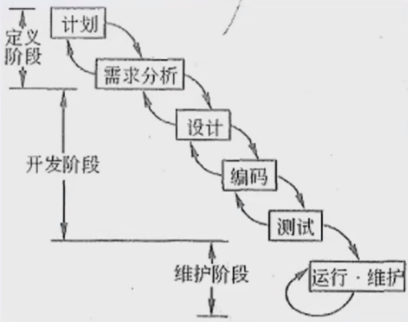

## 2. 螺旋模型

### 2.1 定义
螺旋模型是一个演化软件过程模型，将原型实现的迭代特征与线性顺序（瀑布）模型中控制的和系统化的方面结合起来。在螺旋模型中，软件开发是一系列的增量发布。

### 2.3 特点
- 开发过程具有周期性重复的螺旋线状
- 四个象限分别标志每个周期所划分的四阶段：制订计划、风险分析、实施工程和客户评估
- 螺旋模型强调了风险分析，特别适用于庞大而复杂的、高风险的系统

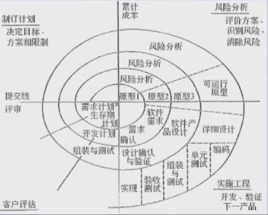

## 3. V模型

### 3.1 定义
V模型用于需求明确和需求变更不频繁的情形。

### 3.2 特点
1. 单元测试的主要目的是针对编码过程中可能存在的各种错误
2. 集成测试的主要目的是针对详细设计中可能存在的问题
3. 系统测试主要针对概要设计，检查系统作为一个整体是否有效地得到运行
4. 验收测试通常由业务专家或用户进行，以确认产品能真正符合用户业务上的需要
5. V模型用于需求明确和需求变更不频繁的情形

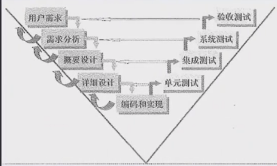

## 4. 原型化模型

### 4.1 定义
原型化模型适用于需求不明确的情形。

### 4.2 步骤
第一步是建造一个快速原型，实现客户或未来的用户与系统的交互，用户或客户对原型进行评价，进一步细化待开发软件的需求。通过逐步调整原型使其满足客户的要求，开发人员可以确定客户的真正需求是什么；第二步则在第一步的基础上开发客户满意的软件产品。

### 4.3 原型特点（当用户需求难以定义准确时）
1. 实际可行
2. 具有最终系统的基本特征
3. 构造方便、快速，造价低。原型法的特点在于原型法对用户的需求是动态响应、逐步纳入的

## 5. 增量模型

### 5.1 定义
首先开发核心模块功能，与用户确认，再开发次要核心模块功能。即每次开发一部分功能，与用户需求确认，最终完成项目开发，最高优先级服务最先交付。

### 5.2 特点
由于模块没有从整体系统角度规划，不利于模块划分。难点在于如何将客户需求划分为多个增量。与原型不同，增量模型的每个增量版本都可以是一个可操作的工作，而原型一般构造出来是用于演示的。

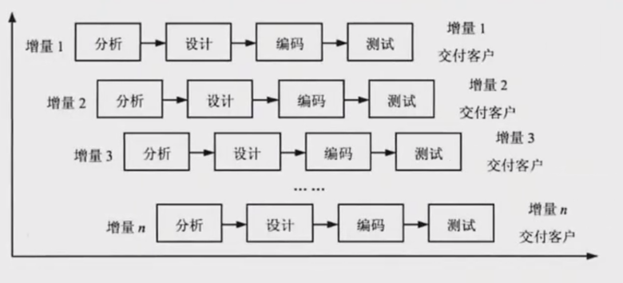

## 6. 其他模型

### 6.1 喷泉模型
- 是一种以用户需求为动力，以对象为驱动的模型
- 适用于面向对象的开发方法
- 使开发过程具有迭代性和无间隙性

### 6.2 基于构件的开发模型CBSD
- 使用预先打包的构件来构造应用系统
- 构件可以是组织内部开发的构件，也可以是商品化成品软件构件
- 特点是增强了复用性，在系统开发过程中，会构建一个构件库，供其他系统复用，从而提高了可靠性，节省了时间和成本

### 6.3 形式化方法模型
- 是一种基于严格数学的软件开发方法
- 主要活动是生成计算机软件的形式化数学规格说明

## 7. 敏捷模型

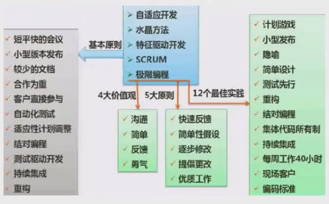

### 7.1 核心思想
1. 敏捷方法是适应型而非可预测型，拥抱变化，适应变化
2. 敏捷方法是以人为本，而非以过程为本，发挥人的特性
3. 迭代增量式的开发过程，以原型开发思想为基础，采用迭代增量式开发，发行版本小型化

### 7.2 开发宣言
- 个体和交互胜过过程和工具
- 可以工作的软件胜过面面俱到的文档
- 客户合作胜过合同谈判
- 响应变化胜过遵循计划

### 7.3 敏捷方法区别于其他方法的两个特点
1. 是"适应性"而非"预设性"
2. 是"面向人的"而非"面向过程的"

## 8. 主要敏捷方法

### 8.1 极限编程（XP - Extreme Programming）
- 是一种近螺旋式的开发方法，它将复杂的开发过程分解为一个个相对比较简单的小周期
- 通过积极的交流、反馈以及其他方法，使开发人员和客户能够清楚了解进度、变化、待解决的问题和潜在的困难等，并根据实际情况及时调整开发过程
- XP提倡测试先行开发，将测试工作提前，以减少后期出现bug的几率

### 8.2 水晶系列方法
- 与XP一样，具有以人为中心的理念
- 目的是发展一种"敏捷"的方法，包含具有共性的核心元素，每个都含有独特的角色、过程模式、工作产品和实践

### 8.3 并列争球法（Scrum）
- 是一种迭代的增量化过程，用于开发、交付和维持复杂的产品
- 将每个30天的迭代称为一个"Sprint"
- 按优先级需求来交付产品
- 多个自组织、自主的团队并行地增量化交付产品

### 8.4 特性驱动开发方法（FDD - Feature-Driven Development）
- 是一种迭代的开发模型
- 认为有效的软件开发需要3个要素：人、过程、技术
- 有5个核心过程：开发整体对象模型、构建特征列表、按特征制定计划、按特征进行设计、按特征进行构建

## 9. 统一过程模型RUP

### 9.1 定义
RUP描述了如何有效地利用商业的、可靠的方法开发和部署软件。它是一个"重量级"过程。RUP就像一个在线的指导者，可以为所有方面和层次上的程序开发提供指导方针、模板以及事例支持。

### 9.2 RUP软件开发生命周期
RUP是一个二维的软件开发模型。RUP有9个核心工作流：
- **业务建模**：理解待开发系统的组织及其业务运作，确保所有参与人员对待开发系统有共同的认识，评估待开发系统对组织的影响
- **需求**：定义系统功能及用户界面，使客户知道系统的功能，使开发人员理解系统的需求，为项目预算和计划提供基础
- **分析与设计**：将需求分析的结果转换为分析与设计模型
- **实现**：将设计模型转换为实现结果，对开发的代码进行单元测试，将不同实现者开发的模块集成为可执行系统
- **测试**：检查各子系统之间的交互、集成，验证需求是否被正确实现，对发现的软件质量上的缺陷进行归档，对软件质量提出改进建议
- **部署**：打包、分发、安装软件，升级旧系统；培训用户及销售人员，并提供技术支持
- **配置与变更管理**：跟踪并维护在软件开发过程中产生的所有制品的完整性和一致性
- **项目管理**：为软件开发项目提供计划、人员分配、执行、监控等方面的指导，为风险管理提供框架
- **环境**：为软件开发组织提供软件开发环境，即提供过程管理和工具支持

### 9.3 RUP的四个阶段
- **初始阶段**：定义最终产品视图和业务模型，并确定系统范围
- **细化阶段**：设计及确定系统的体系结构，制定工作计划及资源要求
- **构造阶段**：构造产品并继续演进需求、体系结构和计划直至产品提交
- **移交阶段**：将产品提交给用户使用

### 9.4 RUP的核心概念
- **角色**：回答"谁"的问题。描述某个人或一个团队的行为与职责。RUP预先定义了很多角色（如架构师、设计师、实现人员、测试人员、配置管理员等），并详细说明了他们的工作内容和职责
- **活动**：回答"如何"的问题。具有明确目的的独立工作单元
- **制品**：回答"什么"的问题。由活动生成、创建或修改的一段信息
- **工作流**：回答"何时"的问题。描述有意义的连续活动序列，每个工作流产生有价值的产品，并显示了角色之间的关系

### 9.5 RUP的三个特点
1. **用例驱动**：需求分析、设计、实现、测试等活动都是用例驱动的
2. **以体系结构为中心**：包括系统的总体组织、全局控制、通信协议等，是用多个视图描述的多维结构
3. **迭代与增量**：整个项目开发分为多个迭代过程，在每次迭代中只考虑系统的一部分需求，进行分析、设计、实现、测试和部署，每次迭代建立在已完成部分的基础上，增加新的功能，直到项目完成

### 9.6 4+1视图模型
- **分析人员和测试人员**关心系统行为，关注**用例视图**
- **最终用户**关心系统功能，关注**逻辑视图**
- **程序员**关心系统配置和装配，关注**实现视图**
- **系统集成人员**关心系统性能、可扩展性、吞吐量等，关注**进程视图**
- **系统工程师**关心系统发布、安装、拓扑等，关注**部署视图**

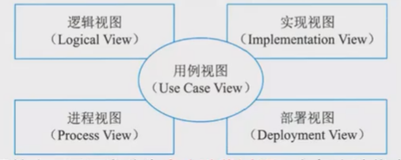

# 逆向工程

## 1. 软件复用与逆向工程概述

### 1.1 软件复用
软件复用是将已有软件的各种有关知识用于建立新的软件，以缩减软件开发和维护的花费。软件复用是提高软件生产力和质量的一种重要技术。早期的软件复用主要是代码级复用，被复用的知识专指程序，后来扩大到包括领域知识、开发经验、设计决定、体系结构、需求、设计、代码和文档等一切有关方面。

### 1.2 逆向工程定义
软件的逆向工程是分析程序，力图在比源代码更高抽象层次上建立程序的表示过程，逆向工程是设计的恢复过程。

### 1.3 逆向工程的四个级别
- **实现级**：包括程序的抽象语法树、符号表、过程的设计表示
- **结构级**：包括反映程序分量之间相互依赖关系的信息，例如调用图、结构图、程序和数据结构
- **功能级**：包括反映程序段功能及程序段之间关系的信息，例如数据和控制流模型
- **领域级**：包括反映程序分量或程序诸实体与应用领域概念之间对应关系的信息，例如E-R模型

其中，领域级抽象级别最高，完备性最低，实现级抽象级别最低，完备性最高。

## 2. 逆向工程相关概念

与逆向工程相关的概念有重构、设计恢复、再工程和正向工程。

### 2.1 重构
重构是指在同一抽象级别上转换系统描述形式。

### 2.2 设计恢复
设计恢复是指借助工具从已有程序中抽象出有关数据设计、总体结构设计和过程设计等方面的信息。

### 2.3 再工程
再工程是指在逆向工程所获得信息的基础上，修改或重构已有的系统，产生系统的一个新版本。再工程是对现有系统的重新开发过程，包括逆向工程、新需求的考虑过程和正向工程三个步骤。它不仅能从已存在的程序中重新获得设计信息，而且还能使用这些信息来重构现有系统，以改进它的综合质量。在利用再工程重构现有系统的同时，一般会增加新的需求，包括增加新的功能和改善系统的性能。

### 2.4 正向工程
正向工程是指不仅从现有系统中恢复设计信息，而且使用该信息去改变或重构现有系统，以改善其整体质量。

# 需求工程

## 1. 软件需求

### 1.1 软件需求定义
软件需求是指用户对系统在功能、行为、性能、设计约束等方面的期望。是指用户解决问题或达到目标所需的条件或能力，是系统或系统部件要满足合同、标准、规范或其他正式规定文档所需具有的条件或能力，以及反映这些条件或能力的文档说明。

### 1.2 需求规格说明书
产出需求规格说明书，分为需求开发和需求管理两大过程。

### 1.3 需求开发和管理流程图
- **需求开发**：需求获取 → 需求分析 → 需求定义(需求规格说明书) → 需求验证 → 需求基线
- **需求管理**：变更控制 → 版本控制 → 需求跟踪 → 需求状态跟踪

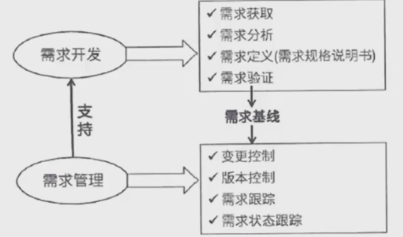

### 1.4 需求分类

#### 1.4.1 业务需求
反映企业或客户对系统高层次的目标要求，通常来自项目投资人、客户、市场营销部门或产品策划部门。通过业务需求可以确定项目视图和范围。

#### 1.4.2 用户需求
描述的是用户的具体目标，或用户要求系统必须能完成的任务。即描述了用户能使用系统来做什么。通常采取用户访谈和问卷调查等方式，对用户使用的场景进行整理，从而建立用户需求。

#### 1.4.3 系统需求
从系统的角度来说明软件的需求，包括功能需求、非功能需求和设计约束等。

**系统需求的子分类：**
1. **功能需求**：也称为行为需求，规定了开发人员必须在系统中实现的软件功能，用户利用这些功能来完成任务，满足业务需要
2. **非功能需求**：指系统必须具备的属性或品质，又可以细分为软件质量属性（如可维护性、可靠性、效率等）和其他非功能需求
3. **设计约束**：也称为限制条件或补充规约，通常是对系统的一些约束说明，例如必须采用国有自主知识产权的数据库系统，必须运行在UNIX操作系统之下等

## 2. 需求获取

### 2.1 需求获取定义
需求获取是一个确定和理解不同的项目干系人的需求和约束的过程。

### 2.2 需求获取方法
常见的需求获取法包括：

1. **用户访谈**：1对1-3，有代表性的用户。其形式包括结构化和非结构化两种
2. **问卷调查**：用户多，无法一一访谈
3. **采样**：从种群中系统地选出有代表性的样本集的过程。样本数量=0.25*(可信度因子/错误率)^2
4. **情节串联板**：一系列图片，通过这些图片来讲故事
5. **联合需求计划(JRP)**：通过联合各个关键用户代表、系统分析师、开发团队代表一起，通过有组织的会议来讨论需求
6. **需求记录技术**：任务卡片、场景说明、用户故事、Volere白卡

## 3. 需求分析

### 3.1 需求分析定义
一个好的需求应该具有无歧义、完整、一致、可测试、确定性、可跟踪、正确性、必要性。需求分析的工作是把杂乱无章的用户要求和期望转化为用户需求。

### 3.2 需求分析任务
1. 画出系统上下文范围关系图
2. 创建用户界面原型
3. 分析需求的可行性
4. 确定需求的优先级
5. 为需求建立模型
6. 创建数据字典
7. 使用QFD（质量功能部署）

### 3.3 结构化需求分析

#### 3.3.1 结构化特点
自顶向下、逐步分解、数据流图。

#### 3.3.2 三大模型
- **功能模型**：数据流图(DFD)
- **行为模型**：状态转换图(STD)
- **数据模型**：实体联系图(ER)
- **数据字典**：数据元素、数据结构、数据流、数据存储、加工逻辑、外部实体

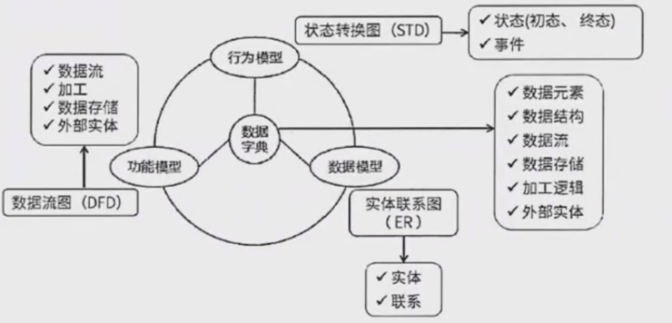

### 3.4 数据流图DFD

#### 3.4.1 基本图形元素
- **外部实体**：矩形
- **加工**：圆角矩形或圆形
- **数据存储**：两条平行横线或右边开口的矩形
- **数据流**：箭头

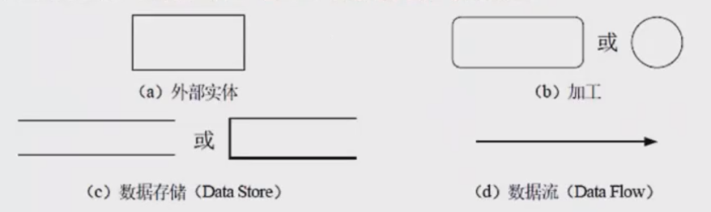

#### 3.4.2 定义
- **数据流**：由固定成分的数据组成，表示数据流向。其流向必须经过加工
- **加工**：描述输入数据流到输出数据流之间的变换
- **数据存储**：用来存储数据
- **外部实体**：软件系统外部的人或组织，是所需数据的源点或生成数据的终点

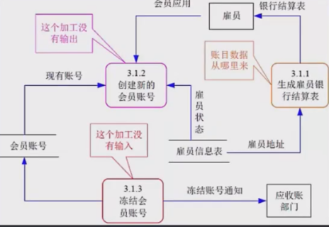

#### 3.4.3 常见错误
- **黑洞**：有输入无输出
- **奇迹**：有输出无输入
- **灰洞**：输入不足以产生输出

### 3.5 分层数据流图
- **顶层图**：系统与外部实体的交互
- **0层图**：系统的主要功能模块
- **1层图**：对0层图的进一步分解

### 3.6 数据字典DD
数据流图描述了系统的分解，但没有对图中各成分进行说明。数据字典就是为数据流图中的每个数据流、文件、加工，以及组成数据流或文件的数据项做出说明。

#### 3.6.1 数据字典条目
数据字典有以下4类条目：数据流、数据项、数据存储和基本加工。

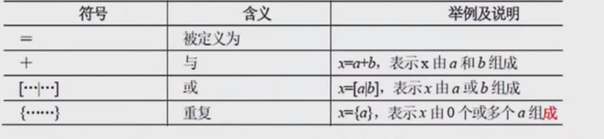

#### 3.6.2 符号说明
- `=`：被定义为
- `+`：与
- `[...]`：或
- `{...}`：重复

#### 3.6.3 加工逻辑描述
加工逻辑也称为"小说明"。常用的加工逻辑描述方法有结构化语言、判定表和判定树3种。

## 4. 需求定义

### 4.1 需求定义（软件需求规格说明书SRS）
需求定义是需求开发活动的产物，编制软件需求规格说明书(SRS)的目的是在项目干系人与开发团队之间建立对初始规格说明的共同理解，形成整个开发工作的基础。SRS是软件开发过程中最重要的文档之一，对于任何软件项目，不论其规模或性质如何，都不应该省略。

### 4.2 需求定义方法

#### 4.2.1 严格定义
也称为预定义。严格定义需求基于一个根本假设，即所有需求都能够被预先定义。它假设开发者和用户能够准确和清晰地沟通，图形(或文字)能够充分表示最终系统。

#### 4.2.2 原型方法
一种迭代的、循环型开发方式。它强调并非所有需求都能在系统开发前被准确描述。原型为克服项目干系人之间通信困难提供了手段。其特点是需要实际可运行的系统模型，用户能参与其中，需要合适的开发环境，重复迭代被认为是必要的和值得推荐的，一旦需求确认，应严格遵循严格方法。

## 5. 需求验证

### 5.1 需求验证定义
需求验证也称为需求确认，其目的是与用户确认需求，确保没有错误。

### 5.2 需求验证内容
需求验证包括对需求规格说明书(SAS)的评审和测试，包括两个步骤：
- **需求评审**：包括正式评审和非正式评审
- **需求测试**：包括设计概念测试用例

### 5.3 需求基线
需求验证通过后，需要用户签字确认，作为验收标准之一。此时，需求规格说明书成为"需求基线"，不能随意更新。如需变更，必须走需求变更流程。

## 6. 需求管理

### 6.1 定义需求基线
通过评审的需求规格说明书成为需求基线。如果以后需求需要变更，必须走流程。

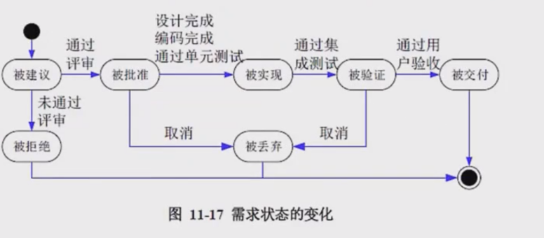

### 6.2 需求的流程及状态
需求状态变化流程：
被建议 → 评审 → 通过评审(被批准) / 未通过评审(被拒绝) → 被实现(设计完成、编码完成、通过单元测试) → 被验证(通过集成测试) → 被交付(通过用户验收)

### 6.3 需求变更

#### 6.3.1 需求变更流程

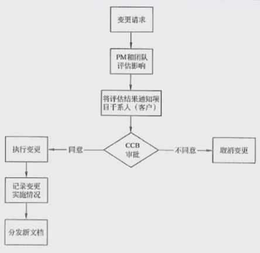

变更请求 → PM和团队评估影响 → 评估结果通知项目干系人(客户) → CCB审批 → 同意(执行变更) / 不同意(取消变更) → 记录变更实施情况 → 分发新文档

#### 6.3.2 需求变更和风险
主要关注变更过程中的需求风险管理。风险做法包括：用户参与不够、忽略用户分类、用户需求不断增加、需求含糊、不必要的特性、过于精简的SRS、不准确的估算。

#### 6.3.3 变更产生的原因
- 外部环境的变化
- 需求和设计的不完整
- 新技术的出现
- 公司机构重组导致业务流程变化

#### 6.3.4 变更控制委员会CCB
也称为配置控制委员会。其任务是评估、批准和监督提出的配置项变更的实施。

### 6.4 需求跟踪

#### 6.4.1 双向跟踪
双向跟踪，两个层次：
- **正向跟踪**：表示用户原始需求是否都实现了
- **反向跟踪**：表示软件实现的是否都是用户要求的，不多不少

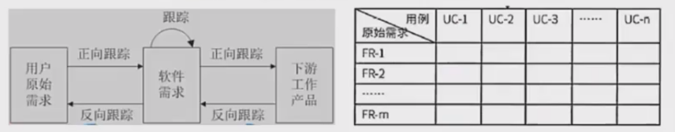

#### 6.4.2 需求跟踪矩阵
可以用原始需求和用例表格(需求跟踪矩阵)来表示。若原始需求和用例有对应，则在对应栏打对号，若某行都没有对号，表明原始需求未实现，正向跟踪发现问题；若某列都没有对号，表明有多余功能用例，软件实现了多余功能，反向跟踪发现问题。
# 系统设计

## 1. 处理流程设计

### 1.1 流程表示工具

#### 1.1.1 程序流程图(PFD)
程序流程图使用各种框来表示操作，它独立于任何程序设计语言，比较直观、清晰，易于学习掌握。任何复杂的程序流程图都应该由**顺序**、**选择**、**循环**结构，或它们的组合和嵌套构成。

#### 1.1.2 IPO图
IPO图也是一种过程描述工具，用来描述构成软件系统的每个模块的**输入**、**输出**和**数据处理**。

#### 1.1.3 N-S图
N-S图容易表示**嵌套**和**层次关系**，具有强烈的**结构化特征**。但是当问题很复杂时，N-S图可能变得很大，因此**不适合于设计复杂的程序**。

#### 1.1.4 问题分析图(PAD)
问题分析图(PAD)是一种支持**结构化程序设计**的图形工具。PAD具有**逻辑结构清晰**、**图形标准化**等优点。更重要的是，它引导设计人员使用结构化程序设计方法，从而**提高程序的质量**。

### 1.2 业务流程重组BPR

#### 1.2.1 BPR定义
BPR是对企业的业务流程进行根本性的再思考和彻底性的再设计，从而获得可以用诸如成本、质量、服务和速度等方面的业绩来衡量的显著性的成就。

#### 1.2.2 BPR基本原则
- 以流程为中心的原则
- 团队管理原则(以人为本)
- 以客户为导向的原则

#### 1.2.3 基于BPR的系统规划
- 战略规划
- 流程规划
- 数据规划
- 功能规划
- 系统实施

#### 1.2.4 BPR步骤
1. 项目的启动
2. 拟订变革计划
3. 建立项目团队
4. 分析目标流程
5. 重新设计目标流程
6. 实施新的设计
7. 持续改进
8. 重新开始

### 1.3 业务流程管理BPM

#### 1.3.1 BPM定义
BPM是一种以规范化的构造端到端的卓越业务流程为中心，以持续的提高组织业务绩效为目的的系统化方法。

#### 1.3.2 BPM与BPR的区别
BPM与BPR管理思想最根本的不同就在于流程管理并不要求对所有的流程进行再造。构造卓越的业务流程并不是流程再造，而是根据现有流程的具体情况，对流程进行规范化的设计。

#### 1.3.3 流程管理三个层面
流程管理包含三个层面：规范流程、优化流程和再造流程。

## 2. 系统设计

### 2.1 系统设计概述

#### 2.1.1 系统设计主要目的
- 制定系统的蓝图
- 权衡各种技术和实现方法之间的利弊
- 合理使用各种资源
- 最终勾画出新系统的详细设计方法

#### 2.1.2 系统设计方法
- 结构化设计方法
- 面向对象设计方法

#### 2.1.3 系统设计主要内容
- 概要设计
- 详细设计

### 2.2 概要设计基本任务
也称为总体系统结构设计。将系统功能需求分配给软件模块，确定每个模块的功能和调用关系，形成软件的模块结构图，即系统结构图。

### 2.3 详细设计基本任务
- 模块内的详细算法设计
- 模块内的数据结构设计
- 数据库的物理设计
- 其他设计，包括：
  - 代码
  - 输入/输出格式
  - 用户界面
- 编写详细设计说明书
- 评审

### 2.4 系统设计基本原理
- 抽象
- 自顶而下，逐步求精
- 信息隐蔽
- 模块独立（高内聚，低耦合）

### 2.5 系统设计原则
- 保持适当的模块大小
- 尽量减少调用深度
- 高扇入，低扇出
- 单入口，单出口
- 模块的作用域应该在控制域内
- 功能应该可以预测

### 2.6 模块独立性标准

#### 2.6.1 内聚性(从低到高)
1. **偶然内聚**：模块内各处理元素之间无任何关系
2. **逻辑内聚**：模块完成几个逻辑上相似的功能，通过参数确定该模块完成哪一个功能
3. **时间内聚**：模块包含需要同时执行的动作
4. **过程内聚**：模块完成多个任务，这些任务必须按指定的过程执行
5. **通信内聚**：模块内所有处理元素都在同一个数据结构上操作，或者各处理使用相同的输入数据或产生相同的输出数据
6. **顺序内聚**：模块内各处理元素和同一个功能密切相关，而且这些处理必须顺序执行，前一处理元素的输出就是下一处理元素的输入
7. **功能内聚**：最强的内聚，模块内所有元素共同完成一个功能，缺一不可

#### 2.6.2 耦合性(从低到高)
1. **无直接耦合**：两个模块之间没有直接的关系，它们分别从属于不同模块的控制与调用，不传递任何信息
2. **数据耦合**：两个模块之间有调用关系，传递的是简单的数据值，相当于高级语言中的值传递
3. **标记耦合**：两个模块之间传递的是数据结构
4. **控制耦合**：一个模块调用另一个模块时，传递的是控制变量，被调用模块通过该控制变量的值有选择的执行模块内的某一功能
5. **外部耦合**：模块间通过软件之外的环境联合(如I/O将模块耦合到特定的设备、格式、通信协议上)时
6. **公共耦合**：通过一个公共数据环境相互作用的那些模块间的耦合
7. **内容耦合**：当一个模块直接使用另一个模块的内部数据，或通过非正常入口转入另一个模块内部时

## 3. 人机界面设计

### 3.1 人机界面设计三大黄金原则

#### 3.1.1 置于用户控制之下
- 以不强迫用户进入不必要的或不希望的动作的方式来定义交互方式
- 提供灵活的交互
- 允许用户交互可以被中断和撤消
- 当技能级别增加时可以使交互流水化并允许定制交互
- 使用户隔离内部技术细节
- 设计应允许用户和出现在屏幕上的对象直接交互

#### 3.1.2 减少用户的记忆负担
- 减少对短期记忆的要求
- 建立有意义的缺省
- 定义直觉性的捷径
- 界面的视觉布局应该基于真实世界的隐喻
- 以不断进展的方式揭示信息

#### 3.1.3 保持界面的一致性
- 允许用户将当前任务放入有意义的语境
- 在应用系列内保持一致性
- 如过去的交互模型已建立起了用户期望，除非有迫不得已的理由，不要改变它

# 测试基础知识

## 1. 测试原则和方法

### 1.1 系统测试定义
系统测试是为了发现错误而执行程序的过程，成功的测试是发现了至今尚未发现的错误的测试。

### 1.2 测试原则
- 应尽早地和不断地进行软件测试
- 测试工作应该避免由原开发软件的人或小组来承担
- 在设计测试方案时，不仅要确定输入数据，而且要根据系统功能确定预期输出结果
- 既包含合理、有效的输入条件，也包含不合理、无效的输入条件
- 检查程序是否做了它应该做的事，以及是否做了它不应该做的事
- 严格按照测试计划来进行
- 妥善保存测试计划和测试用例
- 测试用例可以重复使用或追加测试

### 1.3 软件测试方法分类
软件测试方法可分为静态测试和动态测试。

#### 1.3.1 静态测试
静态测试是指不运行程序，通过人工检查和计算机辅助静态分析的手段对程序进行检测，包括文档的静态测试和代码的静态测试。

**静态测试技术：**
- **文档静态测试**：主要使用检查单
- **代码静态测试**：包括桌前检查、代码审查、代码走查

**效果：** 这种方法可以有效地发现30%-70%的逻辑设计和编码错误。

#### 1.3.2 动态测试
动态测试是指通过运行程序来发现软件错误，一般使用白盒测试和黑盒测试方法。

**黑盒测试法：**
- 也称为功能性测试
- 不需要了解软件内部代码结构
- 根据功能需求设计测试用例
- 重点测试软件功能

**白盒测试法：**
- 也称为结构性测试
- 需要清楚了解代码流程
- 根据代码逻辑结构设计测试用例
- 目标是测试用例覆盖代码

## 2. 测试阶段

### 2.1 测试策略
- **自底向上**：从最底层模块开始测试，需要编写驱动程序，而后开始逐一合并模块，最终完成整个系统的测试。优点是较早的验证了底层模块
- **自顶向下**：先测试整个系统，需要编写桩程序，而后逐步向下直至最后测试最底层模块。优点是较早的验证了系统的主要控制和判断点
- **三明治**：既有自底向上也有自顶向下的测试方法，二者都包括。兼有二者的优点，缺点是测试工作量大

### 2.2 测试阶段分类

#### 2.2.1 单元测试
- **对象**：独立可编译或可汇编的程序模块、软件构件或OO软件中的类(统称为模块)
- **依据**：软件详细设计规格说明
- **别名**：模块测试

#### 2.2.2 集成测试
- **目的**：检查模块之间，以及模块和已集成的软件之间的接口关系，验证已集成的软件是否符合设计要求
- **依据**：软件总体设计文档

#### 2.2.3 确认测试
- **主要用途**：验证软件的功能、性能及其他特性是否与用户需求一致
- **依据**：需求文档

**确认测试类型(按用户参与程度)：**
- **内部确认测试**：主要由软件开发组织内部按SRS进行测试
- **Alpha测试**：用户在开发环境下进行的测试
- **Beta测试**：用户在实际使用环境下进行的测试，通过此测试后产品可交付用户
- **验收测试**：交付前以用户为主进行的测试

**验收测试：**
- **对象**：完整的、集成的计算机系统
- **目的**：验证软件系统是否满足开发技术合同或SRS，在真实用户工作环境下
- **结论**：用户决定是否接受软件的主要依据
- **前提**：除满足一般测试准入条件外，还必须确认被测软件系统已通过系统测试

#### 2.2.4 系统测试
- **对象**：完整的、集成的计算机系统
- **目的**：验证已完成的软件配置项能否正确连接到系统中，并满足系统/子系统设计文档和软件开发合同中规定的要求
- **依据**：用户需求或开发合同
- **主要内容**：功能测试、健壮性测试、性能测试、用户界面测试、安全性测试、安装与卸载测试等
- **最重要工作**：功能测试和性能测试
- **功能测试方法**：主要采用黑盒测试
- **关键性能指标**：响应时间、吞吐量、并发用户数、资源利用率等

#### 2.2.5 配置项测试
- **对象**：软件配置项
- **目的**：验证软件配置项与SRS的一致性
- **依据**：SRS
- **前提**：应确认被测软件配置项已通过单元测试和集成测试

#### 2.2.6 回归测试
- **目的**：测试软件变更后，变更部分的正确性和对变更需求的符合性，以及软件原有的、正确的功能、性能和其他规定的要求的不损害性

## 3. 测试用例的设计

### 3.1 黑盒测试用例
黑盒测试用例：将程序看做一个黑盒子，只知道输入输出，不知道内部代码，由此设计出测试用例，分为下面几类：

#### 3.1.1 等价类划分
把所有的数据按照某种特性进行归类，而后在每类的数据里选取一个即可。等价类测试用例的设计原则：设计一个新的测试用例，使其尽可能多地覆盖尚未被覆盖的有效等价类，重复这一步，直到所有的有效等价类都被覆盖为止；设计一个新的测试用例，使其仅覆盖一个尚未被覆盖的无效等价类，重复这一步，直到所有的无效等价类都被覆盖为止。

#### 3.1.2 边界值划分
将每类的边界值作为测试用例，边界值一般为范围的两端值以及在此范围之外的与此范围间隔最小的两个值，如年龄范围为0-150，边界值为0,150,-1,151四个。

#### 3.1.3 错误推测
没有固定的方法，凭经验而言，来推测有可能产生问题的地方，作为测试用例进行测试。

#### 3.1.4 因果图
由一个结果来反推原因的方法，具体结果具体分析，没有固定方法。

### 3.2 白盒测试用例
白盒测试用例：知道程序的代码逻辑，按照程序的代码语句，来设计覆盖代码分支的测试用例。覆盖级别从低至高分为下面几种：

#### 3.2.1 语句覆盖SC
逻辑代码中的所有语句都要被执行一遍，覆盖层级最低，因为执行了所有的语句，不代表执行了所有的条件判断。

**示例：**
- **输入**：X=4, Y=2, Z=0
- **路径**：s -> a (True) -> c -> b (True) -> e -> d

#### 3.2.2 判定覆盖DC
逻辑代码中的所有判断语句的条件的真假分支都要覆盖一次。又称分支覆盖。

**示例：**
- **输入1**：X=1, Y=3, Z=0
- **输入2**：X=3, Y=2, Z=1

#### 3.2.3 条件覆盖CC
针对每一个判断条件内的每一个独立条件都要执行一遍真和假。

**示例：**
- **输入1**：X=1, Y=2, Z=0
- **输入2**：X=2, Y=1, Z=1

#### 3.2.4 条件判定组合覆盖CDC
同时满足判定覆盖和条件覆盖。

**示例：**
- **输入1**：X=4, Y=2, Z=0
- **输入2**：X=1, Y=1, Z=1

#### 3.2.5 路径覆盖
逻辑代码中的所有可行路径都覆盖了，覆盖层级最高。

**示例：**
- **输入1**：X=1, Y=1, Z=1
- **输入2**：X=3, Y=2, Z=0
- **输入3**：X=3, Y=3, Z=0
- **输入4**：X=1, Y=2, Z=1

## 4. 调试

### 4.1 调试定义
测试是发现错误，调试是找出错误的代码和错误的原因。

### 4.2 调试方法
- **蛮力法**：一种直接、往往很彻底的方法
- **回溯法**：从出错的地方开始，逐步向后回溯，直到找到错误的根源
- **原因排除法**：找出所有可能的原因，然后逐一排除。具体包括演绎推理、归纳推理、二分法

### 4.3 调试过程
调试需要定位错误的确切位置，确定问题的根本原因，制定解决方案，并在修正后进行回归测试。

## 5. 软件度量

### 5.1 软件属性
软件属性分为两类：
- **外部属性**：与管理者、用户相关的属性，可直接测量，通常作为性能指标(如效率、可用性)
- **内部属性**：软件产品本身的属性，如可靠性，只能间接测量

### 5.2 McCabe度量
也称为圈复杂度。对于有m条有向边和n个节点的有向图，圈复杂度为m-n+2。

**记忆方法：** 不要混淆m(边)和n(节点)的含义，简单的循环可以帮助记忆公式。在程序流程图中，每个分支或连接代表一条有向边，每个语句或语句框代表一个节点。

# 系统转换

## 1. 遗留系统

### 1.1 遗留系统定义
遗留系统是指任何基本上不能进行修改和演化以满足新的变化了的业务需求的信息系统。

### 1.2 遗留系统特点
1. 系统虽然完成企业中许多重要的业务管理工作，但仍然不能完全满足要求。一般实现业务处理电子化及部分企业管理功能，很少涉及经营决策。
2. 系统在性能上已经落后，采用的技术已经过时。例如，多采用主机/终端形式或小型机系统，软件使用汇编语言或第三代程序设计语言的早期版本开发，使用文件系统而不是数据库。
3. 通常是大型的软件系统，已经融入企业的业务运作和决策管理机制之中，维护工作十分困难。
4. 没有使用现代信息系统建设方法进行管理和开发，现在基本上已经没有文档，很难理解。

### 1.3 遗留系统转换策略
基于技术水平和业务价值的2x2矩阵：

|             | **高业务价值** | **低业务价值** |
| :---------- | :------------- | :------------- |
| **高技术水平** | 改造           | 集成           |
| **低技术水平** | 继承           | 淘汰           |

- **高水平、高价值** → 改造 (Transformation/Renovation)
- **高水平、低价值** → 集成 (Integration)
- **低水平、高价值** → 继承 (Inheritance)
- **低水平、低价值** → 淘汰 (Elimination)

## 2. 系统转换概述
系统转换是指新系统开发完毕，投入运行，取代现有系统的过程，需要考虑多方面的问题，以实现与老系统的交接。

## 3. 系统转换方法

### 3.1 直接转换
- **定义**：现有系统被新系统直接取代
- **特点**：风险很大，适用于新系统不复杂，或者现有系统已经不能使用的情况
- **优点**：节省成本

### 3.2 并行转换
- **定义**：新系统和老系统并行工作一段时间
- **特点**：新系统经过试运行后再取代，若新系统在试运行过程中有问题，也不影响现有系统的运行，风险极小。在试运行过程中还可以比较新老系统的性能，适用于大型系统
- **缺点**：耗费人力和时间资源，难以控制两个系统间的数据转换

### 3.3 分段转换
- **定义**：分期分批逐步转换，是直接和并行转换的集合
- **特点**：将大型系统分为多个子系统，依次试运行每个子系统，成熟一个子系统，就转换一个子系统。同样适用于大型项目，只是更耗时，而且现有系统和新系统间混合使用，需要协调好接口等问题

## 4. 数据转换与迁移
将数据从旧数据库迁移到新数据库中。有三种方法：
1. 系统切换前通过工具迁移
2. 系统切换前采用手工录入
3. 系统切换后通过新系统生成

# 系统维护

## 1. 系统维护概述

### 1.1 系统可维护性定义
系统的可维护性可以定义为维护人员理解、改正、改动和改进这个软件的难易程度。

### 1.2 可维护性评价指标
1. **易分析性**：软件产品诊断软件中的缺陷或失效原因或识别待修改部分的能力
2. **易改变性**：软件产品使指定的修改可以被实现的能力，实现包括编码、设计和文档的更改
3. **稳定性**：软件产品避免由于软件修改而造成意外结果的能力
4. **易测试性**：软件产品使已修改软件能被确认的能力
5. **维护性的依从性**：软件产品遵循与维护性相关的标准或约定的能力

## 2. 系统维护类型

### 2.1 系统维护分类
系统维护包括硬件维护、软件维护和数据维护。

### 2.2 软件维护类型
1. **正确性维护**：发现了bug而进行的修改
2. **适应性维护**：由于外部环境发生了改变，被动进行的对软件的修改和升级
3. **完善性维护**：基于用户主动对软件提出更多的需求，修改软件，增加更多的功能，使其比之前的软件功能、性能更高，更加完善
4. **预防性维护**：对未来可能发生的bug进行预防性的修改

# 净室软件工程

## 1. 净室软件工程概述

### 1.1 理论基础
净室软件工程(CSE)的理论基础主要是函数理论和抽样理论。

### 1.2 定义
净室软件工程是一种应用数学与统计学理论以经济的方式生产高质量软件的工程技术，力图通过严格的工程化的软件过程达到开发中的零缺陷或接近零缺陷。

### 1.3 核心理念
净室方法不是先制作一个产品，再去消除缺陷，而是要求在规约和设计中消除错误，然后以"净"的方式制作，可以降低软件开发中的风险，以合理的成本开发出高质量的软件。

## 2. 净室软件工程哲学
在净室软件工程背后的哲学是：通过在第1次正确地书写代码增量，并在测试前验证它们的正确性，来避免对成本很高的错误消除过程的依赖。

### 2.1 过程模型
它的过程模型是在代码增量积聚到系统的过程的同时，进行代码增量的统计质量验证。

### 2.2 开发理念
它甚至提倡开发者不需要进行单元测试，而是进行正确性验证和统计质量控制。

## 3. 应用技术手段
1. **统计过程控制下的增量式开发**
2. **基于函数的规范与设计**
3. **正确性验证**：CSE的核心
4. **统计测试和软件认证**

## 4. 使用中的缺点
1. CSE太理论化，需要更多的数学知识。其正确性验证的步骤比较困难且比较耗时
2. CSE开发小组不进行传统的模块测试，这是不现实的
3. CSE也会带有传统软件工程的一些弊端

# 基于构件的软件工程

## 1. 基于构件的软件工程概述

### 1.1 定义
基于构件的软件工程(CBSE)是一种分布式对象技术，强调使用可重用的构件来设计和构建软件系统。

### 1.2 核心理念
强调"购买而不是构建"的哲学，将软件开发的重点从编程转向组装现有构件。

## 2. 构件特征

### 2.1 构件基本特征
基于构件的软件工程中使用的构件应具备以下特征：

1. **可组装型**：构件必须允许所有外部交互都通过公开定义的接口进行。还必须控制外部对其内部信息的访问
2. **可部署性**：软件构件必须是自包含的，能够作为独立实体在构件模型平台上运行。通常以二进制形式存在，部署前不需要编译
3. **文档化**：构件必须完全文档化，使用户能够根据文档确定构件是否满足其需求
4. **独立性**：构件应该是独立的，意味着它们可以在不需要其他特定构件的情况下进行组装和部署。如果构件需要其他构件的服务，这种依赖关系应该明确声明
5. **标准化**：CBSE过程中使用的构件必须符合标准化的构件模型。该模型定义了构件实现、文档和开发的标准

### 2.2 构件模型要素
- **接口**：构件接口定义构件如何交互。构件模型指定如何定义这些接口以及接口定义中应包含哪些元素(如操作名称、参数和异常)
- **使用信息**：为了支持远程分发和访问，每个构件必须具有特定的、全局唯一的名称或句柄。构件元数据包括与构件本身相关的信息，如其接口和属性
- **部署**：构件模型包括一个规范，概述如何打包构件以成为独立可执行实体。部署信息包括包内容及其二进制组成的详细信息

## 3. 构件模型服务

### 3.1 服务类型
- **平台服务**：这些服务使构件能够在分布式环境中通信和互操作
- **支持服务**：这些是许多构件所需的通用服务，如身份认证服务。中间件通常实现这些通用构件服务并提供其接口

## 4. CBSE过程

### 4.1 主要活动
CBSE过程支持基于构件的软件组装，包括以下六个主要活动：
1. 系统需求概述
2. 识别候选构件
3. 根据发现的构件修改需求
4. 架构设计
5. 构件定制和适配
6. 创建组装的构件系统

### 4.2 与传统开发过程的区别
1. CBSE的早期阶段需要完整的需求，以最大化可重用构件的识别
2. 在早期阶段，根据可用构件对需求进行细化和修改。如果现有构件无法满足用户需求，应考虑可重用构件支持的相关需求
3. 架构设计后，还有构件搜索和设计细化的进一步活动。这可能涉及寻找替代构件或修改现有构件以适应功能和架构需求
4. CBSE中的开发主要是一个组装过程，集成已识别和适配的构件

## 5. 构件组装

### 5.1 组装定义
构件组装是指构件的直接集成或使用专门编写的"胶水代码"将它们组合成新系统或新构件。

### 5.2 组装方法
1. **顺序组装**：按特定顺序调用现有构件。一个构件的输出作为下一个构件的输入，允许两个现有构件创建新构件
2. **层次组装**：当一个构件直接调用另一个构件提供的服务时发生。被调用构件为调用构件提供必要服务，它们的接口必须兼容
3. **叠加组装**：将两个或多个构件组合以创建新构件。新构件合并原始构件的功能并提供新的外部接口。原始构件不相互依赖或调用。当构件是程序单元或服务时，这种组装类型是合适的

### 5.3 组装不兼容性
三种类型的构件组装不兼容性，通常可以通过编写适配器来解决：

1. **参数不兼容**：当接口两端的操作具有相同名称但参数类型或参数数量不同时发生
2. **操作不兼容**：当提供接口和请求接口中的操作名称不同时发生
3. **操作不完备**：当构件的提供接口是另一个构件请求接口的子集时发生，反之亦然

# 真题

## 真题1：系统分析阶段工作产品

**题目：** 系统分析阶段的工作产品是()，系统测试阶段的工作产品是()。

**选项：**
- A. 系统设计规格说明 (System Design Specification)
- B. 系统方案建议书 (System Solution Proposal)
- C.程序规格说明
- D.单元测试数据
- A. 验收测试计划 (Acceptance Test Plan)
- B. 测试标准 (Test Standard)
- C. 系统测试计划 (System Test Plan)
- D. 操作手册 (Operation Manual)

**答案：** BD

**解析：**
- **第一空：系统方案建议书** - 系统分析阶段后，主要输出是对系统需求的清晰描述和初步解决方案规划。系统方案建议书是需求分析后提出的综合解决方案文档，符合该阶段的产出
- **第二空：操作手册** - 系统测试阶段后，提供给用户的最终文档包括操作指南。操作手册是系统测试后提供给用户的使用手册，是该阶段的工作产品

## 真题2：CMM能力成熟度模型

**题目：** 以下关于CMM（能力成熟度模型）的叙述中，不正确的是()。

**选项：**
- A. CMM是指软件过程能力成熟度模型
- B. CMM将软件过程分为5个成熟度等级，其中1级是最高成熟度，5级是最低成熟度
- C. CMMI的任务是将现有的多个CMM模型整合成一个"集成模型"
- D. 采用更成熟的CMM模型，通常可以提高最终产品的质量

**答案：** B

**解析：**
- **A. CMM是指软件过程能力成熟度模型** - 正确
- **B. CMM将软件过程分为5个成熟度等级，其中1级是最高成熟度，5级是最低成熟度** - 错误。CMM的5个等级中，1级（初始级）是最低成熟度，5级（优化级）是最高成熟度
- **C. CMMI的任务是将现有的多个CMM模型整合成一个"集成模型"** - 正确
- **D. 采用更成熟的CMM模型，通常可以提高最终产品的质量** - 正确

## 真题3：软件开发模型选择

**题目：** 假设某软件公司与客户签订合同开发一个软件系统，系统的功能有较清晰的定义，且客户对交付时间有严格要求，则该系统的开发最适宜采用()。

**选项：**
- A. 瀑布模型 (Waterfall Model)
- B. 原型模型 (Prototype Model)
- C. V模型 (V-Model)
- D. 螺旋模型 (Spiral Model)

**答案：** A

**解析：** 功能清晰，也即需求较明确，有这样的关键字都是考察瀑布模型，牢记总结的记忆关键字。

## 真题4：螺旋模型特点

**题目：** 以下关于螺旋模型的叙述中，不正确的是()。

**选项：**
- A. 它是风险驱动的，要求开发人员必须具有丰富的风险评估知识和经验
- B. 它可以降低过多测试或测试不足带来的风险
- C. 它包含维护周期，因此维护和开发之间没有本质区别
- D. 它不适用于大型软件开发

**答案：** D

**解析：** 螺旋模型的特点是风险分析，应对风险的都正确，螺旋模型适合大型软件开发。

## 真题5：系统构建技术与软件工具

**题目：** 应用系统构建中可以采用多种不同的技术，()可以将软件某种形式的描述转换为更高级的抽象表现形式，而利用这些获取的信息，()能够对现有系统进行修改或重构，从而产生系统的一个新版本。

**选项：**
- A. 逆向工程 (Reverse Engineering)
- B. 系统改进 (System Improvement)
- C. 设计恢复 (Design Recovery)
- D. 再工程 (Re-engineering)

**答案：** AD

**解析：**
- **第一空：逆向工程** - 逆向工程是将软件的低级表示（如源代码）转换为更高级的抽象表示（如设计模型），以理解软件的结构和功能
- **第二空：再工程** - 再工程是在逆向工程获得信息的基础上，对现有系统进行修改或重构，以产生一个新版本，通常是为了改进系统质量或适应新的需求

## 真题6：软件系统工具分类

**题目：** 在软件系统工具中，版本控制工具属于()，软件评价工具属于()。

**选项：**
- A. 软件开发工具 (Software Development Tools)
- B. 软件维护工具 (Software Maintenance Tools)
- C. 编码与排错工具 (Coding and Debugging Tools)
- D. 软件管理和软件支持工具 (Software Management and Support Tools)

**答案：** BD

**解析：**
- 软件开发工具：需求分析工具、设计工具、编码与排错工具
- **版本控制工具**：属于软件维护工具。软件维护工具包括版本控制工具、文档分析工具、开发信息库工具、逆向工程工具、再工程工具
- **软件评价工具**：属于软件管理和软件支持工具。软件管理和软件支持工具包括项目管理工具、配置管理工具、软件评价工具、软件开发工具的评价和选择

## 真题7：软件需求开发阶段

**题目：** 软件需求开发是指从情况收集、分析和评价到编写文档、评审等一系列产生需求的活动，分为获取情况、分析、()和评审四个阶段。

**选项：**
- A. 制订规格说明 (Formulate specifications)
- B. 形成需求基线 (Form a requirements baseline)
- C. 跟踪需求变更 (Track requirements changes)
- D. 控制需求版本 (Control requirements versions)

**答案：** A

**解析：** 软件需求开发分为四个阶段：需求获取、需求分析、需求定义(制订规格说明)、需求验证(评审)。

## 真题8：需求分类

**题目：** 某软件公司正在承担开发一个字处理器的任务。在需求分析阶段，公司的相关人员整理出一些相关的系统需求，其中：
1. "找出文档中的拼写错误并提供一个替换项列表来供选择替换拼错的词" 属于()
2. "显示提供替换词的对话框以及实现整个文档范围的替换" 属于()
3. "用户能有效地纠正文档中的拼写错误" 属于()

**选项：**
- A. 业务需求 (Business Requirements)
- B. 用户需求 (User Requirements)
- C. 功能需求 (Functional Requirements)
- D. 性能需求 (Performance Requirements)

**答案：** BCA

**解析：**
- **第一空：用户需求** - 该需求描述了用户希望系统完成的具体任务(如"找出错误"和"提供替换项")，属于用户对系统功能的直接操作要求，因此归类为用户需求
- **第二空：功能需求** - 该需求明确界定了系统需要实现的具体功能(如"显示对话框"和"全局替换")，属于开发人员需直接编码实现的系统功能，因此归类为功能需求
- **第三空：业务需求** - 该需求反映了企业或客户对系统的高层次目标(如"有效纠正错误")，属于业务层面的核心目标，因此归类为业务需求

## 真题9：需求获取方法

**题目：** 需求获取是确定和理解不同的项目干系人的需求和约束的过程，需求获取是否科学、准备充分，对获取出来的结果影响很大。在多种需求获取方式中，()方法具有良好的灵活性，有较宽广的应用范围，但存在获取需求时信息量大、记录较为困难、需要足够的领域知识等问题。()方法基于数理统计原理，不仅可以用于收集数据，还可以用于采集访谈用户或者是采集观察用户，并可以减少数据收集偏差。()方法通过高度组织的群体会议来分析企业内的问题，并从中获取系统需求。

**选项：**
- A. 用户访谈 (User Interviews)
- B. 问卷调查 (Questionnaires)
- C. 联合需求计划 (Joint Requirements Planning)
- D. 采样 (Sampling)

**答案：** ADC

**解析：**
- **第一空：用户访谈** - 用户访谈具有良好的灵活性，有较宽广的应用范围，但存在获取需求时信息量大、记录较为困难、需要足够的领域知识等问题
- **第二空：采样** - 采样方法基于数理统计原理，不仅可以用于收集数据，还可以用于采集访谈用户或者是采集观察用户，并可以减少数据收集偏差
- **第三空：联合需求计划** - 联合需求计划通过高度组织的群体会议来分析企业内的问题，并从中获取系统需求

## 真题10：需求管理

**题目：** 以下关于需求管理的叙述中，正确的是()。

**选项：**
- A. 要达到过程能力成熟度模型的第2级，一个组织必须具有3个关键过程域
- B. 需求稳定性不是需求属性
- C. 需求变更的管理过程按照变更分析、成本计算、问题分析和变更描述、变更实现的顺序进行
- D. 变更控制委员会可以对项目中任何基线工作产品的变更进行决策

**答案：** D

**解析：**
- **A. 要达到过程能力成熟度模型的第2级，一个组织必须具有3个关键过程域** - 错误。CMM第2级(可重复级)包括6个关键过程域，不是3个
- **B. 需求稳定性不是需求属性** - 错误。需求稳定性是需求属性的重要组成部分，衡量需求变化的可能性
- **C. 需求变更的管理过程按照变更分析、成本计算、问题分析和变更描述、变更实现的顺序进行** - 错误。标准的需求变更管理过程是：问题分析和变更描述 → 变更分析和成本计算 → 变更实现。选项C中后两个步骤的顺序颠倒了
- **D. 变更控制委员会可以对项目中任何基线工作产品的变更进行决策** - 正确。变更控制委员会(CCB)负责审查和决定对基线工作产品的变更请求，符合该描述

## 真题11：数据流图与外部实体

**题目：** 在结构化分析中，数据流图描述()。在使用数据流图分析图书馆管理系统时，()是外部实体。

**选项：**
- A. 数据对象之间的关系，用于数据建模
- B. 数据在系统中传输或变换的过程以及实现数据变换的功能或子功能，用于功能建模
- C. 系统对外部事件和动作的响应，用于行为建模
- D. 数据流图的各个组成部分
- A. 读者
- B. 图书
- C. 借书证
- D. 借阅

**答案：** BA

**解析：**
- **第一空：数据流图描述数据在系统中传输或变换的过程以及实现数据变换的功能或子功能，用于功能建模** - 数据流图(DFD)主要描述数据在系统中的流动路径、如何被处理或变换，以及相关的功能或子功能，用于功能建模。选项A(数据对象关系)通常由ER图描述，选项C(系统对外部事件的响应)由行为模型如状态图描述，选项D描述的是DFD的组成部分，不是其建模目标
- **第二空：读者** - 在图书馆管理系统的语境下，外部实体是与系统交互的对象(如人、组织或其他系统)。"读者"是与系统交互的用户(如借书/还书)，是典型的外部实体。"图书"、"借书证"、"借阅"都是系统内部的数据存储或数据流，不是外部实体

## 真题12：流程设计

**题目：** 流程设计的任务是设计出系统所有模块和它们之间的相互关系，并具体设计出每个模块内部的功能和处理过程。以下关于流程设计的叙述，正确的是()。

**选项：**
- A. 任何复杂的程序流程图都应该由顺序、选择、循环结构构成
- B. IPO图不适合用来进行流程设计
- C. PAD图是一种支持原型化设计方法的图形工具
- D. N-S图容易表示嵌套关系和层次关系，特别适合于设计非常复杂的流程

**答案：** A

**解析：** 任何复杂的程序流程图都应该由顺序、选择、循环结构，或它们的组合和嵌套构成。这是程序流程图的基本特征。

## 真题13：业务流程重组BPR

**题目：** 业务流程重组(Business Process Reengineering,BPR)是针对企业业务流程的基本问题进行回顾，其核心思路是对业务流程的()改造，BPR过程通常以()为中心。

**选项：**
- A. 增量式 (Incremental)
- B. 根本性 (Fundamental)
- C. 迭代式 (Iterative)
- D. 保守式 (Conservative)
- A. 流程 (Process)
- B. 需求 (Requirements)
- C. 组织 (Organization)
- D. 资源 (Resources)

**答案：** BA

**解析：**
- **第一空：根本性** - BPR是对企业的业务流程进行根本性的再思考和彻底性的再设计
- **第二空：流程** - BPR过程通常以流程为中心，强调流程的重新设计

## 真题14：内聚性

**题目：** 某模块中各个处理元素都密切相关于同一功能且必须顺序执行，前一处理元素的输出就是下一处理元素的输入，则该模块的内聚类型为()内聚。

**选项：**
- A. 过程 (Procedural)
- B. 时间 (Temporal)
- C. 顺序 (Sequential)
- D. 逻辑 (Logical)

**答案：** C

**解析：** 顺序内聚是指模块内各处理元素和同一个功能密切相关，而且这些处理必须顺序执行，前一处理元素的输出就是下一处理元素的输入。

## 真题15：耦合性

**题目：** 已知模块A给模块B传递数据结构x，则这两个模块的耦合类型为()。

**选项：**
- A. 数据耦合 (Data coupling)
- B. 公共耦合 (Common coupling)
- C. 外部耦合 (External coupling)
- D. 标记耦合 (Stamp coupling)

**答案：** D

**解析：** 标记耦合是指两个模块之间传递的是数据结构，而不是简单的数据值。

## 真题16：系统设计

**题目：** 系统设计是根据系统分析的结果，完成系统的构建过程。系统设计的主要内容包括()；系统总体结构设计的主要任务是将系统的功能需求分配给软件模块，确定每个模块的功能和调用关系，形成软件的()。

**选项：**
- A. 概要设计和详细设计 (Preliminary design and detailed design)
- B. 架构设计和对象设计 (Architecture design and object design)
- C. 部署设计和用例设计 (Deployment design and use case design)
- D. 功能设计和模块设计 (Functional design and module design)
- A. 用例图 (Use case diagram)
- B. 模块结构图 (Module structure diagram)
- C. 系统部署图 (System deployment diagram)
- D. 类图 (Class diagram)

**答案：** AB

**解析：**
- **第一空：概要设计和详细设计** - 系统设计的主要内容包括概要设计和详细设计
- **第二空：模块结构图** - 系统总体结构设计的主要任务是形成软件的模块结构图

## 真题17：模块结构设计

**题目：** 以下关于软件系统模块结构设计的叙述中，正确的是()。

**选项：**
- A. 当模块扇出过大时，应把下级模块进一步分解为若干个子模块
- B. 当模块扇出过小时，应适当增加中间的控制模块
- C. 模块的扇入大，表示模块的复杂度较高
- D. 模块的扇入大，表示模块的复用程度高

**答案：** D

**解析：**
- **扇出(Fan-out)**：指的是一个模块直接调用的下级模块的数量
- **扇入(Fan-in)**：指的是有多少个上级模块调用它
- **选项A错误**：模块扇出过大时，正确的处理方式是将当前模块分解为多个中间模块，而非分解下级模块
- **选项B错误**：模块扇出过小通常无需特殊处理，或可通过合并模块优化结构
- **选项C错误**：模块的扇入大仅表示该模块被多个上级模块调用，与模块自身的复杂度无直接关联
- **选项D正确**：高扇入直接反映模块的复用程度。多个上级模块调用同一模块，说明其功能通用性强，复用价值高

## 真题18：软件确认测试

**题目：** 软件确认测试也称为有效性测试，主要验证()。确认测试计划通常是在需求分析阶段完成的。根据用户的参与程度不同，软件确认测试通常包括()。

**选项：**
- A. 系统中各个单元模块之间的协作性 (Collaboration between various unit modules in the system)
- B. 软件与硬件在实际运行环境中能否有效集成 (Whether software and hardware can be effectively integrated in the actual operating environment)
- C. 软件功能、性能及其它特性是否与用户需求一致 (Whether software functions, performance, and other characteristics are consistent with user requirements)
- D. 程序模块能否正确实现详细设计说明中的功能、性能和设计约束等要求 (Whether program modules can correctly implement the functions, performance, and design constraints specified in the detailed design document)
- A. 黑盒测试和白盒测试 (Black-box testing and white-box testing)
- B. 一次性组装测试和增量式组装测试 (One-time assembly testing and incremental assembly testing)
- C. 内部测试、Alpha、Beta 和验收测试 (Internal testing, Alpha, Beta, and acceptance testing)
- D. 功能测试、性能测试、用户界面测试和安全性测试 (Functional testing, performance testing, user interface testing, and security testing)

**答案：** CC

**解析：**
- **第一空：软件功能、性能及其它特性是否与用户需求一致** - 确认测试的主要用途是验证软件的功能、性能及其他特性是否与用户需求一致
- **第二空：内部测试、Alpha、Beta 和验收测试** - 根据用户的参与程度不同，软件确认测试通常包括内部测试、Alpha、Beta 和验收测试

## 真题19：软件测试分类

**题目：** 软件测试一般分为两个大类：动态测试和静态测试。前者通过运行程序发现错误，包括()等方法；后者采用人工和计算机辅助静态分析的手段对程序进行检测，包括()等方法。

**选项：**
- A. 边界值分析、逻辑覆盖、基本路径 (Boundary value analysis, logical coverage, basic path)
- B. 桌面检查、逻辑覆盖、错误推测 (Desk checking, logical coverage, error guessing)
- C. 桌面检查、代码审查、代码走查 (Desk checking, code review, code walkthrough)
- D. 错误推测、代码审查、基本路径 (Error guessing, code review, basic path)

**答案：** AC

**解析：**
- **第一空：边界值分析、逻辑覆盖、基本路径** - 动态测试通过运行程序发现错误，包括黑盒测试(如边界值分析)和白盒测试(如逻辑覆盖、基本路径)等方法
- **第二空：桌面检查、代码审查、代码走查** - 静态测试采用人工和计算机辅助静态分析的手段对程序进行检测，包括桌面检查、代码审查、代码走查等方法

## 真题20：测试用例设计

**题目：** 招聘系统要求求职的人年龄在20岁到60岁之间(含)，学历为本科、硕士或者博士，专业为计算机科学与技术、通信工程或者电子工程。其中()不是好的测试用例。

**选项：**
- A. (20,本科,电子工程) (20, Bachelor's, Electronic Engineering)
- B. (18,本科,通信工程) (18, Bachelor's, Communication Engineering)
- C. (18,大专,电子工程) (18, Junior College, Electronic Engineering)
- D. (25,硕士,生物学) (25, Master's, Biology)

**答案：** C

**解析：** 选项C中年龄18岁不符合要求(应在20-60岁之间)，学历大专不符合要求(应为本科、硕士或博士)，专业电子工程符合要求。这个测试用例违反了多个条件，不是好的测试用例。

## 真题21：测试原则

**题目：** 以下关于测试的叙述中，正确的是()。

**选项：**
- A. 实际上，可以采用穷举测试来发现软件中的所有错误 (In practice, exhaustive testing can be used to find all errors in software)
- B. 错误很多的程序段在修改后错误一般会非常少 (Program segments with many errors usually have very few errors after modification)
- C. 测试可以用来证明软件没有错误 (Testing can be used to prove that software has no errors)
- D. 白盒测试技术中，路径覆盖法往往能比语句覆盖法发现更多的错误 (In white-box testing techniques, path coverage often finds more errors than statement coverage)

**答案：** D

**解析：**
- **选项A错误**：穷举测试在实际中不可行，因为测试用例数量巨大
- **选项B错误**：错误多的程序段修改后可能仍有错误，甚至引入新错误
- **选项C错误**：测试只能证明软件存在错误，不能证明软件没有错误
- **选项D正确**：路径覆盖法覆盖所有可行路径，比语句覆盖法覆盖更全面，往往能发现更多错误

## 真题22：白盒测试覆盖

**题目：** 采用白盒测试方法对下图进行测试，设计了4个测试用例：①(x=0, y=3), ②(x=1, y=2), ③(x=-1, y=2), ④(x=3,y=1)。至少需要测试用例①②才能完成()覆盖，至少需要测试用例①②③或①②④才能完成()覆盖。

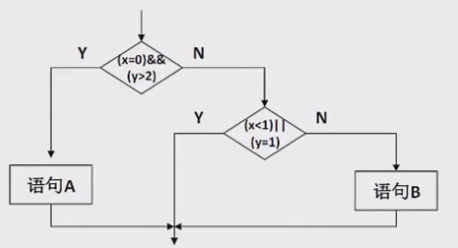

**选项：**

- A. 语句 (Statement)
- B. 条件 (Condition)
- C. 判定/条件 (Decision/Condition)
- D. 路径 (Path)

**答案：** AD

**解析：**
- **第一空：语句覆盖** - 测试用例①②可以覆盖所有语句，完成语句覆盖
- **第二空：路径覆盖** - 测试用例①②③或①②④可以覆盖所有可行路径，完成路径覆盖

## 真题23：McCabe度量

**题目：** 下图使用白盒测试方法进行测试。该图有()条路径。使用McCabe度量，该程序图的圈复杂度为()。

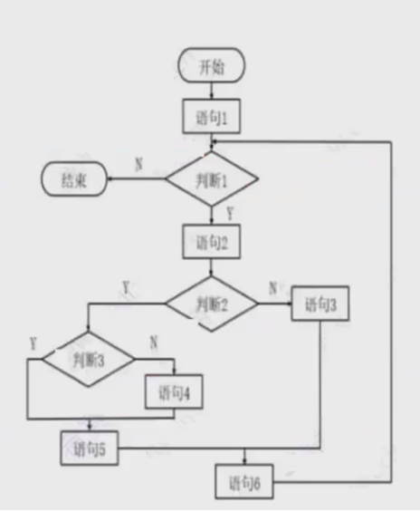

**选项：**

- A. 3, 3
- B. 4, 4
- C. 5, 5
- D. 6, 6

**答案：** B

**解析：**
- **节点数(n)**：11个节点(开始、语句1、判断1、结束、语句2、判断2、语句3、判断3、语句4、语句5、语句6)
- **边数(m)**：13条有向边
- **圈复杂度**：m - n + 2 = 13 - 11 + 2 = 4
- **独立路径数**：等于圈复杂度，为4条

