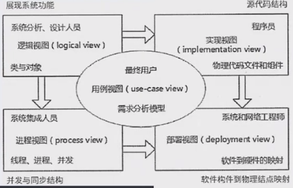

# 面向对象开发

## 1. 面向对象基本概念

### 1.1 对象(Object)
对象是由数据及其操作所构成的封装体，是系统中用来描述客观事务的一个实体，是构成系统的一个基本单位。一个对象通常可以由对象名、属性和方法3个部分组成。

### 1.2 类(Class)
类是现实世界中实体的形式化描述，类将该实体的属性(数据)和操作(函数)封装在一起。对象是类的实例，类是对象的模板。

**类的分类：**
类可以分为三种：实体类、接口类(边界类)和控制类。

- **实体类**：实体类的对象表示现实世界中真实的实体，如人、物等
- **接口类(边界类)**：接口类的对象为用户提供一种与系统合作交互的方式，分为人和系统两大类
  - **人的接口**：显示屏、窗口、Web窗体、对话框、菜单、列表框、其他显示控制、条形码、二维码或者用户与系统交互的其他方法
  - **系统接口**：涉及到把数据发送到其他系统，或者从其他系统接收数据
- **控制类**：控制类的对象用于控制活动流，充当协调者

### 1.3 抽象(Abstraction)
抽象是通过特定的实例抽取共同特征以后形成概念的过程。它强调主要特征，忽略次要特征。一个对象是现实世界中一个实体的抽象，一个类是一组对象的抽象，抽象是一种单一化的描述，它强调给出与应用相关的特性，抛弃不相关的特性。

### 1.4 封装(Encapsulation)
封装是一种信息隐蔽技术，将相关的概念组成一个单元模块，并通过一个名称来引用。面向对象封装是将数据和基于数据的操作封装成一个整体对象，对数据的访问或修改只能通过对象对外提供的接口进行。

### 1.5 继承(Inheritance)
继承表示类之间的层次关系(父类与子类)，这种关系使得某类对象可以继承另外一类对象的特征，又可分为单继承和多继承。

### 1.6 多态(Polymorphism)
多态是不同的对象收到同一个消息时产生完全不同的结果。包括参数多态(不同类型参数多种结构类型)、包含多态(父子类型关系)、过载多态(类似于重载，一个名字不同含义)、强制多态(强制类型转换)四种类型。多态由继承机制支持，将通用消息放在抽象层，具体不同的功能实现放在底层。

### 1.7 接口(Interface)
接口是描述对操作规范的说明，其只说明操作应该做什么，并没有定义操作如何做。

### 1.8 消息(Message)
消息体现对象间的交互，通过它向目标对象发送操作请求。

### 1.9 覆盖(Overriding)
覆盖是子类在原有父类接口的基础上，用适合于自己要求的实现去置换父类中的相应实现。即在子类中重定义一个与父类同名同参的方法。

### 1.10 函数重载(Function Overloading)
函数重载与覆盖要区分开，函数重载与子类父类无关，且函数是同名不同参数。

### 1.11 绑定(Binding)
绑定是一个把过程调用和响应调用所需要执行的代码加以结合的过程。在一般的程序设计语言中，绑定是在编译时进行的，叫作静态绑定。动态绑定则是在运行时进行的，因此，一个给定的过程调用和代码的结合直到调用发生时才进行。

## 2. 面向对象的分析

### 2.1 面向对象分析定义
面向对象分析的目的是确定和理解问题域。包括五个活动：识别对象、组织对象、描述对象间的交互、确定对象的操作、定义对象的内部信息。

### 2.2 面向对象需求建模
面向对象需求建模包括两个主要模型：

#### 2.2.1 用例模型
- 识别参与者
- 合并需求获得用例
- 细化用例描述
- 调整用例模型

**用例模型要素：**
- 用例名称
- 简要说明
- 事件流
- 非功能需求
- 前置条件
- 后置条件
- 扩展点
- 优先级

**用例关系：**
- 包含关系(Include)
- 扩展关系(Extend)
- 泛化关系(Generalization)

#### 2.2.2 分析模型
- 定义概念类
- 识别类之间的关系
- 为类添加职责
- 建立交互图

**类之间的关系：**
- 依赖关系(Dependency)
- 关联关系(Association)
- 聚合关系(Aggregation)
- 组合关系(Composition)
- 泛化关系(Generalization)
- 实现关系(Realization)

## 3. 面向对象的设计

### 3.1 面向对象设计定义
面向对象设计是对分析模型进行设计，并实现相应的源代码。它提供问题域的解决方案，是与技术相关的。面向对象设计(OOD)应该遵循抽象、信息隐藏、功能独立、模块化等设计原则。

### 3.2 OOA和OOD模型组成
#### 3.2.1 面向对象的分析模型
主要由以下部分组成：
- 顶层架构图
- 用例与用例图
- 领域概念模型

#### 3.2.2 设计模型
包括：
- 以包图表示的软件体系结构图
- 以交互图表示的用例实现图
- 完整精确的类图
- 针对复杂对象的状态图
- 用以描述流程化处理过程的活动图等

### 3.3 设计过程

## 4. 面向对象的设计原则

### 4.1 单一责任原则(Single Responsibility Principle)
一个类应该只有一个引起它变化的原因。当修改一个类时，应该只有一个原因，确保一个类只承担一种类型的职责。

### 4.2 开放-封闭原则(Open-Closed Principle)
软件实体(类、模块、函数等)应该对扩展开放，对修改封闭。

### 4.3 里氏替换原则(Liskov Substitution Principle)
子类型必须能够替换它们的基类型。也就是说，在任何父类可以出现的地方，子类的实例也可以用来赋值给父类型的引用。

### 4.4 依赖倒置原则(Dependency Inversion Principle)
抽象不应该依赖于细节，细节应该依赖于抽象。具体来说，高层模块不应该依赖于低层模块，两者都应该依赖于抽象。

### 4.5 接口分离原则(Interface Segregation Principle)
客户端不应该被迫依赖于它们不使用的接口。接口属于客户端，而不是它们所在的类层次结构。也就是说，依赖于抽象，而不是具体实现，在抽象层面，不应该有对细节的依赖。这样做的好处是最大化对可能变化的适应性。

## 5. 面向对象的测试

### 5.1 测试层次
一般来说，对面向对象软件的测试可分为下列4个层次进行：

1. **算法层**：测试类中定义的每个方法，这基本上等价于传统软件测试中的单元测试
2. **类层**：测试封装在同一个类中的所有方法和属性之间的交互。在面向对象软件中，类是基本模块，因此这可以认为是面向对象测试所特有的模块测试
3. **模板层**：测试一组协作类之间的交互，大体上等价于传统软件测试中的集成测试，但也结合了面向对象软件的特点(如对象通过发送消息进行交互)
4. **系统层**：将各种子系统组装成完整的面向对象软件系统，在组装过程中进行测试

# 统一建模语言UML

## 1. UML概述

### 1.1 UML定义
UML(统一建模语言)是一种可视化的建模语言，而非程序设计语言，支持从需求分析开始的软件开发的全过程。

### 1.2 UML结构
从总体上来看，UML的结构包括构造块、规则和公共机制三个部分：

**(1) 构造块**
UML有三种基本的构造块，分别是事物(thing)、关系(relationship)和图(diagram)。事物是UML的重要组成部分，关系把事物紧密联系在一起，图是多个相互关联的事物的集合。

**(2) 公共机制**
公共机制是指达到特定目标的公共UML方法。

**(3) 规则**
规则是构造块如何放在一起的规定。

## 2. UML基本构造块

### 2.1 事物(Things)

#### 2.1.1 结构事物
模型的静态部分，如类、接口、用例、构件等。

#### 2.1.2 行为事物
模型的动态部分，如交互、活动、状态机。

#### 2.1.3 分组事物
模型的组织部分，如包。

#### 2.1.4 注释事物
模型的解释部分，依附于一个元素或一组元素之上对其进行约束或解释的简单符号。

### 2.2 关系(Relationships)

#### 2.2.1 依赖关系
一个事物的语义依赖于另一个事物的语义的变化而变化。

#### 2.2.2 关联关系
是一种结构关系，描述了一组链，链是对象之间的连接。分为组合和聚合，都是部分和整体的关系，其中组合事物之间关系更强。两个类之间的关联，实际上是两个类所扮演角色的关联，因此，两个类之间可以有多个由不同角色标识的关联。

#### 2.2.3 泛化关系
一般/特殊的关系，子类和父类之间的关系。

#### 2.2.4 实现关系
一个类元指定了另一个类元保证执行的契约。

## 3. UML图分类

### 3.1 静态图(结构图)
- **用例图**：系统与外部参与者的交互
- **类图**：一组类、接口、协作和它们之间的关系
- **对象图**：一组对象及它们之间的关系
- **构件图**：一个封装的类和它的接口
- **部署图**：软硬件之间映射
- **制品图**：系统的物理结构
- **包图**：由模型本身分解而成的组织单元，以及它们之间的依赖关系
- **组合结构图**

### 3.2 动态图(行为图)
- **状态图**：状态转换变迁
- **活动图**：类似程序流程图，并行行为

### 3.3 交互图(作为动态图的子分类)
- **顺序图**：强调按时间顺序
- **通信图(协作图)**
- **定时图**：强调实际时间
- **交互概览图**

## 4. 主要UML图详解

### 4.1 用例图(Use Case Diagram)
用例图是静态图，展现了一组用例、参与者以及它们之间的关系。用例图中的参与者是人、硬件或其他系统可以扮演的角色；用例是参与者完成的一系列操作，用例之间的关系有扩展、包含、泛化。

**用例关系：**
- **包含关系(Include)**：一个用例包含另一个用例的行为
- **扩展关系(Extend)**：一个用例扩展另一个用例的行为
- **泛化关系(Generalization)**：一般用例与特殊用例之间的关系

### 4.2 类图(Class Diagram)
类图是一种静态图，为系统的静态设计视图，展现一组对象、接口、协作和它们之间的关系。

**类图元素：**
- **类**：包含属性(attributes)和方法(methods)
- **接口**：用圆圈表示
- **关系**：关联、依赖、泛化、实现等

### 4.3 对象图(Object Diagram)
对象图是一种静态图，展现某一时刻一组对象及它们之间的关系，是类图的某一快照。在没有类图的前提下，对象图也可以作为静态设计视图。

### 4.4 序列图(Sequence Diagram)
序列图，即顺序图，是动态图，是场景的图形化表示，描述了以时间顺序组织的对象之间的交互活动。

**消息类型：**
- **同步消息**：进行阻塞调用，调用者中止执行，等待控制权返回，需要等待返回消息，用实心三角箭头表示
- **异步消息**：发出消息后继续执行，不引起调用者阻塞，也不等待返回消息，由空心箭头表示
- **返回消息**：由从右到左的虚线箭头表示

### 4.5 通信图(Communication Diagram)
通信图是动态图，即协作图，强调参加交互的对象的组织。

### 4.6 状态图(State Diagram)
状态图是一种动态图，展现了一个状态机，描述单个对象在多个用例中的行为，包括简单状态和组合状态。转换可以通过事件触发器触发，事件触发后相应的监护条件会进行检查。

**状态图元素：**
- **状态**：用方框表示
- **转换**：用箭头表示，箭头上标注触发事件
- **起点和终点**：用实心圆点表示

### 4.7 活动图(Activity Diagram)
活动图是一种特殊的动态图，展现了在系统内从一个活动到另一个活动的流程。活动的分岔和汇合线是一条水平粗线。

**活动图元素：**
- **并发分岔**：水平粗线，表示并行活动的开始
- **并发汇合**：水平粗线，表示并行活动的结束
- **监护表达式**：条件判断
- **分支**：决策节点
- **流**：活动之间的连接

### 4.8 构件图(Component Diagram)
构件图(组件图)是一种静态图，为系统静态实现视图，展现了一组构件之间的组织和依赖。

**构件图元素：**
- **构件**：用矩形表示，右上角有构件图标
- **供接口**：用"棒棒糖"符号表示
- **需接口**：用"插座"符号表示
- **依赖**：用虚线箭头表示

### 4.9 部署图(Deployment Diagram)
部署图是一种静态图，表示系统的静态部署视图，展现物理模块在节点中的分布情况。

**部署图特点：**
- 与构件图相关
- 一个节点通常包含一个或多个构件
- 部署构件之间的依赖关系是单向的，类似于包含关系

## 5. UML 4+1视图

### 5.1 逻辑视图(Logical View)
也称为设计视图，表示设计模型中架构上重要的部分，即类、子系统、包和用例实现的子集。

### 5.2 进程视图(Process View)
将可执行的线程和进程建模为主动类。它是逻辑视图的一次执行实例，描述了并发与同步结构。

### 5.3 实现视图(Implementation View)
对组成系统物理代码的文件和构件进行建模。

### 5.4 部署视图(Deployment View)
把构件部署到一组物理节点上，表示软件到硬件的映射和分布结构。

### 5.5 用例视图(Use Case View)
最基本的需求分析模型。

## 6. 设计模式

### 6.1 设计模式概述
在实际项目中，我应用过多种设计模式来解决不同的问题，以下是一些例子，有助于理解记忆：

1. **单例模式 (Singleton Pattern)**
   - **应用场景**：在电商平台中，我使用单例模式来管理全局唯一的订单ID生成器。
   - **解决问题**：确保系统中只有一个订单ID生成器实例，避免多个实例导致ID冲突，保证订单数据的准确性和一致性，同时节约系统资源。

2. **工厂模式 (Factory Pattern)**
   - **应用场景**：在支付模块中，我使用工厂模式根据不同的支付类型（如支付宝、微信支付、银行卡支付）创建不同的支付客户端。
   - **解决问题**：将支付客户端的创建逻辑与业务代码解耦，方便扩展新的支付方式，提高代码的可维护性和可扩展性，并简化了对象创建逻辑。

3. **策略模式 (Strategy Pattern)**
   - **应用场景**：在商品促销模块中，我使用策略模式根据不同的用户等级（如普通会员、VIP、超级VIP会员）采用不同的促销策略。
   - **解决问题**：避免大量的if-else语句，将不同的促销策略封装成独立的类，方便扩展和维护，提高代码的可读性和灵活性。

4. **模板方法模式 (Template Method Pattern)**
   - **应用场景**：在数据导出模块中，需要将数据导出为不同的格式（如CSV、Excel、PDF），但导出的基本流程相同，我使用了模板方法模式。
   - **解决问题**：避免重复编写相同的导出流程代码，固定算法骨架，提高代码的复用性，同时允许子类根据需要实现具体的导出逻辑。

5. **建造者模式 (Builder Pattern)**
   - **应用场景**：在订单系统中，需要构建复杂的订单对象，订单包含多个属性（如商品列表、用户信息、支付信息等），我使用了建造者模式。
   - **解决问题**：避免构造函数参数过多，分步骤构建复杂对象，简化复杂对象的构建过程，提高代码的可读性和可维护性。

6. **观察者模式 (Observer Pattern)**
   - **应用场景**：在用户注册模块中，当用户注册成功后，需要发送欢迎短信、发送注册邮件、增加用户积分等操作，我使用了观察者模式。
   - **解决问题**：将注册成功后的操作与注册流程解耦，避免注册流程过于臃肿，实现松耦合的通知机制，提高代码的可扩展性和灵活性。

7. **装饰器模式 (Decorator Pattern)**
   - **应用场景**：在日志系统中，需要为日志记录器添加额外的功能（如加密日志、压缩日志），我使用了装饰器模式。
   - **解决问题**：动态地为对象添加额外的功能，而无需修改其结构，提供比继承更灵活的扩展方式，遵循开闭原则，提高代码的灵活性和可扩展性。

8. **适配器模式 (Adapter Pattern)**
   - **应用场景**：在系统集成中，需要将第三方支付接口适配到现有的支付系统中，我使用了适配器模式。
   - **解决问题**：解决接口不兼容的问题，实现不兼容接口的协作，使现有系统能够与第三方接口无缝对接，提高系统的兼容性和可扩展性。

### 6.2 创建型设计模式

| 模式 | 定义 | 记忆关键字 |
|------|------|------------|
| Abstract Factory 抽象工厂模式 | 提供一个接口，可以创建一系列相关或相互依赖的对象，而无需指定它们具体的类 | 抽象接口 |
| Builder 建造者模式 | 将一个复杂对象的构建与它的表示分离，使得相同的构建过程能够创建不同的表示 | 类和构造分离 |
| Factory Method 工厂方法模式 | 定义一个创建对象的接口，但让子类决定实例化哪一个类，使子类实例化过程延迟到子类 | 子类决定实例化 |
| Prototype 原型模式 | 用原型实例指定创建对象的类型，并且通过拷贝这个原型来创建新的对象 | 原型实例，拷贝 |
| Singleton 单例模式 | 保证一个类只有一个实例，并提供一个访问它的全局访问点 | 唯一实例 |

### 6.3 结构型设计模式

| 模式 | 定义 | 记忆关键字 |
|------|------|------------|
| Adapter 适配器模式 | 将一个类的接口转换成用户希望的另一种接口，使得原本不相容的接口可以协同工作 | 转换，兼容接口 |
| Bridge 桥接模式 | 将抽象部分与它的实现部分分离，使它们都可以独立地变化 | 抽象和实现分离 |
| Composite 组合模式 | 将对象组合成树形结构以表示“部分-整体”的层次结构，使得用户对单个对象和组合对象的使用具有一致性 | 整体-部分，树形结构 |
| Decorator 装饰器模式 | 动态地给一个对象添加一些额外的职责，比派生子类更灵活地扩展功能 | 附加职责 |
| Facade 外观模式 | 定义一个高层接口，为系统中的一组接口提供一个一致的访问方式 | 对外统一接口 |
| Flyweight 享元模式 | 提供支持大量细粒度对象共享的有效方法 | 细粒度，共享 |
| Proxy 代理模式 | 为其他对象提供一种代理以控制对这个对象的访问 | 代理控制 |

### 6.4 行为型设计模式

| 模式 | 定义 | 记忆关键字 |
|------|------|------------|
| Chain of Responsibility 职责链模式 | 通过多个对象处理请求的机会，减少请求的发送者与接收者之间的耦合，将接收对象链接起来，在链中传递请求，直到有一个对象处理这个请求 | 传递请求，职责链 |
| Command 命令模式 | 将一个请求封装为一个对象，从而可用不同的请求对客户进行参数化，将请求排队或记录请求日志，支持可撤销的操作 | 日志记录，可撤销 |
| Interpreter 解释器模式 | 给定一种语言，定义它的文法表示，并定义一个解释器，该解释器用来根据文法表示来解释语言中的句子 | 解释器，虚拟机 |
| Iterator 迭代器模式 | 提供一种方法来顺序访问一个聚合对象中的各个元素，而不需要暴露该对象的内部表示 | 顺序访问，不暴露内部 |
| Mediator 中介者模式 | 用一个中介对象来封装一系列的对象交互，它使各对象不需要显式地相互引用，从而达到低耦合，还可以独立地改变对象间的交互 | 不直接引用 |
| Memento 备忘录模式 | 在不破坏封装性的前提下，捕获一个对象的内部状态，并在该对象之外保存这个状态，从而可以在以后将该对象恢复到原先保存的状态 | 保存，恢复 |
| Observer 观察者模式 | 定义对象间的一种一对多的依赖关系，当一个对象的状态发生改变时，所有依赖于它的对象都得到通知并自动更新 | 通知，自动更新 |
| State 状态模式 | 允许一个对象在其内部状态改变时改变它的行为 | 状态变成类 |
| Strategy 策略模式 | 定义一系列算法，把它们一个个封装起来，并且使它们之间可相互替换，从而让算法可以独立于使用它的用户而变化 | 算法替换 |
| Template Method 模板方法模式 | 定义一个操作中的算法骨架，而将一些步骤延迟到子类中，使得子类可以不改变一个算法的结构即可重新定义该算法的某些特定步骤 | 子类决定具体实现 |
| Visitor 访问者模式 | 表示一个作用于某对象结构中的各元素的操作，使得在不改变各元素的类的前提下定义作用于这些元素的新操作 | 数据和操作分离 |

# 真题

## 真题1：方法重载

**题目：** 一个类中可以拥有多个名称相同而参数表(参数类型或参数个数或参数类型顺序)不同的方法，称为()。

**选项：**
- A. 方法标记 (Method Tagging)
- B. 方法调用 (Method Invocation)
- C. 方法重载 (Method Overloading)
- D. 方法覆盖 (Method Overriding)

**答案：** C

**解析：** 方法重载是指在同一个类中定义多个同名但参数列表不同的方法。参数列表的不同可以体现在参数类型、参数个数或参数类型顺序上。

## 真题2：类的分类

**题目：** 在某销售系统中，客户采用扫描二维码进行支付。若采用面向对象方法开发该销售系统，则客户类属于()类，二维码类属于()类。

**选项：**
- A. 接口 (Interface)
- B. 实体 (Entity)
- C. 控制 (Control)
- D. 状态 (State)

**答案：** BA

**解析：**
- **客户类**：直接映射业务中的客户实体，存储属性和基础行为，属于实体类
- **二维码类**：若负责与外部支付系统交互(如生成二维码、处理扫描逻辑)，则属于接口类(边界类)；若仅存储二维码数据，则为实体类。但题目强调"扫描二维码进行支付"，隐含交互逻辑，故更倾向接口类

## 真题3：面向对象分析设计模型

**题目：** 面向对象的分析模型主要由顶层架构图、用例与用例图和()构成；设计模型则包含以()表示的软件体系结构图、以交互图表示的用例实现图、完整精确的类图、描述复杂对象的()和用以描述流程化处理过程的活动图等。

**选项：**
- A. 数据流模型 (Data Flow Model)
- B. 领域概念模型 (Domain Concept Model)
- C. 功能分解图 (Functional Decomposition Diagram)
- D. 功能需求模型 (Functional Requirement Model)
- A. 模型视图控制器 (Model-View-Controller)
- B. 组件图 (Component Diagram)
- C. 包图 (Package Diagram)
- D. 2层、3层或N层 (2-layer, 3-layer, or N-layer)
- A. 序列图 (Sequence Diagram)
- B. 协作图 (Collaboration Diagram)
- C. 流程图 (Flowchart)
- D. 状态图 (State Diagram)

**答案：** BCD

**解析：**
- **第一空：领域概念模型** - 面向对象的分析模型主要由顶层架构图、用例与用例图和领域概念模型构成。领域概念模型描述了问题域中的核心概念、实体及其关系，通常用类图表示，是分析阶段的重要工件
- **第二空：包图** - 设计模型的软件体系结构图使用包图表示。包图通过展示系统中的包及其依赖关系，提供高层次的模块化视图，帮助组织和管理系统的复杂性
- **第三空：状态图** - 设计模型中需要状态图来描述复杂对象的状态变化。状态图适用于展示对象在其生命周期内不同状态之间的转换逻辑，例如订单状态从"待支付"到"已发货"的流程

## 真题4：面向对象设计原则

**题目：** 在面向对象设计的原则中，()原则是指抽象不应该依赖于细节，细节应该依赖于抽象，即应针对接口编程，而不是针对实现编程。

**选项：**
- A. 开闭 (Open/Closed)
- B. 里氏替换 (Liskov Substitution)
- C. 最少知识 (Least Knowledge)
- D. 依赖倒置 (Dependency Inversion)

**答案：** D

**解析：** 依赖倒置原则(Dependency Inversion Principle)是指抽象不应该依赖于细节，细节应该依赖于抽象。具体来说，高层模块不应该依赖于低层模块，两者都应该依赖于抽象。这意味着应该针对接口编程，而不是针对实现编程。

## 真题5：用例关系

**题目：** 用例(use case)用来描述系统对事件做出响应时所采取的行动。用例之间是具有相关性的。在一个会员管理系统中，会员注册时可以采用电话和邮件两种方式。用例"会员注册"和"电话注册"、"邮件注册"之间是()关系。

**选项：**
- A. 包含(include)
- B. 扩展(extend)
- C. 泛化(generalize)
- D. 依赖(depends on)

**答案：** C

**解析：** 在会员管理系统中，"会员注册"是一个通用的用例，表示会员进行注册的操作；"电话注册"和"邮件注册"是"会员注册"的两种具体实现方式，它们继承了"会员注册"的基本行为，并且各自有自己的特殊注册方式(电话或邮件)。这符合泛化关系中父用例表示一般化行为，子用例表示特殊化行为的特点。

## 真题6：UML状态图

**题目：** 以下关于UML状态图的叙述中，不正确的是()

**选项：**
- A. 活动可以在状态内执行，也可以在迁移时执行
- B. 若事件触发一个没有特定监护条件的迁移，则对象离开当前状态
- C. 迁移可以包含事件触发器，监护条件和状态
- D. 事件触发迁移

**答案：** C

**解析：** 迁移(Transition)的组成元素包括事件触发器(Event Trigger)、监护条件(Guard Condition)和动作(Action)，但不包含状态本身。状态是迁移的源(Source State)和目标(Target State)，而非迁移的一部分。

## 真题7：UML 4+1视图

**题目：** 在UML提供的系统视图中，()是逻辑视图的一次执行实例，描述了并发与同步结构；()是最基本的需求分析模型。

**选项：**
- A. 进程视图
- B. 实现视图
- C. 部署视图
- D. 用例视图

**答案：** AD

**解析：**
- **进程视图**：是逻辑视图的一次执行实例，描述了并发与同步结构
- **用例视图**：是最基本的需求分析模型

## 真题8：UML活动图

**题目：** 如下所示的UML图是()，图中(I)表示()，(Ⅱ)表示()。

**选项：**
- A. 序列图
- B. 状态图
- C. 通信图
- D. 活动图
- A. 合并分叉
- B. 分支
- C. 合并汇合
- D. 流
- A. 分支条件
- B. 监护表达式
- C. 动作名
- D. 流名称

**答案：** DAB

**解析：**
- 该图是**活动图**，描述了订单处理流程
- 图中(I)表示**分支**，即决策节点，用于条件判断
- 图中(Ⅱ)表示**监护表达式**，即条件表达式，如"[not complete]"和"[else]"

## 真题9：设计模式

