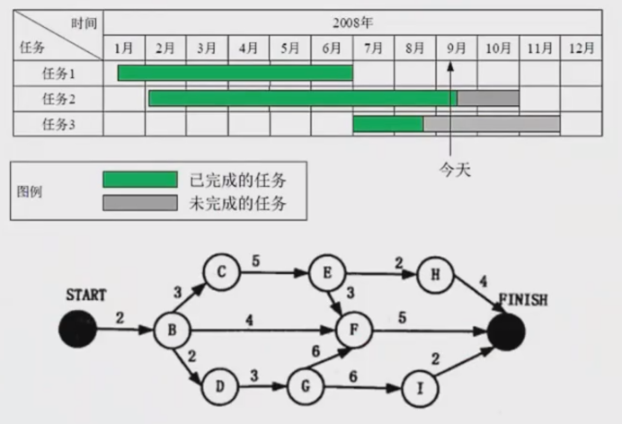
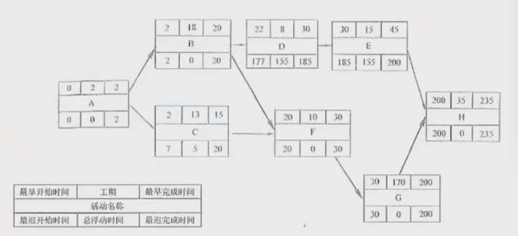
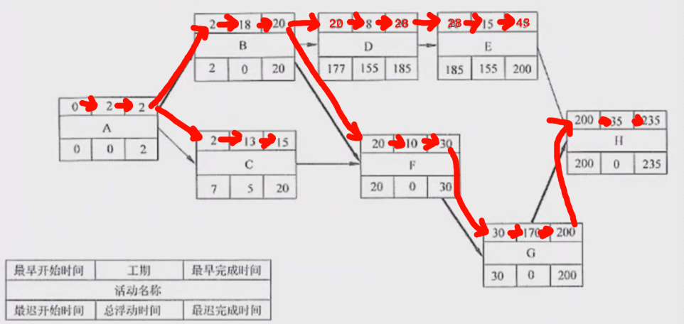
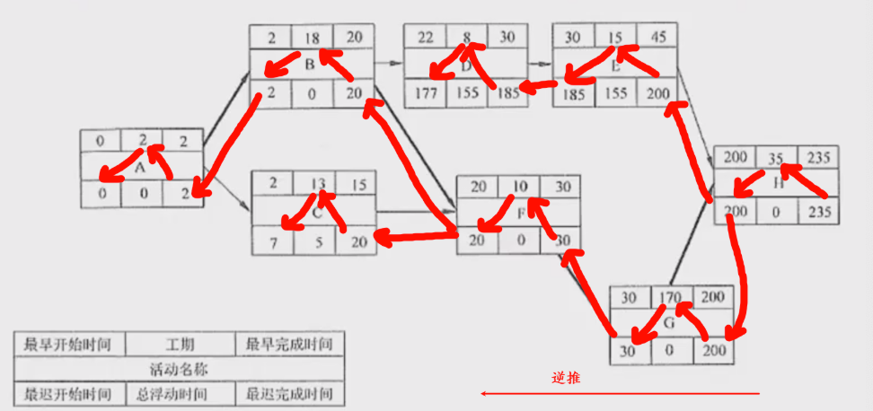
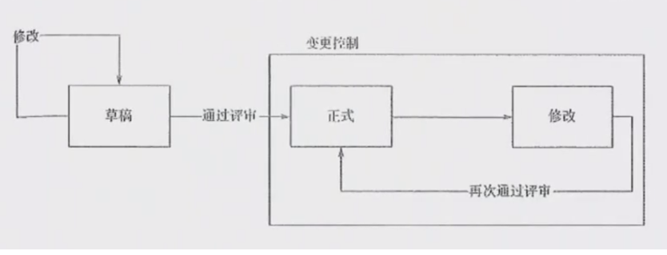
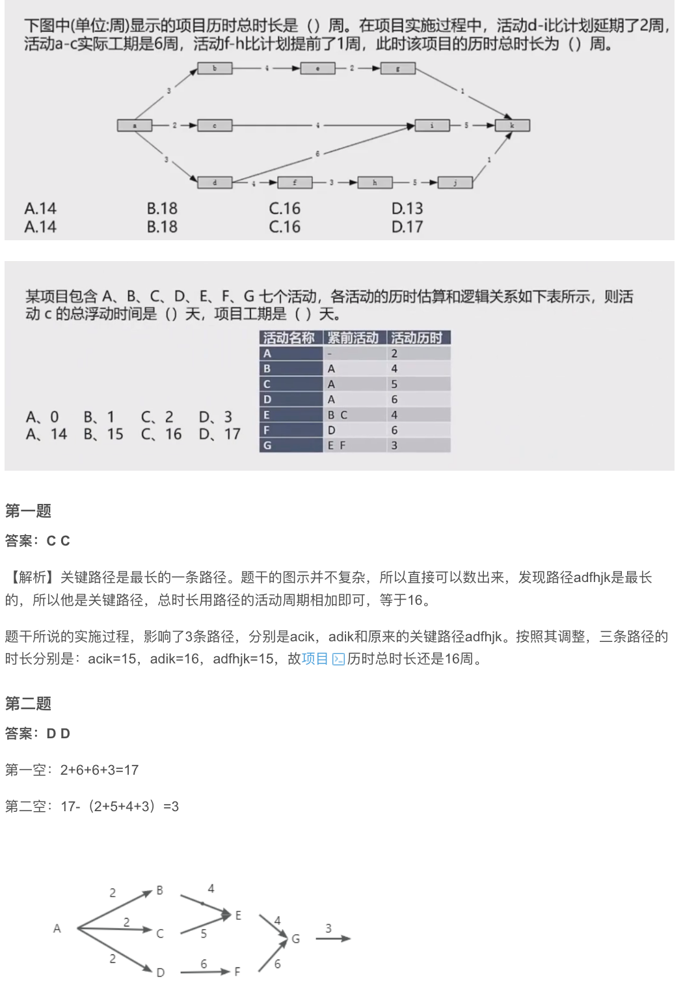

# 进度管理

进度管理就是采用科学的方法，确定进度目标，编制进度计划和资源供应计划，进行进度控制，在与质量、成本目标协调的基础上，实现工期目标。

具体来说，包括以下过程：
(1) **活动定义**：识别和记录为完成项目各可交付成果而需要开展的具体活动。
(2) **活动排序**：确定完成各项活动之间的先后关系和逻辑关系。
(3) **活动资源估算**：估算完成各项活动所需要的资源类型和数量。
(4) **活动历时估算**：估算完成各项活动所需要的具体时间。
(5) **制定进度计划**：分析活动顺序、活动持续时间、资源要求和进度制约因素，制定项目进度计划。
(6) **进度控制**：根据进度计划开展项目活动。如果发现偏差，则分析原因或进行调整。

常用图表：甘特图（Gantt图）和项目计划评审技术图（PERT）。

进度安排的常用图形描述方法有Gantt图（甘特图）与项目计划评审技术（Program Evaluation & Review Technique, PERT）图。

### 关键路径法
关键路径是项目的最长路径，但却是从开始到结束时间最长的路径。进度网络图中可能有多条关键路径，因为活动会变化，因此关键路径也在不断变化。关键活动：关键路径上的活动，最早开始时间=最晚开始时间。

通常，每个节点的活动有以下几个时间：
(1) **最早开始时间（ES）**：某项活动能够开始的最早时间。
(2) **最早结束时间（EF）**：某项活动能够完成的最早时间。EF=ES+工期
(3) **最迟结束时间（LF）**：为了使项目按时完成，某项活动必须完成的最迟时间。
(4) **最迟开始时间（LS）**：为了使项目按时完成，某项活动必须开始的最迟时间。LS=LF-工期

这几个时间通常作为每个节点的组成部分，顺推：最早开始ES=所有前置活动最早完成的最大值；最早完成EF=最早开始ES+持续时间。逆推：最晚完成LF=所有后续活动最晚开始的最小值；最晚开始LS=最晚完成LF-持续事件。

顺推：取最大

逆推：取最小

总浮动时间 = 最迟开始LS - 最早开始ES 或 最迟完成LF - 最早完成EF 或 关键路径- 非关键路径

算D的总浮动时间：157 。方法1️⃣：177-20=157；方法2️⃣：185-28=157；方法3️⃣：关键路径-非关键路径=（2+18+10+170+35）-（2+18+8+15+35）= 157

自由浮动时间 = 紧后活动最早开始时间的最小值-本活动的最早完成时间。

B的自由浮动时间：20-20=0；C的自由浮动时间：20-15=5

### 总浮动时间与自由浮动时间

- **总浮动时间**：在不延误项目完工时间且不违反进度制约因素的前提下，活动可以从最早开始时间推迟或拖延的时间量，就是该活动的进度灵活性。正常情况下，关键活动的总浮动时间为零。
  总浮动时间=最迟开始LS-最早开始ES 或 最迟完成LF-最早完成EF 或 关键路径-非关键路径时长。
- **自由浮动时间**：是指在不延误任何紧后活动的最早开始时间且不违反进度制约因素的前提下，活动可以从最早开始时间推迟或拖延的时间量。
  自由浮动时间=紧后活动最早开始时间的最小值-本活动的最早完成时间。

# 软件配置管理

配置管理是为了系统地控制配置变更，在系统的整个生命周期中维持配置的完整性和可跟踪性，而标识系统在不同时间点上配置的学科。

在GB/T11457-2006中将“配置管理”正式定义为：“应用技术的和管理的指导和监控方法以标识和说明配置项的功能和物理特征，控制这些特征的变更，记录和报告变更处理和实现状态并验证与规定的需求的遵循性。”

配置管理包括6个主要活动：制订配置管理计划、配置标识、配置控制、配置状态报告、配置审计、发布管理和交付。

### 配置项
配置项：GB/T11457-2006对配置项的定义为：“为配置管理设计的硬件、软件或二者的集合，在配置管理过程中作为一个单个实体来对待”。

以下内容可以作为配置项进行管理：外部交付的软件产品和数据、指定的内部软件工作产品和数据、指定的用于创建或支持软件产品的支持工具、供方/供应商提供的软件和客户提供的设备/软件。

典型配置项包括项目计划书、需求文档、设计文档、源代码、可执行代码、测试用例、运行软件所需的各种数据，它们经评审和检查通过后进入配置管理。

每个配置项的主要属性有：名称、标识符、文件状态、版本、作者、日期等。

配置项可以分为基线配置项和非基线配置项两类。例如，基线配置项可能包括所有的设计文档和源程序等；非基线配置项可能包括项目的各类计划和报告等。

所有配置项的操作权限应由CMO（配置管理员）严格管理，基本原则是：基线配置项向开发人员开放读取的权限；非基线配置项向PM、CCB及相关人员开放。

### 配置项的状态
配置项的状态可分为“草稿”“正式”和“修改”三种。配置项刚建立时，其状态为“草稿”。配置项通过评审后，其状态变为“正式”。此后若更改配置项，则其状态变为“修改”。当配置项修改完毕并重新通过评审时，其状态又变为“正式”。

### 配置项版本号
(1) 处于“草稿”状态的配置项的版本号格式为0.YZ的数字格式为01-99。随着草稿的修改，YZ的取值应递增。YZ的初始值和增幅由用户自己把握。
(2) 处于“正式”状态的配置项的版本号格式为X.Y，X为主版本号，取值范围为1-9。Y为次版本号，取值范围为0-9。配置项第一次成为“正式”文件时，版本号为1.0。如果配置项的版本升级幅度比较小，一般只增大Y值，X值保持不变。当配置项版本升级幅度比较大时，才允许增大X值。
(3) 处于“修改”状态的配置项的版本号格式为X.YZ。配置项正在修改时，一般只增大Z值，X.Y值保持不变。当配置项修改完成并评审后，其状态变为“正式”时，将Z值设置为0，增大Y值（当Y值为9时，则增大X值，Y值复0）。

配置项版本管理：在项目开发过程中，绝大部分的配置项都要经过多次的修改才能最终确定下来。对配置项的任何修改都将产生新的版本。由于我们不能保证新版本一定比旧版本“好”，所以不能抛弃旧版本。版本管理的目的是按照一定的规则保存配置项的所有版本，避免发生版本丢失或混淆等现象，并可以快速准确地查找到配置项的任何版本。

# 质量管理

质量是软件产品特性的综合，表示软件产品满足明确（基本需求）或隐含（期望需求）要求的能力。质量管理是确定质量方针、目标和职责，并通过质量策划、质量控制、质量保证和质量改进来使其实现的所有管理职能的全部活动。

主要包括以下过程：
(1) **质量策划**：识别项目及其产品的质量要求和标准，并书面描述项目将如何达到这些要求和标准的过程。
(2) **质量保证**：一般是每隔一定时间（例如，每个阶段末）进行的，主要通过系统的质量审计和过程分析来保证项目的质量。
(3) **质量控制**：实时监控项目的具体结果，以判断它们是否符合相关质量标准，制订有效方案，以消除产生质量问题的原因。

# 风险管理

风险管理就是要对项目风险进行认真的分析和科学的管理，这样，是能够避开不利条件、减少损失、取得预期的结果并实现项目目标的，能够争取避免风险的发生或尽量减小风险发生后的影响。但是，完全避免或消除风险，或者只享受收益而不承担风险是不可能的。

在信息系统项目中，从宏观上来看，风险可以分为项目风险、技术风险和商业风险。

**项目风险**是指潜在的预算、进度、个人（包括人员和组织）、资源、用户和需求方面的问题，以及它们对项目的影响。项目复杂性、规模和结构的不确定性也构成项目的（估算）风险因素。项目风险威胁到项目计划，一旦项目风险成为现实，可能会拖延项目进度，增加项目的成本。

**技术风险**是指潜在的设计、实现、接口、测试和维护方面的问题。此外，规格说明的多义性、技术上的不确定性、技术陈旧、最新技术（不成熟）也是风险因素。技术风险威胁到待开发系统的质量和预定的交付时间。如果技术风险成为现实，开发工作可能会变得很困难或根本不可能。

**商业风险**威胁到待开发系统的生存能力，主要有以下5种不同的商业风险：
(1) 市场风险。开发的系统虽然很优秀但不是市场真正所想要的。
(2) 策略风险。开发的系统不再符合企业的信息系统战略。
(3) 销售风险。开发了销售部门不清楚如何推销的系统。
(4) 管理风险。由于重点转移或人员变动而失去上级管理部门的支持。
(5) 预算风险。开发过程没有得到预算或人员的保证。

风险管理计划编制：如何安排与实施项目的风险管理，制定下列各步的计划。

**风险识别**：识别出项目中已知和可预测的风险，确定风险的来源、产生的条件、描述风险的特征以及哪些项目可以产生风险，形成一个风险列表。

**风险定性分析**：对已经识别的风险进行排序，确定风险可能性与影响、确定风险优先级、确定风险类型。

**风险定量分析**：进一步了解风险发生的可能性具体由多大，后果具体由多严重。包括灵敏度分析、期望货币价值分析、决策树分析、蒙特卡罗模拟。

**风险应对计划编制**：对每一个识别出来的风险来分别制定应对措施，这些措施组成的文档称为风险应对计划。包括消极风险（避免策略、转移策略、减轻策略）；积极风险（开拓、分享、提高）。

**风险监控**：监控风险计划的执行，检测残余风险，识别新的风险，保证风险计划的执行，并评价这些计划对减少风险的有效性。

# 真题

## 综合题一：项目进度管理
项目经理小王正在负责一个软件开发项目，需要计算关键路径。项目包含A、B、C、D、E五个活动，其中A活动工期为3天，B活动工期为2天（依赖A），C活动工期为4天（依赖A），D活动工期为3天（依赖B和C），E活动工期为1天（依赖D）。

**问题1**：请计算该项目的关键路径。
**答案1**：关键路径为A→B→D→E，总工期为9天。

**问题2**：计算活动C的总浮动时间。
**答案2**：活动C的总浮动时间为1天。

## 综合题二：软件配置管理
某软件开发团队在实施配置管理过程中遇到了一些问题。团队成员小李对配置项状态和版本管理不太清楚，导致配置混乱。

**问题1**：配置项的三种状态是什么？
**答案1**：草稿、正式、修改。

**问题2**：处于"修改"状态的配置项版本号格式是什么？
**答案2**：X.YZ格式。

## 综合题三：质量管理
某软件公司正在推行全面质量管理，强调质量不是靠测试出来的，而是靠开发过程来保证的。

**问题1**：质量管理的三个主要过程是什么？
**答案1**：质量策划、质量保证、质量控制。

**问题2**：质量保证和质量控制的主要区别是什么？
**答案2**：质量保证是通过系统的质量审计和过程分析来保证项目的质量，一般是在每个阶段末进行；质量控制是实时监控项目的具体结果，以判断它们是否符合相关质量标准。

## 综合题四：风险管理
某项目团队正在进行风险评估，识别到以下风险：需求变更频繁、技术难度高、团队成员经验不足。

**问题1**：风险管理包含哪六个过程？
**答案1**：风险管理计划编制、风险识别、风险定性分析、风险定量分析、风险应对计划编制、风险监控。

**问题2**：对于需求变更频繁的风险，最适合采用哪种应对策略？
**答案2**：减轻策略（如加强需求管理、建立变更控制流程）。

## 综合题五：项目管理综合
某项目经理在项目实施过程中，需要协调进度、质量、成本等多个方面的管理工作。

**问题1**：项目管理的四个主要知识领域除了进度管理、质量管理外，还包括哪些？
**答案1**：成本管理、范围管理（注：根据用户提供的上下文，这里只需要列出软件配置管理和风险管理）。

**问题2**：在项目管理中，什么是基线？它有什么作用？
**答案2**：基线是已经通过正式评审和批准的某个规约或产品，它可以作为进一步开发的基础，并且只有通过正式的变更控制流程才能被更改。基线的主要作用是确保团队成员在项目的不同阶段都有一个共同的参照标准，便于控制变更和进行沟通。

