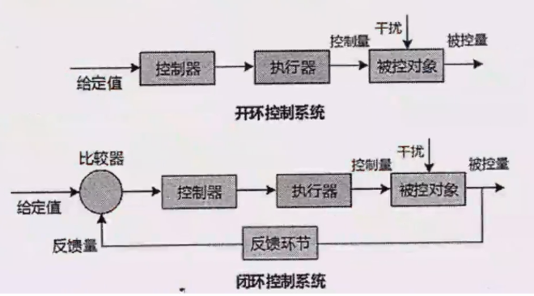
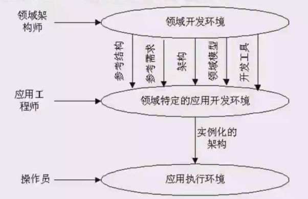
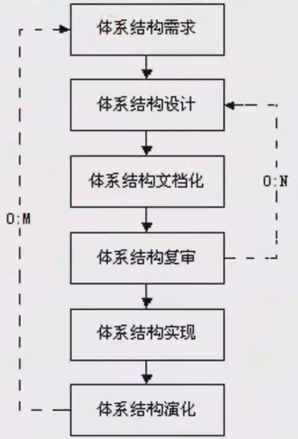
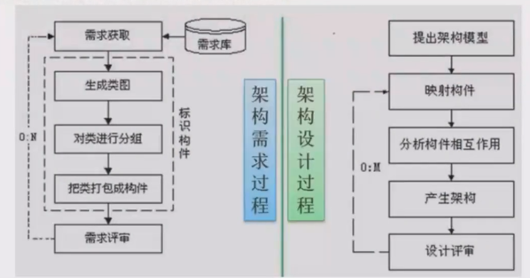
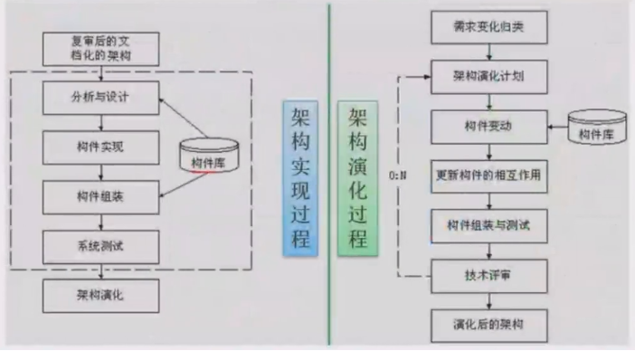
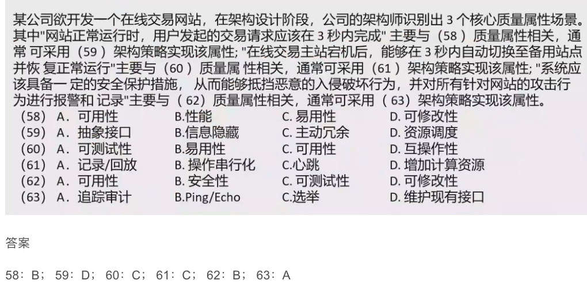
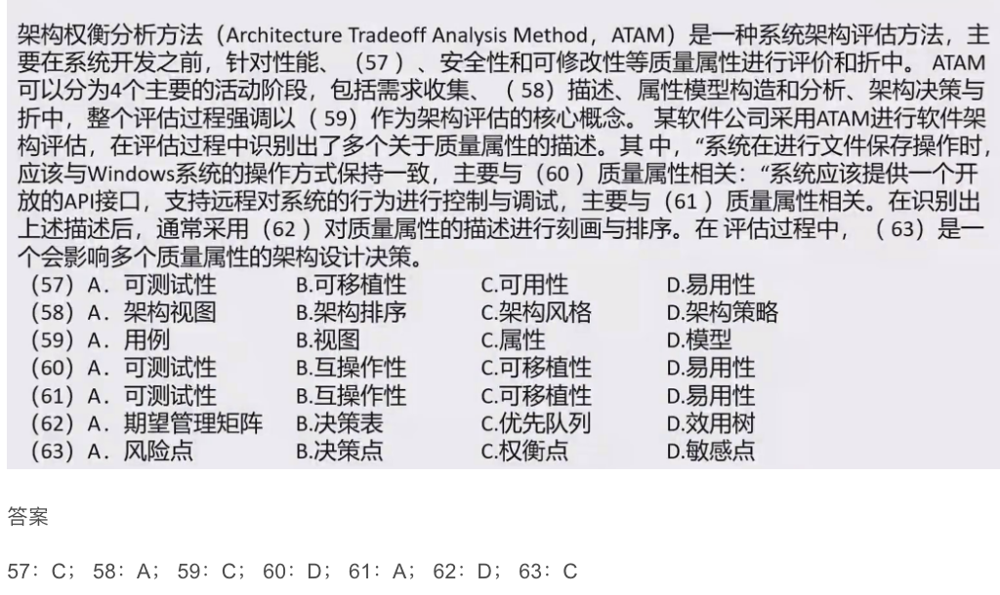

# 软件架构概述

从需求分析到软件设计之间的过渡过程称为软件架构。只要软件架构设计好了，整个软件就不会出现坍塌性的错误，即不会崩溃。

架构设计就是需求分配，将满足需求的职责分配到组件上。

软件架构为软件系统提供了一个结构、行为和属性的高级抽象，由构件的描述、构件的相互作用（连接件）、指导构件集成的模式以及这些模式的约束组成。

软件架构不仅指定了系统的组织结构和拓扑结构，并且显示了系统需求和构件之间的对应关系，提供了一些设计决策的基本原理。

解决好软件的复用、质量和维护问题，是研究软件架构的基本目的。

软件架构设计包括提出架构模型，产生架构设计和进行设计评审等活动，是一个迭代的过程。架构设计主要关注软件组件的结构、属性和交互作用，并通过多种视图全面描述特定系统的架构。

软件架构能够在设计变更相对容易的阶段，考虑系统结构的可选方案，便于技术人员与非技术人员就软件设计进行交互，能够展现软件的结构、属性与内部交互关系。

软件架构是项目干系人进行交流的手段，明确了对系统实现的约束条件，决定了开发和维护组织的组织结构，制约着系统的质量属性。

软件架构使推理和控制的更改更加简单，有助于循序渐进的原型设计，可以作为培训的基础。

软件架构是可传递和可复用的模型，通过研究软件架构可能预测软件的质量。

# 软件架构设计与生命周期

## 1. 需求分析阶段
需求分析和SA设计面临的是不同的对象：一个是问题空间；另一个是解空间。从软件需求模型向SA模型的转换主要关注两个问题：如何根据需求模型构建SA模型；如何保证模型转换的可追踪性。

## 2. 设计阶段
是SA（软件架构）研究关注的最早和最多的阶段，这一阶段的SA研究主要包括：SA模型的描述、SA模型的设计与分析方法，以及对SA设计经验的总结与复用等。有关SA模型描述的研究分为3个层次：SA的基本概念（构件和连接子）、体系结构描述语言ADL、SA模型的多视图表示。

## 3. 实现阶段
最初SA研究往往只关注较高层次的系统设计、描述和验证。为了有效实现SA设计向实现的转换，实现阶段的体系结构研究表现在以下几个方面：
(1) 研究基于SA的开发过程支持，如项目组织结构、配置管理等。
(2) 寻求从SA向实现过渡的途径，如将程序设计语言元素引入SA阶段、模型映射、构件组装、复用中间件平台等。
(3) 研究基于SA的测试技术。

## 4. 构件组装阶段
在SA设计模型的指导下，可复用构件的组装可以在较高层次上实现系统，并能够提高系统实现的效率。在构件组装的过程中，SA设计模型起到了系统蓝图的作用。研究内容包括如下两个方面：
(1) 如何支持可复用构件的互联，即对SA设计模型中规定的连接子的实现提供支持。
(2) 在组装过程中，如何检测并消除体系结构失配问题。
在构件组装阶段的失配问题主要包括：由构件引起的失配、由连接子引起的失配、由于系统成分对全局体系结构的假设存在冲突引起的失配等。

## 5. 部署阶段

软件架构对软件部署的作用如下：

(1) 提供高层的体系结构视图来描述部署阶段的软硬件模型。
(2) 基于SA模型可以分析部署方案的质量属性，从而选择合理的部署方案。

## 6. 后开发阶段
是指软件部署安装之后的阶段。这一阶段的SA研究主要围绕维护、演化、复用等方面来进行。典型的研究方向包括动态软件体系结构、体系结构恢复与重建等。
(1) 动态软件体系结构。现实中的软件具有动态性，体系结构会在运行时发生改变。运行时变化包括两类：软件内部执行所导致的体系结构改变；软件系统外部的请求对软件进行的重配置。
(2) 体系结构恢复与重建。对于没有系统的开发、运行时测量基础设施的情况，从这些系统中恢复或重构体系结构。从已有的系统中获取体系结构的重建方法分为4类：手工体系结构重建、工具支持的手工重建、通过查询语言来自动建立聚集、使用其他技术（如数据挖掘等）。

# 构件

构件是一个独立可交付的功能单元，外界通过接口访问其提供的服务。

构件由一组通常需要同时部署的原子构件组成。一个原子构件是一个模块和一组资源。原子构件是部署、成本控制和替换的基本单位。原子构件通常成组地部署，但是它也能够被单独部署。尽管它们可以被单独部署，但是，大多数原子构件永远都不会被单独部署，部署往往涉及整个家族。

一个模块是不带单独资源的原子构件。

一个单独的包被编译成多个单独的类文件——每个公共类都有一个。

模块是一组类和可能的非面向对象的结构体，比如过程或者函数。

## 构件的特性
(1) 独立部署单元；
(2) 作为第三方的组装单元；
(3) 没有（外部的）可见状态。
一个构件可以包含多个元素，但是一个类元素只能属于一个构件。将一个类拆分进行部署通常没什么意义。

## 构件的实例（对象）
(1) 一个实例单元，具有唯一的标志。
(2) 可能具有状态，此状态外部可见。
(3) 封装了自己的状态和行为。

## 构件接口
接口标准化是对接口中消息的格式、模式和协议的标准化。它不是要将接口格式化为参数化操作的集合，而是关注输入输出的消息的标准化，它强调当机器在网络中互连时，标准的消息模式、格式、协议的重要性。

## 面向构件的编程（COP）
关注向构件程序员提供构件内的解决方案。面向构件的编程需要下列基本的支持：
- 多态性（可替代性）；
- 模块封装性（高层次信息的隐藏）；
- 后期的绑定和装载（部署独立性）；
- 安全性（类型和模块安全性）。

## 国际构件标准

构件技术就是利用某种编程手段，将一些人们所关心的，但又不便于让最终用户去直接操作的细节进行了封装，同时对各种业务逻辑规则进行了实现，用于处理用户的内部操作细节。目前国际上常见的构建标准主要有三大流派。

### EJB(Enterprise Java Bean)
EJB规范由Sun公司制定，有三种类型的EJB，分别是会话Bean(Session Bean)、实体Bean(Entity Bean)和消息驱动Bean(Message-driven Bean)。EJB实现应用中关键的业务逻辑，创建基于构件的企业级应用程序。

### COM、DCOM、COM+
COM是微软公司的。DCOM是COM的进一步扩展，具有位置独立性和语言无关性。COM+并不是COM的新版本，是COM的新发展或是更高层次的应用。

### CORBA
CORBA标准主要分为三个层次：对象请求代理、公共对象服务和公共设施。
最底层是对象请求代理ORB，规定了分布对象的定义（接口）和语言映射，实现对象间的通讯和互操作，是分布对象系统中的“软总线”；
在ORB之上定义了很多公共服务，可以提供诸如并发服务、名字服务、事务（交易）服务、安全服务等各种各样的服务；
最上层的公共设施则定义了组件框架，提供可直接为业务对象使用的服务，规定业务对象有效协作所需的协定规则。

# 架构风格

软件架构风格是描述某一特定应用领域中系统组织方式的惯用模式。架构风格定义一个系统家族，即一个架构定义一个词汇表和一组约束。词汇表中包含一些构件和连接件类型，而这组约束指出系统是如何将这些构件和连接件组合起来的。

架构风格反映了领域中众多系统所共有的结构和语义特性，并指导如何将各个模块和子系统有效地组织成一个完整的系统。对软件架构风格的研究和实践促进对设计的重用。

架构设计的一个核心问题是能否达到架构级的软件复用。

架构风格定义了用于描述系统的术语表和一组指导构建系统的规则。

- 数据流风格：面向数据流，按照一定的顺序从前向后执行程序，代表的风格有批处理序列、管道-过滤器。
- 调用/返回风格：构建之间存在互相调用的关系，一般是显式的调用，代表的风格有主程序/子程序、面向对象、层次结构
- 独立构件风格：构建之间是互相独立的，不存在显式的调用关系，而是通过某个事件触发、异步的方式来执行，代表的风格有进程通信、事件驱动系统（隐式调用）
- 虚拟机风格：自定义了一套规则供使用者使用，使用者基于这个规则来开发构件，能跨平台适配，代表的风格有解释器、基于规则的系统
- 仓库风格：以数据为中心，所有的操作都是围绕建立的数据中心进行的，代表的风格有数据库系统、超文本系统、黑板系统。

## 1. 数据流风格

两者区别在于批处理前后构件不一定有关联，并且是作为整体传递，必须前一个执行完才能执行下一个。管道-过滤器是前一个输出作为后一个输入，前面执行到部分可以开始下一个的执行。

### 批处理序列
构件为一系列固定顺序的计算单元，构件之间只通过数据传递交互，每个处理步骤是一个独立的程序，每一步必须在其前一步结束后才能开始，数据必须是完整的，以整体的方式传递。

### 管道/过滤器
每个构件都有一组输入和输出，构件读取输入的数据，经过内部处理，产生输出数据流，前一个构件的输出作为后一个构件的输入，前后数据流关联，过滤器就是构件，连接件就是管道。

## 2. 调用/返回风格

### 主程序/子程序
单线程控制，把问题划分为若干个处理步骤，构件即为主程序和子程序，子程序通常可合成为模块，过程调用作为交互机制、充当连接件角色

### 面向对象风格
构件是对象，对象是抽象数据类型的实例，连接件即对象间交互的方式，对象是通过函数和过程的调用来交互的。

### 层次结构
构件组成一个层次结构、连接件通过决定层间如何交互的协议来定义，每层为上一层提供服务，只能使用下一层的服务，只能见到与自己邻接的层，修改某一层，最多影响其相邻的两层（通常只能影响上层）

优点：

1. 支持基于可增加抽象层的设计，允许将一个复杂问题分解成一个增量步骤序列的实现
2. 不同的层次处于不同的抽象级别，越靠近底层，抽象级别越高
3. 由于每一层最多影响两层，同时只要给相邻层提供相同的接口，允许每层用不同的方法实现，同样为软件复用提供了强大的支持。

缺点：

1. 并不是每个系统都可以很容易的划分为分层的模式
2. 很难找到一个合适的、正确的层次抽象方法

## 3. 独立构件风格

### 进程通信
构件是独立的进程，连接件是消息传递，构件通常是命名过程，消息传递的方式可以是点对点、异步或同步方式，以及远程过程（方法）调用等。

### 事件驱动系统（隐式调用）
构件不直接调用一个过程，而是触发或广播一个或多个事件。构件中的过程在一个或多个事件中注册，当某个事件被触发时，系统自动调用在这个事件中注册的所有过程。一个事件的触发导致了另一个模块中的过程调用。这种风格中的构件是匿名的过程，它们之间交互的连接件往往是以过程之间的隐式调用来实现的。
**主要优点**：为软件复用提供了强大的支持，为构件的维护和演化带来了方便
**缺点**：构件放弃了对系统计算的控制

## 4. 虚拟机风格

### 解释器
通常包括一个完成解释工作的解释引擎，一个包含将被解释的代码的存储区，一个记录解释引擎当前工作状态的数据结构，以及一个记录源代码被解释执行的进度的数据结构。

具有解释器风格的软件中含有一个虚拟机，可以仿真硬件的执行过程和一些关键应用，缺点是执行效率低。

### 基于规则的系统
包括规则集、规则解释器、规则/数据选择器和工作内存，一般用在人工智能领域和DSS中。

## 仓库（数据共享）风格

### 1. 数据库系统
构件主要有两大类：
1. **中央共享数据源**：保存当前系统的数据状态。
2. **多个独立处理单元**：处理单元对数据元素进行操作。

### 2. 黑板系统
黑板系统包括**知识源**、**黑板**和**控制**三部分。
- **知识源**：包括若干独立计算的不同单元，提供解决问题的知识。知识源响应黑板的变化，也只修改黑板。
- **黑板**：是一个全局数据库，包含问题域解空间的全部状态，是知识源相互作用的唯一媒介。
- **控制**：知识源响应是通过黑板状态的变化来控制的。

黑板系统通常应用在对于解决问题没有确定性算法的软件中（例如信号处理、问题规划和编译器优化等）。

### 3. 超文本系统
构件以网状链接方式相互连接，用户可以在构件之间进行按照人类的联想思维方式任意跳转到相关构件。它是一种非线性的网状信息组织方法，以节点为基本单位，链作为节点之间的联想式关联。通常应用在互联网领域。

### 4. 现代编译器的集成开发环境
现代编译器的集成开发环境一般采用数据仓库（即以数据为中心的架构风格）架构风格进行开发，其中心数据就是程序的语法树。

## 闭环控制

当软件被用来操作一个物理系统时，软件与硬件之间可以粗略地表示为一个反馈循环。这个反馈循环通过接受一定的输入，确定一系列的输出，最终使环境达到一个新的状态。它适合于嵌入式系统，涉及连续的动作与状态。

### 1. 开环控制系统
**图示描述：**
一个流程图，从左到右依次是：
- **给定值**：输入到**控制器**。
- **控制器**：输出到**执行器**。
- **执行器**：输出**控制量**到**被控对象**。
- **干扰**：一个向下的箭头指向**被控对象**。
- **被控对象**：输出**被控量**。

### 2. 闭环控制系统
**图示描述：**
一个更复杂的流程图，包含反馈机制：
- **给定值**：输入到**比较器**。
- **比较器**：接收两个输入，一个是**给定值**，另一个是来自**反馈环节**的**反馈量**。
- **比较器**的输出到**控制器**。
- **控制器**输出到**执行器**。
- **执行器**输出**控制量**到**被控对象**。
- **干扰**：一个向下的箭头指向**被控对象**。
- **被控对象**：输出**被控量**。
- **被控量**同时作为输入到**反馈环节**。
- **反馈环节**的输出是**反馈量**，输入到**比较器**。

## C2体系结构风格

C2体系结构风格可以概括为：通过连接件绑定在一起的按照一组规则运作的并行构件网络。

### 1. C2风格中的系统组织规则
1. 系统中的构件和连接件都有一个顶部和一个底部。
2. 构件的顶部应连接到某连接件的底部，构件的底部则应连接到某连接件的顶部，而构件与构件之间的直接连接是不允许的。
3. 一个连接件可以和任意数目的其它构件和连接件连接。
4. 当两个连接件进行直接连接时，必须由其中一个的底部到另一个的顶部。

### 2. C2体系结构风格图示
**图示描述：**
一个展示C2架构风格的示意图，其中包含多个"构件"和"连接件"。
- **构件**：表示为矩形框，每个构件上方和下方都有水平线段，代表其"顶部"和"底部"。
- **连接件**：表示为水平线段，连接在构件的顶部和底部之间。
- 图中展示了构件与连接件的连接方式：
  - 构件的顶部连接到连接件的底部。
  - 构件的底部连接到连接件的顶部。
  - 没有构件之间直接连接的示例。
- 连接件之间也可以相互连接，例如一个连接件的底部连接到另一个连接件的顶部。
- 图示中通过虚线和省略号表示可以有更多的构件和连接件，形成一个层次化的网络结构。

## 架构风格总结

### 软件架构风格记忆表

| 架构风格名 | 常考关键字及实例 | 简介 |
|---|---|---|
| 数据流-批处理 | 传统编译器,每个阶段产生的,结果作为下一个阶段的输入,区别在于整体 | 一个接一个,以整体为单位 |
| 数据流-管道-过滤器 | 传统编译器,每个阶段产生的,结果作为下一个阶段的输入,区别在于整体 | 一个接一个,前一个输出是后一个输入 |
| 调用/返回-主程序/子程序 | (无) | 显示调用,主程序直接调用子程序 |
| 调用/返回-面向对象 | (无) | 对象是构件,通过对象调用封装的方法和属性 |
| 调用/返回-层次结构 | (无) | 分层,每层最多影响其上下两层,有调用关系 |
| 独立构件-进程通信 | (无) | 进程间独立的消息传递,同步异步 |
| 独立构件-事件驱动(隐式调用) | 事件触发推动动作,如程序语言的语法高亮、语法错误提示 | 不直接调用,通过事件驱动 |
| 虚拟机-解释器 | 自定义流程,按流程执行,规则随时改变,灵活定义,业务灵活组合 | 解释自定义的规则,解释引擎、存储区、数据结构 |
| 虚拟机-规则系统 | 机器人 | 规则集、规则解释器、选择器和工作内存,用于DSS和人工智能、专家系统 |
| 仓库-数据库 | 现代编译器的集成开发环境IDE,以数据为中心 | 中央共享数据源,独立处理单元 |
| 仓库-超文本 | IDE,以数据为中心 | 网状链接,多用于互联网 |
| 仓库-黑板 | 又称为数据共享风格 | 语音识别、知识推理等问题复杂、解空间很大、求解过程不确定的这一类软件系统,黑板、知识源、控制 |
| 闭环-过程控制 | 汽车巡航定速,空调温度调节,设定参数,并不断调整 | 发出控制命令并接受反馈,循环往复达到平衡 |
| C2风格 | 构件和连接件、顶部和底部 | 通过连接件绑定在一起按照一组规则运作的并行构件网络 |

# 层次架构风格

## 1. 两层C/S架构

两层C/S架构中，客户端和服务器都有处理功能，现在已经不常用，原因有：
- 开发成本较高
- 客户端程序设计复杂
- 信息内容和形式单一
- 用户界面风格不一
- 软件移植困难
- 软件维护和升级困难
- 新技术不能轻易应用
- 安全性问题
- 服务器端压力大难以复用

## 2. 三层C/S架构

三层C/S架构将处理功能独立出来，表示层和数据层都变得简单。表示层在客户机上，功能层在应用服务器上，数据层在数据库服务器上。即将两层C/S架构中的数据从服务器中独立出来了。其优点下面四点：
1. **各层在逻辑上保持相对独立**，整个系统的逻辑结构更为清晰，能提高系统和软件的可维护性和可扩展性；
2. **允许灵活有效的选用相应的平台和硬件系统**，具有良好的可升级性和开放性；
3. **各层可以并行开发**，各层也可以选择各自最适合的开发语言；
4. **功能层有效的隔离表示层与数据层**，为严格的安全管理奠定了坚实的基础，整个系统的管理层次也更加合理和可控制。

**三层C/S架构设计的关键**在于各层之间的通信效率，要慎重考虑三层间的通信方法、通信频度和数据量，否则即使分配给各层的硬件能力很强，性能也不高。

## 3. 三层B/S架构

三层B/S架构是三层C/S架构的变种，将客户端变为用户客户端上的浏览器，将应用服务器变为网络上的WEB服务器，又称为0客户端架构，虽然不用开发客户端，但有很多缺点：
1. B/S架构缺乏对动态页面的支持能力，没有集成有效的数据库处理功能；
2. 安全性难以控制；
3. 在数据查询等响应速度上，要远远低于C/S架构；
4. 数据提交一般以页面为单位，数据的动态交互性不强，不利于OLTP应用。

## 4. 混合架构风格

**内外有别模型**：企业内部使用C/S，外部人员访问使用B/S。
**查改有别模型**：采用B/S查询，采用C/S修改。
混合架构实现困难，且成本高。

## 5. 富互联网应用RIA

富互联网应用RIA解决了三层B/S架构的问题，RIA是比用HTML实现的界面更加健壮、提供更丰富视觉内容的用户界面。本质上仍然是网站模式。

**优点：**
- 结合了C/S架构反应速度快、交互性强的优点，以及B/S架构传播范围广及传播容易的优点
- 简化并改进了B/S架构的用户交互
- 数据能够被缓存在客户端，其界面响应速度比HTML界面更快，同时向服务器的请求往返次数更少

**本质：** 仍然是"0客户端"模式，利用高速网络快速缓存本地需要的插件，提高页面支持动态内容的能力。小程序是典型例子。

## 6. MVC架构

**(1) 控制器(Controller)：**
- **定义**：应用程序中处理用户交互的部分
- **功能**：通常控制器负责从视图读取数据，控制用户输入，并向模型发送数据

**(2) 模型(Model)：**
- **定义**：应用程序中用于处理应用程序数据逻辑的部分
- **功能**：通常模型对象负责在数据库中存取数据。Model表示业务数据和业务逻辑

**(3) 视图(View)：**
- **定义**：应用程序中处理数据显示的部分
- **功能**：通常视图是依据模型数据创建的。它是用户看到并与之交互的界面。视图向用户显示相关的数据，并能接收用户的输入数据，但是它并不进行任何实际的业务处理

**图示描述：**
- 三个矩形框分别标注"View"(上方中央)、"Controller"(左下方)、"Model"(右下方)
- 箭头表示通信：Controller与View之间有双向箭头，Controller到Model有单向箭头，Model到View有单向箭头

## 7. MVP架构

MVP架构用Presenter替代了MVC中的Controller，主要目的是完全分离View和Model，Presenter作为桥梁实现View和Model的完全隔离通信。

**MVP特点：**
1. **双向通信**：Model、View、Presenter之间都有双向通信
2. **View-Model隔离**：View和Model不直接通信，所有通信都通过Presenter进行。Presenter完全分离了Model和View，主要程序逻辑在Presenter中实现
3. **薄View，厚Presenter**：View非常"薄"，不部署任何业务逻辑，被称为"Passive View"，没有主动性。而Presenter很"厚"，所有逻辑都部署在那里
4. **基于接口交互**：Presenter并不直接与特定的View相关联，而是通过定义好的接口进行交互，从而使得在变更View时Presenter可以保持不变，即重用

**图示描述：**
- 三个矩形框分别标注"View"(上方中央)、"Presenter"(左下方)、"Model"(右下方)
- 箭头表示通信：Presenter与View之间有双向箭头，Presenter到Model有单向箭头
- 关键：View和Model之间没有直接箭头，强调完全隔离

## 8. MVVM架构

MVVM模式与MVC模式类似，主要目的是分离视图(View)和模型(Model)。它有以下几个主要优点：

1. **低耦合**：视图(View)可以独立于Model变化和修改。一个ViewModel可以绑定到不同的"View"上。当View变化时Model可以不变，当Model变化时View也可以不变
2. **可重用性**：可以将一些视图逻辑放在一个ViewModel里面，让很多View重用这段视图逻辑
3. **独立开发**：开发人员可以专注于业务逻辑和数据的开发(ViewModel)，设计人员可以专注于页面设计
4. **可测试**：界面向来是比较难于测试的，而现在测试可以针对ViewModel来写

**图示描述：**
- ViewModel位于左下方，通过单向箭头指向View
- View位于中间上方
- Model位于右下方，与ViewModel之间有双向箭头连接

# 面向服务的架构风格

## 1. SOA概述

**SOA (Service-Oriented Architecture)** 是一种粗粒度、松耦合服务架构。服务之间通过简单、精确定义接口进行通信，不涉及底层编程接口和通信模型。

在SOA中，服务是一种为了满足某项业务需求的操作、规则等的逻辑组合，它包含一系列有序活动的交互，为实现用户目标提供支持。

SOA并不仅仅是一种开发方法，还具有管理上的优点。管理员可直接管理开发人员所构建的相同服务。多个服务通过企业服务总线(ESB)提出服务请求，由应用管理来进行处理。

## 2. SOA中应用的关键技术

SOA中应用的关键技术如下表：

| 功能 | 协议 |
|---|---|
| 发现服务 | UDDI, DISCO |
| 描述服务 | WSDL, XML Schema |
| 消息格式层 | SOAP, REST |
| 编码格式层 | XML (DOM, SAX) |
| 传输协议层 | HTTP、TCP/IP、SMTP等 |

- **UDDI**：是一套基于WEB的、分布式的、为WebService提供的、信息注册中心的实现标准规范，同时也包含一组使企业能将自身提供的WebService注册，以使别的企业能够发现的访问协议的实现标准，用于WEB服务注册统一描述、发现及集成。
- **WSDL (Web Service描述语言)**：将Web服务描述定义为一组服务访问点，客户端可以通过这些服务访问点对包含面向文档信息或面向过程调用的服务进行访问(类似远程调用)，用于描述服务。
- **SOAP (简单对象访问协议)**：是用于交换XML编码信息的轻量级协议，用于传递信息。
- **XML (可扩展标记语言)**：是WebService平台中表示数据的基本格式，用于数据交换。

## 3. SOA的关键目标与特征

实施SOA的关键目标是实现企业IT资产重用的最大化。在实施SOA过程中要牢记以下特征：
- **可从企业外部访问**
- **随时可用** (服务请求能被及时响应)
- **粗粒度接口** (粗粒度提供一项特定的业务功能，而细粒度服务代表了技术构件方法)
- **服务分级**
- **松散耦合** (服务提供者和服务使用者分离)
- **可重用的服务及服务接口设计管理**
- **标准化的接口** (WSDL、SOAP、XML是核心)
- **支持各种消息模式**
- **精确定义的服务接口**

## 4. 基于服务的构件与传统构件的区别

从基于对象到基于构件再到基于服务，架构越来越松散耦合，粒度越来越粗，接口越来越标准。

基于服务的构件与传统构件的区别有四点：
1. **粒度**：服务构件粗粒度，传统构件细粒度居多。
2. **接口**：服务构件的接口是标准的，主要是WSDL接口，而传统构件常以具体API形式出现。
3. **实现**：服务构件的实现与语言是无关的，而传统构件常绑定某种特定的语言。
4. **服务质量(QoS)**：服务构件可以通过构件容器提供QoS的服务，而传统构件完全由程序代码直接控制。

## 5. WEB Service

### 5.1 WEB Service概述

WEB Service涉及服务提供者、服务注册中心(中介,提供交易平台,可有可无)、服务请求者。服务提供者将服务描述发布到服务注册中心，供服务请求者查找，查找到后，服务请求者将绑定查找结果。

**图示描述：**
一个展示WEB Service交互的流程图：
- **服务提供者**：位于右下角，提供"服务"和"服务描述"
- **服务注册中心**：位于图的中央上方，接收来自服务提供者的"发布"的服务描述，并提供"查找"功能给服务请求者
- **服务请求者**：位于左下角，向服务注册中心发起"查找"，并与服务提供者进行"绑定"以使用"服务"
- 箭头表示交互方向：
  - 服务提供者 -> 服务注册中心 (发布 服务描述)
  - 服务注册中心 -> 服务请求者 (查找)
  - 服务请求者 -> 服务提供者 (绑定)

### 5.2 服务注册表

1. **服务注册**：应用开发者(服务提供者)在注册表中公布服务的功能。
2. **服务位置**：服务使用者(服务应用开发者)，帮助他们查询注册服务，寻找符合自身要求的服务。
3. **服务绑定**：服务使用者利用检索到的服务接口来编写代码，所编写的代码将与注册的服务绑定，调用注册的服务，以及与它们实现互动。

## 6. 企业服务总线ESB

### 6.1 ESB定义与组成

**企业服务总线ESB**：简单来说是一根管道，用来连接各个服务节点。ESB的存在是为了集成基于不同协议的不同服务，ESB做了消息的转化、解释以及路由的工作，以此来让不同的服务互联互通。

**图示描述：**
一个展示企业服务总线(ESB)架构的示意图：
- 中央是一个标有"ESB"的矩形框
- 周围有多个标有"App"的矩形框，通过双向箭头与中央的"ESB"连接
- 整个图示呈现出一种星型拓扑结构，表示多个应用程序通过ESB进行通信和集成

ESB包括：客户端(服务请求者)、基础架构服务(中间件)、核心集成服务(提供服务)。

### 6.2 ESB特点

1. **SOA的一种实现方式**：ESB在面向服务的架构中起到的是总线作用，将各种服务进行连接与整合。
2. **描述服务的元数据和服务注册管理**。
3. **在服务请求者和提供者之间传递数据**：以及对这些数据进行转换的能力，并支持由实践中总结出来的一些模式如同步模式、异步模式等。
4. **发现、路由、匹配和选择的能力**：支持服务之间的动态交互，解耦服务请求者和服务提供者。高级一些的能力，包括对安全的支持、服务质量保证、可管理性和负载平衡等。

# 软件架构复用

## 1. 软件架构复用概述

软件架构复用是指在不同项目中重复使用已有的软件架构设计，以提高开发效率、降低开发成本、保证软件质量。

## 2. 软件架构复用的优势

- **提高开发效率**：避免重复设计，缩短开发周期
- **降低开发成本**：减少人力投入，提高资源利用率
- **保证软件质量**：复用经过验证的架构，降低风险
- **促进标准化**：形成统一的架构模式和设计规范
- **便于维护**：统一的架构便于后续维护和升级

## 3. 软件架构复用的类型

- **完全复用**：直接使用已有的架构设计
- **部分复用**：复用架构的某些部分或模式
- **适应性复用**：根据具体需求对架构进行调整
- **组合复用**：将多个架构模式组合使用

## 4. 软件架构复用的挑战

- **领域差异**：不同领域的业务需求差异较大
- **技术变化**：技术栈的快速演进
- **组织文化**：不同组织的开发习惯和标准
- **文档质量**：架构文档的完整性和准确性
- **版本管理**：架构版本的演进和兼容性

# 特定领域软件架构DSSA

## 1. DSSA概述

特定领域软件架构(Domain-Specific Software Architecture, DSSA)是指在特定应用领域中，为相似应用系统提供通用架构设计的一种软件架构方法。

## 2. 参与DSSA的四种角色人员

### 2.1 领域专家(Domain Expert)
- **定义**：有经验的系统用户和从事需求获取、设计、实现以及项目管理的有经验的软件工程师
- **职责**：
  - 提供关于系统需求、实现的知识
  - 帮助组织标准化、一致的领域字典
  - 帮助选择样本系统作为领域工程
  - 复审领域模型、DSSA以及领域工程的其他产品

### 2.2 领域分析人员(Domain Analyst)
- **定义**：有经验的系统分析员，具有知识工程背景
- **职责**：
  - 控制整个领域分析过程
  - 进行知识获取
  - 将获取的知识组织到领域模型中

### 2.3 领域设计人员(Domain Designer)
- **定义**：有经验的软件设计人员
- **职责**：
  - 根据领域模型和现有系统开发DSSA
  - 负责对DSSA的准确性、一致性进行验证

### 2.4 领域实现人员(Domain Implementer)
- **定义**：有经验的程序员
- **职责**：
  - 根据领域模型和DSSA开发构件

## 3. 建立DSSA的过程

### 3.1 定义领域范围
确保领域内的应用满足一系列用户需求。

### 3.2 定义领域特定的元素
- 建立领域字典
- 总结领域特定的术语
- 识别领域内相同和不同的元素

### 3.3 定义领域特定的设计和实现需求的约束
- 识别领域内的所有约束
- 理解这些约束对领域设计和实现的潜在后果

### 3.4 定义领域模型和架构
- 生成一般架构
- 提供架构组件的详细规格说明

### 3.5 产生、搜集可复用的产品单元
- 向DSSA添加可复用构件
- 使这些构件在新系统中可用

**注：** 以上过程是并发的、递归的、反复的、螺旋型的。

## 4. 三层次模型

三层次模型定义了软件开发过程中的三个主要环境及其对应的角色和产出。

### 4.1 三层次模型详解
- **领域开发环境** → 领域架构师
- **领域特定的应用开发环境** → 应用工程师  
- **应用执行环境** → 操作员

### 4.2 三层次模型图示
**图示描述：**
一个流程图展示了三层次模型，从上到下依次是：

1. **领域架构师**角色指向**领域开发环境**
   - **领域开发环境**产出：**参考结构**、**参考需求**、**架构**、**领域模型**、**开发工具**
   - 这些产出指向**领域特定的应用开发环境**

2. **应用工程师**角色指向**领域特定的应用开发环境**
   - **领域特定的应用开发环境**产出：**实例化的架构**
   - **实例化的架构**指向**应用执行环境**

3. **操作员**角色指向**应用执行环境**

# 基于架构的软件开发

ABSD方法是架构驱动，采用视角和视图来描述软件架构，采用用例和质量属性场景来描述需求。

## 1. ABSD方法概述

### 1.1 定义和特点
- **定义**：ABSD方法是架构驱动，强调由业务、质量和功能需求的组合驱动架构设计。它强调采用视角和视图来描述软件架构，采用用例和质量属性场景来描述需求。进一步来说，用例描述的是功能需求，质量属性场景描述的是质量需求（或侧重于非功能需求）。
- **设计活动开始时机**：使用ABSD方法，设计活动可以从项目总体功能框架明确就开始，这意味着需求获取和分析还没有完成，就开始了软件设计。
- **特点**：ABSD方法是递归的，且迭代的每一个步骤都是清晰定义的。因此，不管设计是否完成，架构总是清晰的，有助于降低架构设计的随意性。

### 1.2 三个基础
1. **功能的分解**：使用已有的基于模块的内聚和耦合技术
2. **选择架构风格**：通过选择架构风格来实现质量和业务需求
3. **软件模板的使用**：软件模板利用了一些软件系统的结构

## 2. ABSD的软件开发过程

ABSD的软件开发过程可分为下列六步：

1. **体系结构需求**
2. **体系结构设计**
3. **体系结构文档化**
4. **体系结构复审**
5. **体系结构实现**
6. **体系结构演化**

### 2.1 过程流程图
**图示描述：**
一个垂直的流程图展示了基于架构的软件开发过程的六个步骤，以及它们之间的主要流程和反馈循环。

- **步骤顺序**：
  1. **体系结构需求**
  2. **体系结构设计**
  3. **体系结构文档化**
  4. **体系结构复审**
  5. **体系结构实现**
  6. **体系结构演化**

- **主要流程**：从"体系结构需求"开始，通过向下箭头依次流向"体系结构设计"、"体系结构文档化"、"体系结构复审"、"体系结构实现"，最终到达"体系结构演化"。

- **反馈循环**：
  - 从"体系结构设计"有一个虚线箭头指向"体系结构需求"，表示设计过程可能需要反馈到需求阶段
  - 从"体系结构文档化"有一个虚线箭头指向"体系结构设计"，并标注"0:N"，表示文档化可能导致N次设计迭代
  - 从"体系结构复审"有一个虚线箭头指向"体系结构设计"，表示复审结果可能需要修改设计
  - 从"体系结构实现"有一个虚线箭头指向"体系结构设计"，并标注"0:M"，表示实现过程可能导致M次设计迭代
  - 从"体系结构演化"有一个虚线箭头指向"体系结构设计"，表示系统演化可能需要重新进行设计

## 3. 各阶段详细说明

### 3.1 体系结构需求
强调掌握标识构件的三个步骤，如左下图所示。

**架构需求过程图示：**
- 从"需求获取"和"需求库"开始
- 流向"生成类图"
- 然后到"对类进行分组"
- 接着"把类打包成构件"
- 最终到"需求评审"
- 垂直标注"标识构件"贯穿从"生成类图"到"把类打包成构件"的步骤
- "0:N"标注表示一对多关系或迭代

### 3.2 体系结构设计
将需求阶段识别的构件映射为构件并进行分析，如右下图所示。

**架构设计过程图示：**
- 从"提出架构模型"开始
- 流向"映射构件"
- 然后到"分析构件相互作用"
- 接着"产生架构"
- 最终到"设计评审"
- "0:M"标注表示一对多关系或迭代

### 3.3 体系结构文档化
主要产生两类文档：体系结构规格说明和测试体系结构需求的质量设计说明书。文档化很重要，它是所有人员之间进行沟通的手段，与开发的成功与否息息相关。

### 3.4 体系结构复审
由外部人员参与的复审（独立于开发组织的，如用户代表和领域专家）。复审评估体系结构是否满足需求、质量属性问题以及构件划分的合理性等。如果复审失败，则返回体系结构设计阶段进行重新设计、文档化和复审。

### 3.5 体系结构实现

用具体的实体来显示体系结构。实现构件，将构件组装成系统，如左下图所示。

**架构实现过程图示：**
- 从"复审后的文档化的架构"开始
- 流向"分析与设计"
- 然后到"构件实现"
- "构件库"作为外部数据存储与"构件实现"交互
- 接着"构件组装"
- 然后"系统测试"
- 最终到"架构演化"
- "0:N"标注表示一对多关系或迭代

### 3.6 体系结构演化
改变体系结构，根据需求增加或删除构件，使体系结构可复用，如右下图所示。

**架构演化过程图示：**
- 从"需求变化归类"开始
- 流向"架构演化计划"
- 然后到"构件变动"
- "构件库"作为外部数据存储与"构件变动"交互
- 接着"更新构件的相互作用"
- 然后"构件组装与测试"
- 接着"技术评审"
- 最终到"演化后的架构"
- "0:N"标注表示一对多关系或迭代

# 软件系统的质量属性

## 1. 软件系统的质量属性概述

可以将软件系统的质量属性分为开发期质量属性和运行期质量属性2个部分。

### 1.1 开发期质量属性

开发期质量属性主要指在软件开发阶段所关注的质量属性，主要包含6个方面：

1. **易理解性**：指设计被开发人员理解的难易程度。
2. **可扩展性**：软件因适应新需求或需求变化而增加新功能的能力，也称为灵活性。
3. **可重用性**：指重用软件系统或某一部分的难易程度。
4. **可测试性**：对软件测试以证明其满足需求规范的难易程度。
5. **可维护性**：当需要修改缺陷、增加功能、提高质量属性时，识别修改点并实施修改的难易程度。
6. **可移植性**：将软件系统从一个运行环境转移到另一个不同的运行环境的难易程度。

### 1.2 运行期质量属性

运行期质量属性主要指在软件运行阶段所关注的质量属性，主要包含7个方面：

1. **性能**：性能是指软件系统及时提供相应服务的能力，如速度、吞吐量和容量等的要求。
2. **安全性**：指软件系统同时兼顾向合法用户提供服务，以及阻止非授权使用的能力。
3. **可伸缩性**：指当用户数和数据量增加时，软件系统维持高服务质量的能力。例如，通过增加服务器来提高能力。
4. **互操作性**：指本软件系统与其他系统交换数据和相互调用服务的难易程度。
5. **可靠性**：软件系统在一定的时间内持续无故障运行的能力。
6. **可用性**：指系统在一定时间内正常工作的时间所占的比例。可用性会受到系统错误、恶意攻击、高负载等问题的影响。
7. **鲁棒性**：是指软件系统在非正常情况（如用户进行了非法操作、相关的软硬件系统发生了故障等）下仍能够正常运行的能力，也称健壮性或容错性。

## 2. 软件架构评估中的质量属性（重点）

### 2.1 性能

**定义**：指系统的响应能力，即要经过多长时间才能对某个事件做出响应，或者在某段时间内系统所能处理的事件的个数。如响应时间、吞吐量。
**设计策略**：优先级队列、增加计算资源、减少计算开销、引入并发机制、采用资源调度等。

### 2.2 可靠性

**定义**：是软件系统在应用或系统错误面前，在意外或错误使用的情况下维持软件系统的功能特性的基本能力。如MTTF、MTBF、MTTR。
**设计策略**：心跳、Ping/Echo、冗余、选举。

### 2.3 可用性

**定义**：是系统能够正常运行的时间比例，经常用两次故障之间的时间长度或在出现故障时系统能够恢复正常的速度来表示。如故障间隔时间。
**设计策略**：心跳、Ping/Echo、冗余、选举。

### 2.4 安全性

**定义**：是指系统在向合法用户提供服务的同时能够阻止非授权用户使用的企图或拒绝服务的能力。如保密性、完整性、不可抵赖性、可控性。
**设计策略**：入侵检测、用户认证、用户授权、追踪审计。

### 2.5 可修改性

**定义**：指能够快速地以较高的性能价格比对系统进行变更的能力。通常以某些具体的变更为基准，通过考察这些变更的代价衡量。
**设计策略**：接口-实现分类、抽象、信息隐藏。

### 2.6 功能性

**定义**：是系统所能完成所期望的工作的能力。一项任务的完成需要系统中许多或大多数构件的相互协作。

### 2.7 可变性

**定义**：指体系结构经扩充或变更而成为新体系结构的能力。这种新体系结构应该符合预先定义的规则，在某些具体方面不同于原有的体系结构。当要将某个体系结构作为一系列相关产品的基础时，可变性是很重要的。

### 2.8 互操作性

**定义**：作为系统组成部分的软件不是独立存在的，经常与其他系统或自身环境相互作用。为了支持互操作性，软件体系结构必须为外部可视的功能特性和数据结构提供精心设计的软件入口。程序和用其他编程语言编写的软件系统的交互作用就是互操作性的问题，也影响应用的软件体系结构。

## 3. 质量属性场景

**质量属性场景**是一种面向特定质量属性的需求。它由6部分组成：

- **刺激源(Source)**：这是某个生成该刺激的实体(人、计算机系统或者任何其他刺激器)。
- **刺激(Stimulus)**：该刺激是当刺激到达系统时需要考虑的条件。
- **环境(Environment)**：该刺激在某些条件内发生。当激励发生时，系统可能处于过载、运行或者其他情况。
- **制品(Artifact)**：某个制品被激励。这可能是整个系统，也可能是系统的一部分。
- **响应(Response)**：该响应是在激励到达后所采取的行动。
- **响应度量(Measurement)**：当响应发生时，应当能够以某种方式对其进行度量，以对需求进行测试。

### 3.1 可修改性质量属性场景描述实例

| 场景要素 | 可能的情况 |
|---|---|
| 刺激源 | 最终用户、开发人员、系统管理员 |
| 刺激 | 希望增加、删除、修改、改变功能、质量属性、容量等 |
| 环境 | 系统设计时、编译时、构建时、运行时 |
| 制品 | 系统用户界面、平台、环境或与目标系统交互的系统 |
| 响应 | 查找架构中需要修改的位置，进行修改且不会影响其他功能，对所做的修改进行测试，部署所做的修改 |
| 响应度量 | 根据所影响元素的数量度量的成本、努力、资金；该修改对其他功能或质量属性所造成影响的程度 |

## 4. 敏感点与权衡点

- **敏感点**：是指为了实现某种特定的质量属性，一个或多个构件所具有的特性。
- **权衡点**：是影响多个质量属性的特性，是多个质量属性的敏感点。
- **风险点与非风险点**：不是以标准专业术语形式出现的，只是一个常规概念，即可能引起风险的因素，可称为风险点。某个做法如果有隐患，有可能导致一些问题，则为风险点；而如果某件事是可行的可接受的，则为非风险点。
- **软件架构评估**：在架构设计之后，系统设计之前，因此与设计、实现、测试都没有关系。评估的目的是为了评估所采用的架构是否能解决软件系统需求，但不是单纯的确定是否满足需求。

# 软件架构评估

## 1. 三种常用的评估方式

### 1.1 基于调查问卷（检查表）的方式
类似于需求获取中的问卷调查方式，只不过是架构方面的问卷，要求评估人员对领域熟悉。

### 1.2 基于度量的方式
制定一些定量指标来度量架构，如代码行数等。要制定质量属性和度量结果之间的映射，要求评估人员对架构熟悉。

### 1.3 基于场景的方式
**主要方法**：首先要确定应用领域的功能和软件架构的结构之间的映射，然后要设计用于体现待评估质量属性的场景（即4+1视图中的场景），最后分析软件架构对场景的支持程度。要求评估人员即对领域熟悉，也对架构熟悉。从三个方面对场景进行设计：刺激（事件）；环境（事件发生的环境）；响应（架构响应刺激的过程）。

### 1.4 评估方式对比表

| 评估方式 | 调查问卷或检查表 | 场景 | 度量 |
|---|---|---|---|
| | 调查问卷 | 检查表 | | |
| **通用性** | 通用 | 特定领域 | 特定系统 | 通用或特定领域 |
| **评估者对架构的了解程度** | 粗略了解 | 无限制 | 中等了解 | 精确了解 |
| **实施阶段** | 早 | 中 | 中 | 中 |
| **客观性** | 主观 | 主观 | 较主观 | 较客观 |

## 2. 基于场景的架构分析方式SAAM

### 2.1 SAAM概述
SAAM (Scenario-based Architecture Analysis Method) 是一种非功能质量属性的架构分析方法，是最早形成文档并得到广泛应用的软件架构分析方法。

### 2.2 特定目标
SAAM的目标是对描述应用程序属性的文档，验证基本的架构假设和原则。

### 2.3 质量属性
这一方法的基本特点是把任何形式的质量属性都具体化为场景，但可修改性是SAAM分析的主要质量属性。

### 2.4 架构描述
SAAM 用于架构的最后版本，但早于详细设计。架构的描述形式应当被所有参与者理解。

### 2.5 功能、结构和分配
功能、结构和分配被定义为描述架构的3个主要方面。

### 2.6 方法活动
SAAM的主要输入是问题描述、需求声明和架构描述。下图描绘了SAAM分析活动的相关输入及评估过程。包括5个步骤，即场景开发、架构描述、单个场景评估、场景交互和总体评估。

**图示描述：SAAM分析活动流程图**
一个流程图展示了SAAM的分析活动：
- **左侧输入**：
  - **问题描述**
  - **需求说明**
  - **需求分析** (连接问题描述和需求说明)
  - **SAAM** (连接需求分析和体系结构设计)
  - **体系结构设计**
  - **体系结构描述** (连接体系结构设计)
- **右侧评估过程**：
  - **场景开发** (迭代)
  - **体系结构描述** (迭代)
  - **单个场景评估** (AND连接场景开发和体系结构描述)
  - **场景交互评估** (连接单个场景评估)
  - **总体评估** (OR连接单个场景评估和场景交互评估)
  - **比较多个体系结构** (连接总体评估)
- **单个体系结构评估** (连接场景交互评估和总体评估)

## 3. 架构权衡分析法ATAM

### 3.1 ATAM概述
架构权衡分析法ATAM (Architecture Trade-off Analysis Method)，让架构师明确如何权衡多个质量目标，参与者有评估小组、项目决策者和其他项目相关人。

### 3.2 ATAM活动领域
ATAM被分为四个主要的活动领域，分别是场景和需求收集、体系结构视图和场景实现、属性模型构造和分析、折中。整个评估过程强调以属性作为架构评估的核心概念。主要针对性能、可用性、安全性和可修改性，在系统开发之前，对这些质量属性进行评价和折中。

### 3.3 ATAM过程流程图

**图示描述：ATAM方法流程图**
一个流程图展示了ATAM方法的各个阶段、活动和参与角色：

- **左侧角色**：
  - **评估小组负责人**：评估方法
  - **首席设计师**：架构
  - **评估小组、设计小组、管理人员和客户代表**
  - **项目干系人**：投票
  - **评估小组负责人**：评估方法
- **中间活动和阶段**：
  - **描述ATAM方法**
  - **描述业务动机**
  - **描述架构**
  - **确定架构方法**
  - **生成质量属性效用树**
  - **分析架构方法**
  - **讨论场景和对场景分级**
  - **分析架构方法**
  - **描述评估结果**
- **右侧角色**：
  - **项目决策者**：业务角度
  - **架构设计师**
  - **评估小组**
  - **架构设计师**
- **阶段划分**：
  - **描述和介绍阶段** (包括描述ATAM方法、描述业务动机、描述架构)
  - **查和分析阶段** (包括确定架构方法、生成质量属性效用树、分析架构方法)
  - **测试和分析阶段** (包括讨论场景和对场景分级、分析架构方法)
  - **报告阶段** (包括描述评估结果)

## 4. 成本效益收益法CBAM

成本效益分析法CBAM，用来对架构建立的成本来进行设计和建模，让决策者根据投资收益率来选择合适的架构，可以看做对ATAM的补充，在ATAM确定质量合理的基础上，再对效益进行分析。有下列步骤：

1. **整理场景**：确定场景，并确定优先级，选择三分之一优先级最高的场景进行分析；
2. **对场景进行细化**：对每个场景详细分析，确定最好、最坏的情况；
3. **确定场景的优先级**：项目干系人对场景投票，根据投票结果确定优先级；
4. **分配效用**：对场景响应级别确定效用表，建立策略、场景、响应级别的表格；
5. **形成"策略-场景-响应级别的对应关系"**；
6. **确定期望的质量属性响应级别的效用**：根据效用表确定所对应的具体场景的效用表；
7. **计算各架构策略的总收益**；
8. **根据受成本限制影响的投资报酬率选择架构策略**：估算成本，用上一步的收益减去成本，得出收益，并选择收益最高的架构策略。

## 5. 其他评估方法（仅了解）

### 5.1 SAEM方法
SAEM方法将软件架构看作一个最终产品以及设计过程中的一个中间产品，从外部质量属性和内部质量属性两个角度来阐述它的评估模型，旨在为软件架构的质量评估创建一个基础框架。

- **外部属性**指用户定义的质量属性。
- **内部属性**指开发者决定的质量属性。

该软件架构评估模型包含以下几个流程：
1. 对待评估的质量属性进行规约建模。
2. 为外部和内部的质量属性创建度量准则，先从评估目的（如软件架构比较、最终产品的质量预测），评估角度（如开发者、用户、维护者），评估环境（架构作为最终产品或设计中间产品）出发来定义架构评估的目标，再根据目标相关的属性来提出问题，然后回答每个问题并提出相应的度量准则。
3. 评估质量属性，包括数据收集、度量和结果分析3个活动。

### 5.2 SAABNet方法
SAABNet方法是一种用来表达和使用定性知识以辅助架构的定性评估。该方法来源于人工智能，允许不确定、不完整知识的推理。该方法使用BBN来表示和使用开发过程中的知识，包含定性和定量的描述，其中定性的描述是所有结点的图，定量的描述是每个结点状态相关的条件概率。

其中的变量可分为3类：
- 架构质量属性变量（如可维护性、灵活性等）
- 质量属性的度量准则变量（如容错性、响应性等）
- 架构特征变量（如继承深度、编程语言等）

高层抽象的质量属性变量分解为低层抽象的度量准则变量，度量准则变量则分解为更低层抽象的架构特征变量。

### 5.3 SACMM方法
SACMM方法是一种软件架构修改的度量方法。

### 5.4 SASAM方法
SASAM方法通过对预期架构（架构设计阶段的相关描述材料）和实际架构（源代码中执行的架构）进行映射和比较来静态地评估软件架构。

### 5.5 ALRRA方法
ALRRA方法是一种软件架构可靠性风险评估方法，该方法使用动态复杂度准则和动态耦合度准则来定义组件和连接件的复杂性因素，其中：
- **动态复杂度准则**在某个场景的执行中分析组件的动态行为来度量组件的复杂性。
- **动态耦合度准则**在某个场景的执行中分析连接件的消息传递协议来度量连接件的复杂性。

该方法利用失效模式和影响分析（FMEA）技术。

### 5.6 AHP（层次分析法）方法
AHP（层次分析法）方法是对定性问题进行定量分析的一种简便、灵活而又实用的多准则决策方法。AHP方法的特点是把复杂问题中的各种因素通过划分为相联系的有序层次使之条理化，并在一般情况下通过两两对比，根据一定客观现实的主观判断结构，把专家意见和分析者的客观判断结果直接、有效地结合起来，将一定层次上元素的某些重要性进行定量描述，之后利用数学方法计算反映每一层次元素的相对重要性次序的权值，并最后通过所有层次之间的总排序计算所有元素的相对权重及对权重进行排序。

### 5.7 COSMIC+UML方法
COSMIC+UML方法基于度量模型来评估软件架构可维护性的方法。针对不同表达方式的软件架构，采用统一的软件度量COSMIC方法来进行度量和评估。该方法主要是为了辅助分析软件架构的演化方案是否可行，并在开源软件DCMMS的软件架构UML组件图上得以验证。

# 中间件

# 真题

## 真题1：软件架构风格定义与重用

**题目：** 软件架构风格是描述某一特定应用领域中系统组织方式的惯用模式。架构风格反映领域中众多系统所共有的结构和()，强调对架构()的重用。

**选项：**
- A. 语义特性 (Semantic Characteristics)
- B. 功能需求 (Functional Requirements)
- C. 质量属性 (Quality Attributes)
- D. 业务规则 (Business Rules)
- A. 分析 (Analysis)
- B. 设计 (Design)
- C. 实现 (Implementation)
- D. 评估 (Evaluation)

**答案：** AB

**解析：** 基本概念：软件架构风格是描述某一特定应用领域中系统组织方式的惯用模式，它反映了领域中众多系统所共有的结构和语义特性。架构风格强调对架构设计的重用。架构设计是指对软件系统的整体结构、组件划分、组件之间的交互等方面进行规划和设计，架构风格提供了一种通用的设计模式，不同的系统可以采用相同的架构风格来进行设计，从而实现设计的重用。

## 真题2：软件架构风格与系统性能

**题目：** 以下关于软件架构风格与系统性能的关系叙述中，错误的是()。

**选项：**
- A. 对于采用层次化架构风格的系统，划分的层次越多，系统的性能越差
- B. 对于采用隐式调用架构风格的系统，可以通过处理函数的并发调用提高系统处理性能
- C. 采用面向对象架构风格的系统，可以通过引入对象管理层提高系统性能
- D. 对于采用解释器架构风格的系统，可以通过部分解释代码预先编译的方式提高系统性能

**答案：** C

**解析：** 引入对象管理层不但不能提高性能，反而会降低系统性能。这个道理与分层模型中增加层次是一样的。

## 真题3：VIP管理系统架构风格选择

**题目：** 某公司拟开发一个VIP管理系统，系统需要根据不同商场活动，不定期更新VIP会员的审核标准和VIP折扣系统。针对上述需求，采用()架构风格最为合适。

**选项：**
- A. 规则系统 (Rule System)
- B. 过程控制 (Process Control)
- C. 分层 (Layered)
- D. 管道-过滤器 (Pipe-Filter)

**答案：** A

**解析：** 根据题目的意思，拟开发的VIP管理系统中VIP会员核标准要能随时改变，灵活定义。在这方面虚拟机风格最为擅长，可而属于虚拟机风格的只有A选项。

## 真题4：C2体系结构风格

**题目：** ()架构风格可以概括为通过连接件绑定在一起按照一组规则运作的并行构件。

**选项：**
- A. C2
- B. 黑板系统 (Blackboard System)
- C. 规则系统 (Rule System)
- D. 虚拟机 (Virtual Machine)

**答案：** A

**解析：** C2体系结构风格可以概括为：通过连接件绑定在一起的按照一组规则运作的并行构件网络。

## 真题5：编译器架构风格选择

**题目：** 某公司拟为某种新型可编程机器人开发相应的编译器。该编译过程包括词法分析、语法分析、语义分析和代码生成四个阶段，每个阶段产生的结果作为下一个阶段的输入，且需独立存储。针对上述描述，该集成开发环境应采用()架构风格最为合适。

**选项：**
- A. 管道-过滤器 (Pipe-Filter)
- B. 数据仓储 (Data Repository)
- C. 主程序-子程序 (Main-Subroutine)
- D. 解释器 (Interpreter)

**答案：** A

**解析：** "每个阶段产生的结果作为下一个阶段的输入"是典型的数据流架构风格的特点，选项中，仅有管道-过滤器属于这种风格。

## 真题6：业务灵活组合架构风格选择

**题目：** 某企业内部现有的主要业务功能已封装成为Web服务。为了拓展业务范围，需要将现有的业务功能进行多种组合，形成新的业务功能。针对业务灵活组合这一要求，采用()架构风格最为合适。

**选项：**
- A. 规则系统 (Rule System)
- B. 面向对象 (Object-Oriented)
- C. 黑板 (Blackboard)
- D. 解释器 (Interpreter)

**答案：** D

**解析：** 根据题意，要求对业务功能灵活组合形成新的业务功能，就是有自定义类型的业务。自定义的业务能正常执行，需要有虚拟机架构的支撑。目前备选答案A与D都是虚拟机风格。而A主要适合于专家系统，所以应选D。

## 真题7：面向服务系统构建技术

**题目：** 面向服务系统构建过程中，()用于实现Web服务的远程调用，()用来将分散的、功能单一的Web服务组织成一个复杂的有机应用。

**选项：**
- A. UDDI (Universal Description, Discovery and Integration)
- B. WSDL (Web Service Description Language)
- C. SOAP (Simple Object Access Protocol)
- D. BPEL (Business Process Execution Language)

**答案：** CD

**解析：**
- **UDDI (Universal Description, Discovery & Integration)**：用于Web服务注册和查找
- **WSDL (Web Service Description Language)**：用于描述Web服务的接口和操作能力
- **SOAP (Simple Object Access Protocol)**：为Web服务和服务请求之间的通信提供支持
- **BPEL (Business Process Execution Language For Web Services)**：面向Web服务的业务流程执行语言，有时也写作BPEL4WS。它是一种使用Web服务定义和执行业务流程的语言。通过BPEL，用户可以将Web服务进行组合、编排和协调，实现自顶向下的面向服务的架构(SOA)。BPEL提供了一种相对简单易懂的方法，将多个Web服务组合成新的复合服务(称为业务流程)

## 真题8：基于架构的软件设计方法

**题目：** 在基于体系结构的软件设计方法中，采用()来描述软件架构，采用()来描述功能需求，采用()来描述质量需求。

**选项：**
- A. 类图和序列图 (Class diagram and sequence diagram)
- B. 视角与视图 (Perspective and view)
- C. 构件和类图 (Component and class diagram)
- D. 构件与功能 (Component and function)
- A. 类图 (Class diagram)
- B. 视角 (Perspective)
- C. 用例 (Use case)
- D. 质量场景 (Quality scenario)
- A. 连接件 (Connector)
- B. 用例 (Use case)
- C. 质量场景 (Quality scenario)
- D. 质量属性 (Quality attribute)

**答案：** BCC

**解析：**
- **第一空：视角与视图** - 在基于架构的软件设计方法中，采用视角与视图来描述软件架构
- **第二空：用例** - 采用用例来描述功能需求
- **第三空：质量场景** - 采用质量场景来描述质量需求

## 真题9：体系结构文档化过程

**题目：** 体系结构文档化有助于辅助系统分析人员和程序员去实现体系结构。体系结构文档化过程的主要输出包括()。

**选项：**
- A. 体系结构规格说明、测试体系结构需求的质量设计说明书
- B. 质量属性说明书、体系结构描述
- C. 体系结构规格说明、软件功能需求说明
- D. 多视图体系结构模型、体系结构验证说明

**答案：** A

**解析：** 体系结构文档化过程的主要输出包括体系结构规格说明和测试体系结构需求的质量设计说明书。这两类文档是体系结构文档化的核心产物，为系统分析人员和程序员提供了实现体系结构所需的关键信息。

