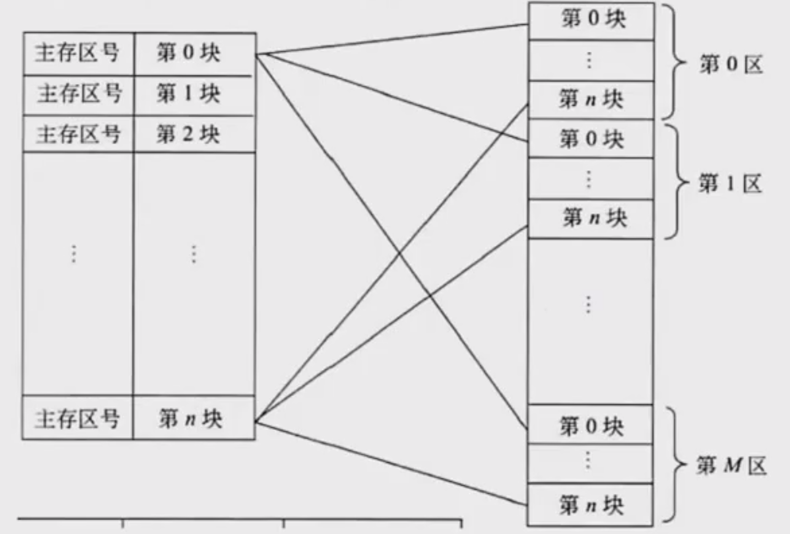
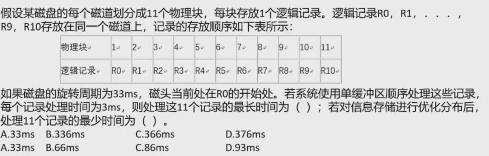
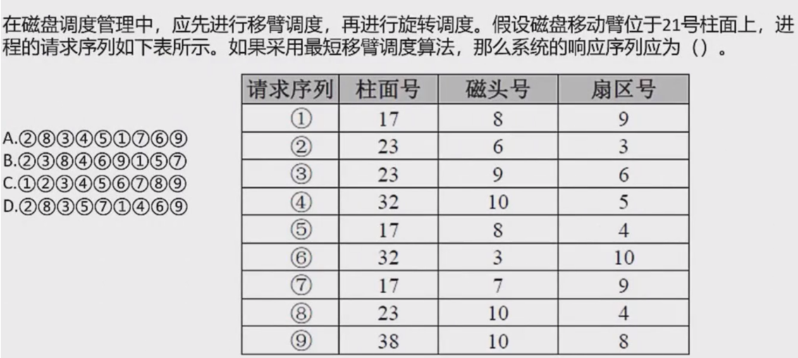

# 计算机硬件组成

## 1. 计算机硬件概述

计算机的基本硬件系统由运算器、控制器、存储器、输入设备和输出设备5大部件组成。

- **中央处理单元（CPU）**：运算器、控制器等部件集成在一起，是硬件系统的核心，负责数据加工处理，完成算术/逻辑运算及控制功能。
- **存储器**：分内部存储器（速度快、容量小、临时存储）和外部存储器（容量大、速度慢、长期保存）。
- **外部设备**：输入设备（输入数据/命令）和输出设备（输出运行结果）的统称。

## 2. 中央处理单元（CPU）

### 2.1 CPU功能

1. **程序控制**：通过执行指令控制程序执行顺序
2. **操作控制**：产生操作信号控制部件按指令要求操作
3. **时间控制**：对操作进行时间控制。严格控制操作信号的出现时间、持续时间及顺序
4. **数据处理**：进行算术/逻辑运算加工数据，是CPU最根本任务

还需要对系统内部和外部的中断（异常）做出响应，进行相应的处理。

### 2.2 CPU组成

由运算器、控制器、寄存器组和内部总线组成：

**运算器**

- **算术逻辑单元ALU**：实现算术和逻辑运算
- **累加寄存器AC**：存放运算结果或源操作数
- **数据缓冲寄存器DR**：暂存内存指令或数据
- **状态条件寄存器PSW**：保存指令运行结果条件码（如溢出标志）

执行所有的算术运算、逻辑运算并进行逻辑测试

**控制器**

- **指令寄存器IR**：暂存当前正在执行的CPU执行指令
- **程序计数器PC**：用于存放即将执行的下一条指令的地址。在指令周期开始时，CPU会使用PC中的地址来定位内存中的指令，并将其加载到指令寄存器（IR）中准备执行。之后，PC会更新为下一条指令的地址，以便于顺序执行后续指令。如果遇到跳转、分支等控制流指令，PC的值会被修改成目标指令的地址。
- **地址寄存器AR**：保存当前CPU访问的内存地址
- **指令译码器ID**：分析指令操作码

CPU依据指令周期的不同阶段来区分二进制的指令和数据。

## 3. 校验码

码距：编码中从一个编码转换为另一个编码需改变的位数。如A:00→B:11，码距为2。码距越大越利于检错纠错。

**奇偶校验码**

增加1位校验位使编码中1的个数为奇数（奇校验）或偶数（偶校验），码距变为2。

- **奇校验**：编码中，含有奇数个1，发送给接收方，接收方收到后，会计算收到的编码有多少个1，如果是奇数个，则无误，是偶数个，则有误。
- **偶校验**：类似奇校验，但要求编码中1的个数为偶数
- 只能检1位错，无法纠错

**CRC校验码**

CRC只能检错，不能纠错。使用CRC编码，需要先约定一个生成多项式G(x)。生成多项式的最高位和最低位必须是1。假设原始信息有m位，则对应多项式M(x)。生成校验码思想：在原始信息位后追加若干校验位，使得追加的信息能被G(x)整除。接收方接收到带校验位的信息，然后用G(x)整除。余数为0，则没有错误；反之则发生错误。

**CRC校验码计算步骤**

1. 确定数据信息和生成多项式
2. 数据左移k位（k为生成多项式阶数）
3. 模2除法求余数（校验位）
4. 组合数据和余数得到CRC码

**详细示例**：假设原始信息串为10110，CRC的生成多项式为G(x)=x⁴+x+1，求CRC校验码。

1. **在原始信息位后面添0**：假设生成多项式的阶为r，则在原始信息位后添加r个0。本题中，G(x)阶为4，则在原始信息串后加4个0，得到的新串为101100000，作为被除数。
2. **由多项式得到除数**：多项式中x的幂指数存在的位置1，不存在的位置0。本题中，x的幂指数为0,1,4的变量都存在，而幂指数为2,3的不存在，因此得到串10011。
3. **生成CRC校验码**：将前两步得出的被除数和除数进行模2除法运算（即不进位也不借位的除法运算）。

**模2除法运算规则**：不进位也不借位，1-0=1；0-1=1；1-1=0；0-0=0；

### 考试真题解析

**CPU执行算术/逻辑运算时，源操作数和结果暂存在（ ）**
A.程序计数器(PC)  B.累加器(AC)  C.指令寄存器(IR)  D.地址寄存器(AR)

**答案：B**
解析：累加寄存器(AC)用于暂存运算过程中的操作数和结果。

---

**执行CPU指令时，需先将指令地址送到地址总线，该地址存于（ ）**
A.指令寄存器(IR)  B.通用寄存器(GR)  C.程序计数器(PC)  D.状态寄存器(PSW)

**答案：C**
解析：程序计数器(PC)存放即将执行的下一条指令地址。

---

**数据1100，生成多项式X³+X+1(1011)，CRC编码为（ ）**
A.11000010  B.1011010  C.1100011  D.1011110

**答案：A**
解析：1100左移3位→1100000，模2除1011余001 → CRC码11000010

## 4. 指令系统

**指令的组成**

一条指令由操作码和操作数两部分组成：
- **操作码**：决定要完成的操作（如加法、减法等）
- **操作数**：指参加运算的数据及其所在的单元地址

在计算机中，操作码和操作数地址都由二进制数码表示，分别称为操作码和地址码，整条指令以二进制编码的形式存放在存储器中。

**指令的执行过程**

计算机指令执行过程分为三个步骤：
1. **取指令**：程序计数器PC中的指令地址送入地址总线，CPU依据该地址从内存中取出指令内容存入指令寄存器IR
2. **分析指令**：由指令译码器分析操作码
3. **执行指令**：取出指令执行所需的源操作数并执行操作

**指令寻址方式**

- 顺序寻址方式：当执行一段程序时，一条指令接着一条指令地顺序执行，由程序计数器PC自动给出下一条指令的地址。

- 跳跃寻址方式：下一条指令的地址不由程序计数器给出，而是由本条指令直接给出。程序跳转后，按新的指令地址开始顺序执行，程序计数器的内容也必须相应改变以跟踪新的指令地址。

**主要寻址方式类型**

- **立即寻址**：指令的地址字段指出的不是地址，而是操作数本身
- **直接寻址**：在指令的地址字段中直接指出操作数在主存中的地址
- **间接寻址**：指令地址字段所指向的存储单元中存储的是操作数的地址
- **寄存器寻址**：地址码是寄存器的编号
- **基址寻址**：将基址寄存器的内容加上指令中的形式地址形成操作数的有效地址
- **变址寻址**：将变址寄存器的内容加上指令中的形式地址形成操作数的有效地址

**CISC与RISC**

- **CISC（复杂指令系统）**：兼容性强，指令繁多、长度可变，由微程序实现
- **RISC（精简指令系统）**：指令少，使用频率接近，主要依靠硬件实现（通用寄存器、硬布线逻辑控制）

| 指令系统类型 | 指令 | 寻址方式 | 实现方式 | 其它 |
|------------|------|---------|---------|------|
| CISC（复杂） | 数量多，使用频率差别大，可变长格式 | 支持多种 | 微程序控制技术（微码） | 研制周期长 |
| RISC（精简） | 数量少，使用频率接近，定长格式，大部分为单周期指令，操作寄存器，只有Load/Store操作内存 | 支持方式少 | 增加了通用寄存器；优化编译，有硬布线逻辑控制为主；适合采用流水线 | 有效支持高级语言 |

**指令流水线原理**：将指令分成不同段，每段由不同的部分去处理，因此可以产生叠加的效果，所有的部件去处理指令的不同段。

**RISC中的流水线技术**

- 超流水线（Super Pipe Line）技术：通过细化流水、增加级数和提高主频，使得在每个机器周期内能完成一个甚至两个浮点操作。其实质是以时间换取空间。

- 超标量（Super Scalar）技术：通过内装多条流水线来同时执行多个处理，其时钟频率虽然与一般流水接近，却有更小的CPI（Clock cycles Per Instruction）。其实质是以空间换取时间。

- 超长指令字（Very Long Instruction Word, VLIW）技术：VLIW和超标量都是20世纪80年代出现的概念，其共同点是要同时执行多条指令，其不同在于超标量依靠硬件来实现并行处理的调度，VLIW则充分发挥软件的作用，而使硬件简化，性能提高。

**流水线性能指标**

- **流水线周期**：指令分成不同执行段，其中执行时间最长的段为流水线周期
- **流水线执行时间**：1条指令总执行时间 +（总指令数-1）×流水线周期
- **吞吐率计算**：指令条数/流水线执行时间。单位时间内执行的指令条数
- **加速比计算**：不使用流水线执行时间/使用流水线执行时间。使用流水线后的效率提升度

### 考试真题解析

-----

**Flynn分类法根据计算机在执行程序的过程中（ ）的不同组合，将计算机分为4类。当前主流的多核计算机属于（ ）计算机。**
A.指令流和数据流
B.数据流和控制流
C.指令流和控制流
D.数据流和总线带宽

A.SISD
B.SIMD
C.MISD
D.MIMD

**答案：第一空选A，第二空选D**
解析：

Flynn 分类法是根据计算机在执行程序过程中**指令流**和**数据流**的不同组合方式，将计算机系统分为4类。
- **指令流**：机器执行的指令序列。
- **数据流**：由指令流调用的数据序列（包括输入数据和中间结果，但不包括控制信息）。

| 类型                 | 英文全称与缩写                                             | 核心特征                                                     | 典型应用与实例                                               |
| :------------------- | :--------------------------------------------------------- | :----------------------------------------------------------- | :----------------------------------------------------------- |
| **单指令流单数据流** | Single Instruction Stream, Single Data Stream (SISD)       | 每次只执行一条指令，并且只对一个数据进行操作。               | 传统的冯·诺依曼体系结构计算机，如早期的个人计算机。          |
| **单指令流多数据流** | Single Instruction Stream, Multiple Data Streams (SIMD)    | 多个处理单元在同一个控制部件控制下，**执行相同的指令**，但**操作于不同的数据**上。 | 对大量数据进行相同处理（数据并行），如：向量处理机、阵列处理机。现代GPU的核心架构思想也源于此。 |
| **多指令流单数据流** | Multiple Instruction Streams, Single Data Stream (MISD)    | 多个处理单元可以**执行不同的指令**，但都对**同一个数据**进行操作。 | **实用性低**，应用很少。可能存在于某些特殊的容错系统或实验性架构中。 |
| **多指令流多数据流** | Multiple Instruction Streams, Multiple Data Streams (MIMD) | 多个处理单元可以**独立地执行不同的指令**，并且**操作于不同的数据**上。 | **当前主流的并行计算机架构**。多核处理器、多处理器系统、计算机集群均属于此类。各处理单元通过共享内存或消息传递进行协作。 |

1.  **分类维度**：依据**指令流**（控制）和**数据流**（操作对象）的“单”与“多”进行组合分类。
2.  **最常见类型**：
    -   **SISD**：代表了传统的串行计算机架构。
    -   **SIMD**：擅长**数据级并行**，适用于大规模数值计算、图形图像处理。
    -   **MIMD**：擅长**任务级并行**，是现代通用多核/多处理器系统的标准模型，灵活性最高。
3.  **非常见类型**：**MISD** 更多是一种理论上的分类，在实际中极少有对应的成功商用架构。

- 多核计算机属于多指令流多数据流（MIMD）类型，每个核心可独立执行不同指令并操作不同数据

----

**以下关于复杂指令集计算机(Complex Instruction Set Computer,CISC)的叙述中，正确的是（ ）。**
A.只设置使用频率高的一些简单指令，不同指令执行时间差别很小
B.CPU中设置大量寄存器，利用率低
C.常采用执行速度更快的组合逻辑实现控制器
D.指令长度不固定，指令格式和寻址方式多

**答案：D**
解析：CISC指令系统特点包括指令长度不固定、指令格式和寻址方式多，通过复杂指令完成复杂任务，由微程序实现。

---

**流水线的吞吐率是指流水线在单位时间里所完成的任务数或输出的结果数。设某流水线有5段，有1段的时间为2ns，另外4段的每段时间为1ns，利用此流水线完成100个任务的吞吐率约为（ ）个/s。**
A.500×10⁶
B.490×10⁶
C.250×10⁶
D.167×10⁶

**答案：B**
解析：流水线吞吐率由最长段时间决定（2ns）。
1. **总执行时间计算**：
   - 第一个任务耗时：2+1+1+1+1=6ns（所有段完成）
   - 后续99个任务：每个仅需2ns（最长段时间）
   - 总时间=6ns + 99×2ns=204ns
2. **单位换算**：204ns=204×10⁻⁹s
3. **吞吐率计算**：100任务 / 204×10⁻⁹s ≈4.9×10⁸任务/s=490×10⁶任务/s
（注：原答案选项A为计算近似值，精确结果应为选项B）

----

**假设磁盘块与缓冲区大小相同，每个盘块读入缓冲区的时间为15us，由缓冲区送至用户区的时间是5us，在用户区内系统对每块数据的处理时间为1us。若用户需要将大小为10个磁盘块的Doc1文件逐块从磁盘读入缓冲区，并送至用户区进行处理，那么采用单缓冲区需要花费的时间为（ ）us；采用双缓冲区需要花费的时间为（ ）us。**
A.150
B.151
C.156
D.201

**答案：第一空选D，第二空选C**
解析：

单缓冲区工作原理（串行执行）

- **第一块耗时**：读入(15us)→传输(5us)→处理(1us) = 21us
- **后续9块耗时**：每块需等待前一块完成传输才能开始读入
  总时间=21us + 9×(15us+5us) = 21+180=201us

双缓冲区工作原理（并行执行）

- 读入新块与处理旧块可并行
- **总时间**=读入全部块时间+最后一块传输+最后一块处理
  =21 + 9 * 15=156us

---

**流水线技术是通过并行硬件来提高系统性能的常用方法。对于一个k段流水线，假设其各段的执行时间均相等（设为t），输入到流水线中的任务是连续的理想情况下，完成n个连续任务需要的总时间为（ ）。若某流水线浮点加法运算器分为5段，所需要的时间分别是6ns、7ns、8ns、9ns和6ns，则其最大加速比为（ ）。**
A.nkt
B.(k+n-1)t
C.(n-k)kt
D.(k+n+1)t

A.4
B.5
C.6
D.7

**答案：第一空选B，第二空选A**
解析：

第一空：流水线总时间公式推导

- **非流水线时间**：n个任务×k段×t = nkt
- **流水线时间**：
  1. 第一个任务：k段×t = kt
  2. 后续n-1个任务：每个仅需t（段并行）
  3. 总时间=kt + (n-1)t = (k+n-1)t

第二空：最大加速比计算

1. **非流水线执行时间**：6+7+8+9+6=36ns
2. **流水线周期**：最长段时间=9ns
3. **n任务流水线时间**：5×9 + (n-1)×9 = 9n+36ns
4. **加速比公式**：非流水线时间/流水线时间
   当n→∞时，加速比≈36n/(9n)=4

## 5. 存储系统

### 5.1 存储系统的层次结构

存储系统采用**分层结构**设计，解决速度、容量和成本之间的矛盾。按速度从快到慢、容量从小到大、成本从高到低排序，典型的存储层次包括：

| 层次 | 存储设备 | 访问速度 | 存储容量 | 成本/位 | 作用 |
|------|----------|----------|----------|---------|------|
| 寄存器 | CPU内部寄存器 | 最快(ns级) | 最小 | 最高 | 临时数据存储 |
| 高速缓存(Cache) | SRAM | 几ns | 小(KB-MB) | 高 | 缓解CPU与内存速度差异 |
| 主存储器 | DRAM | 几十ns | 中等(GB) | 中 | 程序和数据的主要存放区域 |
| 外存储器 | HDD/SSD | 几ms | 大(TB) | 低 | 长期数据存储 |
| 离线存储 | 光盘/磁带 | 最慢 | 最大 | 最低 | 数据备份归档 |

主要为两级存储：Cache-主存、主存-辅存（虚拟存储体系）

局部性原理：总的来说，在CPU运行时，所访问的数据会趋向一个较小的局部空间地址内，主要包括两个方面：

- 时间局部性：如果一个数据项正在被访问，那么在近期内它很可能被再次访问，即在相邻的时间里会访问同一个数据项
- 空间局部性：在最近的将来会用到的数据的地址和现在正在访问的数据地址很可能是相近的，即相邻的空间地址会被连续访问。

### 5.3 高速缓存(Cache)

Cache是位于CPU和主存之间的一种高速缓冲存储器，用于**缓解CPU与主存之间的速度差异**。

Cache用于存储当前最活跃的程序和数据，直接与CPU交互。

由控制部分和存储器组成。存储器存储数据，控制部分判断CPU要访问的数据是否在Cache中，在则命中，不在则依据一定的算法从主存中替换。

地址映射：CPU工作时，送出的是主存单元的地址，应该从Cache存储器中读/写信息，需要将主存地址转换为Cache存储器地址，这种转化成为地址映射，由硬件自动完成映射。

**Cache的映射方式**

Cache与主存之间的数据映射方式有三种：

1. **直接映射**
   - 将cache存储器等分成块，主存页等分成块并编号
   - 每个主存块只能映射到Cache的特定块

1. **全相联映射**
   - 等分成块并编号。主存中任意一块都与Cache中任意一块对应。因此可以随意调入Cache任意位置，地址变换复杂，速度较慢。是最不容易发生块冲突的映射方式
2. **组相联映射**
   - 结合直接映射和全相联映射的优点
   - 将Cache分块再分组，主存同样分块再分组
   - 组间采用直接映射，即主存中组号与Cache中组号相同的组才能命中，但是组内全相联映射，即组号相同的两个组内的所有块可以任意调换。

**Cache的替换算法**

目标是获得尽可能高的命中率，常用的替换算法包括：

1. **随机替换(RAND)**：随机选择一个Cache块进行替换
2. **先进先出(FIFO)**：选择最早调入Cache的块进行替换
3. **最久未使用(LRU)**：选择最长时间未被访问的块进行替换
4. **近期最少使用(LFU)**：选择访问次数最少的块进行替换
5. **优化替换(OPT)**：选择未来最长时间内不会被访问的块进行替换(理论最优，实际无法实现)

**Cache的性能指标**

Cache的主要性能指标是**命中率**和**平均访问时间**：

- **命中率(h)**：CPU访问Cache命中的次数占总访问次数的比例
- **平均访问时间(T)**：T = h×Tc + (1-h)×Tm，其中Tc为Cache访问时间，Tm为主存访问时间

### 5.5 磁盘结构和参数

**磁盘的物理结构**

磁盘是一种磁表面存储器，每个磁盘有正反两面，每个盘面有多个同心圆，每个同心圆是一个磁道，每个同心圆又被分为多个扇区，数据就被存放在一个个扇区中。

磁头首先要寻找到对应的磁道，然后等待磁盘进行周期旋转，旋转到指定的扇区才能读取到对应数据，因此会产生寻道时间和等待时间。公式为：存取时间=寻道时间+等待时间（平均定位时间+转动延迟）。

寻道时间：磁头移动到磁道所需的时间。（通常这个时间耗时最长）

等待时间：等待读写的扇区转到磁头下方所用的时间。

**磁盘调度算法**

寻道时间最长，需要进行调度。磁盘调度算法用于优化磁头移动路径，提高磁盘访问效率：

1. **先来先服务(FCFS)算法**：根据请求到达的先后顺序进行调度，完全公平但性能较差。

2. **最短寻道时间优先(SSTF)算法**：每次选择与当前磁头位置距离最近的磁道请求进行处理。
- 优点：显著改善平均寻道时间
- 缺点：可能导致距离较远的请求长期得不到服务（饥饿现象）

3. **扫描算法(SCAN)算法**：磁头从当前位置向一个方向移动，遇到磁道请求就处理，直到到达磁盘的一端，然后反转方向，继续处理请求。
- 磁头移动的规律与电梯运行类似，因此也被称为"电梯算法"
- 优点：避免了饥饿问题
- 缺点：对于最近扫描过的区域请求会有较高的延迟

4. **循环扫描算法(C-SCAN)算法**：磁头只向一个方向移动，处理遇到的请求，到达磁盘一端后，直接返回到磁盘另一端的起始位置，然后继续向原方向移动并处理请求。
- 优点：使得不同位置的磁道请求具有相对公平的响应时间
- 缺点：每次到达端点后需要空移回另一端

### 5.7 考试真题解析

---

按照Cache地址映像的块冲突概率，从高到低排列的是（B）。

**选项：**
A. 全相联映像→直接映像→组相联映像  
B. 直接映像→组相联映像→全相联映像  
C. 组相联映像→全相联映像→直接映像  
D. 直接映像→全相联映像→组相联映像  

**原理分析：**

1. **直接映像**：主存中的每个块只能映射到Cache中唯一固定的块。若多个主存块映射到同一Cache块，则冲突概率最高。
2. **组相联映像**：将Cache分为若干组，组内采用全相联映射，组间采用直接映射。冲突概率介于直接映像和全相联之间，属于折中方案。
3. **全相联映像**：主存块可映射到Cache中任意块，冲突概率最低（仅当Cache满时才会发生冲突）。

**排序逻辑：**
直接映像的严格映射规则导致高冲突率，而全相联的灵活性最大程度减少了冲突，组相联通过分组部分缓解冲突。因此冲突概率排序为：直接映像 > 组相联映像 > 全相联映像。

---

以下关于Cache与主存间地址映射的叙述中，正确的是（D）。

**选项：**
A. 操作系统负责管理Cache与主存之间的地址映射  
B. 程序员需要通过编程来处理Cache与主存之间的地址映射  
C. 应用软件对Cache与主存之间的地址映射进行调度  
D. 由硬件自动完成Cache与主存之间的地址映射  

**关键解析：**

1. **硬件自动管理机制**：
   - Cache与主存的地址映射（包括直接映射、全相联映射、组相联映射）由计算机硬件逻辑电路实现
   - 通过地址转换部件、相联存储器（CAM）和比较器等硬件组件完成
   - 所有操作在CPU访存时实时完成，无需软件干预

2. **错误选项分析**：
   - ❌ A. 操作系统负责管理：操作系统仅负责内存分配等高层管理，不参与实时地址映射
   - ❌ B. 程序员编程处理：地址映射对程序员透明，属于底层硬件功能
   - ❌ C. 应用软件调度：应用软件无法直接操作Cache映射规则

Cache与主存的地址映射由硬件自动实现，确保高速访问和低延迟，与软件无关。正确答案为D。

---

解析

1. 最长时间计算（366ms）

**原因分析：**
- **单缓冲区的限制**：系统使用单缓冲区时，每次只能读取一个逻辑记录到缓冲区中，处理完该记录后才能读取下一个。
- **时间计算逻辑**：
  - 磁盘旋转周期为33ms，每个物理块读取时间为3ms（33ms/11块）
  - 处理第一个记录R0：读取3ms + 处理3ms = 6ms。此时磁头已移动到R2的起始位置
  - 处理后续记录（R1~R10）：每个记录需要等待磁盘旋转至起始位置（最多需30ms），再加上读取3ms和处理3ms，共需36ms/个
  - 总时间：R0的6ms + 后续10个记录的36ms × 10 = 6 + 360 = 366ms

2. 优化后的最少时间（66ms）

**优化策略：**
- **逻辑记录的间隔分布**：将逻辑记录按间隔排列，例如优化后的顺序为：R0，R6，R1，R7，R2，R8，…，R5
- **时间计算逻辑**：
  - 每个记录的处理周期为读取3ms + 处理3ms = 6ms
  - 总时间：11个记录 × 6ms = 66ms

**关键结论：**
- 最长时间由单缓冲区导致的旋转等待时间决定，优化前总耗时366ms
- 最少时间通过优化存储分布消除旋转等待时间，优化后总耗时66ms

---

解析

关键分析步骤

1. **初始位置**：磁头位于21号柱面

2. **距离计算**：
   - 23号柱面（②、③、⑧）距离为2（最近）
   - 17号柱面（①、⑤、⑦）距离为4
   - 32号柱面（④、⑥）距离为11
   - 38号柱面（⑨）距离为17（最远）

3. **调度顺序**：
   - 第一步：处理最近的23号柱面请求（②、③、⑧）。根据题目表格中请求的原始顺序，优先处理②→③→⑧（同一柱面请求按出现顺序处理）
   - 第二步：磁头移动到23号柱面后，下一个最近的柱面是17号（距离6），处理①、⑤、⑦（同一柱面按出现顺序）
   - 第三步：磁头移动到17号柱面后，下一个最近的柱面是32号（距离15），处理④→⑥
   - 第四步：最后处理38号柱面的⑨

4. **选项匹配**：
   - 正确答案为选项D：②⑧③⑤⑦①④⑥⑨
   - 该顺序严格遵循最短移臂调度算法，确保每次磁头移动距离最短，并合理处理同一柱面内的请求顺序

结论

正确答案为选项D：②⑧③⑤⑦①④⑥⑨。该顺序符合最短移臂调度算法逻辑，保证磁头移动距离最短并合理处理同一柱面请求顺序。

##                                                                                                                                                                                                                                                                                                                                                                                                                                                                                                                                                                                                                                                                                                                                                                                                                                                                                                                                                                                                                                                                                                                                                                                                                                                                                                                                                                                                                                                                                                                                                                                                                                                                                                                                                                                                                                                                                                                                                                                                                                                                                                                                                                                                                                                                                                                                                                                                                                                                                                                                                                                                                                                                                                                                                                                                                                                                                                                                                                                                                                                                                                                                                                                                                                                                                                                                                                                                                                                                                                                                                                                                                                                                                                                                                                                                                                                                                                                                                                                                                                                                                                                                                                                                                                                                                                                                                                                                                                                                                                                                                                                                                          6 输入输出技术

计算机系统中存在多种内存与接口地址的编址方法，常见的有以下两种：

1. **内存与接口地址独立编址方法**
   - 内存地址和接口地址是完全独立的两个地址空间
   - 访问数据时所使用的指令也完全不同，用于接口的指令只用于接口的读/写，其余的指令全都是用于内存的
   - 优点：在编程或程序设计时很容易使用和辨认
   - 缺点：用于接口的指令太少、功能太弱

2. **内存与接口地址统一编址方法**
   - 内存地址和接口地址统一在一个公共的地址空间里，即内存单元和接口共用地址空间
   - 优点：原则上用于内存的指令全都可以用于接口，这就大大地增强了对接口的操作功能，而且在指令上不再区分内存或接口指令
   - 缺点：整个地址空间被分成两部分，其中一部分分配给接口使用，剩余的为内存所用，这经常会导致内存地址不连续

**数据交换方式**

计算机与外设间的数据交互方式主要有以下几种：

1. **程序控制（查询）方式**

- CPU主动查询外设是否完成数据传输，效率极低

2. **程序中断方式**

- 外设完成数据传输后，向CPU发送中断请求，等待CPU处理数据，效率相对较高。
- **中断响应时间**：从发出中断请求到开始进入中断处理程序的时间
- **中断处理时间**：从中断处理开始到中断处理结束的时间
- 中断向量：提供中断服务程序的入口地址
- 多级中断嵌套，使用堆栈来保护断点和现场

3. **DMA方式（直接内存存取）**

- CPU只需完成必要的初始化等操作，数据传输的整个过程由DMA控制器来完成，在主存和外设之间建立直接的数据通路。效率很高
- 注意：在一个总线周期结束后，CPU会响应DMA请求开始读取数据；CPU响应程序中断方式请求是在一条指令执行结束时

## 7 总线结构

**总线（Bus）** 是指计算机设备和设备之间传输信息的公共数据通道。总线是连接计算机硬件系统内多种设备的通信线路，它的一个重要特征是由总线上的所有设备共享，因此可以将计算机系统内的多种设备连接到总线上。

从广义上讲，任何连接两个以上电子元器件的导线都可以称为总线，通常分为以下三类：

1. **内部总线**：内部芯片级别的总线，芯片与处理器之间通信的总线

2. **系统总线**：是板级总线，用于计算机内各部分之间的连接，具体分为：
   - **数据总线**：并行数据传输位数
   - **地址总线**：系统可管理的内存空间的大小
   - **控制总线**：传送控制命令
   - 代表的有ISA总线、EISA总线、PCI总线

3. **外部总线**：设备一级的总线，微机和外部设备的总线
   - 代表的有RS232（串行总线）、SCSI（并行总线）、USB（通用串行总线，即插即用，支持热插拔）

### 真题解析

---

**题目：** 计算机系统中常用的输入/输出控制方式有无条件传送、中断、程序查询和DMA方式等。当采用（）方式时，不需要CPU执行程序指令来传送数据。

**选项：**
A. 中断  
B. 程序查询  
C. 无条件传送  
D. DMA  

**正确答案：** D. DMA

解析

DMA（Direct Memory Access，直接存储器存取）是一种完全由硬件控制的数据传输方式。其核心特点是：

1. **无需CPU程序指令介入传输过程**
   - 在DMA方式下，CPU仅在数据传输的开始阶段（初始化DMA控制器）和结束阶段（处理中断）进行干预
   - 具体的数据传输由DMA控制器直接管理内存与外设之间的数据通路完成

2. **硬件接管总线控制权**
   - DMA控制器通过向CPU申请总线控制权，接管系统总线后直接与内存交互
   - 数据块传输完全由硬件实现，无需CPU逐条执行指令

3. **与其他方式的对比**
   - 程序查询/无条件传送：CPU需持续轮询或直接控制数据传送
   - 中断方式：每个数据传输需CPU响应中断并执行服务程序
   - DMA：仅在数据块传输的起始和结束时需要CPU参与，数据传输过程完全独立

**结论：** DMA方式通过硬件控制器实现高效、独立的数据传输，显著减少CPU负担，适用于高速、大批量数据交换场景（如磁盘、网络设备）。

---

**题目：** 以下关于总线的说法中，正确的是（ ）。

**选项：**
A. 串行总线适合近距离高速数据传输，但线间串扰会导致速率受限  
B. 并行总线适合长距离数据传输，易提高通信时钟频率来实现高速数据传输  
C. 单总线结构在一个总线上适应不同种类的设备，设计复杂导致性能降低  
D. 半双工总线只能在一个方向上传输信息  

**正确答案：** C. 单总线结构在一个总线上适应不同种类的设备，设计复杂导致性能降低

选项解析

1. **选项A**
   - 错误。串行总线（如USB、SATA）适合长距离数据传输，而非近距离高速传输
   - 串行总线通过差分信号技术（如双绞线）有效抑制线间串扰，抗干扰能力强，更适合远距离通信
   - 并行总线因多线间信号同步问题，在长距离传输时容易因时序差异和干扰导致速率受限

2. **选项B**
   - 错误。并行总线（如PCI、ISA）适合近距离高速数据传输，而非长距离
   - 并行总线通过多数据通道同时传输数据位，理论速率高
   - 但提升时钟频率会加剧信号时序同步问题和线间干扰，难以适应长距离传输

3. **选项C**
   - 正确。单总线结构（如早期ISA总线）将所有设备连接到同一总线上
   - 虽然设计简单、易于扩展，但需分时工作（同一时刻只能有一对设备通信），导致系统整体性能受限
   - 适应不同种类设备的协议和控制逻辑会增加设计复杂性，进一步影响效率

4. **选项D**
   - 错误。半双工总线（如对讲机通信）支持双向数据传输，但同一时刻只能单向传输，需交替进行
   - 选项D混淆了"半双工"与"单工"的概念（单工总线仅支持单向传输，如广播）

总结

- **串行总线**：长距离、抗干扰，通过差分信号提升速率（如USB 3.0可达5Gbps）
- **并行总线**：近距离、高速但成本高，时钟频率提升受限（如PCI总线频率通常不超过33MHz）
- **单总线结构**：设计简单但性能瓶颈显著，多设备分时操作导致效率下降
- **半双工与全双工**：半双工支持双向交替传输，全双工可同时双向传输（如以太网）

---

https://tyron.blog.csdn.net/article/details/145923555

