# 操作系统知识

## 操作系统概述

- **历年真题考情**：本章节每年都考3-5分左右

**操作系统定义**

能有效地组织和管理系统中的各种软/硬件资源，合理地组织计算机系统工作流程，控制程序的执行，并且向用户提供一个良好的工作环境和友好的接口。

**操作系统的重要作用**

1. 管理计算机中运行的程序、分配各种软硬件资源
2. 为用户提供友善的人机界面
3. 为应用程序的开发和运行提供一个高效率的平台

**操作系统的4个特征**

- 并发性
- 共享性
- 虚拟性
- 不确定性（异步性）

**操作系统的功能**

1. **进程管理**：实质上是对处理机的执行"时间"进行管理，采用多道程序等技术将CPU的时间合理地分配给每个任务，主要包括进程控制、进程同步、进程通信和进程调度
2. **文件管理**：主要包括文件存储空间管理、目录管理、文件的读/写管理和存取控制
3. **存储管理**：存储管理是对主存储器"空间"进行管理，主要包括存储分配与回收、存储保护、地址映射(变换)和主存扩充
4. **设备管理**：实质是对硬件设备的管理，包括对输入/输出设备的分配、启动、完成和回收
5. **作业管理**：包括任务、界面管理、人机交互、图形界面、语音控制和虚拟现实等

**操作系统的分类**

- **批处理操作系统**：单道批处理和多道批处理(主机与外设可并行)
- **分时操作系统**：一个计算机系统与多个终端设备连接。将CPU的工作时间划分为许多很短的时间片，轮流为各个终端的用户服务
- **实时操作系统**：实时是指计算机对于外来信息能够以足够快的速度进行处理，并在被控对象允许的时间范围内做出快速反应。实时系统对交互能力要求不高，但要求可靠性有保障
- **网络操作系统**：是使联网计算机能方便而有效地共享网络资源，为网络用户提供各种服务的软件和有关协议的集合。三种模式：集中模式、客户端/服务器模式、对等模式
- **分布式操作系统**：由多个分散的计算机经连接而成的计算机系统，系统中的计算机无主、次之分，任意两台计算机可以通过通信交换信息
- **微型计算机操作系统**：简称微机操作系统，常用的有Windows、Mac OS、Linux

**嵌入式操作系统主要特点**

1. **微型化**：从性能和成本角度考虑，希望占用的资源和系统代码量少
2. **可定制**：要求能运行在不同的微处理器平台上，能针对硬件变化进行结构与功能上的配置
3. **实时性**：主要应用于过程控制、数据采集、传输通信等需要迅速响应的场合
4. **可靠性**：系统构件、模块和体系结构必须达到应有的可靠性
5. **易移植性**：通常采用硬件抽象层和板级支撑包的底层设计技术

**嵌入式系统初始化过程**：按照自底向上、从硬件到软件的次序依次为：片级初始化→板级初始化→系统初始化

## 进程管理

### 知识点

**进程的组成**

- 进程控制块PCB（唯一标志）
- 程序（描述进程要做什么）
- 数据（存放进程执行时所需数据）

**进程状态**

- 运行、阻塞、就绪三态图会考，五态图不考

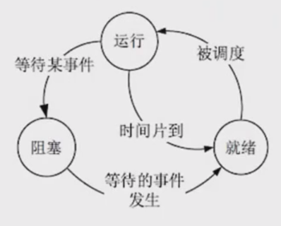

**前趋图**

用来表示哪些任务可以并行执行，哪些任务之间有顺序关系。

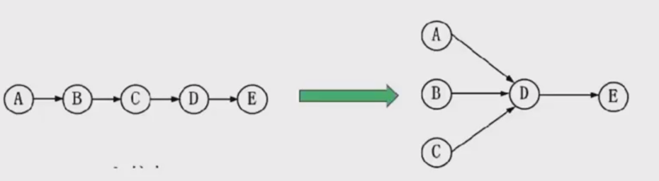

可知，ABC可以并行执行，但是必须ABC都执行完后，才能执行D，这就确定了两点：任务间的并行、任务间的先后顺序。

**进程资源图**

用来表示进程和资源之间的分配和请求关系。

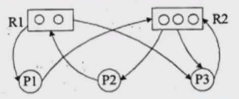

- **P代表进程**，**R代表资源**，R方框中有几个圆球就表示有几个这种资源
- **R1指向P1**：表示R1有一个资源已经分配给了P1
- **P1指向R2**：表示P1还需要请求一个R2资源才能执行

**节点类型**

- **阻塞节点**：某进程所请求的资源已经全部分配完毕。无法获取所需资源，该进程被阻塞了无法继续
- **非阻塞节点**：某进程所请求的资源还有剩余可以分配给该进程继续运行

**死锁状态**

当一个进程资源图中所有进程都是阻塞节点时，即陷入死锁状态。

### 进程同步与互斥

1. 临界资源

- **定义**：各进程间需要以互斥方式对其进行访问的资源
- **特点**：同一时间只能被一个进程访问

2. 临界区

- **定义**：进程中对临界资源实施操作的那段程序
- **本质**：一段程序代码
- **功能**：包含对临界资源的访问操作

3. 互斥

- **定义**：某资源（临界资源）在同一时间内只能由一个任务单独使用
- **机制**：使用时需要加锁，使用完后解锁才能被其他任务使用
- **示例**：打印机资源

4. 同步

- **定义**：多个任务可以并发执行，但有速度上的差异，在一定情况下停下等待
- **特点**：不存在资源是否单独或共享的问题
- **示例**：自行车和汽车的协同运行

**二、信号量机制**

1. 信号量类型

- **互斥信号量**
  - 用途：对临界资源采用互斥访问
  - 特性：使用互斥信号量后其他进程无法访问
  - 初值：通常为1

- **同步信号量**
  - 用途：对共享资源的访问控制
  - 初值：一般是共享资源的数量

2. P操作（Wait操作）

- **功能**：申请资源
- **操作过程**：
  - S = S - 1（信号量减1）
  - 若 S ≥ 0：执行P操作的进程继续执行
  - 若 S < 0：将进程置为阻塞状态（因无可用资源），并插入阻塞队列

3. V操作（Signal操作）

- **功能**：释放资源
- **操作过程**：
  - S = S + 1（信号量加1）
  - 若 S > 0：执行V操作的进程继续执行
  - 若 S ≤ 0：从阻塞状态唤醒一个进程，将其插入就绪队列，然后执行V操作的进程继续

**三、经典问题：生产者-消费者问题**

信号量设置

- **互斥信号量S0**：控制仓库独立使用权
- **同步信号量S1**：表示仓库空闲个数
- **同步信号量S2**：表示仓库商品个数

问题特点

- 生产者进程向仓库添加产品
- 消费者进程从仓库取用产品
- 需要保证生产与消费的同步协调
- 防止对仓库的同时访问导致数据不一致

**四、核心要点总结**

1. **临界区管理**：通过互斥机制确保同一时间只有一个进程访问临界资源
2. **信号量操作**：P操作用于申请资源，V操作用于释放资源
3. **进程同步**：通过信号量机制协调多个进程的执行顺序
4. **经典应用**：生产者-消费者问题是进程同步与互斥的典型应用场景

### 进程调度

- 进程调度方式是指当有更高优先级的进程到来时如何分配CPU。分为可剥夺和不可剥夺两种，可剥夺指当有更高优先级进程到来时，强行将正在运行进程的CPU分配给高优先级进程；不可剥夺是指高优先级进程必须等待当前进程自动释放CPU。

- 在某些操作系统中，一个作业从提交到完成需要经历高、中、低三级调度。
  - 高级调度。高级调度又称“长调度”“作业调度”或“接纳调度”，它决定处于输入池中的哪个后备作业可以调入主系统做好运行的准备，成为一个或一组就绪进程。在系统中一个作业只需经过一次高级调度。
  - 中级调度。中级调度又称“中程调度”或“对换调度”，它决定处于交换区中的哪个就绪进程可以调入内存，以便直接参与对CPU的竞争。
  - 低级调度。低级调度又称“短程调度”或“进程调度”，它决定处于内存中的哪个就绪进程可以占用CPU。低级调度是操作系统中最活跃、最重要的调度程序，对系统的影响很大。

**调度算法：**

- 先来先服务FCFS：先到达的进程优先分配CPU。用于宏观调度。

- 时间片轮转：分配给每个进程CPU时间片，轮流使用CPU，每个进程时间片大小相同，很公平，用于微观调度。

- 优先级调度：每个进程都拥有一个优先级，优先级大的先分配CPU。

- 多级反馈调度：时间片轮转和优先级调度结合而成，设置多个就绪队列1,2,3...n，每个队列分别赋予不同的优先级，分配不同的时间片长度；新进程先进入队列1的末尾，按FCFS原则，执行队列1的时间片；若未能执行完进程，则转入队列2的末尾，如此重复。

**死锁**

- 当一个进程在等待永远不可能发生的事件时，就会产生死锁，若系统中有多于进程处于死锁状态，就会造成系统死锁。

- 死锁产生的四个必要条件：资源互斥、每个进程占有资源并等待其他资源、系统不能剥夺进程资源、进程资源图是一个环路。

死锁产生后，解决措施是打破四大条件，有下列方法：

1. 死锁预防：采用某种策略限制并发进程对于资源的请求，破坏死锁产生的四个条件之一，使系统任何时刻都不满足死锁的条件。

2. 死锁避免：一般采用银行家算法来避免，银行家算法，就是提前计算出一条不会死锁的资源分配方法，才分配资源，否则不分配资源，相当于借贷，考虑对方还得起才借钱，提前考虑好以后，就可以避免死锁。

3. 死锁检测：允许死锁产生，但系统定时运行一个检测死锁的程序，若检测到系统中发生死锁，则设法加以解除。

4. 死锁解除：即死锁发生后的解除方法，如强制剥夺资源，撤销进程等。

- 死锁资源计算：系统内有n个进程，每个进程都需要R个资源，那么其发生死锁的最大资源数为n*(R-1)。其不发生死锁的最小资源数为n\*(R-1)+1。

### 线程

传统的进程有两个属性：可拥有资源的独立单位；可独立调度和分配的基本单位。

进程在创建、撤销和切换中，系统时空开销大，在系统中设置的进程数目不宜过多，进程切换的频率不宜太高，这就限制了并发程度的提高。引入线程后，将传统进程的两个基本属性分开，线程作为调度和分配的基本单位，进程作为独立分配资源的单位。用户可以通过创建线程来完成任务，以减少程序并发执行时付出的时空开销。

线程是进程中的一个实体，是被系统独立分配和调度的基本单位。线程基本上不拥有资源，只拥有一点运行中必不可少的资源（如程序计数器、一组寄存器和栈），它可与同属一个进程的其他线程共享进程所拥有的全部资源，例如进程的公共数据、全局变量、代码、文件等资源，但不能共享线程独有的资源，如线程的栈指针等标识数据。

### 分区存储管理

分区存储组织，就是整存，将某进程运行所需的内存整体一起分配给它，然后再执行。有三种分区方式：

1. 固定分区：静态分区方法，将主存分为若干个固定的分区，将要运行的作业装配进去，由于分区固定，大小和作业需要的大小不同，会产生内部碎片。

2. 可变分区：动态分区方法，主存空间的分区是在作业转入时划分，正好划分为作业需要的大小，这样就不存在内部碎片，但容易将整片主存空间切割成许多块，会产生外部碎片。可变分区的算法如下：

- 系统分配内存的算法有很多，如下所示，根据分配前的内存情况，还需要分配9k空间，对不同算法的结果介绍如下：

3. 可重定位分区：可以解决碎片问题，移动所有已经分配好的区域，使其成为一个连续的区域，这样其他外部细小的分区碎片可以合并为大的分区，满足作业要求。只在外部作业请求空间得不到满足时进行。

- 首次适应法：按内存地址顺序从头查找，找到第一个>=9K空间的空闲块，即切割9K空间分配给进程。
- 最佳适应法：将内存中所有空闲内存块按从小到大排序，找到第一个>=9K空间的空闲块，切割分配，这个将会找到与9K空间大小最相近的空闲块。
- 最差适应法：和最佳适应法相反，将内存中空闲块空间最大的，切割9K空间分配给进程，这是为了预防系统中产生过多的细小空闲块。
- 循环首次适应法：按内存地址顺序查找，找到第一个>=9K空间的空闲块，而后若还需分配，则找下一个，不用每次都从头查找，这是与首次适应法不同的地方

### 分页存储管理

◆逻辑页分为页号和页内地址，页内地址就是物理偏移地址，而页号与物理块号并非按序对应的，需要查询页表，才能得知页号对应的物理块号，再用物理块号加上偏移地址才得出了真正运行时的物理地址。
优点：利用率高，碎片小，分配及管理简单。
缺点：增加了系统开销，可能产生抖动现象

**页面置换算法**

◆最优算法：OPT，理论上的算法，无法实现，是在进程执行完后进行的最佳效率计算，用来让其他算法比较差距。原理是选择未来最长时间内不被访问的页面置换，这样可以保证未来执行的都是马上要访问的。
◆先进先出算法：FIFO，先调入内存的页先被置换淘汰，会产生抖动现象，即分配的页数越多，缺页率可能越多（即效率越低）.
◆最近最少使用：LRU，在最近的过去，进程执行过程中，过去最少使用的页面被置换淘汰，根据局部性原理，这种方式效率高，且不会产生抖动现象，使用大量计数器，但是没有LFU多。
◆淘汰原则：优先淘汰最近未访问的，而后淘汰最近未被修改的页面。

### 分段存储管理

◆将进程空间分为一个个段，每段也有段号和段内地址，与页式存储不同的是，每段物理大小不同，分段是根据逻辑整体分段的，因此，段表也与页表的内容不同，页表中直接是逻辑页号对应物理块号，而段表有段长和基址两个属性，才能确定一个逻辑段在物理段中的位置。

### 段页式存储管理

◆对进程空间先分段，后分页，具体原理和优缺点如下：
优点：空间浪费小、存储共享容易、存储保护容易、能动态链接。
缺点：由于管理软件的增加，复杂性和开销也随之增加，需要的硬件以及占用的内存也有所增加，使得执行速度大大下降。

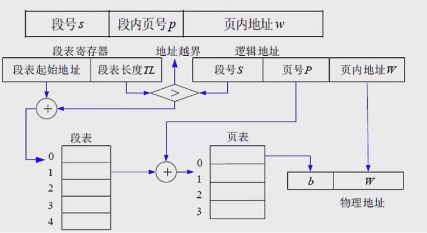

### 考试真题

---

在单处理机系统中，采用先来先服务调度算法。系统中有4个进程P1、P2、P3、P4（假设进程按此顺序到达），其中P1为运行状态，P2为就绪状态，P3和P4为等待状态，且P3等待打印机，P4等待扫描仪。若P1（ ），则P1、P2、P3和P4的状态应分别为（ ）。

**选项A**：时间片到  
**选项B**：释放了扫描仪  
**选项C**：释放了打印机  
**选项D**：已完成  

**状态选项A**：等待、就绪、等待和等待  
**状态选项B**：运行、就绪、运行和等待  
**状态选项C**：就绪、运行、等待和等待  
**状态选项D**：就绪、就绪、等待和运行  

**选项分析**：选项A（时间片到）是唯一与状态选项C（就绪、运行、等待和等待）匹配的组合。虽然FCFS传统上无时间片，但题目提供此选项，可能是假设某种抢占式变体。

**结论**：若P1时间片到，则P1、P2、P3和P4的状态应分别为就绪、运行、等待和等待。即选择A和C。

---

在如下所示的进程资源图中，（ ）；该进程资源图是（ ）。

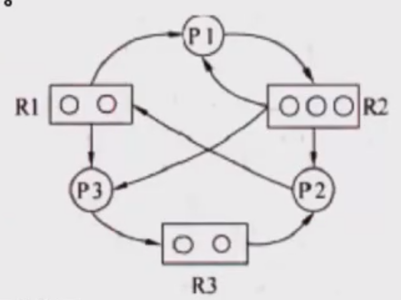

**问题一选项**：
A. P1、P2、P3都是阻塞节点  
B. P1是阻塞节点、P2、P3是非阻塞节点  
C. P1、P2是阻塞节点、P3是非阻塞节点  
D. P1、P2是非阻塞节点、P3是阻塞节点  

**问题二选项**：
A. 可以化简的，其化简顺序为P1→P2→P3  
B. 可以化简的，其化简顺序为P3→P1→P2  
C. 可以化简的，其化简顺序为P2→P1→P3  
D. 不可以化简的，因为P1、P2、P3申请的资源都不能得到满足  

**问题1：判断进程的阻塞状态**

- P1申请了R1和R2资源。若R1或R2已被其他进程占用，则P1会被阻塞
- P2申请了R3资源。若R3不可用，则P2会被阻塞
- P3申请了R1资源。若R1未被占用（假设当前R1空闲），则P3可以立即运行，是非阻塞节点

**结论**：C. P1、P2是阻塞节点，P3是非阻塞节点

**问题2：判断进程资源图是否可以化简及化简顺序**

**化简可行性分析**：
- P3是非阻塞节点，可以立即执行，执行后会释放R1资源
- P1因等待R1和R2被阻塞，但P3释放R1后，若R2可用，则P1可以运行
- P1运行后释放R2，使P2可以申请R3并执行

因此，系统可以通过逐步释放资源完成所有进程，不存在死锁，可以化简。

**化简顺序**：根据资源释放的依赖关系：P3（释放R1）→P1（释放R2）→P2（释放R3）

**结论**：B. 可以化简的，其化简顺序为P3→P1→P2

**最终答案**：
- 阻塞状态判断：C
- 化简顺序判断：B

> **注**：假设初始资源分配中R1未被占用（允许P3直接运行），且R2/R3初始可用。若资源初始状态不同，结论可能变化，需结合图中具体资源持有关系确认。

---

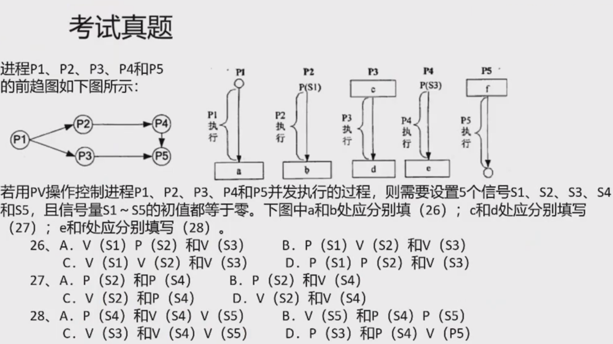

**问题1**  
a和b处的操作（P1和P2）  

- P1是起始进程，执行后需触发P2和P3，因此需要释放两个信号量：  
  ● V(S1)：通知P2可以运行。  
  ● V(S2)：通知P3可以运行。  
  a处应填写 V(S1)V(S2)。  
- P2结束后需触发P4，因此释放信号量：V(S3)：通知P4可以运行。  
  b处应填写 V(S3)。  
  答案：C. V(S1)V(S2)和V(S3)

**问题2**  
c和d处的操作（P3）  
- P3需要等待P1的信号量S2（通过P(S2)），执行后释放S4以触发P5：  
  c处应填写 P(S2)。  
- P3结束后需触发P4，因此释放信号量：V(S4)：通知P5可以运行。  
  根据选项设计，P3的操作对应P(S2)和V(S4)。  
  答案：B. P(S2)和V(S4)

**问题3**  
e和f处的操作（P4和P5）  
- P4执行后需触发P5，因此需要释放信号量：V(S5)  
  e处应填写 V(S5)；  
- P5需要等待P3和P4都完成，即需两个信号量操作：  
  P(S4)：等待P3完成。  
  P(S5)：等待P4完成。  
  f处应填写 P(S4)P(S5)。

---

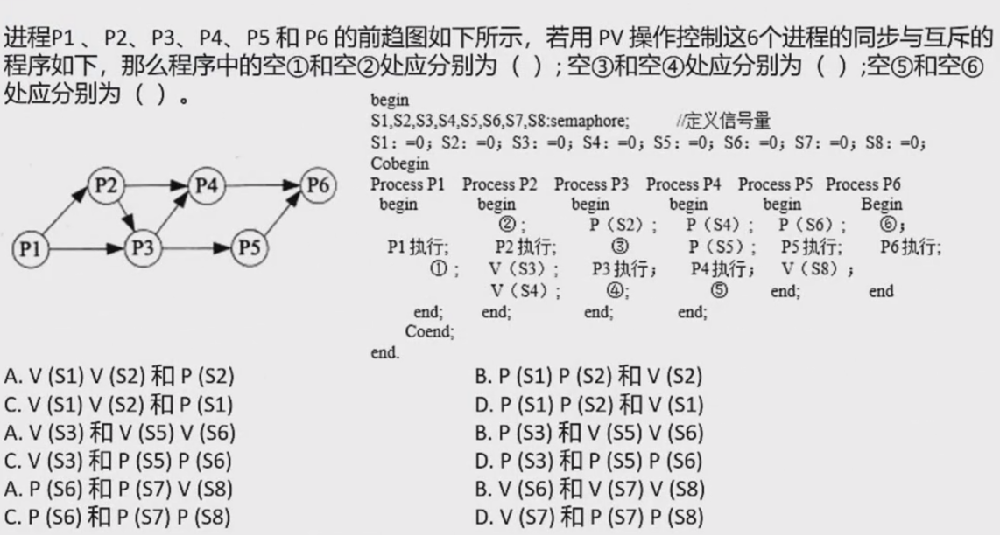

CBD

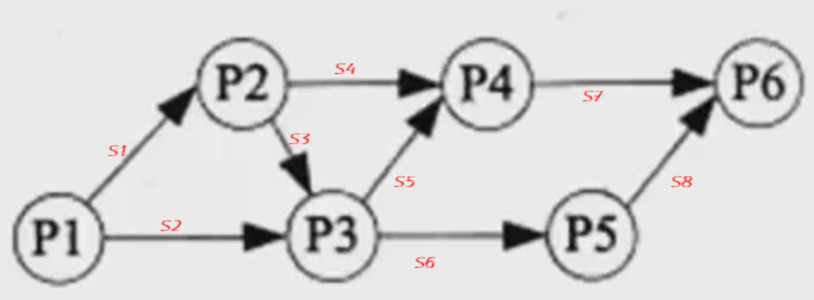

---

**某系统中有3个并发进程竞争资源R，每个进程都需要5个R，那么至少有()个R，才能保证系统不会发生死锁。**
A.12
B.13
C.14
D.15

**答案：B**
解析：
根据操作系统死锁预防的理论，当系统中有3个并发进程竞争资源R且每个进程需要5个R时，至少需要13个资源R才能保证不发生死锁。

关键分析过程：
1. 死锁预防的资源分配策略
   为了预防死锁，需确保系统资源分配后，至少有一个进程能完成并释放资源。这里采用公式：
   最少资源数 = 进程数 × (每个进程所需资源数 - 1) + 1
   代入数值：3×(5-1)+1=13
   
2. 具体场景验证
   - 若总资源为12（即3×4）：每个进程最多获取4个资源，但无法满足第5个需求，导致所有进程互相等待，形成死锁。
   - 若总资源为13：假设3个进程各分配4个资源后，剩余1个资源可分配给任一进程，使其完成运行并释放5个资源。此时系统剩余资源足够其他进程继续执行，避免死锁。

---

**假设系统中有n个进程共享3台打印机，任一进程在任一时刻最多只能使用1台打印机。若用PV操作控制n个进程使用打印机，则相应信号量s的取值范围为（）；若信号量s的值为-3，则系统中有（）个进程等待使用打印机。**

**取值范围选项**：
A．0，-1，…，-(n-1)
B.3，2，1，0，-1，…，-(n-3)
C.1，0，-1，…，-(n-1)
D.2，1，0，-1，…，-(n-2)

**等待进程数选项**：
A．0 B.1 C.2 D.3

**答案：B；D**
解析：

1. **信号量S的取值范围**
   - 初始值：系统有3台打印机，信号量S初始值为3。
   - 取值范围：
     - 当所有打印机空闲时，S最大为3。
     - 当所有打印机被占用且有更多进程请求时，每多一个请求，S减1。最多有n个进程竞争，其中3个正在使用，剩余n-3个等待，此时S的最小值为3-n，即取值范围为3,2,1,0,-1,…,-(n-3)。

2. **信号量S=-3时的等待进程数**
   - 信号量为负数的含义：绝对值表示等待进程数量。
   - S=-3时，有3个进程在等待。

---

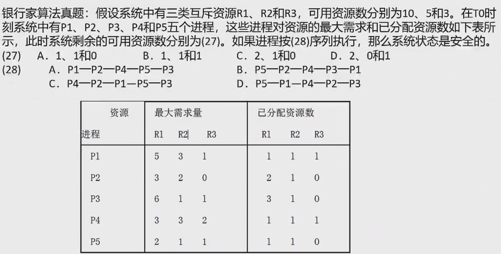

**(27) 系统剩余可用资源数**  
**答案：** D. 2、0和1  

**计算过程：**  

- 系统原有资源：R1=10，R2=5，R3=3。  
- 已分配资源总和：  
  - R1 = 1+2+3+1+1 = 8  
  - R2 = 1+1+1+1+1 = 5  
  - R3 = 1+0+0+1+0 = 2  
- 剩余可用资源：  
  - R1: 10-8 = 2  
  - R2: 5-5 = 0  
  - R3: 3-2 = 1  

**(28) 安全序列**  
**答案：** B. P5—P2—P4—P3—P1  

**推导过程：**  
1. **初始可用资源**：R1=2，R2=0，R3=1。  
2. **各进程还需资源**：  

| 进程 | R1需 | R2需 | R3需 |
| ---- | ---- | ---- | ---- |
| P1   | 4    | 2    | 0    |
| P2   | 1    | 1    | 0    |
| P3   | 3    | 0    | 1    |
| P4   | 2    | 2    | 1    |
| P5   | 1    | 0    | 1    |

3. **安全序列推导**：  
   - **第一步选P5**：需求 (1,0,1) ≤ 可用资源 (2,0,1)，执行后释放资源，可用资源变为 (3,1,1)。  
   - **第二步选P2**：需求 (1,1,0) ≤ 可用资源 (3,1,1)，执行后可用资源变为 (5,2,1)。  
   - **第三步选P4**：需求 (2,2,1) ≤ 可用资源 (5,2,1)，执行后可用资源变为 (6,3,2)。  
   - **第四步选P3**：需求 (3,0,1) ≤ 可用资源 (6,3,2)，执行后可用资源变为 (9,4,2)。  
   - **第五步选P1**：需求 (4,2,0) ≤ 可用资源 (9,4,2)。  

**最终答案**：(27) D; (28) B  

---

在分页系统中，逻辑地址由页号和页内偏移量组成。已知页面大小为4KB（即0x1000），逻辑地址为1D16H，需转换为物理地址。具体步骤如下：

**1. 确定页号和偏移量**

- 页面大小 = 0x1000（4KB），对应十六进制低3位（12位二进制）。
- 页号 = 逻辑地址 / 页面大小 = 1D16H ÷ 0x1000 = **1**（取高位1位十六进制数）。
- 偏移量 = 逻辑地址 % 页面大小 = 1D16H - 0x1000 = **D16H**（取低3位十六进制数）。

**2. 查页表获取物理块号**

- 根据页表，页号1对应的物理块号为 **3**。

**3. 计算物理地址**

- 物理基址 = 物理块号 × 页面大小 = 3 × 0x1000 = **0x3000**。
- 物理地址 = 物理基址 + 偏移量 = 0x3000 + 0xD16 = **0x3D16H**。

**最终答案**：B. 3D16H

---

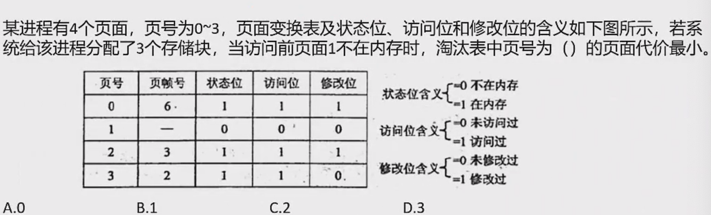

**1. 淘汰代价核心因素**
页面淘汰的代价主要取决于页面是否被修改过：

- 若页面修改位=1（已被修改），淘汰时需写回磁盘，产生额外I/O开销，代价较大。
- 若页面修改位=0（未被修改），可直接移除，无需写回磁盘，代价最小。

**2. 内存中页面状态分析**
根据页表信息：

- **页0**：状态位=1（在内存），修改位=1 → 淘汰需写回磁盘，代价大。
- **页2**：状态位=1，修改位=1 → 淘汰需写回磁盘，代价大。
- **页3**：状态位=1，修改位=0 → 淘汰无需写回磁盘，代价最小。

**3. 结论**
选择淘汰**页号3**​（对应选项D）的代价最小，因其未被修改过，可直接移除。

**答案：D**

---

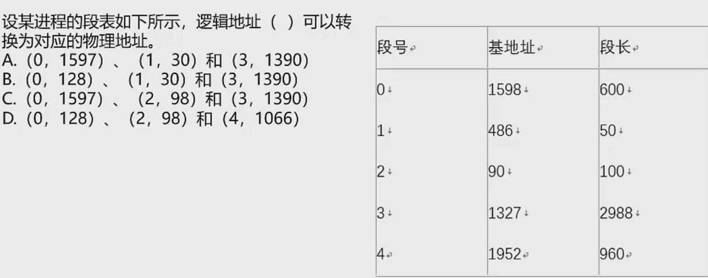

**1. 段号合法性检查**
仅段号0~4有效（其他段号直接判定为非法）。

**2. 偏移量合法性检查（各段号对应的段长及偏移范围）**

- 段号0：段长600 → 偏移范围0~599
- 段号1：段长50 → 偏移范围0~49
- 段号2：段长100 → 偏移范围0~99
- 段号3：段长2988 → 偏移范围0~2987
- 段号4：段长960 → 偏移范围0~959

**3. 选项逐个验证**

- A. (0,1597)、(1,30)、(3,1390)
  - 段0偏移1597 > 599（非法）
  - ❌ 排除
- B. (0,128)、(1,30)、(3,1390)
  - 段0偏移128 ≤ 599（合法）
  - 段1偏移30 ≤ 49（合法）
  - 段3偏移1390 ≤ 2987（合法）
  - ✅ 全部合法
- C. (0,1597)、(2,98)、(3,1390)
  - 段0偏移1597 > 599（非法）
  - ❌ 排除
- D. (0,128)、(2,98)、(4,1066)
  - 段0偏移128 ≤ 599（合法）
  - 段2偏移98 ≤ 99（合法）
  - 段4偏移1066 > 959（非法）
  - ❌ 排除

**最终答案**：B. (0,128)、(1,30)、(3,1390) 所有逻辑地址均合法，可转换为物理地址。

## 存储管理

- 分区存储管理
- 分页存储管理
- 分段存储管理
- 段页式存储管理

## 设备管理

### 设备管理概述

设备是计算机系统与外界交互的工具，具体负责计算机与外部的输入/输出工作，所以称为外部设备（简称外设）。在计算机系统中，将负责管理设备和输入/输出的机构称为I/O系统。I/O系统由设备、控制器、通道（具有通道的计算机系统）、总线和I/O软件组成。

设备的分类：
按数据组织分类：块设备、字符设备。
按职能组织分类：输入设备、输出设备、存储设备、网络联网设备、供电设备。
资源分配角度分类：独占设备、共享设备和虚拟设备。
数据传输速率分类：低速设备、中速设备、高速设备。

设备管理的任务是保证在多程序环境下，当多个进程争使设备时，按一定的策略分配和管理各种设备，控制设备的各种操作，完成I/O设备与主存之间的数据交换。

设备管理的主要功能是动态地掌握并记录设备的状态、设备分配和释放、缓冲区管理、实现物理I/O设备的操作、提供设备使用的用户接口及设备的访问控制。

### I/O软件

I/O设备管理软件的所有层次及每一层次功能如下：

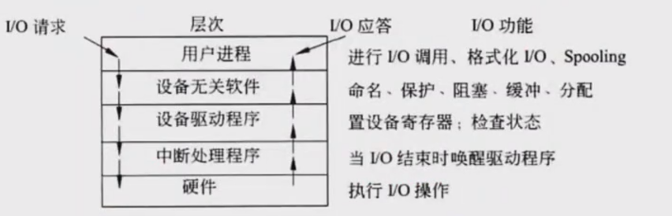

实例：当用户程序试图读一个磁盘文件时，需要通过操作系统实现这一操作。与设备无关软件检查高速缓存中有无要读的数据块，若没有，则调用设备驱动程序，向I/O硬件发出一个请求。然后，用户进程阻塞并等待磁盘操作的完成。当磁盘操作完成时，硬件产生一个中断，转入中断处理程序。中断处理程序检查中断的原因，认识到这时磁盘读取操作已经完成，于是唤醒用户进程取回从磁盘读的信息，从而结束此次I/O请求。用户进程在得到了所需的磁盘文件内容之后，继续运行。

### 设备管理技术

◆独占设备在同一时间只能由一个进程使用，其他进程只能等待，且不知道什么时候打印机空闲，此时，极大的浪费了外设的工作效率。

◆引入SPOOLing（外围设备联机操作）技术，就是在外设上建立两个数据缓冲区，分别称为输入井和输出井，这样，无论多少进程，都可以共用这一台打印机，只需要将打印命令发出，数据就会排队存储在缓冲区中，打印机会自动按顺序打印，实现了物理外设的共享，使得每个进程都感觉在使用一个打印机。

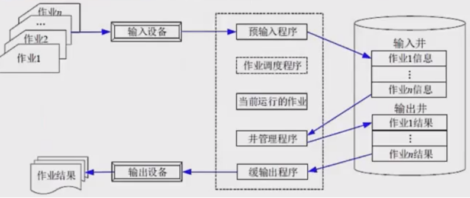

IO设备隐藏了底层复杂的实现细节，只提供接口供用户方便地使用

## 文件管理

### 文件管理概述

◆文件是具有符号名的、在逻辑上具有完整意义的一组相关信息项的集合。
◆信息项是构成文件内容的基本单位，可以是一个字符，也可以是一个记录，记录可以等长，也可以不等长。一个文件包括文件体和文件说明。文件体是文件真实的内容。文件说明是操作系统为了管理文件所用到的信息，包括文件名、文件内部标识、文件的类型、文件存储地址、文件的长度、访问权限、建立时间和访问时间等。
◆文件管理系统，就是操作系统中实现文件统一管理的一组软件和相关的数据的集合，专门负责管理和存取文件信息的软件机构，简称文件系统。文件系统的功能包括按名存取；统一的用户接口；并发访问和控制；安全性控制；优化性能；差错恢复。

◆文件的类型:
(1) 按文件性质和用途可将文件分为系统文件、库文件和用户文件。
(2) 按信息保存期限分类可将文件分为临时文件、档案文件和永久文件。
(3) 按文件的保护方式分类可将文件分为只读文件、读/写文件、可执行文件和不保护文件。
(4) UNIX系统将文件分为普通文件、目录文件和设备文件（特殊文件）。

◆文件的逻辑结构可分为两大类：有结构的记录式文件；无结构的流式文件。
◆文件的物理结构是指文件在物理存储设备上的存放方法，包括：
(1) 连续结构。连续结构也称顺序结构，它将逻辑上连续的文件信息（如记录）依次存放在连续编号的物理块上。
(2) 链接结构。链接结构也称串联结构，它是将逻辑上连续的文件信息（如记录）存放在不连续的物理块上，每个物理块设有一个指针指向下一个物理块。
(3) 索引结构。将逻辑上连续的文件信息（如记录）存放在不连续的物理块中，系统为每个文件建立一张索引表。索引表记录了文件信息所在的逻辑块号对应的物理块号，并将索引表的起始地址放在与文件对应的文件目录项中。
(4) 多个物理块的索引表。索引表是在文件创建时由系统自动建立的，并与文件一起存放在同一文件卷上。根据一个文件大小的不同，其索引表占用物理块的个数不等，一般占一个或几个物理块。

### 索引文件结构

◆索引文件结构是一种高效的文件物理结构，通过为每个文件建立索引表来实现文件数据的存储和访问。
◆索引表的构成：索引表是一个包含多个表项的数组，每个表项记录了文件的一个逻辑块号对应的物理块号。索引表通常存放在一个或多个物理块中，其起始地址记录在文件目录项中。
◆多级索引结构：对于大型文件，可以采用多级索引结构。第一级索引表指向第二级索引表，第二级索引表再指向文件数据块，这样可以大大增加文件的最大长度。

◆具体实现示例：系统中设有13个索引节点，0-9为直接索引，每个索引节点直接存放物理盘块地址，假设每个物理盘块大小为4KB，共可存储4KB×10=40KB数据；
◆10号索引节点为一级间接索引节点，大小为4KB，存放的并非直接数据，而是链接到直接物理盘块的地址，假设每个地址占4B，则共有1024个地址，对应1024个物理盘块，可存储1024×4KB=4096KB数据。
◆二级间接索引节点类似，直接存放一级地址，一级地址再存放物理盘块地址，而后链接到存放数据的物理盘块，容量又扩大了一个数量级，为1024×1024×4KB数据。
◆优缺点：
- 优点：可以实现快速的随机访问，无需连续的物理存储空间，便于文件的动态增长和删除。
- 缺点：需要额外的存储空间来存放索引表，对于小型文件可能会浪费空间；访问文件时需要先访问索引表，增加了一次磁盘I/O操作。

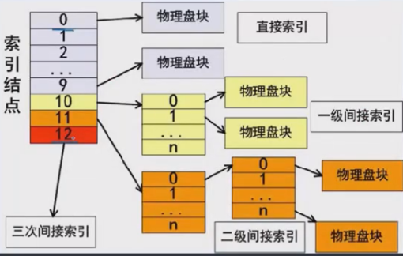

### 文件目录

◆文件控制块中包含以下三类信息：基本信息类、存取控制信息类和使用信息类。
（1）基本信息类。例如文件名、文件的物理地址、文件长度和文件块数等。
（2）存取控制信息类。文件的存取权限，像UNIX用户分成文件主、同组用户和一般用户三类，这三类用户的读/写/执行RWX权限。
（3）使用信息类。文件建立日期、最后一次修改日期、最后一次访问的日期、当前使用的信息（如打开文件的进程数、在文件上的等待队列）等。
◆文件控制块的有序集合称为文件目录。
◆相对路径：是从当前路径开始的路径。
◆绝对路径：是从根目录开始的路径。
◆全文件名=绝对路径+文件名。要注意，绝对路径和相对路径是不加最后的文件名的，只是单纯的路径序列。

### 文件存储空间管理

◆文件的存取方法是指读/写文件存储器上的一个物理块的方法。通常有顺序存取和随机存取两种方法。顺序存取方法是指对文件中的信息按顺序依次进行读/写；随机存取方法是指对文件中的信息可以按任意的次序随机地读/写。
◆文件存储空间的管理：
（1）空闲区表。将外存空间上的一个连续的未分配区域称为"空闲区"。操作系统为磁盘外存上的所有空闲区建立一张空闲表，每个表项对应一个空闲区，适用于连续文件结构。
| 序号 | 第一个空闲块号 | 空闲块数 | 状态 |
|------|--------------|----------|------|
| 1    | 18           | 5        | 可用 |
| 2    | 29           | 8        | 可用 |
| 3    | 105          | 19       | 可用 |
| 4    | —            | —        | 未用 |

（2）位示图。这种方法是在外存上建立一张位示图（Bitmap），记录文件存储器的使用情况。每一位对应文件存储器上的一个物理块，取值0和1分别表示空闲和占用。

| 第0字节 | 0 | 1 | 1 | 0 | 0 | 1 | … | 0 | 1 |
|--------|---|---|---|---|---|---|---|---|---|
| 第1字节 | 1 | 0 | 1 | 0 | 0 | 0 | … | 1 | 1 |
| 第2字节 | 0 | 1 | 1 | 1 | 1 | 0 | … | 1 | 0 |
| 第3字节 | 1 | 1 | 1 | 1 | 0 | 0 | … | 0 | 1 |
| ⋮      | ⋮ | ⋮ | ⋮ | ⋮ | ⋮ | ⋮ | ⋱ | ⋮ | ⋮ |
| 第n-1字节 | 0 | 1 | 0 | 1 | 0 | 1 | … | 1 | 1 |

（3）空闲块链。每个空闲物理块中有指向下一个空闲物理块的指针，所有空闲物理块构成一个链表，链表的头指针放在文件存储器的特定位置上（如管理块中），不需要磁盘分配表，节省空间。
（4）成组链接法。例如，在实现时系统将空闲块分成若干组，每100个空闲块为一组，每组的第一个空闲块登记了下一组空闲块的物理盘块号和空闲块总数。假如某个组的第一个空闲块号等于0，意味着该组是最后一组，无下一组空闲块。
◆文件存储空间管理是文件系统的重要功能，负责有效地管理和分配文件存储设备的空闲空间，提高存储空间的利用率。

### 真题

**题目内容：**

设文件索引节点中有8个地址项，每个地址项大小为4字节，其中5个地址项为直接地址索引，2个地址项是一级间接地址索引，1个地址项是二级间接地址索引，磁盘索引块和磁盘数据块大小均为1KB，若要访问文件的逻辑块号分别为5和518，则系统应分别采用*27**，而且可表示的单个文件最大长度是*28__KB。

**(27)**

A．直接地址索引和一级间接地址索引

B．直接地址索引和二级间接地址索引

C．一级间接地址索引和二级间接地址索引

D．一级间接地址索引和一级间接地址索引

**(28)**

A．517

B．1029

C．16513

D．66053

------

**解析：**

**问题27：访问逻辑块号5和518时采用的索引方式**

1. **直接地址索引**：对应逻辑块号0~4（共5个直接地址项）。
2. **一级间接地址索引**：
   - 每个一级间接索引可存放256个物理块地址（1KB / 4B = 256）。
   - 题目中两个一级间接地址项（地址项5和6），分别覆盖逻辑块号5~260和261~516。
   - 逻辑块号5属于第一个一级间接地址项（地址项5）的范围内，因此采用一级间接地址索引。
3. **二级间接地址索引**：
   - 二级间接地址项（地址项7）通过两层索引表定位物理块，其覆盖的逻辑块号为517~66052（256 × 256 = 65536个块）。
   - 逻辑块号518超过了一级间接的覆盖范围（0~516），因此需通过二级间接地址索引访问。

**结论**：逻辑块号5采用一级间接地址索引，逻辑块号518采用二级间接地址索引。正确答案为 **C. 一级间接地址索引和二级间接地址索引**。

**问题28：单个文件的最大长度**

1. **直接地址索引**：5个地址项，每个对应1KB数据块 → 总容量为 5 × 1KB = 5KB。
2. **一级间接地址索引**：
   - 每个一级间接地址项指向256个数据块 → 2个一级间接地址项总容量为 2 × 256 × 1KB = 512KB。
3. **二级间接地址索引**：
   - 二级间接地址项指向256个一级间接索引块，每个一级间接索引块再指向256个数据块 → 总容量为 256 × 256 × 1KB = 65536KB。

**总和**：5KB（直接）+ 512KB（一级间接）+ 65536KB（二级间接）= 66053KB。

**结论**：单个文件最大长度为 **D. 66053KB**。

---

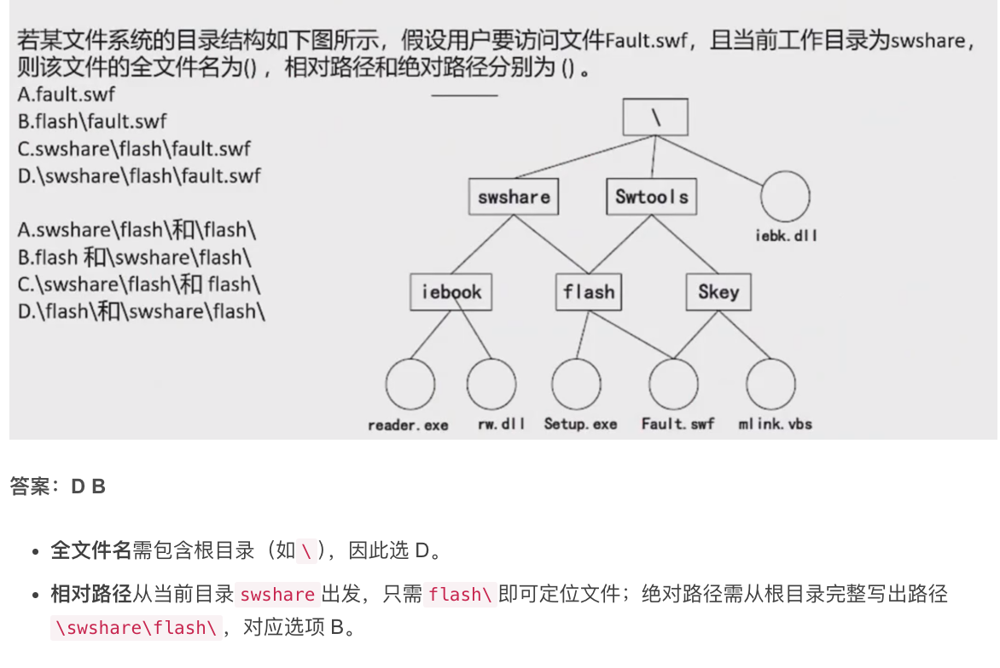

---

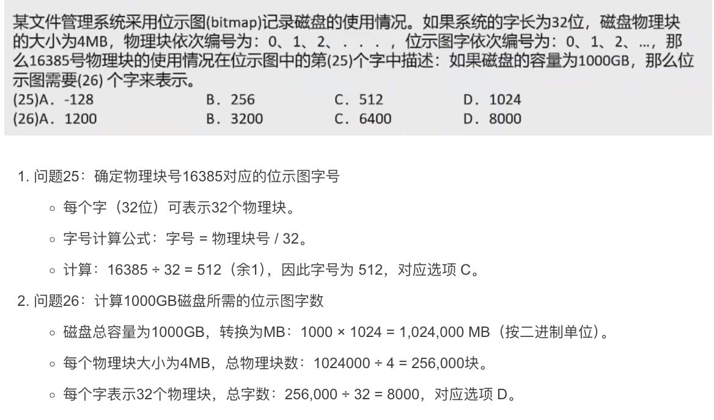
