# 数据库系统知识

## 数据库基本概念

### 数据库系统

数据：是数据库中存储的基本对象，是描述事物的符号记录。

数据的种类：文本、图形、图像、音频、视频、学生的档案记录、货物的运输情况等。

数据库DB：是长期存储在计算机内、有组织的、可共享的大量数据的集合。

数据库的基本特征：

- 数据按一定的数据模型组织、描述和存储；
- 可为各种用户共享；
- 冗余度较小；
- 数据独立性较高；
- 
- 
- 易扩展。

◆数据库系统DBS：是一个采用了数据库技术，有组织地、动态地存储大量相关数据，方便多用户访问的计算机系统。其由下面四个部分组成：

数据库（统一管理、长期存储在计算机内的，有组织的相关数据的集合）

硬件（构成计算机系统包括存储数据所需的外部设备）

软件（操作系统、数据库管理系统及应用程序）

人员（系统分析和数据库设计人员、应用程序员、最终用户、数据库管理员DBA）。

◆数据库管理系统DBMS的功能

实现对共享数据有效的组织、管理和存取。

包括数据定义、数据库操作、数据库运行管理、数据的存储管理、数据库的建立和维护等。

### 三级模式-两级映像

◆内模式：管理如何存储物理的数据，对应具体物理存储文件。

◆模式：又称为概念模式，就是我们通常使用的基本表，根据应用、需求将物理数据划分成一张张表。

◆外模式：对应数据库中的视图这个级别，将表进行一定的处理后再提供给用户使用。

◆外模式-模式映像：是表和视图之间的映射，存在于概念级和外部级之间，若表中数据发生了修改，只需要修改此映射，而无需修改应用程序。

◆模式-内模式映像：是表和数据的物理存储之间的映射，存在于概念级和内部级之间，若修改了数据存储方式，只需要修改此映射，而不需要去修改应用程序。

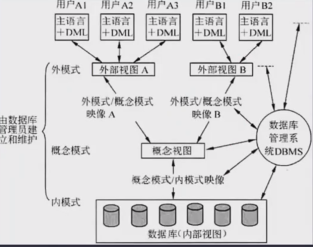

### 数据库设计

（1）**需求分析**：即分析数据存储的要求，产出物有数据流图、数据字典、需求说明书。获得用户对系统的三个要求：信息要求、处理要求、系统要求。

（2）**概念结构设计**：就是设计E-R图，也即实体-联系图。工作步骤包括：选择局部应用、逐一设计分E-R图、E-R图合并。

分E-R图进行合并时，它们之间存在的冲突主要有以下3类。

◆ **属性冲突**。同一属性可能会存在于不同的分E-R图中。

◆ **命名冲突**。相同意义的属性，在不同的分E-R图上有着不同的命名，或是名称相同的属性在不同的分E-R图中代表着不同的意义。

◆ **结构冲突**。同一实体在不同的分E-R图中有不同的属性，同一对象在某一分E-R图中被抽象为实体而在另一分E-R图中又被抽象为属性。

（3）**逻辑结构设计**：将E-R图，转换成关系模式。工作步骤包括：确定数据模型、将E-R图转换成为指定的数据模型、确定完整性约束和确定用户视图。

（4）**物理设计**：步骤包括确定数据分布、存储结构和访问方式。

（5）**数据库实施阶段**。根据逻辑设计和物理设计阶段的结果建立数据库，编制与调试应用程序，组织数据入库，并进行试运行。

（6）**数据库运行和维护阶段**。数据库应用系统经过试运行即可投入运行，但该阶段需要不断地对系统进行评价、调整与修改。

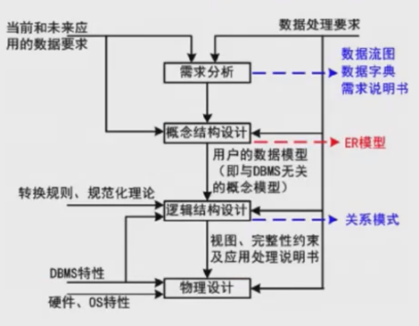

### E-R模型

关系模型是二维表的形式表示的实体-联系模型，是将实体-联系模型转换而来的，经过开发人员设计的。

概念模型是从用户的角度进行建模的，是现实世界到信息世界的第一抽象，是真正的实体-联系模型。

网状模型表示实体类型及其实体之间的联系，一个事物和另外几个都有联系，形成一张网。

面向对象模型是采用面向对象的方法设计数据库，以对象为单位，每个对象包括属性和方法，具有类和继承等特点。

数据模型三要素：数据结构（所研究的对象类型的集合）、数据操作（对数据库中各种对象的实例允许执行的操作的集合）、数据的约束条件（一组完整性规则的集合）。

◆ 用E-R图来描述概念数据模型，世界是由一组称作实体的基本对象和这些对象之间的联系构成的。

◆ 在E-R模型中，使用椭圆表示属性（一般没有）、长方形表示实体、菱形表示联系，联系的两端要填写联系类型。

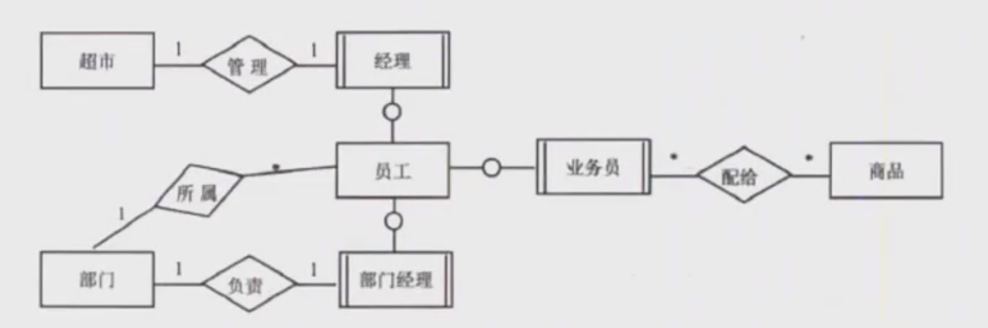

◆ 实体：客观存在并可相互区别的事物。可以是具体的人、事、物或抽象概念。如人、汽车、图书、账户、贷款。

◆ 弱实体和强实体：弱实体依赖于强实体的存在而存在。

◆ 实体集：具有相同类型和共享相同属性的实体的集合，如学生、课程。

◆ 属性：实体所具有的特性。

◆ 属性分类：简单属性和复合属性；单值属性和多值属性；NULL属性；派生属性。

◆ 域：属性的取值范围称为该属性的域。

◆ 码（key）：唯一标识实体的属性集。

◆ 联系：现实世界中事物内部以及事物之间的联系，在E-R图中反映为实体内部的联系和实体之间的联系。

◆ 联系类型：一对一1:1、一对多1:N、多对多M:N。

### 关系模型

关系模型

关系模型中数据的逻辑结构是一张二维表，由行（元组）和列（属性）组成。它用表格结构表达实体集，用外键标识实体间的联系。

**示例：学生信息表**

| 学号    | 姓名   | 年龄 | 性别 | 系名     | 年级 |
| ------- | ------ | ---- | ---- | -------- | ---- |
| 2021001 | 王小明 | 19   | 男   | 计算机系 | 2021 |
| 2021002 | 黄大鹏 | 20   | 男   | 计算机系 | 2021 |
| 2021003 | 张文斌 | 18   | 女   | 计算机系 | 2021 |

**优点：**

- 建立在严格的数学概念基础上。
- 概念单一、结构简单、清晰，用户易懂易用。
- 存取路径对用户透明，从而数据独立性、安全性好，简化数据库开发工作。

**缺点：**

- 由于存取路径透明，查询效率往往不如非关系数据模型。

------

数据模型：E-R模型转换为关系模型

**转换规则：**

1. **每个实体**都对应一个关系模式。
2. **联系**的转换分为三种情况：
   - **1:1联系**：联系可以放到任意的两端实体中，作为一个属性（要保证1:1的两端关联）；**或者**转换为一个单独的关系模式。
   - **1:N联系**：联系可以单独作为一个关系模式；**或者**在N端中加入1端实体的主键。
   - **M:N联系**：联系**必须**作为一个单独的关系模式，其主键是M端和N端的联合主键。

### 关系代数

- 并集
- 交集
- 差集

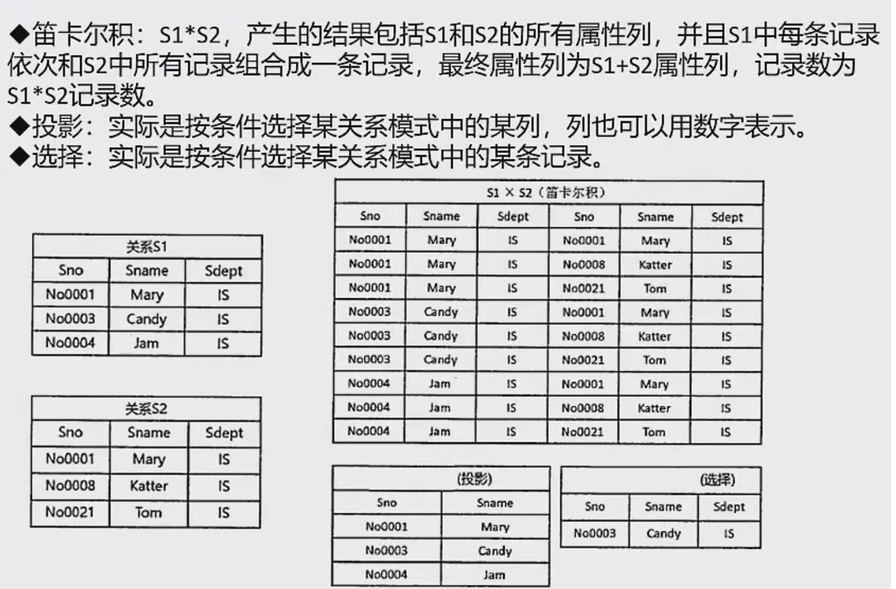

- 自然连接

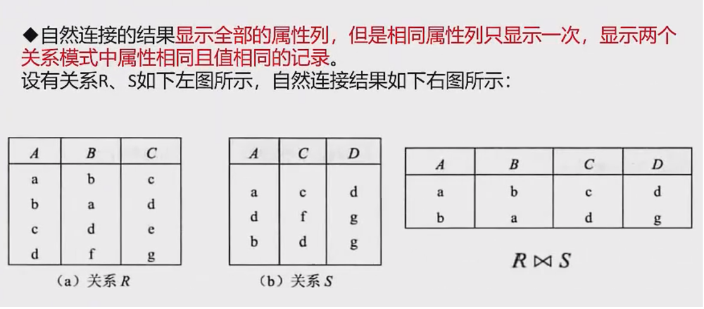

### 真题

在数据库系统中，数据库的视图、基本表和存储文件的结构分别与（ ）对应；数据的物理独立性和数据的逻辑独立性是分别通过修改（ ）来完成的。

A.模式、外模式、内模式

B.模式、内模式、外模式

C.外模式、模式、内模式

D.外模式、内模式、模式

A.模式与内模式之间的映像、外模式与模式之间的映像

B.外模式与内模式之间的映像、外模式与模式之间的映像

C.外模式与模式之间的映像、模式与内模式之间的映像

D.外模式与内模式之间的映像、模式与内模式之间的映像

在数据库逻辑结构设计阶段，需要（ ）阶段形成的（ ）作为设计依据。

A.需求分析

B.概念结构设计

C.物理结构设计

D.数据库运行和维护

A.程序文档、数据字典和数据流图

B.需求说明文档、程序文档和数据流图

C.需求说明文档、数据字典和数据流图

D.需求说明文档、数据字典和程序文档

------

**第一题**

在数据库系统中，视图、基本表和存储文件的结构分别对应外模式、模式和内模式：

- 视图属于外模式（用户级数据视图），是虚拟表，通过查询定义动态生成数据，屏蔽底层细节。
- 基本表属于模式（概念模式），是数据库中全体数据的逻辑结构描述。
- 存储文件属于内模式（物理存储结构），描述数据的物理存储方式。

关于数据的独立性：

1. 物理独立性通过修改模式与内模式之间的映像实现。当存储结构（如索引、文件组织）改变时，只需调整该映像，而无需修改模式或应用程序。
2. 逻辑独立性通过修改外模式与模式之间的映像实现。当模式结构（如新增字段）改变时，只需调整该映像，保持外模式不变，应用程序不受影响。

**答案：**

- 第一空选 C（外模式、模式、内模式）
- 第二空选 A（模式与内模式之间的映像、外模式与模式之间的映像）

**第二题**

**答案：**

- 第一空选 A（需求分析）
- 第二空选 C（需求说明文档、数据字典和数据流图）

---

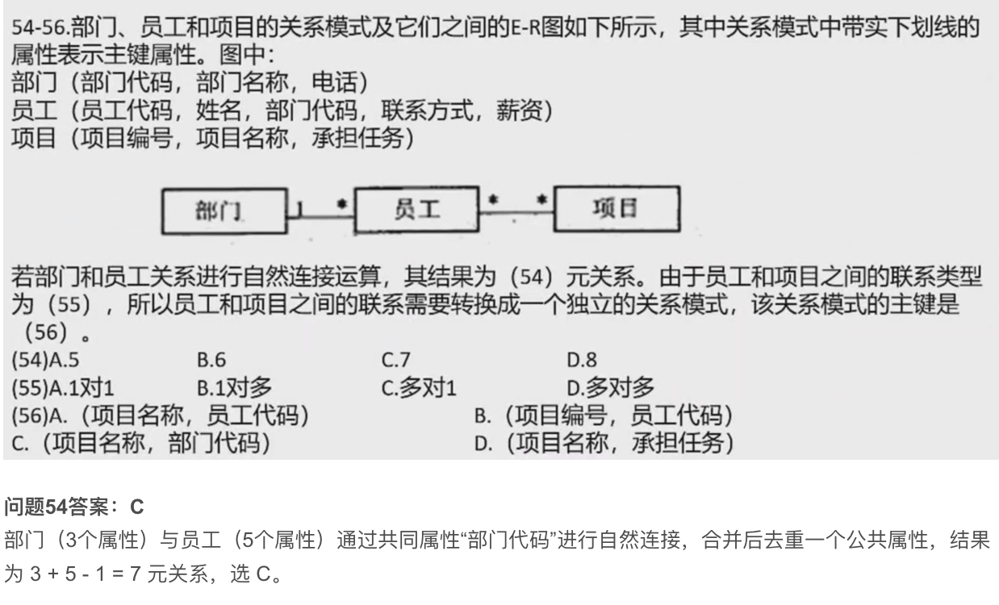

---

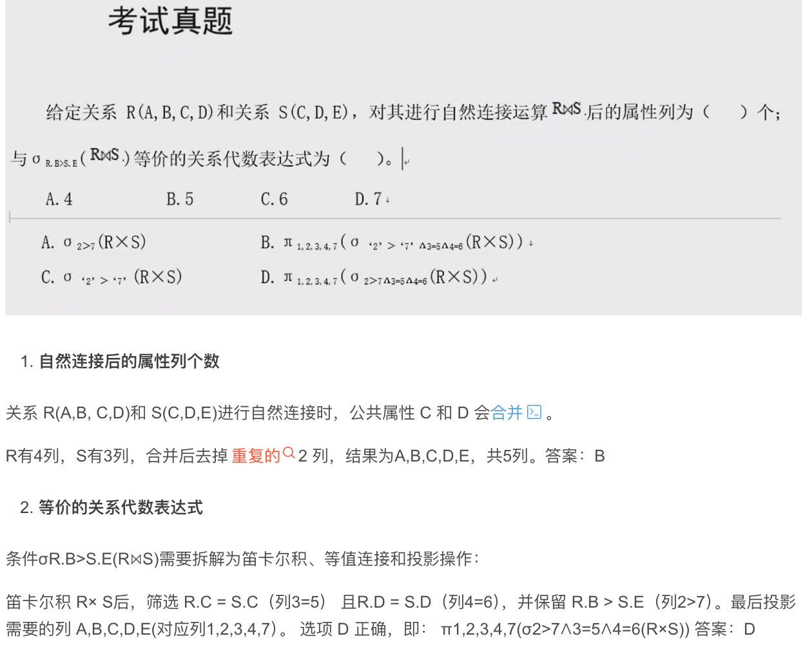

## 规范化和并发控制

### 函数依赖

给定一个属性集X，能唯一确定一个属性集Y，就称X确定Y，或者说Y依赖于X。

例如：Y = X * X 函数。

**部分函数依赖**

若A可确定C，且(A,B)也可确定C，但(A,B)中的一部分（即A）已经可以确定C，则称C部分函数依赖于(A,B)。

**传递函数依赖**

当A和B不等价时，若A可确定B，且B可确定C，则A可确定C，称为传递函数依赖。

若A和B等价，则不存在传递依赖，A可直接确定C。

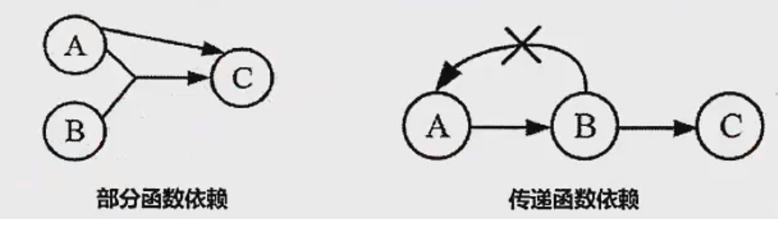

------

**函数依赖的公理系统（Armstrong公理）**

设关系模式 R<U, F>，其中：

- U 是关系模式R的属性全集
- F 是关系模式R的一个函数依赖集

Armstrong公理包含以下基本规则：

1. **自反律**

   若 Y ⊆ X ⊆ U，则 X → Y 为F所逻辑蕴含。

2. **增广律**

   若 X → Y 为F所逻辑蕴含，且 Z ⊆ U，则 XZ → YZ 为F所逻辑蕴含。

3. **传递律**

   若 X → Y 和 Y → Z 为F所逻辑蕴含，则 X → Z 为F所逻辑蕴含。

1. **合并规则**

   若 X → Y，X → Z，则 X → YZ 为F所蕴涵。

2. **伪传递率**

   若 X → Y，WY → Z，则 XW → Z 为F所蕴涵。

3. **分解规则**

   若 X → Y，Z ⊆ Y，则 X → Z 为F所蕴涵。

### 键与约束

◆ 超键：能唯一标识此表的属性的组合。

◆ 候选键：超键中去掉冗余的属性，剩余的属性就是候选键。

◆ 主键：任选一个候选键，即可作为主键。

◆ 外键：其他表中的主键。

◆ 主属性：候选键内的属性为主属性，其他属性为非主属性。

◆ 实体完整性约束：即主键约束，主键值不能为空，也不能重复。

◆ 参照完整性约束：即外键约束，外键必须是其他表中已经存在的主键的值，或者为空。

◆ 用户自定义完整性约束：自定义表达式约束，如设定年龄属性的值必须在0到150之间。

### 范式

- 第一范式：关系中的每一个分量必须是一个不可分的数据项
- 第二范式：每一个非主属性不会依赖复合主键中的某一列。如果关系R属于1NF，且每一个非主属性完全函数依赖于任何一个候选码，则R属于2NF。
- 第三范式：在满足1NF的基础上，表中不存在非主属性对码的传递依赖。
- BC范式：在第三范式的基础上进一步消除主属性对码的部分函数依赖和传递依赖。通俗说，在每一种情况下，每一个依赖的左边决定因素都必然包含候选键。

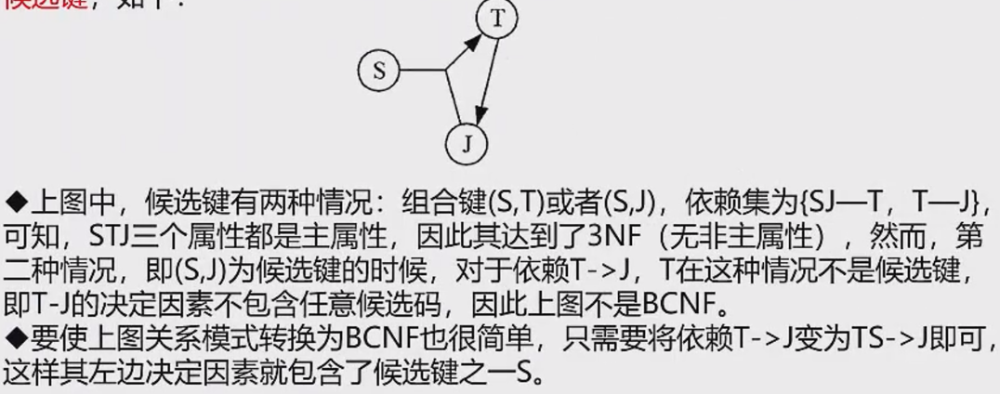

### 模式分解

范式之间的转换一般都是通过拆分属性，即模式分解，将具有部分函数依赖和传递依赖的属性分离出来，来达到一步步优化，一般分为以下两种：

**保持函数依赖分解**

对于关系模式R，有依赖集F，若对R进行分解，分解出来的多个关系模式，保持原来的依赖集不变，则为保持函数依赖的分解。另外，注意要消除掉冗余依赖（如传递依赖）。

**实例：** 设原关系模式R(A,B,C)，依赖集F(A→B,B→C,A→C)，将其分解为两个关系模式R1(A,B)和R2(B,C)，此时R1中保持依赖A→B，R2保持依赖B→C，说明分解后的R1和R2是保持函数依赖的分解，因为A→C这个函数依赖实际是一个冗余依赖，可以由前两个依赖传递得到，因此不需要管。

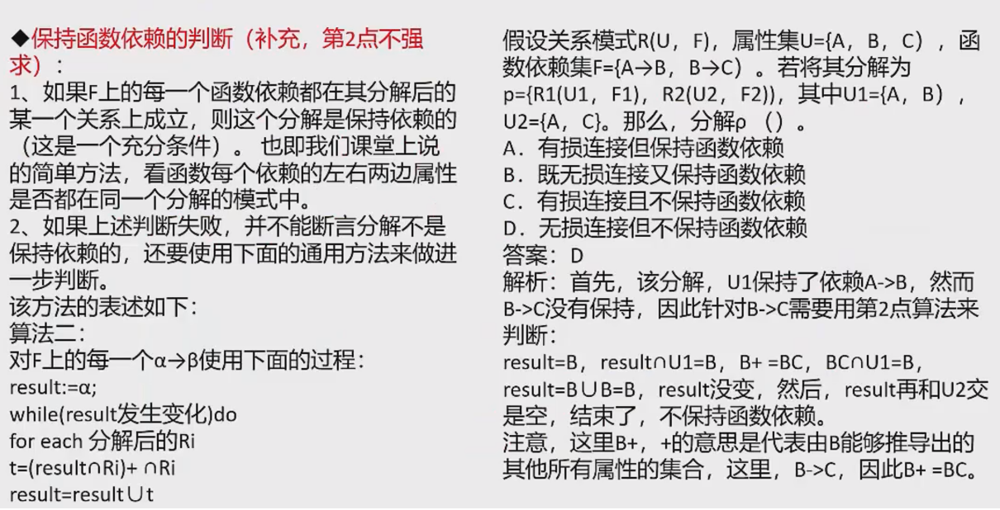


无损分解：分解后的关系模式能够还原出原关系模式，就是无损分解，不能还原就是有损。

当分解为两个关系模式，可以通过以下定理判断是否无损分解：

**定理：** 如果R的分解为ρ={R1，R2}，F为R所满足的函数依赖集合，分解ρ具有无损连接性的充分必要条件是R1∩R2→（R1-R2）或者R1∩R2→（R2-R1）。

当分解为三个及以上关系模式时，可以通过表格法求解。

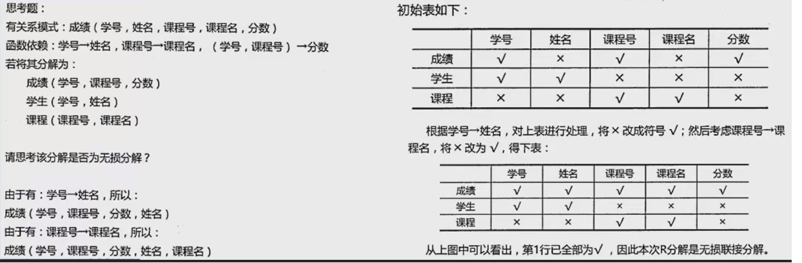

### 并发控制

- 事务：由一系列操作组成，这些操作，要么全执行、要么都不执行


- 原子性
- 一致性
- 隔离性
- 持续性


事务是并发控制的前提条件，并发控制就是控制不同的事务并发执行，提高系统效率，并发控制中存在下面三个问题。

- 更新丢失
- 不可重复读
- 读脏数据

### 封锁协议

◆ X锁是排它锁（写锁）。若事务T对数据对象A加上X锁，则只允许T读取和修改A，其他事务都不能再对A加任何类型的锁，直到T释放A上的锁。

◆ S锁是共享锁（读锁）。若事务T对数据对象A加上S锁，则只允许T读取A，但不能修改A，其他事务只能再对A加S锁（也即能读不能修改），直到T释放A上的S锁。

◆ 共分为三级封锁协议，如下：

一级封锁协议：事务在修改数据R之前必须先对其加X锁，直到事务结束才释放。可解决丢失更新问题。

------

◆ 二级封锁协议：一级封锁协议的基础上加上事务T在读数据R之前必须先对其加S锁，读完后即可释放S锁。

可解决丢失更新、读脏数据问题。

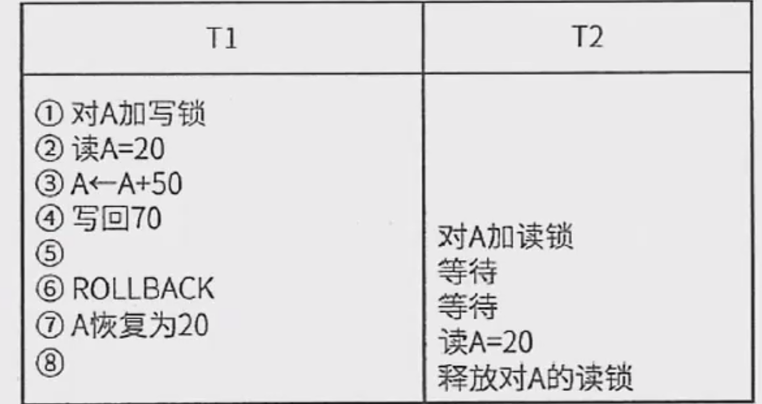

### 真题

**题目一：**

给定关系模式R(U,F)，U={A,B,C,D}，F={AB→C,CD→B}。关系R（ ），且分别有（ ）。

**第一问选项：**

A.只有1个候选关键字ACB

B.只有1个候选关键字BCD

C.有2个候选关键字ACD和ABD

D.有2个候选关键字ACB和BCD

**第二问选项：**

A.0个非主属性和4个主属性

B.1个非主属性和3个主属性

C.2个非主属性和2个主属性

D.3个非主属性和1个主属性

**候选关键字的求法：** 根据依赖集，找出从未在右边出现过的属性，必然是候选键之一。以该属性为基础，根据依赖集依次扩展，看能否遍历所有属性，将无法遍历的加入候选键中。

**第一空正确选项：** C.有2个候选关键字ACD和ABD

**第二空正确选项：** A.0个非主属性和4个主属性

1、候选键的确定

候选键需满足：

1. 闭包覆盖所有属性（即通过函数依赖能推导出全部属性）。
2. 最小性（无冗余属性）。

给定关系模式R(U,F)，其中U={A,B,C,D}，函数依赖集F={AB→C,CD→B}。

- **候选键1: ACD**
  - 计算闭包(ACD)+：
    - ACD→A,C,D（初始属性）。
    - 通过CD→B，可推导出B（因CD⊆ACD）。
    - 最终闭包为ACD→ABCD。
  - 满足条件，ACD为候选键。
- **候选键2: ABD**
  - 计算闭包(ABD)+：
    - ABD→A,B,D（初始属性）。
    - 通过AB→C，可推导出C。
  - 最终闭包为ABD→ABCD。
  - 满足条件，ABD为候选键。

**其他选项排除：**

- ACB：闭包无法推导出D，不符合覆盖所有属性。
- BCD：闭包无法推导出A，不符合覆盖所有属性。

**结论：** 候选键为ACD和ABD，对应选项C。

2、主属性与非主属性

主属性是候选键中的属性。本题中：

- 候选键ACD包含属性A,C,D。

- 候选键ABD包含属性A,B,D。

  **主属性：** 所有出现在候选键中的属性，即A,B,C,D。

  **非主属性：** 无（所有属性均为主属性）。

**结论：**

- 主属性数量：4个（A,B,C,D）。

- 非主属性数量：0个。

  对应选项A。

3、拓展

关系模式R达到第三范式（3NF），但未达到BCNF。需通过分解消除主属性间的非候选键依赖。


----

**题目二：**

设有关系模式R（E，N，M，L，Q），其函数依赖集为F={E→N，EM→Q，M→L}。则关系模式R达到了***；该关系模式***。

**第一问选项：**

A.1NF

B.2NF

C.3NF

D.BCNF

**第二问选项：**

A.无需进行分解，因为已经达到了3NF

B.无需进行分解，因为已经达到了BCNF

C.尽管不存在部分函数依赖，但还存在传递依赖，所以需要进行分解

D.需要进行分解，因为存在冗余、修改操作的不一致性、插入和删除异常

**候选键确定**

通过计算属性闭包发现，EM是唯一候选键：

- EM的闭包：EM→Q（直接依赖），E→N（扩展闭包到N），M→L（扩展闭包到L），最终闭包为{EMNQL}，覆盖所有属性。
- 其他组合（如E、M单独或部分组合）无法推导出所有属性。

**范式判断**

- **1NF：** 满足，所有属性均为原子值。
- **2NF：** 不满足。存在部分函数依赖：E→N（非主属性N依赖于候选键EM的部分属性E）。M→L（非主属性L依赖于候选键EM的部分属性M）。
- **3NF/BCNF：** 因不满足2NF，无需进一步判断。

**问题根源**

- **冗余：** 例如，若多个元组具有相同E值，N值会重复存储；同理，相同M值的L值也会冗余。
- **操作异常**
  - 插入异常：无法单独插入M→L的依赖关系而不提供E。
  - 删除异常：删除某个EM组合可能导致M→L的关联信息丢失。
  - 更新不一致：修改M→L时需要更新所有相关元组。

**分解方案**

- 将R分解为以下子模式以消除部分依赖：
  - R1(E, M, Q)：保留完全依赖EM→Q。
  - R2(E, N)：处理E→N的依赖。
  - R3(M, L)：处理M→L的依赖。
- 分解后所有子模式均满足2NF及以上。

**第一空答案：** A.1NF（存在部分依赖，未达到2NF）。

**第二空答案：** D.需要进行分解（因冗余和操作异常问题需通过分解解决）。

---

给定关系模式R < U，F >，U = {A，B，C，D，E}，F = {B→A，D→A，A→E，AC→B}，则R的候选关键字为（ ），分解ρ = {R1（ABCE），R2（CD)}（ ）。

**第一问选项：**

A. CD

B. ABD

C. ACD

D. ADE

**第二问选项：**

A. 具有无损连接性，且保持函数依赖

B. 不具有无损连接性，但保持函数依赖

C. 具有无损连接性，但不保持函数依赖

D. 不具有无损连接性，也不保持函数依赖

候选关键字分析

候选关键字的求法：根据依赖集，找出从未在右边出现过的属性，必然是候选键之一，以该属性为基础，根据依赖集依次扩展，看能否遍历所有属性，将无法遍历的加入候选键中。

- 属性集U = {A, B, C, D, E}，函数依赖集F = {B→A, D→A, A→E, AC→B}。
- 候选键需满足：能推导出所有属性且极小。
- **CD是候选键**：
  - CD → D → A → E，且AC → B（通过C∈CD和A∈D+）。
  - 其他组合（如BC、AC）无法推导出所有属性。
- **结论**：候选关键字为CD，对应选项A。

无损性判断

使用公式判断：若R1 ∩ R2 → (R1 - R2) 或 R1 ∩ R2 → (R2 - R1) 成立，则分解具有无损连接性。

- R1 ∩ R2 = C
- R1 - R2 = ABE
- R2 - R1 = D
- C → ABE 和 C → D 都不成立，所以为有损分解。

函数依赖

原依赖D→A无法在R1或R2中保留（因D仅在R2，而A不在R2），依赖未完全保持。

最终答案

- 候选关键字：**A. CD**
- 分解性质：**D. 不具有无损连接性，也不保持函数依赖**

## 数据库新技术

### 数据库安全

安全措施

| 措施           | 说明                                                         |
| -------------- | ------------------------------------------------------------ |
| 用户标识和鉴定 | 最外层的安全保护措施，可以使用用户帐户、口令及随机数检验等方式 |
| 存取控制       | 对用户进行授权，包括操作类型（如查找、插入、删除、修改等动作）和数据对象（主要是数据范围）的权限 |
| 密码存储和传输 | 对远程终端信息用密码传输                                     |
| 视图的保护     | 对视图进行授权                                               |
| 审计           | 使用一个专用文件或数据库，自动将用户对数据库的所有操作记录下来 |

故障处理

| 故障关系               | 故障原因               | 解决方法                                                     |
| ---------------------- | ---------------------- | ------------------------------------------------------------ |
| 事务本身的可预期故障   | 本身逻辑               | 在程序中预先设置Rollback语句                                 |
| 事务本身的不可预期故障 | 算术溢出、违反存储保护 | 由DBMS的恢复子系统通过日志，撤销事务对数据库的修改，回退到事务初始状态 |
| 系统故障               | 系统停止运转           | 通常使用检查点法                                             |
| 介质故障               | 外存被破坏             | 一般使用日志重做业务                                         |

- **静态转储（冷备份）**：指在转储期间不允许对数据库进行任何存取、修改操作
  - 优点：非常快速的备份方法、容易归档（直接物理复制操作）
  - 缺点：只能提供到某一时间点上的恢复，不能做其他工作，不能按表或按用户恢复
- **动态转储（热备份）**：在转储期间允许对数据库进行存取、修改操作，因此转储和用户事务可并发执行
  - 优点：可在表空间或数据库文件级备份，数据库仍可使用，可达到秒级恢复
  - 缺点：不能出错，否则后果严重，若热备份不成功，所得结果几乎全部无效
- **完全备份**：备份所有数据
- **差量备份**：仅备份上一次完全备份之后变化的数据
- **增量备份**：备份上一次备份之后变化的数据
- **日志文件**：在事务处理过程中，DBMS把事务开始、事务结束以及对数据库的插入、删除和修改的每一次操作写入日志文件。一旦发生故障，DBMS的恢复子系统利用日志文件撤销事务对数据库的改变，回退到事务的初始状态

### 分布式数据库

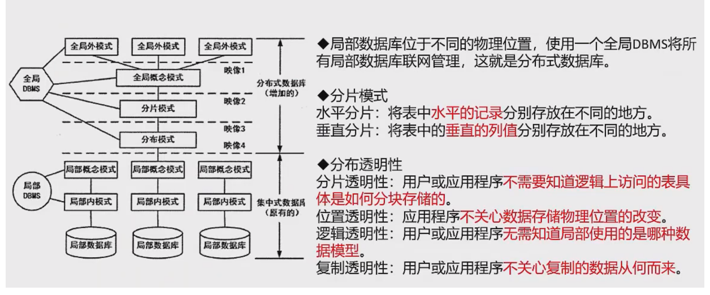

### 数据仓库

数据仓库定义与特征

数据仓库是一个面向主题的、集成的、非易失的、且随时间变化的数据集合，用于支持管理决策。

**核心特征：**

- **面向主题**：按照一定的主题域进行组织
- **集成的**：数据仓库中的数据是在对原有分散的数据库数据抽取、清理的基础上经过系统加工、汇总和整理得到的，必须消除源数据中的不一致性，以保证数据仓库内的信息是关于整个企业的一致的全局信息
- **相对稳定的**：数据仓库的数据主要供企业决策分析之用，所涉及的数据操作主要是数据查询，一旦某个数据进入数据仓库以后，一般情况下将被长期保留，也就是数据仓库中一般有大量的查询操作，但修改和删除操作很少，通常只需要定期的加载、刷新
- **反映历史变化**：数据仓库中的数据通常包含历史信息，系统记录了企业从过去某一时点（如开始应用数据仓库的时点）到目前的各个阶段的信息，通过这些信息，可以对企业的发展历程和未来趋势做出定量分析和预测

数据仓库体系结构

数据仓库的结构通常包含四个层次：

1. **数据源**：是数据仓库系统的基础，是整个系统的数据源泉
2. **数据的存储与管理**：是整个数据仓库系统的核心
3. **OLAP（联机分析处理）服务器**：对分析需要的数据进行有效集成，按多维模型组织，以便进行多角度、多层次的分析，并发现趋势
4. **前端工具**：主要包括各种报表工具、查询工具、数据分析工具、数据挖掘工具以及各种基于数据仓库或数据集市的应用开发工具

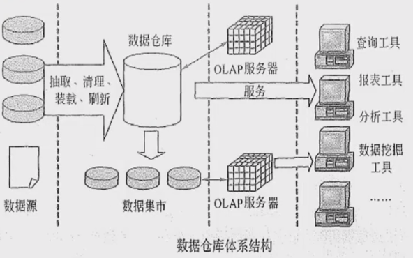-

BI系统主要阶段

BI系统主要包括数据预处理、建立数据仓库、数据分析和数据展现四个主要阶段。

- **数据预处理**：是整合企业原始数据的第一步，它包括数据的抽取（Extraction）、转换（Transformation）和加载（Load）三个过程（ETL过程）
- **建立数据仓库**：是处理海量数据的基础
- **数据分析**：是体现系统智能的关键，一般采用联机分析处理（OLAP）和数据挖掘两大技术。联机分析处理不仅进行数据汇总/聚集，同时还提供切片、切块、下钻、上卷和旋转等数据分析功能，用户可以方便地对海量数据进行多维分析。数据挖掘的目标则是挖掘数据背后隐藏的知识，通过关联分析、聚类和分类等方法建立分析模型，预测企业未来发展趋势和将要面临的问题
- **数据展现**：在海量数据和分析手段增多的情况下，数据展现则主要保障系统分析结果的可视化

### 反规范化技术

反规范化技术是指在规范化设计后，数据库设计者希望牺牲部分规范化来提高性能。

采用反规范化技术的益处

- 降低连接操作的需求
- 降低外码和索引的数目
- 可能减少表的数目
- 能够提高查询效率

可能带来的问题

- 数据的重复存储，浪费了磁盘空间
- 可能出现数据的完整性问题
- 为了保障数据的一致性，增加了数据维护的复杂性
- 会降低修改速度

具体方法

（1）增加冗余列

在多个表中保留相同的列，通过增加数据冗余减少或避免查询时的连接操作。

（2）增加派生列

在表中增加可以由本表或其它表中数据计算生成的列，减少查询时的连接操作并避免计算或使用集合函数。

（3）重新组表

如果许多用户需要查看两个表连接出来的结果数据，则把这两个表重新组成一个表来减少连接而提高性能。

（4）水平分割表

根据一列或多列数据的值，把数据放到多个独立的表中，主要用于表数据规模很大、表中数据相对独立或数据需要存放到多个介质上时使用。

（5）垂直分割表

对表进行分割，将主键与部分列放到一个表中，主键与其它列放到另一个表中，在查询时减少I/O次数。

### 大数据

大数据的特点

- **大量化**：数据量巨大
- **多样化**：数据类型丰富多样
- **价值密度低**：数据价值密度相对较低
- **快速化**：数据处理速度要求高

大数据与传统数据的比较

| 比较维度         | 传统数据             | 大数据                         |
| ---------------- | -------------------- | ------------------------------ |
| **数据量**       | GB或TB级             | PB级或以上                     |
| **数据分析需求** | 现有数据的分析与检测 | 深度分析（关联分析、回归分析） |
| **硬件平台**     | 高端服务器           | 集群平台                       |

大数据处理系统的特征

要处理大数据，一般使用集成平台，称为大数据处理系统，其特征包括：

- **高度可扩展性**：能够灵活扩展处理能力
- **高性能**：具备高效的数据处理性能
- **高度容错**：系统具有强大的容错机制
- **支持异构环境**：能够适应不同的硬件和软件环境
- **较短的分析延迟**：数据分析响应时间短
- **易用且开放的接口**：提供友好开放的编程接口
- **较低成本**：具有较好的成本效益
- **向下兼容性**：能够兼容传统数据处理需求

### SQL语言

**SQL语言中的语法关键字，不区分大小写：**

创建表 create table;

指定主键 primary key();

指定外键 foreign key();

修改表 alter table;

删除表 drop table;

索引 index，视图 view;

```SQL
CREATE TABLE S( Sno CHAR(5) NOT NULL UNIQUE,
Sname CHAR(30) UNIQUE,
Status CHAR(8),
City CHAR(20)
PRIMARY KEY(Sno));
```

```
ALTER TABLE S ADD Zap CHAR(6);

DROP TABLE Student

CREATE UNIQUE INDEX S-SNO ON S(Sno);

CREATE VIEW CS-STUDENT
```

**数据库查询 select...from...where;**

**分组查询 group by，** 分组时要注意select后的列名要适应分组，having为分组查询附加条件：select sno,avg(score) from student group by sno having(avg(score)>60)

**更名运算 as：** select sno as“学号” from t1

**字符串匹配 like，** %匹配多个字符串，*匹配任意一个字符串：select \* from t1 where sname like‘a*’

**数据库插入 insert into...values():** insert into t1 values('a',66)

**数据库删除 delete from...where：** delete t1 where sno=4

**数据库修改 update...set...where：** update t1 set sname='aa' where sno=3

**排序 order by，** 默认为升序，降序要加关键字DESC：select * from t1 order by sno desc

SELECT [ALL|DISTINCT]<目标列表表达式>[,<目标列表表达式>]···

FROM <表名或视图名>[,<表名或视图名>]

[WHERE <条件表达式>]

[GROUP BY <列名1>[HAVING<条件表达式>]]

[ORDER BY <列名2>[ASC|DESC]···]

**DISTINCT：** 过滤重复的选项，只保留一条记录。

**UNION：** 出现在两个SQL语句之间，将两个SQL语句的查询结果取或运算，即值存在于第一句或第二句都会被选出。

**INTERSECT：** 对两个SQL语句的查询结果做与运算，即值同时存在于两个语句才被选出。

**MIN、AVG、MAX：** 分组查询时的聚合函数

### 真题

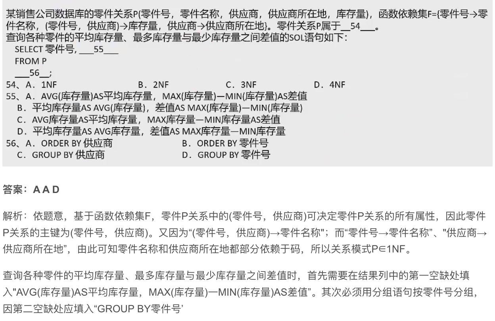

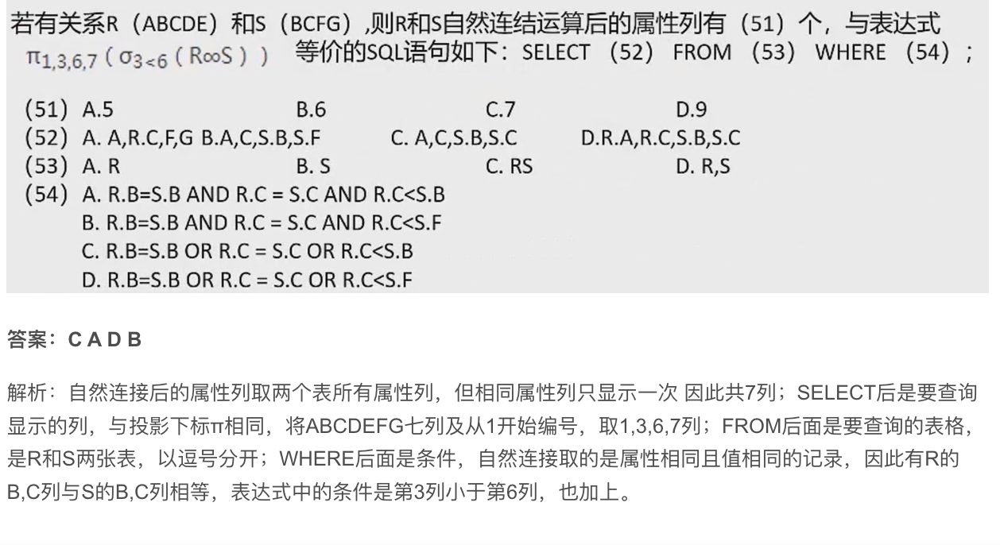