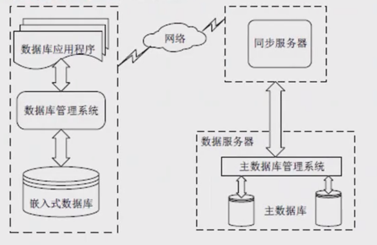

## 嵌入式微处理器体系结构

### 冯·诺依曼结构

传统计算机采用冯·诺依曼（Von Neumann）结构，也称普林斯顿结构，是一种将程序指令存储器和数据存储器合并在一起的存储器结构。

◆ 冯·诺依曼结构的计算机程序和数据共用一个存储空间，程序指令存储地址和数据存储地址指向同一个存储器的不同物理位置。

◆ 采用单一的地址及数据总线，程序指令和数据的宽度相同。

◆ 处理器执行指令时，先从存储器中取出指令解码，再取操作数执行运算，即使单条指令也要耗费几个甚至几十个周期，在高速运算时，在传输通道上会出现瓶颈效应。

### 哈佛结构

哈佛结构是一种并行体系结构，它的主要特点是将程序和数据存储在不同的存储空间中，即程序存储器和数据存储器是两个相互独立的存储器，每个存储器独立编址、独立访问。

◆ 与两个存储器相对应的是系统中的两套独立的地址总线和数据总线。

◆ 这种分离的程序总线和数据总线可允许在一个机器周期内同时获取指令字（来自程序存储器）和操作数（来自数据存储器），从而提高了执行速度，使数据的吞吐率提高了1倍。

## 微处理器分类

### 分类方式一：按字长宽度

- 根据嵌入式微处理器的字长宽度，可分为4位、8位、16位、32位和64位
- 16位及以下称为**嵌入式微控制器**（Embedded Micro Controller）
- 32位及以上称为**嵌入式微处理器**

### 分类方式二：按系统集成度

- **一般用途型微处理器**：内部仅包含单纯的中央处理器单元
- **单芯片微控制器**（Single Chip Microcontroller）：将CPU、ROM、RAM及I/O等部件集成到同一个芯片上

### 分类方式三：按用途分类

#### 嵌入式微控制器（MCU）

- 典型代表是单片机，片上外设资源比较丰富，适合于控制
- 芯片内部集成ROM/EPROM、RAM、总线、总线逻辑、定时/计数器、看门狗、I/O、串行口、脉宽调制输出、A/D、D/A、Flash RAM、EEPROM等各种必要功能和外设
- 最大特点是单片化，体积小，功耗和成本低，可靠性高
- 是嵌入式系统工业的主流

#### 嵌入式微处理器（MPU）

- 由通用计算机中的CPU演变而来，具有32位以上的处理器
- 具有较高的性能，价格相应较高
- 在实际嵌入式应用中，只保留与嵌入式应用紧密相关的功能硬件
- 具有体积小、重量轻、成本低、可靠性高的优点
- 常见的有**ARM**、**MIPS**、**POWER PC**等

#### 嵌入式数字信号处理器（DSP）

- 专门用于信号处理方面的处理器，系统结构和指令算法方面进行了特殊设计，编译效率和指令的执行速度高
- 采用哈佛结构，流水线处理，处理速度比最快的CPU还快10-50倍
- 在数字滤波、FFT、谱分析等各种仪器上获得大规模应用

#### 嵌入式片上系统（SOC）

- 追求产品系统最大包容的集成器件
- 成功实现软硬件无缝结合，直接在处理器片内嵌入操作系统的代码模块
- 是包含完整系统和嵌入软件全部内容的专用目标集成电路

## 多核处理器

### 多核处理器概述

- 多核指多个微处理器内核，是将两个或更多的微处理器封装在一起，集成在一个电路中
- 多核处理器是单枚芯片，能够直接插入单一的处理器插槽中
- 多核与多CPU相比，很好地降低了计算机系统的功耗和体积
- 在多核技术中，由操作系统软件进行调度，多进程、多线程并发都可以

### 内核工作协调实现方式

##### 对称多处理技术（SMP）

- 将两颗完全一样的处理器封装在一个芯片内
- 达到双倍或接近双倍的处理性能
- 节省运算资源

##### 非对称处理技术（AMP）

- 两个处理内核彼此不同
- 各自处理和执行特定的功能
- 在软件的协调下分担不同的计算任务

### 多核CPU的调度算法

#### 全局队列调度

- 操作系统维护一个全局的任务等待队列
- 当系统中有一个CPU空闲时，操作系统就从全局任务等待队列中选取就绪任务开始执行
- **优点**：CPU核心利用率高

#### 局部队列调度

- 操作系统为每个CPU内核维护一个局部的任务等待队列
- 当系统中有一个CPU内核空闲时，就从该核心的任务等待队列中选取适当的任务执行
- **优点**：无需在多个CPU之间切换

## 嵌入式软件

嵌入式软件是指应用在嵌入式计算机系统当中的各种软件，具有通用软件的一般特性，还具有一些与嵌入式系统相关的特点：

- 规模较小
- 开发难度大
- 实时性和可靠性要求高
- 要求固化存储

### 嵌入式软件分类

#### 系统软件

控制和管理嵌入式系统资源，为嵌入式应用提供支持的各种软件，如：

- 设备驱动程序
- 嵌入式操作系统
- 嵌入式中间件等

#### 应用软件

嵌入式系统中的上层软件，定义了嵌入式设备的主要功能和用途，并负责与用户交互，一般面向特定的应用领域，如：

- 飞行控制软件
- 手机软件
- 地图等

#### 支撑软件

辅助软件开发的工具软件，如：

- 系统分析设计工具
- 在线仿真工具
- 交叉编译器等

### 板级支持包（BSP）

板级支持包（BSP）是介于主板硬件和操作系统中驱动层程序之间的一层，一般认为它属于操作系统一部分，主要是实现对操作系统的支持，为上层的驱动程序提供访问硬件设备寄存器的函数包，使之能够更好的运行于硬件主板。

#### BSP具体功能

1. 单板硬件初始化，主要是CPU初始化，为整个软件系统提供底层硬件支持
2. 为操作系统提供设备驱动程序和系统中断服务程序
3. 定制操作系统的功能，为软件系统提供一个实时多任务的运行环境
4. 初始化操作系统，为操作系统正常运行做好准备

#### BSP主要特点

**① 硬件相关性**：因为嵌入式实时系统的硬件环境具有应用相关性，而作为上层软件与硬件平台之间的接口，BSP需为操作系统提供操作和控制具体硬件的方法

**② 操作系统相关性**：不同的操作系统具有各自的软件层次结构，因此不同操作系统具有特定的硬件接口形式

### BSP组成

一般来说，BSP主要包括两个方面的内容：

- 引导加载程序BootLoader
- 设备驱动程序

#### BootLoader

BootLoader是嵌入式系统加电后运行的第一段软件代码，是在操作系统内核运行之前运行的一小段程序，通过这段程序，可以初始化硬件设备、建立内存空间的映射图，从而将系统的软硬件环境设置到一个合适的状态，以便为最终调用操作系统内核做好准备。

**BootLoader功能**

**◆ 片级初始化**

- 主要完成微处理器的初始化
- 包括设置微处理器的核心寄存器和控制寄存器、微处理器的核心工作模式及其局部总线模式等
- 片级初始化把微处理器从上电时的默认状态逐步设置成系统所要求的工作状态
- 这是一个纯硬件的初始化过程

**◆ 板级初始化**

- 通过正确地设置各种寄存器的内容来完成微处理器以外的其他硬件设备的初始化
- 例如，初始化LED显示设备、初始化定时器、设置中断控制寄存器、初始化串口通信、初始化内存控制器、建立内存空间的地址映射等
- 在此过程中，除了要设置各种硬件寄存器以外，还要设置某些软件的数据结构和参数
- 这是一个同时包含有软件和硬件在内的初始化过程

**◆ 加载内核（系统级初始化）**

- 将操作系统和应用程序的映像从Flash存储器复制到系统的内存当中
- 然后跳转到系统内核的第一条指令处继续执行

#### 设备驱动程序

在一个嵌入式系统当中，操作系统是可能也有可能无的。但无论如何，设备驱动程序是必不可少的。设备驱动程序就是一组库函数，用来对硬件进行初始化和管理，并向上层软件提供良好的访问接口。

**设备驱动程序基本功能**

不同的硬件设备，功能不一样，所以它们的设备驱动程序也是不一样的。一般来说，大多数的设备驱动程序都会具备以下的一些基本功能：

- **硬件启动**：在开机上电或系统重启的时候，对硬件进行初始化
- **硬件关闭**：将硬件设置为关机状态
- **硬件停用**：暂停使用这个硬件
- **硬件启用**：重新启用这个硬件
- **读操作**：从硬件中读取数据
- **写操作**：往硬件中写入数据

## 嵌入式系统

一般嵌入式系统由**嵌入式处理器、相关支撑硬件、嵌入式操作系统、支撑软件以及应用软件**组成。

**（1）嵌入式处理器**

由于嵌入式系统一般在恶劣环境条件下工作，嵌入式处理器应可抵抗恶劣环境的影响，比如高温、寒冷、电磁、加速度等环境因素。为适应恶劣环境，嵌入式处理器芯片除满足低功耗、体积小等需求外，根据不同环境需求，其工艺可分为民用、工业和军用等三个档次。

（2）相关支撑硬件

相关支撑硬件是指除嵌入式处理器以外的构成系统的其他硬件，包括存储器、定时器、总线、IO接口以及相关专用硬件。

（3）嵌入式操作系统

嵌入式操作系统是指运行在嵌入式系统中的基础软件，主要用于管理计算机资源和应用软件。与通用操作系统不同，嵌入式操作系统应具备实时性、可剪裁性和安全性等特征。

（4）支撑软件

支撑软件是指为应用软件开发与运行提供公共服务、软件开发、调试能力的软件，支撑软件的公共服务通常运行在操作系统之上，以库的方式被应用软件所引用。

（5）应用软件

应用软件是指为完成嵌入式系统的某一特定目标所开发的软件。

------

### 嵌入式系统特性与架构

#### 嵌入式系统特性

1. **专用性强**：面向特定应用需求，能够把通用CPU中许多由板卡完成的任务集成在芯片内部
2. **技术融合**：将先进的计算机技术、通信技术、半导体技术和电子技术与各个行业的具体应用相结合
3. **软硬一体软件为主**：软件是嵌入式系统的主体，有IP核
4. **比通用计算机资源少**：管理的资源少，成本低，结构更简单
5. **程序代码固化**：软件一般都固化在存储器芯片或单片机本身中
6. **需专门开发工具和环境**：必须有一套开发工具和环境才能进行开发
7. **体积小、价格低、工艺先进**：性能价格比高、系统配置要求低、实时性强
8. **对安全性和可靠性的要求高**

#### 嵌入式系统分类

- **实时性**：嵌入式实时系统（强实时/弱实时）和嵌入式非实时系统
- **安全性**：安全攸关系统和非安全攸关系统

#### 五层架构体系

（1）硬件层

核心是微处理器、存储器（ROM、SDRAM、Flash等）、I/O接口（A/D、D/A、I/O等）和通用设备以及总线、电源、时钟等。

（2）抽象层

在硬件层和软件层之间，主要实现对硬件层的硬件进行抽象，为上层应用提供虚拟的硬件资源。板级支持包（BSP）是一种硬件驱动软件，为上层操作系统提供对硬件进行管理的支持。

（3）操作系统层

主要由嵌入式操作系统、文件系统、图形用户接口、网络系统和通用组件等可配置模块组成。

（4）中间件层

一般位于操作系统之上，管理计算机资源和网络通信，是连接两个独立应用的桥梁。

（5）应用层

指嵌入式系统的具体应用，主要包括不同的应用软件。

------

### 嵌入式数据库系统（EDBMS）与嵌入式操作系统（EOS）

#### 嵌入式数据库系统EDBMS

使用环境特点

1. **设备随时移动性**：嵌入式数据库主要用在移动信息设备上
2. **网络频繁断接**：经常主动或被动地间歇性断接和连接
3. **网络条件多样化**：不同网络系统在带宽、通信代价等方面可能有所差异
4. **通信能力不对称**：下行通信带宽和上行带宽相差很大

系统组成

一个完整的EDBMS由若干子系统组成，包括**主数据库、同步服务器、嵌入式数据库和连接网络**等几个子系统。

嵌入式移动数据库在实际应用中必须解决好**数据的一致性（复制性）、高效的事务处理和数据的安全性**等关键问题。

#### 嵌入式操作系统EOS

主要特点

与通用操作系统相比，EOS主要有以下特点：

1. **微型化**：必须做得小巧，以占用尽量少的系统资源
2. **代码质量高**：要求程序代码的质量要高，代码要尽量精简
3. **专业化**：要有很好适应性和移植性，支持多种开发平台
4. **实时性强**：广泛应用于过程控制、数据采集等要求实时响应的场合
5. **可裁减和可配置**：能够根据应用的特点和具体要求进行灵活配置和合理裁减

## 嵌入式实时操作系统

特征

**① 高精度计时系统**

- 计时精度是影响实时性的一个重要因素
- 在实时应用系统中，经常需要精确确定实时地操作某个设备或执行某个任务，或精确的计算一个时间函数
- 不仅依赖于硬件提供的时钟精度，也依赖于实时操作系统实现的高精度计时功能

**② 多级中断机制**

- 实时应用系统通常需要处理多种外部信息或事件，处理的紧迫程度有轻重缓急之分
- 需要建立多级中断嵌套处理机制，确保对紧迫程度较高的实时事件进行及时响应和处理

**③ 实时调度机制**

- 实时操作系统不仅要及时响应实时事件中断，同时也要及时调度运行实时任务
- 实时调度机制包括两个方面：
  - 在调度策略和算法上保证优先调度实时任务
  - 建立更多"安全切换"时间点，保证及时调度实时任务

## 嵌入式软件设计

**交叉平台开发环境**

一个典型的交叉平台开发环境包含三个高度集成的部分：

1. **运行在宿主机和目标机上的交叉开发工具和实用程序**
2. **运行在目标机上的高性能、可裁剪的实时操作系统**
3. **连接宿主机和目标机的多种通信方式**：以太网、USB、串口等

**交叉编译**

- 在一个平台上生成可以在另一个平台上执行的代码
- 将程序转化成运行该程序的CPU所能识别的机器代码
- 嵌入式系统开发需要借助宿主机（通用计算机）来编译出目标机的可执行代码

**交叉调试**

- 调试器运行在宿主机的通用操作系统上，被调试进程运行在目标机的嵌入式操作系统中
- 调试器和被调试进程通过串口或网络进行通信
- 调试器可以控制、访问被调试进程，读取当前状态，改变运行状态

------

## 软件开发工具

#### 嵌入式软件开发阶段

1. 编码
2. 交叉编译
3. 交叉调试

#### 开发工具分类

##### 编辑器

- 用于编写嵌入式源代码程序
- 集成开发环境：VS系列、eclipse、keil、CSS等
- 独立编辑器：UE、Source Insight、vim等

##### 编译器gcc

- 使用交叉编译工具处理源代码，生成可执行目标文件
- GNU C/C++（gcc）是常用交叉编译器，支持多种宿主机/目标机组合

##### 调试器gdb

- 调试器运行在宿主机上，被调试程序运行在目标机上
- 通信方式：串口、并口、网络、JTAG等
- gdb是GNU开源组织发布的强大程序调试工具

## 考试真题

### 第一题

**题目**：嵌入式处理器是嵌入式系统的核心部件，一般可分为嵌入式微处理器(MPU)、微控制器(MCU)、数字信号处理器(DSP)和片上系统(SOC)。以下叙述中，错误的是（ ）。

A. MPU在安全性和可靠性等方面进行增强，适用于运算量较大的智能系统

B. MCU典型代表是单片机，体积小从而使功耗和成本下降

C. DSP处理器对系统结构和指令进行了特殊设计，适合数字信号处理

D. SOC是一个有专用目标的集成电路，其中包括完整系统并有嵌入式软件的全部内容

**答案**：A

**解析**：DSP适用于运算量较大的智能系统。

### 第二题

**题目**：以下关于多核处理器的说法中，不正确的是（ ）。

A. 采用多核处理器可以降低计算机系统的功耗和体积

B. SMP、BMP和AMP是多核处理器系统通常采用的三种结构，采用哪种结构与应用场景相关，而无须考虑硬件的组成差异

C. 在多核处理器中，计算机可以同时执行多个进程，而操作系统中的多个线程也可以并行执行

D. 多核处理器是将两个或更多的独立处理器封装在一起，集成在一个电路中

**答案**：B

### 第一题

**题目**：以下关于RTOS（实时操作系统）的叙述中，不正确的是（ ）

A. RTOS不能针对硬件变化进行结构与功能上的配置及裁剪

B. RTOS可以根据应用环境的要求对内核进行裁剪和重配

C. RTOS的首要任务是调度一切可利用的资源来完成实时控制任务

D. RTOS实质上就是一个计算机资源管理程序，需要及时响应实时事件和中断

**答案**：A

### 第二题

**题目**：以下描述中，（ ）不是嵌入式操作系统的特点

A. 面向应用，可以进行裁剪和移植

B. 用于特定领域，不需要支持多任务

C. 可靠性高，无需人工干预独立运行，并处理各类事件和故障

D. 要求编码体积小，能够在嵌入式系统的有效存储空间内运行

**答案**：B

### 第三题

**题目**：以下关于嵌入式系统开发的叙述，正确的是（ ）

A. 宿主机与目标机之间只需要建立逻辑连接

B. 宿主机与目标机之间只能采用串口通信方式

C. 在宿主机上必须采用交叉编译器来生成目标机的可执行代码

D. 调试器与被调试程序必须安装在同一台机器上

**答案**：C

**解析**：

- A错误：宿主机与目标机之间需要建立物理连接（串口、USB等）
- B错误：通信方式多样，除串口外还可使用USB、以太网等
- C正确：需要在宿主机上使用交叉编译器编译目标机可执行代码
- D错误：调试器运行在宿主机，被调试程序运行在目标机