## **网络功能和分类**

计算机网络是计算机技术与通信技术相结合的产物，实现了远程通信、远程信息处理和资源共享。

**计算机网络功能**

- 数据通信
- 资源共享
- 管理集中化
- 实现分布式处理
- 负载均衡

**网络性能指标**

- 速率
- 带宽（频带宽度或传送线路速率）
- 吞吐量
- 时延
- 往返时间
- 利用率

**网络非性能指标**

- 费用
- 质量
- 标准化
- 可靠性
- 可扩展性
- 可升级性
- 易管理和可维护性

### 计算机网络分类

按分布范围划分

| 网络分类       | 缩写 | 分布距离  | 计算机分布范围 | 传输速率范围   |
| -------------- | ---- | --------- | -------------- | -------------- |
| **局域网** LAN | LAN  | 10m左右   | 房间           | 4Mbps~1Gbps    |
|                |      | 100m左右  | 楼寓           |                |
|                |      | 1000m左右 | 校园           |                |
| **城域网** MAN | MAN  | 10km      | 城市           | 50Kbps~100Mbps |
| **广域网** WAN | WAN  | 100km以上 | 国家或全球     | 9.6Kbps~45Mbps |

按拓扑结构划分

- **总线型**：利用率低、干扰大、价格低
- **星型**：交换机形成的局域网、中央单元负荷大
- **环型**：流动方向固定、效率低扩充难
- **树型**：总线型的扩充、分级结构
- **分布式**：任意节点连接、管理难成本高

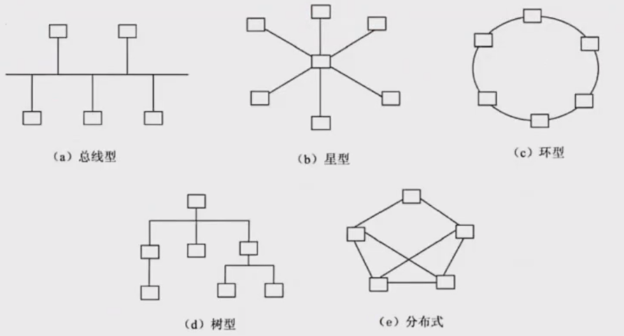

### 通信技术

计算机网络是利用通信技术将数据从一个结点传送到另一结点的过程。通信技术是计算机网络的基础。

**信道分类**

- **物理信道**：由传输介质和设备组成，根据传输介质的不同，分为无线信道和有线信道
- **逻辑信道**：在数据发送端和接收端之间存在的一条虚拟线路，可以是有连接的或无连接的。逻辑信道以物理信道为载体

**信号处理技术**

发信机信号处理

- 信源编码
- 信道编码
- 交织
- 脉冲成形
- 调制

收信机信号处理

- 解调
- 采样判决
- 去交织
- 信道译码
- 信源译码

#### 复用与多址技术

**复用技术**

在一条信道上同时传输多路数据的技术：

- TDM 时分复用
- FDM 频分复用
- CDM 码分复用

**多址技术**

在一条线上同时传输多个用户数据的技术，在接收端把多个用户的数据分离：

- TDMA 时分多址
- FDMA 频分多址
- CDMA 码分多址

#### 5G通信技术特征

作为新一代的移动通信技术，5G特征体现在以下方面：

1. 基于OFDM优化的波形和多址接入
2. 实现可扩展的OFDM间隔参数配置
3. OFDM加窗提高多路传输效率
4. 灵活框架设计
5. 大规模MIMO：最多256根天线
6. 毫米波：频率大于24GHz以上的频段
7. 频谱共享
8. 先进的信道编码设计

**5G网络主要特征**

- 服务化架构
- 网络切片


## OSI七层模型

OSI七层模型为网络通信提供了一个清晰的层次结构，使得不同厂商的网络设备和软件能够相互兼容和通信。通过将复杂的网络通信过程分解为多个层次，每个层次专注于特定的功能，降低了系统的复杂度，提供了系统的可扩展性和可维护性。

| 层                | 功能                                                         | 单位   | 协议                                               | 设备           |
| ----------------- | ------------------------------------------------------------ | ------ | -------------------------------------------------- | -------------- |
| **1. 物理层**     | 在链路上透明地传输位。需要完成的工作包括线路配置、确定数据传输模式、确定信号形式、对信号进行编码、连接传输介质。为此定义了建立、维护和拆除物理链路所具备的机械特性、电气特性、功能特性以及规程特性。 | 比特   | EIA/TIA RS-232、RS-449、V.35、RJ-45、FDDI          | 中继器、集线器 |
| **2. 数据链路层** | 把不可靠的信道变为可靠的信道。为此将比特组成帧，在链路上提供点到点的帧传输，并进行差错控制、流量控制等。 | 帧     | SDLC、HDLC、LAPB、PPP、STP、帧中继等、IEEE802、ATM | 交换器、网桥   |
| **3. 网络层**     | 在源节点-目的节点之间进行路由选择、拥塞控制、顺序控制、传送包，保证报文的正确性。网络层控制着通信子网的运行，因而它又称为通信子网层。 | IP分组 | IP、ICMP、IGMP、ARP、RARP                          | 路由器         |
| **4. 传输层**     | 提供端-端间可靠的、透明的数据传输，保证报文顺序的正确性、数据的完整性。 | 报文段 | TCP、UDP                                           | 网关           |
| **5. 会话层**     | 建立通信进程的逻辑名字与物理名字之间的联系，提供进程之间建立、管理和终止会话的方法，处理同步与恢复问题。 |        | RPC、SQL、NFS                                      | 网关           |
| **6. 表示层**     | 实现数据转换（包括格式转换、压缩、加密等），提供标准的应用接口、公用的通信服务、公共数据表示方法。 |        | JPEG、ASCII、GIF、MPEG、DES                        | 网关           |
| **7. 应用层**     | 对用户不透明的提供各种服务，如E-mail。                       | 数据   | Telnet、FTP、HTTP、SMTP、POP3、DNS、DHCP等         | 网关           |


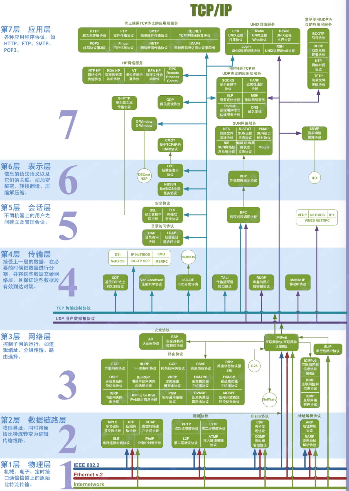

### 局域网和广域网协议

以太网是一种计算机局域网组网技术，是目前应用最广泛的局域网技术。

IEEE 802.3协议标准

| 标准类型                   | 速率     | 传输介质     |
| -------------------------- | -------- | ------------ |
| **IEEE 802.3标准以太网**   | 10Mb/s   | 细同轴电缆   |
| **IEEE 802.3u快速以太网**  | 100Mb/s  | 双绞线       |
| **IEEE 802.3z千兆以太网**  | 1000Mb/s | 光纤或双绞线 |
| **IEEE 802.3ae万兆以太网** | 10Gb/s   | 光纤         |

**以太帧格式：**

```
DMAC | SMAC | Length/Type | DATA/PAD | FCS
```

**各字段说明：**

- **DMAC**：目的MAC地址（6字节）
- **SMAC**：源MAC地址（6字节）
- **Length/Type**：长度/类型字段（2字节）
- **DATA/PAD**：数据/填充字段（46-1500字节）
- **FCS**：帧校验序列（4字节）

**技术参数：**

- 最小帧长：64字节
- 最大帧长：1518字节

#### 无线局域网（WLAN）

技术标准

- **IEEE 802.11**：无线局域网标准

拓扑结构

WLAN主要采用三种拓扑结构形式：

1. **点对点型**
2. **HUB型**
3. **全分布型**

#### 广域网技术

1. **同步光网络（SONET）**
   - 利用光纤进行数字化信息通信
2. **数字数据网（DDN）**
   - 利用数字信道提供半永久性连接电路以传输数据
3. **帧中继（FR）**
   - 数据包交换技术
4. **异步传输技术（ATM）**
   - 以信元为基础的面向连接的一种分组交换和复用技术

## CP/IP协议

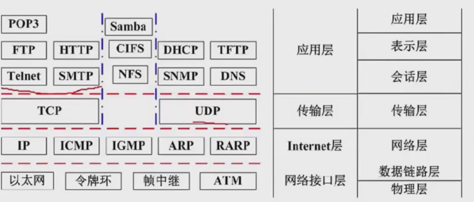

网络协议三要素

- **语法**：规定传输数据的格式
- **语义**：规定所要完成的功能
- **时序**：规定执行各种操作的条件、顺序关系等

### 网络层协议

**IP**

- 网络层最重要的核心协议
- 在源地址和目的地址之间传送数据报
- 无连接、不可靠

**ICMP**

- 因特网控制报文协议
- 用于在IP主机、路由器之间传递控制消息
- 控制网络通不通、主机是否可达、路由是否可用等网络本身的消息

**ARP和RARP**

- 地址解析协议
- ARP将IP地址转换为物理地址
- RARP将物理地址转换为IP地址

**IGMP**

- 网络组管理协议
- 允许因特网中的计算机参加多播
- 计算机向相邻多目路由器报告多目组成员，支持组播

### 传输层协议

**TCP**

- TCP/IP协议族中最重要的协议之一
- 在IP协议不可靠数据基础上采用重发技术
- 提供可靠的、面向连接的、全双工的数据传输服务
- 适用于传输数据量少、可靠性要求高的场合

**UDP**

- 不可靠、无连接的协议
- 有助于提高传输速率
- 适用于传输数据量大、可靠性要求不高但要求速度快的场合

------

### 应用层协议

**FTP**

- 可靠的文件传输协议
- 用于因特网上控制文件的双向传输

**HTTP**

- 超文本传输协议
- 用于从WWW服务器传输超文本到本地浏览器
- SSL加密后为HTTPS

**SMTP和POP3**

- 简单邮件传输协议
- 用于源地址到目的地址传送邮件
- 邮件报文采用ASCII格式

**Telnet**

- 远程连接协议
- 因特网远程登录服务的标准协议

**TFTP**

- 不可靠的、开销不大的小文件传输协议

**SNMP**

- 简单网络管理协议
- 包含应用层协议、数据库模型和一组资源对象
- 支持网络管理系统监测网络设备

**DHCP**

- 动态主机配置协议
- 基于UDP，C/S模型
- 为主机动态分配IP地址（固定分配、动态分配、自动分配）

**DNS**

- 域名解析协议
- 通过域名解析出IP地址

协议端口号对照表

| 端口 | 服务                 | 端口 | 服务                         |
| ---- | -------------------- | ---- | ---------------------------- |
| 20   | 文件传输协议（数据） | 80   | 超文本传输协议（HTTP）       |
| 21   | 文件传输协议（控制） | 110  | POP3服务器（邮箱接收服务器） |
| 23   | Telnet终端仿真协议   | 69   | 简单文件传输协议（TFTP）     |
| 67   | DHCP（服务端）       | 68   | DHCP（客户端）               |
| 25   | SMTP简单邮件发送协议 | 161  | SNMP（轮询）                 |
| 53   | 域名服务器（DNS）    | 162  | SNMP（陷阱）                 |

------

## 交换技术

数据在网络中转发通常离不开交换机，人们日常使用的计算机通常就是通过交换机接入网络的。

交换机功能

- **集线功能**：提供大量端口部署星状拓扑网络
- **中继功能**：转发帧时重新产生不失真电信号
- **桥接功能**：在端口上使用相同转发和过滤逻辑
- **隔离冲突域**：将局域网分为多个冲突域，提高带宽利用率

交换机工作流程

1. **转发路径学习**：根据源MAC地址建立端口映射，写入MAC地址表
2. **数据转发**：查询目的MAC地址并向对应端口转发
3. **数据泛洪**：目的MAC地址不在表中时向所有端口转发
4. **链路地址更新**：MAC地址表定期更新（如300s）

------

## 路由技术

**路由器功能**

1. 异种网络互连（异种子网协议网络互连）
2. 子网协议转换（局域网和广域网间协议转换）
3. 数据路由（依据路由规则转发数据）
4. 速率适配（利用缓存和流控协议）
5. 隔离网络（防止广播风暴，实现防火墙）
6. 报文分片和重组（超过MTU报文分片，目的地重组）
7. 备份、流量控制（主备线路切换和复杂流量控制）

**路由器工作特性**

- 工作在OSI网络层（第3层）
- 根据数据包目的地址决定下一跳地址
- 通过路由表实现数据转发
- 路由表可静态配置或通过动态路由协议生成

**路由协议分类**

- 内部网关协议（IGP）
- 外部网关协议（EGP）

**网络建设工程环节**

- 网络规划
- 网络设计
- 网络实施

## 传输介质

### 网线

双绞线

- 将多根铜线按规则缠绕在一起，能够减少干扰
- 分为无屏蔽双绞线UTP和屏蔽双绞线STP，都是由一对铜线簇组成，即常说的网线
- 双绞线的传输距离在100m以内

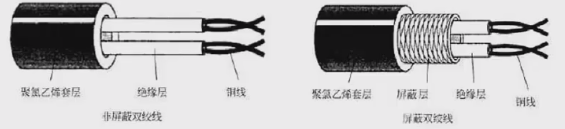

**无屏蔽双绞线UTP**

- 价格低，安装简单，但可靠性相对较低
- 分类：
  - CAT3（3类UTP）：速率10Mbps
  - CAT4（4类UTP）：与3类差不多，无应用
  - CAT5（5类UTP）：速率100Mbps，用于快速以太网
  - CAT5E（超5类UTP）：速率1000Mbps
  - CAT6（6类UTP）：用来替代CAT5E，速率1000Mbps

**屏蔽双绞线STP**

- 比UTP增加了一层屏蔽层，可有效提高可靠性
- 价格高，安装麻烦
- 一般用于对传输可靠性要求很高的场合

**网线安装标准**

- 网线有两种安装标准：T568A和T568B
- 都是八根不同颜色的网线，按照不同的顺序排序，插入水晶头中
- 主要区别在第1、2、3、6四根网线的位置不同

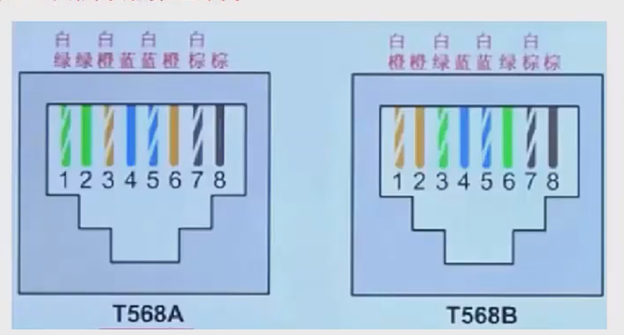

### 光纤

- 由纤芯和包层组成，传输的光信号在纤芯中传输
- 从PC端出来的电信号必须转换为光信号才能通过光纤传输

**多模光纤MMF**

- 纤芯半径较大，可同时传输多种不同的信号
- 光信号在光纤中以全反射的形式传输
- 采用发光二极管LED为光源，成本低
- 传输效率和可靠性较低，适合于短距离传输
- 传输距离与传输速率相关：
  - 速率100Mbps时：2KM
  - 速率1000Mbps时：550m

**单模光纤SMF**

- 纤芯半径很小，一般只能传输一种信号
- 采用激光二极管LD作为光源，只支持激光信号的传播
- 以全反射形式传播，反射角很大，看起来像一条直线
- 成本高，但传输距离远，可靠性高
- 传输距离可达5KM

### 无线信道

分为无线电波和红外光波

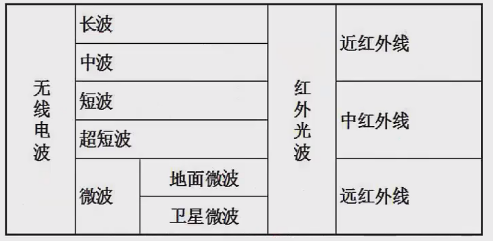

## 通信方式和交换方式

### 通信方向

数据通信是指发送方发送数据到接收方，这个传输过程可以分类如下：

单工

- 只能由设备A发给设备B，即数据流只能单向流动

半双工

- 设备A和设备B可以互相通信，但是同一时刻数据流只能单向流动

全双工

- 设备A和设备B在任意时刻都能互相通信

### 同步方式

#### 异步传输

- 发送方每发送一个字符，需要约定一个起始位和停止位插入到字符的起始和结尾处
- 这样当接收方接收到该字符时能够识别
- 会造成资源浪费，传输效率降低

#### 同步传输

- 以数据块为单位进行传输
- 发送方要发送数据时，先发送一个同步帧，接收方收到后做好接收准备
- 开始接收数据块，结束后又会有结束帧确认
- 一次传输一个数据块，效率高

#### 串行传输

- 只有一根数据线，数据只能1bit挨个排队传送
- 适合低速设备、远距离的传送
- 一般用于广域网中

#### 并行传输

- 有多根数据线，可以同时传输多个bit数据
- 适合高速设备的传送
- 常用于计算机内部各硬件模块之间

### 交换方式

1. 电路交换

- 通信一方进行呼叫，另一方接收后，在二者之间会建立一个专用电路
- 特点：面向连接、实时性高、链路利用率低
- 一般用于语音视频通信

2. 报文交换

- 以报文为单位，存储转发模式
- 接收到数据后先存储，进行差错校验，没有错误则转发，有错误则丢弃
- 因此会有延时，但可靠性高
- 是面向无连接的

3. 分组交换

- 以分组为单位，也是存储转发模式
- 因为分组的长度比报文小，所以时延小于报文交换
- 可分为三种方式：

数据报

- 是现在主流的交换方式
- 各个分组携带地址信息，自由的选择不同的路由路径传送到接收方
- 接收方接收到分组后再根据地址信息重新组装成原数据
- 是面向无连接的，但是不可靠的

虚电路

- 发送方发送一个分组，接收方收到后二者之间就建立了一个虚拟的通信线路
- 二者之间的分组数据交互都通过这条线路传送
- 在空闲的时候这条线路也可以传输其他数据
- 是面向连接的，可靠的

信元交换

- 异步传输模式ATM采用的交换方式
- 本质是按照虚电路方式进行转发
- 信元是固定长度的分组，共53B，其中5B为头部，48B为数据域
- 也是面向连接的，可靠的

## IP地址

### IP地址表示

机器中存放的IP地址是32位的二进制代码，每隔8位插入一个空格，可提高可读性。为了便于理解和设置，一般会采用点分十进制方法来表示：将32位二进制代码每8位二进制转换成十进制，就变成了4个十进制数，而后在每个十进制数间隔中插入"."。

**示例**：128.11.3.31

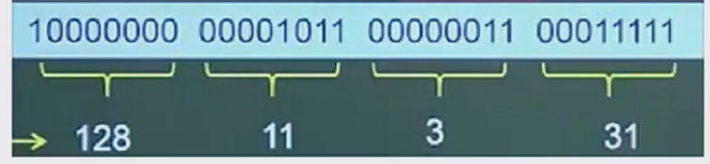

**特点**：

- 每个十进制数由8个二进制数转换而来
- 每个十进制数的取值范围为0-255
- 需掌握二进制转十进制的快速计算方法

### 分类IP地址

IP地址分四段，每段八位，共32位二进制数组成。在逻辑上分为网络号和主机号，依据网络号位数的不同分类如下：

| 类别    | 点分十进制范围              | 二进制范围                                                   | 说明               |
| ------- | --------------------------- | ------------------------------------------------------------ | ------------------ |
| **A类** | 0.0.0.0 - 127.255.255.255   | 00000000.00000000.00000000.00000000 - 01111111.11111111.11111111.11111111 | 第一个字节为网络号 |
| **B类** | 128.0.0.0 - 191.255.255.255 | 10000000.00000000.00000000.00000000 - 10111111.11111111.11111111.11111111 | 前两个字节为网络号 |
| **C类** | 192.0.0.0 - 223.255.255.255 | 11000000.00000000.00000000.00000000 - 11011111.11111111.11111111.11111111 | 前三个字节为网络号 |
| **D类** | 224.0.0.0 - 239.255.255.255 | 11100000.00000000.00000000.00000000 - 11101111.11111111.11111111.11111111 | 组播地址           |
| **E类** | 240.0.0.0 - 255.255.255.255 | 11110000.00000000.00000000.00000000 - 11111111.11111111.11111111.11111111 | 保留地址           |

### 无分类编址

不按照ABC类规则，自动规定网络号，格式为：**IP地址/网络号**

**示例**：128.168.0.11/20

- IP地址：128.168.0.11
- 网络号占20位
- 主机号占12位（32-20=12）
- 支持子网划分

### 特殊IP地址

#### 公有地址与私有地址

| 类型         | 说明                                                   | 范围   |
| ------------ | ------------------------------------------------------ | ------ |
| **公有地址** | 全网唯一的IP地址，可直接访问因特网                     | -      |
| **私有地址** | 非注册地址，专门为组织机构内部使用，不能直接访问因特网 | 见下表 |

#### 私有地址范围

| 类别 | IP地址范围                    | 网络数       |
| ---- | ----------------------------- | ------------ |
| A类  | 10.0.0.0 - 10.255.255.255     | 1个A类网络   |
| B类  | 172.16.0.0 - 172.31.255.255   | 16个B类网络  |
| C类  | 192.168.0.0 - 192.168.255.255 | 256个C类网络 |

#### 特殊用途地址

| 网络号  | 主机号     | 源地址使用 | 目的地址使用 | 含义                          |
| ------- | ---------- | ---------- | ------------ | ----------------------------- |
| 0       | 0          | 可以       | 不可         | 在本网络上的本主机            |
| 全1     | 全1        | 不可       | 可以         | 在本网络上进行广播            |
| Net-ID  | 全1        | 不可以     | 可以         | 对net-ID上的所有主机进行广播  |
| 127     | 非全0或全1 | 可以       | 可以         | 本地软件环回测试              |
| 169.254 | 非全0或全1 | 可以       | 可以         | Windows主机DHCP服务器故障分配 |

## 子网划分


### 子网划分的原因

- 一般公司在申请网络时，会直接获得一个范围很大的网络，如一个B类地址
- 因为主机数之间相差太大，不利于分配
- 采用子网划分的方法来划分网络，即自定义网络号位数，就能自定义主机号位数
- 可以根据主机个数来划分出最适合的方案，不会造成资源的浪费

### 子网的概念

- 一般的IP地址按标准划分为ABC类后，可以进行再一步的划分
- 将主机号拿出几位作为子网号，就可以划分出多个子网
- 此时IP地址组成为：**网络号 + 子网号 + 主机号**

### 子网掩码特征

- 网络号和子网号都为1，主机号都为0
- 这样的地址为子网掩码

### 取值注意事项

- **子网号**：可以为全0和全1
- **主机号**：不能为全0或全1
- **因此**：主机数需要-2，而子网数不用

### 超网（Supernetting）

- 可以聚合网络为超网，就是划分子网的逆过程
- 将网络号取出几位作为主机号
- 此时，这个网络内的主机数量就变多了，成为一个更大的网络

## IPv6

- 地址长度为128位，地址空间增大了2^96倍
- 灵活的IP报文头部格式，使用固定格式的扩展头部取代可变长度选项字段
- 简化报文头部格式，加快报文转发，提高吞吐量
- 提高安全性，支持身份认证和隐私权
- 支持更多服务类型
- 允许协议继续演变，适应未来技术发展

### IPv4向IPv6过渡技术

**（1）双协议栈**

- 主机同时运行IPv4和IPv6两套协议栈
- IPv6的低32位可直接转换为IPv4地址，实现互相通信

**（2）隧道技术**

- 在IPv4网络之上建立传输IPv6数据报的隧道
- 将IPv6数据报封装在IPv4数据报中传输

**（3）翻译技术**

- 利用专门翻译设备在纯IPv4和纯IPv6网络之间转换IP报头地址
- 对分组做相应语义翻译，实现透明通信

## 网络规划和设计

三层模型将网络划分为核心层、汇聚层和接入层，每一层都有着特定的作用。

- **核心层**：提供不同区域之间的最佳路由和高速数据传送
- **汇聚层**：将网络业务连接到接入层，并且实施与安全、流量、负载和路由相关的策略
- **接入层**：为用户提供了在本地网段访问应用系统的能力，还要解决相邻用户之间的互访需要，接入层要负责一些用户信息（例如用户IP地址、MAC地址和访问日志等）的收集工作和用户管理功能（包括认证和计费等）

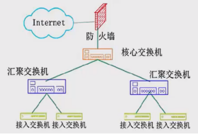

### 建筑物综合布线系统PDS

建筑物综合布线系统PDS包含以上六个子系统，共同构成完整的结构化布线体系。

1. **工作区子系统**：实现工作区终端设备到水平子系统的信息插座之间的互联
2. **水平布线子系统**：实现信息插座和管理子系统之间的连接
3. **设备间子系统**：实现中央主配线架与各种不同设备之间的连接
4. **垂直干线子系统**：实现各楼层设备间子系统之间的互连
5. **管理子系统**：连接各楼层水平布线子系统和垂直干线子系统，负责连接控制其他子系统为连接其他子系统提供连接手段
6. **建筑群子系统**：各个建筑物通信系统之间的互联

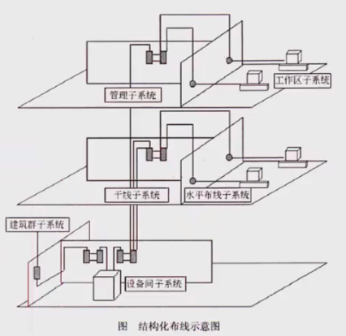


## 网络存储技术

### 磁盘冗余阵列（RAID）

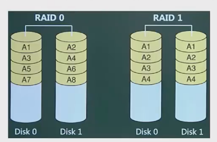

**RAID0**

- 将数据分散存储在不同磁盘中，磁盘利用率100%
- 访问速度最快，但没有冗余和错误修复功能

**RAID1**

- 在成对独立磁盘上产生互为备份的数据
- 增加存储可靠性，可以纠错，但磁盘利用率只有50%

**RAID2**

- 将数据条块化的分布于不同硬盘上，并使用海明码校验

**RAID3**

- 使用奇偶校验，并用单块磁盘存储奇偶校验信息（可靠性低于RAID5）

**RAID5**

- 在所有磁盘上交叉存储数据及奇偶校验信息
- 校验信息存储总量为一个磁盘容量，但是分布式存储在不同磁盘上
- 读/写指针可同时操作


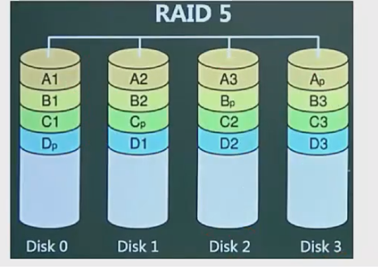

**RAID0+1 vs RAID1+0**

- RAID0+1：两个RAID0，若一个磁盘损坏，则当前RAID0无法工作
- RAID1+0：两个RAID1，不允许同一组中的两个磁盘同时损坏
- 磁盘利用率都为50%，但安全性更高

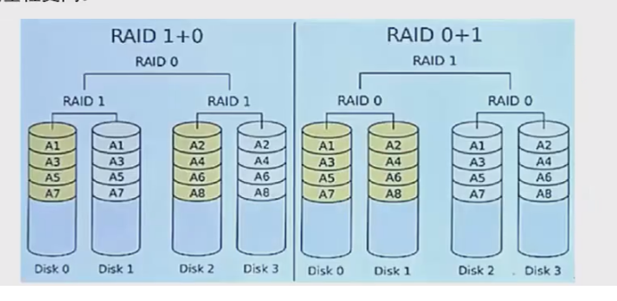


### 网络存储架构

**直接附加存储（DAS）**

- 存储设备通过SCSI接口直接连接到服务器
- 问题：传输距离、连接数量、传输速率受限；服务器异常会波及存储器

**网络附加存储（NAS）**

- 通过网络接口与网络直接相连，有独立存储系统
- 类似于专用文件服务器，仅提供文件系统功能
- 性能特点：小文件级共享存取；支持即插即用

**存储区域网（SAN）**

- 通过专用交换机将磁盘阵列与服务器连接的高速专用子网
- 采用块级别存储，将存储设备从以太网中分离
- 技术分类：FC SAN（光纤通道）、IP SAN（IP网络）、IB SAN（无线带宽）

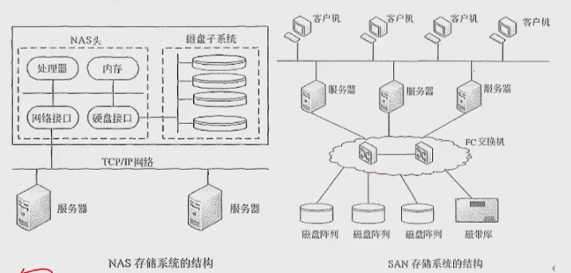

## 其他网络考点


### 网络地址翻译（NAT）

- 将公司内部大量IP地址映射到少量公网IP地址的过程
- 减少公网IP地址的使用量

### 默认网关

- 主机找不到可用网关时，将数据包发给默认指定网关
- 默认网关IP地址必须与本机IP地址在同一网段

### 虚拟局域网（VLAN）

- 一组逻辑上的设备和用户，不受物理位置限制
- 工作在OSI第2层和第3层，一个VLAN就是一个广播域
- 优点：减少管理开销；控制广播活动；提高网络安全性

### 冲突域和广播域

- **路由器**：可阻断广播域和冲突域
- **交换机**：只能阻断冲突域
- **集线器**：整体作为一个冲突域和广播域

------

## 考试真题


### 第一题

**题目**：在OSI参考模型中能实现路由选择、拥塞控制与互连功能的层是（ ）

A. 传输层

B. 应用层

C. 网络层

D. 物理层

**答案**：C

### 第二题

**题目**：在TCP/IP体系结构中，将IP地址转化为MAC地址的协议是（ ）

A. RARP

B. ARP

C. ICMP

D. TCP

**答案**：B

**解析**：网络层协议ARP，地址转换协议，将网络层的IP地址转换为物理MAC地址。

### 第三题

**题目**：下列网络互连设备中，属于物理层的是（ ）

A. 交换机

B. 中继器

C. 路由器

D. 网桥

**答案**：B

---


#### 题目一

**题目**：以下关于光纤的说法中，错误的是（ ）

A. 单模光纤的纤芯直径更细

B. 单模光纤采用LED作为光源

C. 多模光纤比单模光纤的传输距离近

D. 多模光纤中光波在光导纤维中以多种模式传播

**答案**：B

**解析**：单模光纤采用激光二极管LD作为光源，多模光纤采用发光二极管LED为光源，成本低适合于短距离传输。

#### 题目二

**题目**：数据通信模型按照数据信息在传输链路上的传送方向，可以分为三类。下列选项中，（ ）不属于这三类传输方式。

A. 单工通信：信号只能向一个方向传送

B. 半双工通信：信息的传递可以是双向的

C. 全双工通信：通信的双方可以同时发送和接收信息

D. 全单工通信：信号同时向两个方向传输

**答案**：D

---


## 题目一

**题目**：把网络117.15.32.0/23划分为117.15.32.0/27，得到的子网是（ ）个，每个子网中可使用的主机地址是（ ）个

A. 4 B. 8 C. 16 D. 32

A. 30 B. 31 C. 32 D. 34

**答案**：C A

**解析**：网络号从23变为27，说明拿出了4位作为子网号，可划分出2^4=16个子网。此时主机号是32-27=5位，2^5-2=30个主机地址（主机地址不能为全0和全1）。

## 题目二

**题目**：分配给某公司网络的地址块是220.17.192.0/20，该网络被划分为\__个C类子网，不属于该公司网络的子网地址是___。

A. 4 B. 8 C. 16 D. 32

A. 220.17.203.0 B. 220.17.205.0 C. 220.17.207.0 D. 220.17.213.0

**答案**：C D

**解析**：C类子网的默认子网掩码为24位（即/24），而题目中给定的地址块为/20，两者相差4位（24-20=4）。子网数量计算公式为2^n（n为子网号位数），因此2^4=16个子网。

该地址块的主机范围是220.17.192.0~220.17.207.255（第三个字节的二进制范围为11000000~11001111，即十进制192~207）。220.17.213.0→213（超出192~207范围）。

总结

- 子网划分的核心是通过子网掩码调整网络位与主机位的分配，C类子网的划分需结合掩码差值计算子网数量。
- IP地址范围需通过二进制转换确定，重点关注第三个字节的数值是否在有效区间内。

## 第一题

**题目**：以下关于层次化局域网模型中核心层的叙述，正确的是（ ）

A. 为了保障安全性，对分组要进行有效性检查

B. 将分组从一个区域高速地转发到另一个区域

C. 由多台二、三层交换机组成

D. 提供多条路径来缓解通信瓶颈

**答案**：B

**解析**：核心层提供不同区域之间的最佳路由和高速数据传送

## 第二题

**题目**：结构化布线系统分为六个子系统，其中水平子系统（ ）

A. 由各种交叉连接设备以及集线器和交换机等设备组成

B. 连接了干线子系统和工作区子系统

C. 由终端设备到信息插座的整个区域组成

D. 实现各楼层设备间子系统之间的互连

**答案**：B

**解析**：水平子系统连接垂直干线子系统与工作区子系统

## 第三题

**题目**：一个虚拟局域网是一个（ ）

A. 广播域

B. 冲突域

C. 组播域

D. 物理上隔离的区域

**答案**：A

**解析**：局域网是二层网络，无法隔离广播域，因此局域网整体是一个广播域

## 第四题

**题目**：以下关于URL的说法中，错误的是____

A. 使用[www.abc.com](www.abc.com)和abc.com打开的是同一个页面

B. 在地址栏中输入[www.abc.com](www.abc.com)默认使用http协议

C. [www.abc.com](www.abc.com)中的"www"是主机名

D. [www.abc.com](www.abc.com)中的"abc.com"是域名

**答案**：A

**解析**：abc.com解析出的IP地址不一定与[www.abc.com](www.abc.com)相同，可能不是同一个页面