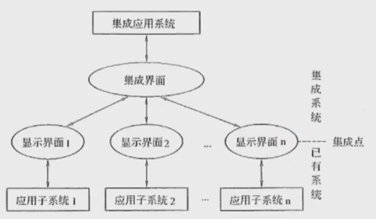
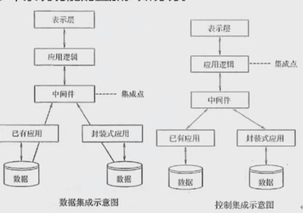
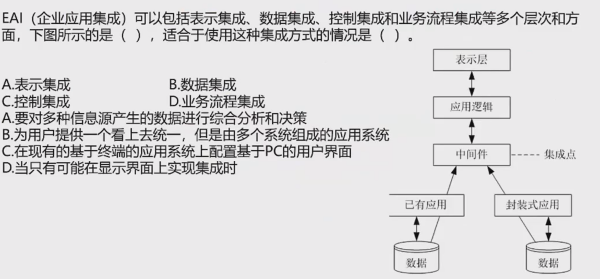

# 信息系统概述

- 信息系统是由计算机硬件、网络和通信设备、计算机软件、信息资源、信息用户和规章制度组成的以处理信息流为目的的人机一体化系统。
- 信息系统的5个基本功能：输入、存储、处理、输出、控制

信息系统的性质影响着系统开发者和系统用户的知识需求：

- "以计算机为基础"要求系统设计者必须具备计算机及其在信息处理中的应用知识
-  "人机交互"要求系统设计者还需要了解人作为系统组成部分的能力以及人作为信息使用者的各种行为

诺兰模型（信息系统进化的阶段模型，将计算机信息系统的发展道路划分为6个阶段）：

1. **初始阶段**：计算机刚进入企业时只作为办公设备使用，应用非常少。一般仅用于财务部门。
2.  **传播阶段**：企业对计算机有了一定了解，想利用计算机解决工作中的问题，比如进行更多的数据处理，给管理工作和业务带来便利。会大幅度增加软件投入，盲目投入产生问题，效率低。
3.  **控制阶段**：从整体上控制计算机信息系统的发展，在客观上要求组织协调、解决数据共享问题。信息系统呈现单点、分散的特点，系统和资源利用率不高。是计算机管理变为数据管理的关键。
4. **集成阶段**：在控制的基础上，企业开始重新进行规划设计，建立基础数据库，并建成统一的信息管理系统。使人、财、物等资源信息能够在企业集成共享，更有效地利用现有的IT系统和资源。
5. **数据管理阶段**：企业高层意识到信息战略的重要，信息成为企业的重要资源，企业的信息化建设也真正进入到数据处理阶段。使用统一平台，各部门、各系统基本实现资源整合和信息共享。
6. **成熟阶段**：信息系统已经可以满足企业各个层次的需求，从简单的事务处理到支持高效管理的决策。企业真正把IT与管理过程结合起来，将组织内部、外部的资源充分整合和利用。

数据系统的分类（从低级到高级）：

1. **业务（数据）处理系统（TPS/DPS）**：随着企业业务需求的增长和技术条件的发展，人们逐步将计算机应用于企业局部业务（数据）的管理，如财会管理、销售管理、物资管理和生产管理等，即计算机应用发展到对企业的局部事务的管理。
2.  **管理信息系统（MIS）**：由人和计算机等组成的，能进行管理信息的收集、传输、存储、加工、维护和使用的系统。形成了对企业全局性的、整体性的计算机应用。能提供企业各级领导从事管理需要的信息，但其收集信息的范围还更多地侧重于企业内部。
3. **决策支持系统（DSS）**：帮助决策者利用数据和模型去解决半结构化决策问题和非结构化决策问题的交互式系统。服务于高层决策的管理信息系统，按功能可分为专用DSS、DSS工具和DSS生成器。
4. **专家系统（ES）**：一个智能计算机程序系统，其内部含有某个领域具有专家水平的大量知识与经验，能够利用人类专家的知识和解决问题的方法来处理该领域的问题。
5. **办公自动化系统（OAS）**：人机结合的综合性办公事务管理系统，或称办公事务处理系统。该系统将当代各种先进的 technologies 应用于办公室的办公活动中，使办公活动实现科学化、自动化，以达到改善工作环境、最大限度地提高办公事务工作质量和工作效率。

企业主要使用的信息化系统（ERP系统、WMS系统、MES系统和产品数据管理系统）：

1. **ERP系统**：主要管理公司的各种资源，负责处理进销存、供应链、生产计划MPS、MRP计算、生产订单、管理会计，是财务数据的强力支撑。
2. **WMS系统**：主要包括库房货位管理，主要有收发料，通过扫码进出库，对库存进行库位、先进先出与盘点；栈板出货管控、库龄管理等内容，主要是立体仓库或大批量仓库数据需求。
3. **MES系统**：负责生产过程和生产过程中防呆、自动化设备集成，是各个客户审核的重点，是生产全流程管控，也有企业称之为SFC，其实大同小异，但是它是生产过程、生产工艺、生产设备、自动化生产直接的核心。
4. **PDM系统**：管理研发阶段的物料、BOM、工程变更数据，负责产品数据为主。PDM系统是产品研发全过程管理，主要涉及协同研发等能力。

信息系统的生命周期（包括四个主要阶段：产生、开发、运行、消亡）：

1. **产生阶段**（也称为信息系统的概念阶段或需求分析阶段）：
   1. 概念的产生过程：根据企业经营管理的需要，提出建设信息系统的初步想法
   2. 需求分析过程：对企业信息系统的需求进行深入地调研和分析，并形成需求分析报告
2. **开发阶段**（最重要、关键的阶段，包括5个子阶段）：
   1. 总体规划阶段：信息系统总体规划是系统开发的起始阶段，基础是需求分析；主要作用是指明信息系统在企业经营战略中的作用和地位、指导信息系统的开发、优化配置和利用各种资源；产出内容包括信息系统的开发目标、总体架构、组织结构和管理流程、实施计划、技术规范等
   2. 系统分析阶段：目标是为系统设计阶段提供系统的逻辑模型；以企业的业务流程分析为基础，规划即将建设的信息系统的基本架构；主要内容包括组织结构及功能分析、业务流程分析、数据和数据流程分析、系统初步方案等
   3. 系统设计阶段：根据系统分析的结果，设计出信息系统的实施方案；主要内容包括系统架构设计、数据库设计、处理流程设计、功能模块设计、安全控制方案设计、系统组织和队伍设计、系统管理流程设计等
   4. 系统实施阶段：将设计阶段的结果在计算机和网络上具体实现，将设计文本变成能在计算机上运行的软件系统；用户的参与特别重要，系统实施阶段以后，用户逐步变为系统的主导地位
   5. 系统验收阶段：信息系统实施阶段结束以后，系统进入试运行；通过试运行暴露系统性能的优劣以及用户友好性问题，进入系统验收阶段
3. **运行阶段**：当信息系统通过验收，正式移交给用户以后，系统就进入了运行阶段；系统维护包括排错性维护、适应性维护、完善性维护和预防性维护
4. **消亡阶段**：在信息系统建设的初期企业就应当注意系统的消亡条件和时机，以及由此而花费的成本

信息系统建设的原则：

1. 高层管理人员介入原则
2. 用户参与开发原则
3. 自顶向下规划原则
4. 工程化原则
5. 其他原则（创新性、整体性、发展性、经济性等）

信息系统开发方法：

1. **结构化方法**（由结构化分析SA、结构化设计SD和结构化程序设计SP三种有机结合系统而成，其精髓是自顶向下、逐步求精和模块化设计）：
   1. 主要特点：开发目标清晰化（系统开发遵循"用户第一"的原则）、开发工作阶段化（每个阶段工作完成后进行审查，便于项目管理与控制）、开发文档规范化（按照要求完成相应文档，保证工作阶段衔接与系统维护）、设计方法结构化（从整体和全局考虑，自顶向下地分解；自底向上逐步实现整个系统）
   2. 不足和局限：开发周期长（按顺序经历各个阶段，直到实施阶段结束后用户才能使用系统）、难以适应需求变化（不适用于需求不明确或经常变更的项目）、很少考虑数据结构（是一种面向数据流的开发方法，很少考虑数据结构）
   3. 常用工具：数据流图、数据字典、结构化语言、判定表以及判定树等
2. **原型化方法**（一种根据用户初步需求，利用系统开发工具，快速地建立一个系统模型展示给用户，在此基础上与用户交流，最终实现用户需求的信息系统快速开发的方法）：
   1. 分类方式：
      1. 按是否实现功能分类：水平原型（行为原型，功能的导航）、垂直原型（结构化原型，实现了部分功能）
      2. 按最终结果分类：抛弃式原型、演化式原型
   2. 优点：使系统开发的周期缩短、成本和风险降低、速度快，获得较高的综合开发效益；以用户为中心开发系统，用户参与程度大大提高，开发的系统符合用户需求；用户参与系统开发全过程，对系统功能和结构容易理解和接受，有利于系统移交和运行维护
   3. 不足之处：开发的环境要求高；管理水平要求高
   4. 适用场景：适用于需求不明确的系统开发，对于分析层面难度大、技术层面难度不大的系统，适合于原型法开发
3. **面向对象方法**（认为客观世界是由各种对象组成的，任何事物都是对象每一个对象都有自己的运动规律和内部状态，都属于某个对象类，是该对象类的一个元素）：
   1. 特点：可以普遍适用于各类信息系统的开发；构造的系统具有更好的复用性，关键在于建立一个全面、合理、统一的模型；系统分析、系统设计和系统实现三个阶段之间界限不明确，具有更好的灵活性
   2. 不足之处：必须依靠一定的面向对象技术支持；在大型项目的开发上具有一定的局限性；不能涉足系统分析以前的开发环节
   3. 实际应用：一些大型信息系统的开发，通常将结构化方法和OO方法结合起来；首先使用结构化方法进行自顶向下的整体划分；然后自底向上地采用OO方法进行开发
4. **面向服务的方法**（进一步将接口的定义与实现进行解耦，催生了服务和面向服务的开发方法）：
   1. 产生背景：从应用来看，组织内部、组织之间各种应用系统的互相通信和互操作性直接影响着组织对信息的掌握程度和处理速度。如何使信息系统快速响应需求与环境变化，提高系统可复用性、信息资源共享和系统之间的互操作性，成为影响信息化建设效率的关键问题，而SO的思维方法恰好满足了这种需求。

# 业务处理系统TPS

业务处理系统TPS又可称为电子数据处理系统（EDP），最初级形式的信息系统。针对管理中具体的事务（如财会、销售、库存等）来辅助管理人员将所发生的数据进行记录、传票、记账、统计和分类，并制成报表等活动，为经营决策提供有效信息的基于计算机的信息系统。

由于TPS的主要功能就是对企业管理中日常事务所发生的数据进行输入、处理和输出。因此，TPS的数据处理周期由5个阶段构成：数据输入、数据处理、数据库的维护、文件报表的生成和查询处理。

1. 数据输入。主要解决如何将企业经营活动中产生的大量原始数据准确、迅速地输入到计算机系统中并存储起来，这是信息系统进行信息处理的"瓶颈"。因此，数据的输入方式和进度是这个阶段的关键问题。常见的数据输入方式有3种，即人工、自动及二者结合。

2. 数据处理。TPS中常见的数据处理方式有两种，一种是批处理方式（将事务数据积累到一段时间后进行定期处理）；另一种是联机事务处理方式（OLTP，实时处理）。

3. 数据库的维护。一个组织的数据库通过TPS来更新，以确保数据库中的数据能及时、正确地反映当前最新的经营状况，因此数据库的维护是TPS的一项主要功能。对数据库的访问形式基本有4种：检索、修改、存入和删除。

4. 文件报表的产生。TPS的输出就是为终端用户提供所需的有关文件和报表，这些文件和报表根据其用途不同可分为：行动文件（该文件的接收者持有文件后可进行某项事务处理）、信息文件（类文件向其持有者表明某项业务己发生了）、周转文件（交给接受者之后通常还要返回到发送者手中）。

5. 查询处理。TPS支持终端用户的批次查询或联机实时查询，典型的查询方式是用户通过屏幕显示获得查询结果。

特点：TPS是其他类型信息系统的信息产生器，企业在推进全面信息化的过程中往往是从开发TPS入手的。许多TPS是处于企业系统的边界，它是将企业与外部环境联系起来的"桥梁"。因此，TPS性能的好坏将直接影响着组织的整体形象，是提高企业市场竞争力的重要因素。由于TPS面对的是结构化程度很高的管理问题，因此可以采用结构化生命周期法来进行开发。

# 管理信息系统MIS

由业务处理系统发展而成的，是在TPS基础上引进大量管理方法对企业整体信息进行处理，并利用信息进行预测、控制、计划，辅助企业全面管理的信息系统。

管理信息系统由四大部件组成，即信息源、信息处理器、信息用户和信息管理者。

根据各部件之间的联系可分为开环（不收集外部信息不反馈）和闭环（不断收集信息反馈调整）。

根据处理的内容及决策的层次来看，我们可以把管理信息系统看成一个金字塔式的结构。**分为战略计划、管理控制和运行控制3层。**

管理信息系统的功能：功能的完成往往是通过"过程"实现，过程是逻辑上相关活动的集合，因而often把管理信息系统的功能结构表示成功能-过程结构，如下：

计划 → 制定计划 → 执行计划

管理信息系统的功能：功能的完成往往是通过过程实现，过程是逻辑上相关活动的集合。

管理信息系统的组成（用功能/层次矩阵表示）

1. 销售市场子系统。它包括销售和推销，在运行控制方面包括雇用和训练销售人员、销售和推销的日常调度，还包括按区域、产品、顾客销售数量的定期分析等。

2. 生产子系统。它包括产品设计、生产设备的调度和运行、生产人员的雇用和训练、质量控制和检查等。

3. 后勤子系统。它包括采购、收货、库存控制和分发。

4. 人事子系统。它包括雇用、培训、考核记录、工资和解雇等。

5. 财务和会计子系统。财务的目标是保证企业的财务要求，并使其花费尽可能的低；会计则是把财务业务分类、总结，填入标准财务报告，准备预算、成本数据的分析与分类等。

6. 信息处理子系统。该系统的作用是保证企业各信息需求。典型的任务是处理请求、收集数据、改变数据和程序的请求、报告硬件和软件的故障及规划建议等。

7. 高层管理子系统。为高层领导服务。业务包括查询信息和支持决策，编写文件和信件，向公司其他部门发送指令。

# 决策支持系统DSS

DSS应当是一个交互式的、灵活的、适应性强的基于计算机的信息系统，能够为解决非结构化管理问题提供支持，以改善决策的质量。

DSS的基本模式反映DSS的形式及其与"真实系统"、人和外部环境的关系，其中管理者处于核心地位，运用自己的知识和经验，结合决策支持系统提供的支持，对其管理的"真实系统"进行决策。

DSS的两种基本结构形式是两库结构和基于知识的结构，实际中的DSS由这两种基本结构通过分解或增加某些部分演变而来。两库结构由数据库子系统、模型库子系统和对话子系统形成三角形分布的结构：

决策支持系统的总体功能是支持各种层次的人们进行决策。具体可细分为：
1. 决策支持系统用来整理和提供本系统与决策问题有关的各种数据。
2. 决策支持系统要尽可能收集、存储和及时提供与决策有关的外部信息。
3. 决策支持系统能及时收集和提供有关活动的反馈信息。
4. 决策支持系统提供与决策有关的数学模型、统计方法和运筹方法。
5. 决策支持系统对各种数据和模型有专门的存储和管理能力。
6. 决策支持系统能对各种数据、模型、方法进行有效管理，为用户提供查找、变更、增加、删除等操作功能。
7. 决策支持系统具有人机对话接口和图形加工、输出功能，并得出有效支持决策的信息。
8. 决策支持系统运用所提供的模型和方法对数据进行加工，不仅用户可以对所需要的数据进行查询，而且可以输出相应的分析。
9. 决策支持系统能支持分布式使用方式，提供有效的传输功能，以保证分散在不同地点的用户能共享系统所提供的模型、方法和共享的数据。

决策支持系统的特点
1. 决策支持系统面向决策者。
2. 决策支持系统支持对半结构化问题的决策。
3. 决策支持系统的作用是辅助决策者、支持决策者。
4. 决策支持系统体现决策过程的动态性。
5. 决策支持系统提倡交互式处理。

决策支持系统的组成
1. 数据的组织和确认。与决策支持系统相关的数据库的问题是，获得正确的数据并且可用理想的形式操作这些数据，这个问题可以通过数据仓库的概念解决。
2. 数据仓库的建立。数据仓库是一个与作业业务系统分离存在的数据仓库，通过对数据仓库的存取，管理者可以做出以事实为根据的决策来解决许多业务问题。
3. 数据分析和智能数据。一旦数据类型包括，管理者们需要运用工具进行数据存取和查询，使用的工具被称为智能体，智能体指的种类包括：
   (1) 联合：把各个事件联系在一起的过程。例如，将学生们经常同时选择的两门课联系起来，以便这两门课不被安排在同一时间。
   (2) 定序：识别模式的过程。例如，识别学生们多个学期课程的次序。
   (3) 分类：根据模式组织数据的过程。例如，以学生完成学业的时间（4年以内、4年以上）为标准分成几个小组。
   (4) 聚类：推导特定小组与其他小组相区分的判断规则的过程。例如，通过兴趣、年龄、工作经验来分类学生。
4. 模型建立。模型管理的目的就是帮助决策者理解与选择有关的现象。建立模型的方法有仿效法、算法、启发式和模拟法。

# 专家系统ES

基于知识的专家系统简称为专家系统，是人工智能的一个重要分支。专家系统的能力来自于它所拥有的专家知识，知识的表示及推理的方法则提供了应用的机理。

专家系统不同于传统的应用程序和其他类型的人工智能问题求解程序，主要表现在以下5个方面：
1. 专家系统属于人工智能范畴，其求解的问题是半结构化或非结构化问题。
2. 专家系统模拟的是人类专家在问题领域的推理，而不是模拟问题领域本身。
3. 专家系统由3个要素组成：描述问题状态的数据集合、存放启发式经验和知识的知识库和对知识库的知识进行推理的推理机。三要素分别对应数据级、知识库级和控制级三级知识，而传统应用程序只有数据和程序两级结构。
4. 专家系统处理的问题是实际的问题，而不是纯学术的问题。
5. 从系统处理来看，专家系统专用性强，通用性差。

人工智能（AI）旨在利用机械、电子、光电或生物器件等制造的装置或机器模仿人类的智能。AI研究的重点放在开发具有智能行为的计算机系统上，智能行为表现出以下5个特点：
1. 从过去的事件或情形中汲取经验，并将从经验中得到的知识应用于新的环境和场景。
2. 具有在缺乏重要信息时解决问题的能力。
3. 具有处理和操纵各种符号、理解形象化图片（图像）的能力。
4. 想象力和创造能力。
5. 善于启发。

人工智能是一个极为广泛的领域，AI的主要分支有专家系统、机器人技术、视觉系统、自然语言处理、学习系统和神经网络等。

专家系统的特点：超越时间限制、操作成本低廉、易于传递与复制、处理手段一致（不会因人而异）、善于克服难题、适用特定领域。

专家系统的组成：
1. 知识库：用来存放系统求解实际问题的领域知识。知识库中的知识可分成两类：一类为事实性知识；另一类是启发性知识。
2. 综合数据库：是专家系统在执行与推理过程中用以存放所需要和产生的各种信息的工作存储器，因此，综合数据库又叫动态知识库，内容在运行过程中不断变化。专家系统的知识库称为静态知识库，二者一起构成完整知识库。
3. 推理机：推理机和知识库一起构成专家系统的核心。推理机也被称为控制结构或规则解释器，通常包括推理机制和控制策略，是一组用来控制系统的运行、执行各种任务、根据知识库进行各种搜索和推理的程序模块。
4. 知识获取程序：主要有两方面功能：一是知识的编辑和求精；二是知识自学习。
5. 解释程序：是面向用户服务的，负责解答用户提出的各种问题。
6. 人机接口：通常包括两部分：一部分是专家系统与用户的接口；另一部分是专家系统与领域专家和知识工程师的接口。

# 办公自动化系统OAS

办公自动化就是办公信息处理手段的自动化。OAS要解决的是包括数据、文字、声音、图像等信息的一体化处理问题。从本质上讲，办公自动化就是以先进的科学技术为基础，利用有关办公自动化设备协助办公人员管理各项办公信息，主要利用资源以提高办公效率和办公质量。计算机技术、通信技术、系统科学和行为科学是它的4大支柱。其中以行为科学为主导，系统科学为理论基础，结合运用计算机技术和通信技术。

OAS的主要功能：
1. 事务处理：完成办公部分内的大量繁琐事情，又称为事务办公系统，分为单机处理系统和多机处理系统（通信、信息共享）。
2. 信息管理：对信息流的控制管理，主要包括信息的收集、加工、传递、交流、存取、提供、分析、判断、应用和反馈那些办公人员的综合性工作。可称为管理型办公系统，它能将事务型办公系统中各项孤立的事务处理通过信息交换和共享资源联系起来，获得准确、快捷、及时、优质功效。管理型办公系统是一种分布式的处理系统，具有计算机通信和网络功能。
3. 辅助决策：可称为决策型办公系统，以经理型办公系统提供的大量信息作为决策工作的基础，建立起能综合分析、预测发展、判断利弊的计算机可运行的决策模型，根据原始数据信息，自动做出比较符合实际的决策方案。

办公自动化系统的组成：计算机设备、办公设备、数据通信及网络设备、软件系统。

# 企业资源规划ERP

企业资源规划是指建立在信息技术基础上，以系统化的管理思想，为企业提供决策和运营手段的管理平台。ERP系统是将企业所有资源进行集成整合，并进行全面、一体化管理的信息系统。

演变过程：物料需求计划（物料单系统）——制造资源计划（增加库存、分销等）——企业资源规划（打通了供应链，加入财务、人力资源、销售管理等）。

一般认为物流资源（物流管理）、资金流（财务管理）、信息流（生产控制管理）是企业三大资源；人力资源（人力资源管理）是企业第四大资源。企业的资源计划可从下面三点来理解：
- 管理思想：ERP首先是一种管理思想，将企业资源分类管理，是管理思想的变革。
- 软件产品：其次，ERP是个软件产品，为企业用户提供一体化的解决方案，不是买来直接用的，需要个性化的开发和部署。
- 管理系统：ERP最后是一个管理系统，存在众多的子系统，这些子系统有统一的规划，是互联互通的，便于事前事中监控。

ERP的结构：

1) 生产预测：市场需求是企业生存的基础，在ERP中首先需要对市场进行较准确的预测。预测主要用于计划，在ERP的5个层次的计划中，前3个层次计划，即经营计划、生产计划大纲和主生产计划的编制都离不开预测。
2) 销售管理（计划）：销售管理主要是针对企业的销售部门的相关业务进行管理。
3) 经营计划（生产计划大纲）：是根据经营计划的生产目标制定的，是对企业经营计划的细化，用以描述企业在可用资源的条件下，在一定时期中的产量计划。
4) 主生产计划：是对企业生产计划大纲的细化，说明在一定时期内的下计划：生产什么，生产多少和什么时候交货。主生产计划的编制以生产大纲为准，其汇总结果应当等同于生产计划大纲。
5) 物料需求计划：物料需求计划是对主生产计划的各个项目所需的全部制造件和全部采购件的网络支持计划和时间进度计划。它根据主生产计划对最终产品的需求数量和交货期，推导出构成产品的零部件及材料的需求数量和需求时期，再导出自制零部件的制作订单下达日期和采购件的采购订单发送日期，并进行需求资源和可用能力之间的进一步平衡。
6) 能力需求计划：是对物料需求计划所需能力进行核算的一种计划管理方法。旨在通过分析比较MRP的需求和企业现有生产能力，及早发现能力的瓶颈所在，为实现企业的生产任务而提供能力方面的保障。
7) 车间作业计划：是在MRP所产生的加工制造订单（即自制零部件生产计划）的基础上，按照交货期的前后和生产优先级选择原则以及车间的生产资源情况（如设备、人员、物料的可用性、加工能力的大小等），将零部件的生产计划以订单的形式到达给适当的车间。
8) 采购与库存管理：采购与库存管理是ERP的基本模块，其中采购管理模块是对采购工作，即从采购订单产生至货物收到的全过程进行组织、实施与控制，库存管理模块则是对企业物料的进、出、存进行管理。
9) 质量与设备管理：质量管理贯穿于企业管理的始终。设备管理是指依据企业的生产经营目标，通过一系列的技术、经济和组织措施，对设备寿命周期内的所有设备物资运动形态和价值运动形态进行的综合管理。
10) 财务管理：会计工作是企业管理的重要组成部分，是以货币的形式反映和监督企业的日常经济活动，并对这些经济业务的数据进行分类、汇总，以便为企业管理和决策提供必要的信息支持。企业财务管理是企业会计工作和活动的统称。
11) ERP有关扩展应用模型：如客户关系管理、分销资源管理、供应链管理和电子商务等。这几个扩展模块本身也是一个独立的系统，在市场上它们常作为独立的软件产品进行出售和实施。

ERP的功能：支持决策的功能、为处于不同行业的企业提供有针对性的IT解决方案、从企业内部的供应链发展为全行业和跨行业的供应链。

# 典型信息系统架构模型

## 政府信息化和电子政务

电子政务实质上是政府职能的一种改变，即利用信息技术和其他相关技术，将其管理和服务职能进行集成，在网络上实现政府组织结构和工作流程优化重组，超越时间空间与部门分隔的限制，实现办公、政务、商务、事务的一体化管理与运行。电子政务主要包括：
(1) 政府部门内部的电子化和网络化办公；
(2) 政府部门之间通过网络进行的信息共享和实时通信；
(3) 政府部门通过网络与民众之间进行的双向信息交流。

电子政务的内容：G2G、G2B、G2C、G2E。

电子政务在世界范围的发展有3个主要特征：第1个特征是以互联网为基础设施，构造和发展电子政务，第2个特征是，对于电子政务的内涵而言，要强调政府服务功能的发挥和完善，包括政府对企业、对居民的服务以及政府各部门之间的相互服务。

电子政务的发展大致经历了4个阶段：起步阶段、政府与用户单向互动、政府与用户双向互动、网上事务处理。

电子政务的应用领域：面向社会、政府部门之间、政府部门内部的各类应用系统、涉及政府部门内部的各类核心数据的应用系统、政府电子化采购、电子社区。

按行政的指令性，G2B、G2C、B2G、B2C、C2G。

## 企业信息化和电子商务

企业信息化是企业利用现代信息技术，通过信息资源的深入开发和广泛利用，实现企业生产过程的自动化、管理方式的网络化、决策支持的智能化和商务运营的电子化，不断提高生产、经营、管理、决策的效率和水平，进而提高企业经济效益和企业竞争力的过程。

企业信息化的具体目标是优化企业业务活动，使之更加有效，它的根本目的在于提高企业竞争能力，使企业具有平稳和有效的运作能力，对紧急情况和机会做出快速反应，为企业内外用户提供有价值的信息，包括技术创新、管理创新、制度创新。

企业信息化应在企业战略规划基础之上，以企业战略规划为基础建立的企业管理模式是建立企业信息化战略的依据。

企业信息化战略是技术和业务的融合，需要从3个层面实现：
(1) 企业战略层面，必须对企业目前的业务策略和未来的发展方向作深入分析，达到战略上的融合。
(2) 业务运作层面，针对企业所确定的业务战略，通过分析获得实现这些目标的关键驱动力和实现这些目标的关键流程。
(3) 管理运作层面，虽然这一层面从价值链的角度上来说，是属于辅助流程，但它对企业日常管理的科学性、高效性十分重要，除了满足功能需求外，还必须给 出相应的信息技术体系。

## 企业战略数据模型

企业战略数据模型分为数据库模型和数据仓库模型。数据库模型用来描述日常事务处理中数据及其关系；数据仓库模型用来描述企业高层管理者所需信息及其关系。

企业信息化方法：
(1) 业务流程重构方法。对企业的组织结构和工作方法进行“彻底的、根本性的”重新设计。
(2) 核心业务应用方法。任何一家企业即使在竞争异常环境中生存和发展，都必须有自己的核心业务，围绕核心业务，应用计算机技术、网络技术来提高企业信息化的成效。
(3) 信息系统建设方法。对大多数企业来说，建设信息系统是企业信息化的重点和关键。因此，数据系统建设成了最普遍意义的企业信息化方法。
(4) 主题数据库方法。主题数据库是面向企业业务主题的数据库。也就是面向企业的核心业务的数据库。
(5) 资源管理方法。主要谈的是企业信息化的资源管理人方有很多，最常见的企业资源计划(ERP)、供应链管理（SCM）等。
(6) 人力资源投资方法。人力资本与人力资源的主要区别是人力资本理论把一部分企业的员工视为企业的一种资本，能取得投资收益，人力资本投资方法特别适用于那些依靠智力和知识而生存的企业。

# 信息化战略体系

企业战略规划利用机会和威胁评价现在和未来的环境，用优势和劣势评价企业现状，进而选择和确定企业的总体和长远目标，制定和抉择实现目标的行动方案。

信息系统战略规划关注如何通过信息系统来支撑业务流程的运作，进而实现企业的关键业务目标，其重点在于对信息系统远景、组成架构、各部分罗关系进行规划。

◆ 信息技术战略规划：通常简称为IT战略规划，是在信息系统规划的基础上，对支撑信息系统运行的**硬件、软件、支撑环境等**进行具体的规划，它更关心技术层面的问题。

◆ 信息资源规划：是在以上规划的基础上，为开展具体的信息化建设项目而进行的**数据需求分析、信息资源标准建立、信息资源整合工作**。

◆ 系统规划：**单个项目的立项分析**，是信息系统生命周期的第一个阶段，其任务是对企业的环境、目标及现有系统的状况进行初步调查，根据企业目标和发展战略，确定信息系统的发展战略，对建设新系统的需求做出分析和预测，同时考虑建设新系统所受的各种约束，研究建设新系统的必要性和可能性。

一个企业信息系统的战略规划可分为下面三个阶段：

**第一阶段：以数据处理为核心，围绕职能部门需求**

**◆ 企业系统规划法（BSP）**

- 自上而下地识别企业目标、企业过程和数据，然后对数据进行分析
- 自下而上地设计信息系统
- 重视数据的创建和使用，以数据的创建和使用归类
- 提供一个信息系统规划，建立CU矩阵（创建使用矩阵）

**◆ 关键成功因素法（CSF）**

- 重视关键因素，每个企业在某阶段都有关键因素
- 抓住关键信息

**◆ 战略集合转化法（SST）**

- 将企业的战略信息（环境、目标等）收集起来，当成一个"信息集合"，转换为信息系统的战略信息
- 全方位的注重企业的战略信息

**第二阶段：以企业内部MIS（管理信息系统）为核心，围绕企业整体需求**

**◆ 战略数据规划法（SDP）**

- 强调建立企业模型和主题数据库（重点和关键，是面向业务主题，整个企业的）
- 数据类基本上是稳定的，而业务和流程是多变的

**◆ 信息工程法（IE）**

- 第一次提出以工程的方法来建立信息系统
- 信息工程是面向企业计算机信息系统建设，以数据为中心的开发方法
- 信息工程方法认为，与企业的信息系统密切相关的三要素是：企业的各种信息、企业的业务过程和企业采用的信息技术
- 信息工程自上而下地将整个信息系统的开发过程划分为四个实施阶段：
  - 信息规划阶段
  - 业务领域分析阶段
  - 系统设计阶段
  - 系统构建阶段

**◆ 战略栅格法（SG）**

- 建立一个2×2的矩阵
- 每个矩阵元素代表过程对数据类的创建和使用等
- 栅格即划分矩阵

**第三阶段：综合考虑企业内外环境，以集成为核心，围绕企业战略需求**

**◆ 价值链分析法（VCA）**

- 将所有对企业有影响的信息作为一个个活动
- 每个活动都有可能对企业造成增值
- 分析其中对企业增值最大的信息

**◆ 战略一致性模型（SAM）**

- 保证企业战略和信息系统战略要一致

# 客户关系管理CRM

以客户为中心，提高客户满意度、增加客户的忠诚度。CRM是一个集成化的信息管理系统，它存储了企业现有和潜在客户的信息，并且对这些信息进行自动的处理从而产生更人性化的市场管理策略。

CRM涵盖的要素主要有：

1. CRM以信息技术为手段，但是CRM绝不仅仅是某种信息技术的应用，它更是一种以客户为中心的商业策略，CRM注重的是与客户的交流，企业的经营是以客户为中心，而不是传统的以产品或以市场为中心。
2. CRM在注重提高客户的满意度的同时，一定要把帮助企业提高获取利润的能力作为重要指标。
3. CRM的实施要求企业对其业务功能进行重新设计，并对工作流程进行重组（BPR），将业务的中心转移到客户，同时要针对不同的客户群体有重点地采取不同的策略。

CRM系统的主要模块包括销售自动化、营销自动化、客户服务与支持、商业智能。

CRM的功能：
- 客户服务：是CRM的关键内容，对客户提供的服务，可以提高客户忠诚度。
- 市场营销：包括商机产生、商机获取和管理、商业活动管理和电话营销等；销售人员与潜在客户的互动行为、将潜在客户发展为真正客户并保持其忠诚度是使企业赢利的核心因素。
- 共享的客户资料库：是企业的一种重要信息资源，将市场营销和客户服务连接起来。也是CRM的基础和依托。
- 分析能力：CRM的一个重要方面在于它具有使客户价值最大化的分析能力。对上述获取的资料库进行分析。

市场营销和客户服务是CRM的支柱性功能。

一个有效的CRM解决方案应该具备以下要素：

- 畅通有效的客户交流渠道（触发中心）。
- 对所获信息进行有效分析（挖掘中心）。
- CRM必须能与ERP很好地集成。

CRM的实现过程：

- 客户服务与支持，即通过控制服务品质以赢得顾客的忠诚度。
- 客户群维系，即通过与顾客的交流实现新的销售。
- 商机管理，即利用数据库开展销售。

# 供应链管理SCM

供应链管理SCM：是一种集成的管理思想和方法，是在满足服务水平要求的同时，为了使系统成本达到最低而采用的将供应商、制造商、仓库和商店有效地结合成一体来生产商品，有效地控制和管理各种信息流、资金流和物流，并把正确数量的商品在正确的时间配送到正确的地点的一套管理方法。

(1) 以客户为中心。SCM追求的目标首先是满足客户的需求；衡量SCM绩效的最重要的指标就是客户满意度。
(2) 集成化管理。SCM的本质在于集成化管理。
(3) 扩展性管理。现代的SCM强调传统的企业向扩展性企业发展。
(4) 合作管理。SCM非常强调企业之间的合作，打破传统的封闭的经营意识，通过供应链中各个节点企业之间建立起新型的合作关系。
(5) 多层次管理。包括公司战略层次、战术层次和作业层次上的活动，主要目标是通过系统的观点，对多个职能和各个层次的供应商进行整合。

◆ **供应链节点**：供应商、制造商、分销商、零售商、仓库、配送中心、客户等。

◆ 每个企业内部都有一条或者几条供应链，每个企业也都处于一条供应链的某个节点中。SCM（供应链管理）需要注意供应网络的构造，处于供应链中的企业是利益共同体，如何实现协作运营是关键。

**SCM包括计划、采购、制造、配送、退货五大基本内容**：

◆ **计划**：这是SCM的策略部分。企业需要有一个策略来管理所有的资源，以满足客户对产品的需求。好的计划是建立一系列的方法监控供应链。

◆ **采购**：选择能为企业提供产品和服务的供应商。

◆ **制造**：安排生产、测试、打包和准备送货所需的活动，是供应链中测量内容最多的部分。

◆ **配送**：即物流，是调整用户的订单收据、建立仓库网络、安排递送人员提货并送货、建立产品计价系统、接收付款。

◆ **退货**：是供应链中的问题处理部分。

# 企业应用集成

企业应用集成EAI，主要有表示集成、数据集成、控制集成（功能集成、应用集成）、业务流程集成。

企业应用集成EAI，可以适用于大多数要实施电子商务的企业，以及企业之间的应用集成。

(1) 表示集成：即界面集成，是最原始的集成，黑盒集成。将多个信息系统的界面集成在一起，统一入口，为用户提供一个看上去统一，但是由多个系统组成的应用系统的集成，例如桌面。

(2) 数据集成：白盒集成，把不同来源、格式、特点性质的数据在逻辑上或者物理上有机的集成，从而为企业提供全面的数据共享，如数据仓库。

(3) 控制集成（功能集成、应用集成）：黑盒集成，业务逻辑层次的集成，可以借助于远程过程调用或远程方法调用、面向消息的中间件等技术，将多个应用系统功能进行绑定，使之像一个实时运行的系统一样接受信息输入和产生数据输出，实现多个系统功能的叠加，如钉钉。

(4) 业务流程集成：即过程集成，最彻底的、综合的集成，这种集成超越了数据和系统，由一系列基于标准的、统一数据格式的工作流组成。当进行业务流程集成时，企业必须对各种业务信息的交换进行定义、授权和管理，以便于改进操作、减少成本、提高响应速度。

它包括应用集成、B2B集成、自动化业务流程管理、人工流程管理、企业门户以及对所有应用系统和流程的管理和监控等。

如电子商务网站+第三方支付平台+银行+物流等流程集成。

**应用集成数据交换方式**
◆共享数据库：在集成时，让多个应用系统通过直接共享数据库的方式，来进行数据交换，实时强劲，可以频繁交互，属于同步方式；但是安全性，并发控制、死锁问题突出。
◆消息传递：消息是软件对象之间进行交互和通信时所使用的一种数据结构，可以独立于软件平台而存在，适用于数据量小、但要求频繁、立即、可靠、异步地传递交换信息。
◆文件传输：是指在进行数据交换时，直接将数据文件传送到相应位置，让目标系统直接读取数据，可以一次性传送大量信息，但不适合频繁进行数据传送，适用于数据量大、交换频度小、即时性要求低的情况。

**企业集成平台**
集成平台是支持企业集成的支撑环境，包括硬件、软件、软件工具和系统，通过集成平台支持企业应用软件形成企业集成系统。由于硬件环境和应用软件的多样性，企业信息系统的功能和环境都非常复杂，因此，为了能够较好地满足企业的应用需求，作为企业集成系统支持环境的集成平台，基本功能主要有：

(1) 通信服务：它提供分布环境下透明的同步/异步通信服务功能，使用户和应用程序无需关心具体的操作系统和应用程序所处的网络物理位置，而以透明的函数调用或对象服务方式完成它们所需的通信服务要求。

(2) 信息集成服务：它实现异构数据库系统之间的数据交换、互操作、分布数据管理和共享信息模型定义（或共享信息数据结构的建立），集成平台上分布的管理和共享信息能被定义一致的信息视图所访问和控制。

(3) 应用集成服务：它包含适配器和应用编程接口，它们应用起来的不同，这些适配器或编程接口通过不同的适配模式或实现对相应应用程序的访问，应用集成服务使集成平台上的应用能够协同工作。

(4) 二次开发工具：是集成平台提供的一组帮助用户开发特定应用程序（如实现数据转换的适配器或应用封装服务等）的支持工具，其目的是简化用户在企业集成平台实施过程中（特定应用程序接口）的开发工作。

(5) 平台运行管理工具：是企业集成平台的运行管理和控制模块，负责企业集成平台的静态和动态配置、集成平台应用运行管理和维护、事件管理和出错管理等。

**企业信息集成**
企业信息集成分为企业内部的信息集成和外部的信息集成两个方面。

1. 按技术平台的集成内部信息集成一般可分为以下四个方面：
(1) 技术平台的集成：系统底层的集成统一，软件、硬件以及异构网络的特殊需求首先必须得到集成。
(2) 数据的集成：为了完成应用集成和业务流程集成，需要解决数据和数据库的集成问题。数据集成的目的是实现不同系统的数据交换与共享，是进行其他更进一步集成的基础。
(3) 应用系统的集成：它进一步的过程集成打下了基础。
(4) 业务过程的集成：使得不同应用系统之间能够实现数据和方法的共享，使得不同系统之间能够无缝连接，实现流程的协调运作和信息共享的主要手段。

2. 企业外部的信息集成主要包括以下两个部分：
(1) 通过门户网站和互联网实现公众、社会团体、社会和客户的互动，实现企业内部外部信息资源的有效交流和对接。
(2) 通过与合作伙伴信息系统的对接，建立动态的企业联盟，发展基于竞争合作机制的虚拟企业，重塑企业的战略模式和竞争优势。

# 电子商务

电子商务是指以信息网络技术为手段，以商品交换为中心的商务活动；也可理解为在互联网、企业内部网和增值网上以电子交易方式进行交易活动和相关服务的活动，是传统商业活动各环节的电子化、网络化。

电子商务包括电子货币交换、供应链管理、电子交易市场、网络营销、在线事务处理、电子数据交换（EDI）、存货管理和自动数据收集系统。在此过程中，利用到的信息技术包括：互联网、外联网、电子邮件、数据库、电子目录和移动电话。

◆**电子商务分三个方面**：电子商情广告、电子选购和交易；电子交易凭证的交换、电子支付与结算；网上售后服务等。

◆**参与电子商务的实体有四类**：顾客（个人消费者或集团购买）、商户（包括销售商、制造商和储运商）、银行（包括发卡行和收单行）及认证中心。

◆**按照交易对象，电子商务模式包括**：
(1) B2B模式，企业对企业。
(2) B2C模式，企业对消费者。
(3) C2C，消费者对消费者。
(4) O2O，Online To Offline，含义是线上购买线下的商品和服务，实体店提货或享受服务。

◆**电子商务的基础设施包括**：网络基础设施、多媒体内容和网络出版的基础设施、报文和信息传播的基础设施、商业服务的基础设施。此外，技术标准，政策、法律等是电子商务系统的重要保障和应用环境。

# 真题

## 综合题一
在综合考虑企业内外环境，以集成化管理为核心，围绕企业战略需求进行信息系统规划时，适合采用的方法是（ ）。
A.战略栅格法 B.价值链分析法 C.信息工程法 D.战略集合转化法

答案：B

## 综合题二
用于管理信息系统规划的方法有很多，其中（ ）将整个过程看成是一个"信息集合"，并将组织的战略目标转变为管理信息系统的战略目标。（ ）通过自上而下地识别企业目标、企业过程和数据，然后对数据进行分析，自下而上地设计信息系统。
（1）A. 关键成功因素法 B.战略目标集转化法 C.征费法 D.零线预算法
（2）A. 企业信息分析与集成法 B.投资回收法 C.企业系统规划法 D.阶石法

答案：（1）B （2）C

## 综合题三
ERP（Enterprise Resource Planning）是建立在信息技术基础上，利用现代企业的先进管理思想，对企业的物流、资金流和（ ）流进行全面集成管理的管理信息系统，为企业提供决策、计划、控制与经营业绩评估的全方位和系统化的管理平台。在ERP系统中，（ ）管理模块主要是对企业的物料的进、出、存进行管理。
（20）A. 产品 B.人力资源 C.信息 D.加工
（21）A. 库存 B.物料 C.采购 D.销售

答案：（20）C （21）A

供应链中的信息流覆盖了从供应商、制造商到分销商，再到零售商等供应链中的所有环节，其信息流分为需求信息流和供应信息流，（ ）属于需求信息流，（ ）属于供应信息流。

（18）A.库存记录 B.生产计划 C.商品入库单 D.提货发运单

（19）A.客户订单 B.采购合同 C.完工报告单 D.销售报告

**答案：B C**

需求信息(如客户定单、生产计划、采购合同等)

供应信息(如入库单、完工报告单、库存记录、可供销售量、提货发运单等)

## 综合题四
在客户关系管理（CRM）系统将市场营销的科学管理理念通过信息技术的手段集成在软件上，能够帮助企业构建良好的客户关系。以下关于CRM系统的叙述中，错误的是（3）。
A. 销售自动化是CRM系统中最基本的模块
B. 营销自动化作为销售自动化的补充，包括营销计划的编制和执行、计划结果分析
C. CRM系统能够与ERP系统在财务、制造、库存等环节进行连接，但两者关系相对松散，一般不会形成闭环结构
D. 客户服务与支持是CRM系统的重要功能。目前，客户服务与支持的主要手段是通过呼叫中心和互联网来实现

答案：C

## 综合题五
（ ）不属于客户关系管理（CRM）系统的基本功能。
A. 自动化销售 B.自动化项目管理 C.自动化市场营销 D.自动化客户服务

答案：B

合格的CRM系统至少需要包括以下几个比较基本的功能模块。(1)自动化的销售 (2)自动化的市场营销（3)自动化的客户服务

## 六、

B、A

## 七

集成平台是支持企业信息集成的支撑环境，包括硬件、软件、软件工具和系统。集成平台的基本功能中，() 实现不同数据库系统之间的数据交换、互操作、分布数据管理和共享信息模型定义；() 能够为应用提供数据交换和访问操作，使各种不同的系统能够相互协作。
A. 数据通信服务 B.信息集成服务 C.应用集成服务 D.操作集成服务

A. 数据通信服务 B.信息集成服务 C.应用集成服务 D.操作集成服务

答案：B C

企业信息集成按照组织范围分为企业内部的信息集成和外部的信息集成。在企业内部的信息集成中，() 实现了不同系统之间的互操作，使得不同系统之间能够实现数据和方法的共享；() 实现了不同应用系统之间的连接、协调运作和信息共享。
A. 技术平台集成 B.数据集成 C.应用系统集成 D.业务过程集成

A. 技术平台集成 B.数据集成 C.应用系统集成 D.业务过程集成

答案：C D

## 电子商务真题
关于电子商务的描述，正确的是 () 。
A、团购网站、电话购物、网上书店属于现代电子商务概念
B、某网站通过推广最新影讯信息及团购折扣活动促进影票销售，这种方式属于 O2O 模式
C、某农产品在线交易网站，为某地区农产品公司和本地销售商提供线上交易和信息咨询等服务，这种方式属于 C2C 模式
D、消费者之间通过个人二手物品在线交易平台进行交易，这种商务模式属于 B2C 模式

答案：B

电子商务系统中参与电子商务活动的实体包括 () 。
A．客户、商户、银行和认证中心 B.客户、银行、商户和政府机构
C.客户、商户、银行和物流企业 D.客户、商户、政府和物流企业

答案：A

认证中心作为保障交易安全的关键角色，负责身份认证和数字证书管理，而银行则承担支付结算功能，两者均为电子商务活动中不可或缺的实体。
