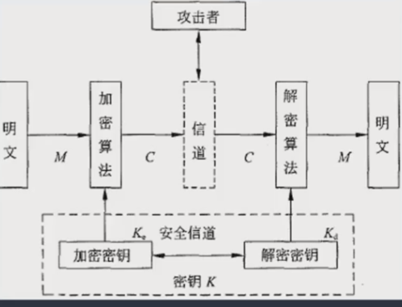
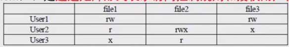
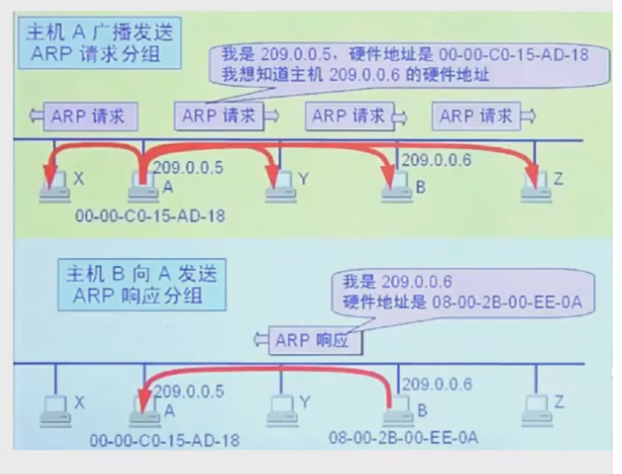
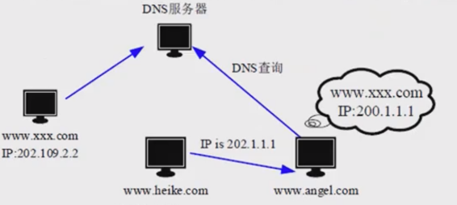
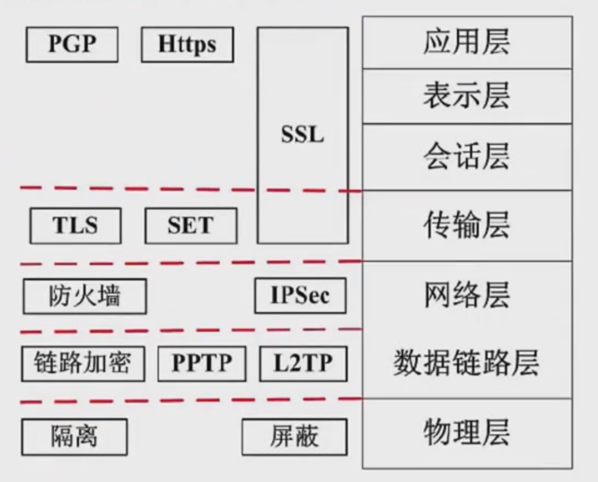
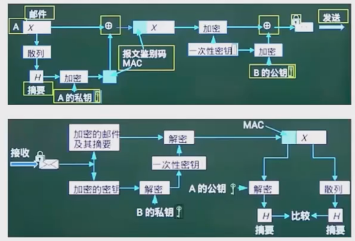

# 信息安全基础知识

## 1. 信息安全的五个基本要素

信息安全包括5个基本要素：

1. **机密性（Confidentiality）**：保证信息不泄露给未授权的用户、实体或进程
2. **完整性（Integrity）**：允许只有授权的人可以修改数据，并且能够判别出数据是否已被篡改
3. **可用性（Availability）**：保证授权实体在需要时能够访问数据，即攻击者不能占用所有的资源而阻碍授权者的工作
4. **可控性（Controllability）**：可以控制授权范围内的信息流向及行为方式
5. **可审查性（Auditability）**：对出现的网络安全问题提供调查的依据和手段

## 2. 信息安全的范围

信息安全的范围包括：设备安全、数据安全、内容安全、行为安全。

### 2.1 信息系统设备的安全
- 是信息系统安全的首要问题和物质基础
- 包括设备稳定性、可靠性、可用性

### 2.2 数据安全
- 保护数据不被未授权泄露、修改、破坏
- 关注数据的机密性、完整性、可用性

### 2.3 内容安全
- 在政治、法律、道德层次上的信息安全
- 要求信息内容政治上健康、符合法律、符合道德规范

### 2.4 信息系统的服务功能
- 确保面向用户的行为安全，最终确保系统安全
- 行为安全特征：机密性、完整性、可控性

## 3. 信息的存储安全

信息的存储安全包括：
- 信息使用的安全
- 系统安全监控
- 计算机病毒防治
- 数据的加密和防止非法的攻击等

### 3.1 信息使用的安全
- 用户识别
- 身份认证
- 访问权限限制

### 3.2 系统安全监控
- 建立完善的监控系统
- 跟踪系统活动
- 检测未授权入侵
- 对漏洞采取纠正措施
- 建立完善的审计和日志管理系统

### 3.3 计算机网络服务器
- 必须配备自动网络病毒检测系统
- 定期更新，防止病毒入侵

## 4. 网络安全

### 4.1 网络安全隐患
- 物理安全
- 软件漏洞
- 不兼容使用安全漏洞
- 选择适当的安全哲学

### 4.2 网络安全威胁
- 非授权访问
- 信息泄露或丢失
- 破坏数据完整性
- 拒绝服务攻击
- 网络传播病毒

### 4.3 安全措施的目标
- 访问控制
- 认证
- 完整性
- 审计
- 机密性

# 安全系统组成框架

## 信息安全系统的组成框架

### 技术体系

从技术实现角度来看，信息安全系统涉及以下技术：

#### 1. 基础安全设备
- 密码芯片
- 加密卡
- 身份识别卡
- 物理环境防护（建筑、机房）
- 硬件条件机械防护
- 电源和系统组件的抗电磁干扰和泄漏防护措施

#### 2. 计算机网络安全
- 网络传输过程中的安全防护
- 防止未授权破坏、修改、数据窃取
- 技术包括：
  - 物理隔离
  - 防火墙
  - 访问控制
  - 加密传输
  - 身份认证
  - 数字签名
  - 摘要
  - 隧道/VPN
  - 病毒防护
  - 互联网行为管理
  - 安全审计

#### 3. 操作系统安全
- 无配置错误、漏洞、后门、木马的操作系统
- 防止未授权访问计算机资源
- 机制包括：
  - 身份识别/认证
  - 访问控制
  - 最小特权
  - 可信路径
  - 操作保证
  - 存储保护
  - 文件保护
  - 安全审计

#### 4. 数据库安全
- 数据库管理系统安全
- 数据库应用系统安全
- 涉及：
  - 物理和逻辑数据库完整性
  - 元素安全
  - 可审计性
  - 访问控制
  - 身份认证
  - 可用性
  - 推理控制
  - 多级保护
  - 消除隐蔽通道

#### 5. 终端安全设备
- 从电信网络终端角度
- 包括：
  - 电话扰码器
  - 传真扰码器
  - 异步数据扰码器

# 信息安全技术

## 1. 加密技术

### 1.1 密码体制的组成

密码体制由五个部分组成：

1. **明文空间M**：所有明文的集合
2. **密文空间C**：所有密文的集合
3. **密钥空间K**：所有密钥的集合，每个密钥K由加密密钥Ke和解密密钥Kd组成，即K = <Ke, Kd>
4. **加密算法E**：从M到C的加密变换集合
5. **解密算法D**：从C到M的解密变换集合

### 1.2 加密解密公式

- 加密：C = E(M, Ke)
- 解密：M = D(C, Kd) = D(E(M, Ke), Kd)

## 2. 对称加密技术

### 2.1 特点
- 加密和解密使用相同的密钥
- 属于不公开密钥加密算法

### 2.2 优缺点
**优点：**
- 加密速度快，适合加密大量数据

**缺点：**
- 加密强度低（密钥位数少）
- 密钥分发困难（需要将密钥传输给接收方，存在保密问题）

### 2.3 常见对称加密算法

#### DES
- 替换+置换
- 56位密钥
- 64位数据块
- 速度快
- 密钥容易生成

#### 3DES
- 三重DES
- 两个56位密钥K1、K2
- 加密：K1加密→K2解密→K1加密
- 解密：K1解密→K2加密→K1解密

#### AES
- 美国联邦政府采用的块加密标准
- 用于替代原来的DES
- 要求至少与3DES一样安全

#### RC-5
- RSA数据安全公司的许多产品使用RC-5

#### IDEA
- 128位密钥
- 64位数据块
- 比DES加密强度更好
- 计算要求相对较低

## 3. 非对称加密技术

### 3.1 特点
- 加密和解密使用不同的密钥
- 分为公钥和私钥
- 属于公开密钥加密算法

### 3.2 优缺点
**优点：**
- 安全性高，难以破解

**缺点：**
- 加密速度慢

### 3.3 工作原理
- 发送方传输数据时，使用接收方的公钥作为加密密钥
- 使用接收方的私钥作为解密密钥
- 只有接收方能够解密密文获得明文
- 安全性高，无需传输密钥
- 但无法保证数据完整性

### 3.4 常见非对称加密算法
- **RSA**：使用512位（或1024位）密钥，计算量大，难以破解
- Elgamal
- ECC（椭圆曲线密码学）
- Knapsack算法
- Rabin
- D-H（Diffie-Hellman）

## 4. 对称与非对称加密对比

### 4.1 对称加密
- 密钥一般只有56位
- 加密过程简单
- 适合加密大量数据
- 加密强度不高

### 4.2 非对称加密
- 密钥1024位
- 解密计算量巨大
- 难以破解
- 不适合加密大量数据
- 一般用来加密对称算法的密钥
- 两种技术结合使用

## 5. 数字信封原理

### 5.1 定义
- "信"指对称加密密钥
- 数字信封是对称密钥的非对称加密

### 5.2 具体过程
1. 发送方使用对称密钥加密并传输实际数据
2. 发送方使用接收方公钥加密这个对称密钥，将加密后的密钥（数字信封）发送给接收方
3. 接收方接收数字信封
4. 接收方使用私钥解密数字信封，获得对称密钥
5. 接收方使用对称密钥解密原始数据（明文）

### 5.3 总结
数字信封利用对称和非对称加密技术，本质是用对称密钥加密数据，用非对称密钥加密对称密钥，有效解决了对称密钥的安全传输问题。

## 6. 信息摘要

### 6.1 定义
信息摘要是数据块的特征信息，如果数据改变，信息摘要也改变。发送方将数据和信息摘要一起传输给接收方，接收方从接收到的数据重新生成信息摘要，如果两个摘要匹配，说明数据正确。信息摘要由哈希函数生成。

### 6.2 信息摘要的特点
- 无论数据长度如何，都会产生固定长度的信息摘要
- 任何不同的输入数据都会产生不同的信息摘要
- 具有单向性，数据只能用来生成信息摘要，不能从信息摘要恢复原始数据

### 6.3 信息摘要算法
- **MD5**：产生128位的输出
- **SHA-1**：安全散列算法，产生160位的输出，安全性更高

## 7. 数字签名

### 7.1 定义
数字签名是唯一标识一个发送方。当发送方发送数据时，使用自己的私钥进行加密，接收方收到数据后，只能使用发送方的公钥进行解密，这样就唯一标识了发送方，这就是数字签名的过程。但无法保证机密性。

### 7.2 数字签名过程
1. 发送者A发送消息m
2. 使用发送者A的私钥skA进行签名
3. 生成签名S
4. 接收者B使用发送者A的公钥pkA验证签名
5. 验证通过后获得消息m

## 8. 公钥基础设施PKI

### 8.1 定义
PKI是以不对称密钥加密技术为基础，以数据机密性、完整性、身份认证和行为不可抵赖性为安全目的，来实施和提供安全服务的具有普适性的安全基础设施。

### 8.2 数字证书

#### 8.2.1 数字证书定义
数字证书是一个数据结构，是一种由一个可信任的权威机构签署的信息集合。不同的应用有不同的证书，如X.509证书。

#### 8.2.2 X.509证书信息
X.509证书必须包含以下信息：
1. 版本号
2. 序列号
3. 签名算法标识符
4. 认证机构
5. 有效期
6. 主体信息
7. 认证机构的数字签名
8. 公钥信息

#### 8.2.3 公钥证书的用途
公钥证书主要用于确保公钥及其与用户绑定关系的安全性。这个公钥是证书所标识实体的合法公钥。任何用户，只要知道认证机构的公钥，就能检查证书签名的合法性。如果检查正确，用户就可以相信证书所携带的公钥是真实的，这个公钥就是证书所标识实体的合法公钥。例如驾驶证。

### 8.3 签证机构CA
CA负责签发证书、管理和撤销证书，是所有注册用户都信任的权威机构。当CA向用户颁发证书时，必须用自己的数字签名来保证证书信息的真实性。任何组织都可以用CA的公钥来验证证书的合法性。

## 访问控制

### 1. 访问控制定义

访问控制是指主体依据某些控制策略或权限对客体本身或其资源进行的不同授权访问。

### 2. 访问控制要素

访问控制包括三个关键要素：主体、客体和控制策略。

### 3. 访问控制组成

访问控制包括认证、控制策略实现和审计3方面的内容。

### 4. 访问控制实现方法

#### 4.1 访问控制矩阵（ACM）

- 以矩阵形式表示访问控制规则和授权用户权限
- 主体表示为行，客体表示为列
- 示例：
  - User1: file1(rw), file2(rwx), file3(rw)
  - User2: file1(r), file2(r), file3(x)
  - User3: file1(x), file2(r), file3(r)

#### 4.2 访问控制表（ACL）

- 目前最流行、使用最多的访问控制实现技术
- 每个客体有一个访问控制表，是系统中每一个有权访问这个客体的主体的信息
- 这种实现技术实际上是按列保存访问矩阵

#### 4.3 能力表

- 与访问控制表相对应，这种实现技术实际上是按行保存访问矩阵
- 每个主体有一个能力表，包含该主体对系统中每个客体的访问权限信息
- 用能力表实现的访问控制系统可以方便地查询某个特定主体的所有访问权限

#### 4.4 授权关系表

- 表中的每一行（或元组）表示访问矩阵中的一个非空元素，详细说明主体对特定客体的访问权限信息
- 如果授权关系表按主体排序，查询可以达到能力表的效率
- 如果按客体排序，查询可以达到访问控制表的效率

# 信息安全的抗攻击技术

## 1. 密钥生成

密钥生成需要考虑三个因素：
- 增加密钥空间
- 选择强（复杂）密钥
- 密钥随机性（使用随机数）

## 2. 拒绝服务攻击（DoS）

### 2.1 攻击原理
- 内部和外部用户都可以发起此攻击
- 内部用户可以占用系统内存和CPU时间
- 外部黑客可以占用网络连接，阻止合法用户访问资源或服务

### 2.2 外部用户发起的DoS攻击模式
- 消耗资源
- 破坏或修改配置信息
- 服务程序处理错误导致服务失败

### 2.3 分布式拒绝服务DDoS攻击
- 传统DoS的进化
- 攻击者首先入侵并控制多台计算机
- 利用这些被控制的机器同时向特定目标发起攻击
- 克服了传统DoS在网络资源限制和隐蔽性方面的局限性

### 2.4 拒绝服务攻击的防御方式
1. **加强对数据包的特征识别**：识别攻击者数据包中的特征字符串，确定攻击服务器和攻击者位置
2. **设置防火墙监视本地主机端口的使用情况**：如果发现端口处于监听状态，系统可能正在遭受攻击
3. **对通信数据量进行统计**：获取攻击系统位置和数量信息，攻击时攻击数据源地址会发送超出正常限度的数据
4. **尽可能的修正已经发现的问题和系统漏洞**

## 3. ARP欺骗

### 3.1 正常ARP原理
当主机A想知道主机B的MAC地址时：
1. 主机A广播ARP请求包
2. 局域网内所有主机都收到，但只有主机B识别出是请求自己的MAC地址
3. 主机B向主机A单播ARP应答包，告知自己的MAC地址
4. 主机A收到应答后，建立主机B的IP地址和MAC地址的动态映射
5. 映射是临时的，如果A和B一段时间没有通信，映射会被清除
6. 需要通信时重复此过程

### 3.2 ARP欺骗原理
- 安全漏洞：主机A收到应答包就会刷新IP和MAC地址映射，不管是否发起过广播请求
- 恶意主机C模拟ARP应答包，构造正确的主机B的IP地址，但使用自己的MAC地址
- 主机A会更新映射，下次向主机B发送数据时实际发送到主机C的MAC地址
- 主机C可以窃听数据

### 3.3 ARP欺骗的防范措施
1. **在Windows XP下输入命令**：使用`arp -s gateway-ip gateway-mac`固化ARP表，防止ARP欺骗
2. **使用ARP服务器**：服务器检查自己的ARP转换表来响应其他机器的ARP广播，确保ARP服务器本身不被攻破
3. **采用双向绑定的方法**：解决和防止ARP欺骗
4. **ARP防护软件——ARPGuard**：
   - 作为系统级核心驱动运行
   - 无需安装其他第三方软件（如WinPcap）
   - 随系统启动以服务和进程方式运行
   - 占用计算机资源极少
   - 无需手动绑定IP地址和MAC地址，避免大量无效工作
   - 确保计算机重启后无需重建ARP缓存，软件保护功能随操作系统自动启动

## 4. DNS欺骗

### 4.1 DNS欺骗原理
- 冒充域名服务器，将查询的IP地址设为攻击者的IP地址
- 用户看到攻击者的主页而不是想访问的合法网站
- 改变域名和IP地址的映射关系
- 黑客通过冒充DNS服务器，用虚假的IP地址进行回复

### 4.2 DNS欺骗的检测
1. **被动监听检测**：被动监听并捕获所有DNS请求和应答包，建立请求和应答的映射表，如果在某个时间间隔内，一个请求对应两个或两个以上不同结果的应答包，则怀疑发生了DNS欺骗攻击
2. **虚假报文探测**：主动探测，发送检测包来检查网络中是否存在DNS欺骗攻击者，如果向非DNS服务器发送请求包却收到任何应答（正常情况下不应该收到），则说明发生了攻击
3. **交叉检查查询**：客户端收到DNS应答包后，向DNS服务器进行反向查询，反向查询询问应答包中返回的IP地址对应的DNS名称，如果反向查询得到的DNS名称与原始DNS名称不匹配，则说明发生了DNS欺骗，否则说明没有欺骗

## 5. IP欺骗

### 5.1 IP欺骗的原理和流程
1. **步骤1**：被冒充的主机（主机b）的网络暂时瘫痪，防止其干扰攻击
2. **步骤2**：攻击者连接到目标机器（主机a）的特定端口，猜测其初始序列号（ISN）基值和增量模式
3. **步骤3**：攻击者将源IP地址欺骗为被冒充主机（主机b）的IP地址，发送带有SYN标志的数据段，请求连接
4. **步骤4**：攻击者等待目标机器（主机a）向现已瘫痪的主机（主机b）发送SYN+ACK包，由于主机b已瘫痪，攻击者看不到此包
5. **步骤5**：攻击者再次冒充主机b，向目标机器（主机a）发送ACK包，此ACK包包含预测的目标机器ISN+1
6. **步骤6**：建立连接，攻击者可以发送命令请求

### 5.2 IP欺骗的防范
- IP欺骗攻击相当困难，但非常常见，入侵往往从IP欺骗开始
- **防范方法**：
  - 删除UNIX系统中所有的`/etc/hosts.equiv`和`$HOME/.rhosts`文件
  - 修改`/etc/inetd.conf`文件，禁用RPC（远程过程调用）机制
  - 配置防火墙过滤掉源地址为内部IP地址但来自外部网络的数据包

## 6. 端口扫描

### 6.1 定义
尝试与目标主机的特定端口建立连接，有响应说明是"活动端口"

### 6.2 扫描原理分类
1. **全TCP连接**：利用标准的三次握手建立TCP连接
2. **半打开式扫描（SYN扫描）**：
   - 扫描主机向指定端口发送SYN段
   - 如果目标响应SYN=1 ACK=1，端口是活动的，扫描器发送RST终止连接，避免完整的三次握手
   - 如果目标响应RST，端口被认为是"死的"，扫描器不采取进一步行动
3. **FIN扫描**：
   - 依靠发送FIN包来确定端口活动
   - 向关闭的端口发送FIN=1的TCP包，包被丢弃并返回RST包
   - 向活动端口发送FIN=1的TCP包，包被简单丢弃，无响应
   - 比前两种方法更安全，不涉及完整的TCP连接，称为"秘密扫描"
4. **第三方扫描**：也称为"代理扫描"，攻击者利用第三方主机（通常是安全性较低的被攻陷计算机，称为"僵尸"或"僵尸网络"）进行扫描

## 7. 强化TCP/IP堆栈以抵御拒绝服务攻击

### 7.1 同步包风暴（SYN Flooding）
- **原理**：利用TCP协议漏洞，发送大量伪造的TCP连接请求，完成三次握手的前两步，但不完成第三步，在队列中留下大量半开连接，耗尽服务器资源，可能导致系统挂起
- **防御**：修改注册表设置可以帮助防御SYN Flooding攻击

### 7.2 ICMP攻击
- **原理**：ICMP协议的固有特性使其容易受到对网络路由器和主机的攻击，"死亡之Ping"攻击利用操作系统对ICMP包大小的限制（不超过64KB）导致TCP/IP堆栈崩溃和主机故障
- **防御**：修改注册表设置可以帮助防御ICMP攻击

### 7.3 SNMP攻击
- **原理**：SNMP可用于控制网络设备、重定向流量、更改数据包优先级，甚至断开通信，具有足够能力的攻击者可能完全控制网络
- **防御**：修改注册表项可以帮助防御SNMP攻击

### 7.4 系统漏洞扫描
- 检查关键计算机信息系统中可利用的漏洞
- 包括基于网络的漏洞扫描（远程扫描主机）和基于主机的漏洞扫描（在目标系统上安装代理）

# 信息安全的保证体系和评估方法

## 1. 计算机系统安全保护能力等级（GB17859-999标准）

### 第一级：用户自主保护级
- 本级的计算机信息系统可信计算基通过隔离用户与数据，使用户具备自主安全保护的能力
- 本级实施的是自主访问控制，即计算机信息系统可信计算机定义和控制系统中命名用户对命名客体的访问

### 第二级：系统审计保护级
- 本级的计算机信息系统可信计算基实施了粒度更细的自主访问控制
- 它通过登录规程、审计安全性相关事件和隔离资源，使用户对自己的行为负责
- 在自主访问控制的基础上控制访问权限扩散

### 第三级：安全标记保护级
- 本级的计算机信息系统可信计算基具有系统审计保护级所有功能
- 此外，还提供有关安全策略模型、数据标记以及主体对客体强制访问控制的非形式化描述
- 具有准确地标记输出信息的能力
- 消除通过测试发现的任何错误
- 本级的主要特征是计算机信息系统可信计算基对所有主体及其所控制的客体（例如：进程、文件、段、设备）实施强制访问控制

### 第四级：结构化保护级
- 本级的计算机信息系统可信计算基建立于一个明确定义的形式化安全策略模型之上
- 它要求将第三级系统中的自主和强制访问控制扩展到所有主体与客体
- 此外，还要考虑隐蔽通道
- 对外部主体能够直接或间接访问的所有资源（例如：主体、存储客体和输入输出资源）实施强制访问控制

### 第五级：访问验证保护级
- 本级的计算机信息系统可信计算基满足访问监控器需求
- 访问监控器仲裁主体对客体的全部访问
- 访问监控器本身是抗篡改的；必须足够小，能够分析和测试
- 与第四级相比，自主访问控制机制根据用户指定方式或默认方式，阻止非授权用户访问客体
- 访问控制的粒度是单个用户
- 访问控制能够为每个命名客体指定命名用户和用户组，并规定他们对客体的访问模式
- 没有存取权的用户只允许由授权用户指定对客体的访问权

## 2. 风险评估

### 2.2 安全风险管理

#### 在风险评估实施前，应该考虑：
1. 确定风险评估的范围
2. 确定风险评估的目标
3. 建立适当的组织结构
4. 建立系统性的风险评估方法
5. 获得最高管理者对风险评估策划的批准

#### 风险评估的基本要素
风险评估的基本要素为脆弱性、资产、威胁、风险和安全措施。与这些要素相关的属性分别为业务战略、资产价值、安全需求、安全事件和残余风险，这些也是风险评估要素的一部分。

### 2.3 风险计算模型
包含信息资产、弱点/脆弱性、威胁等关键要素。每个要素有各自的属性：
- 信息资产的属性是资产价值
- 弱点的属性是弱点被威胁利用后对资产带来的影响的严重程度
- 威胁的属性是威胁发生的可能性

#### 风险计算的过程：
1. 对信息资产进行识别，并对资产赋值
2. 对威胁进行分析，并对威胁发生的可能性赋值
3. 识别信息资产的脆弱性，并对弱点的严重程度赋值
4. 根据威胁和脆弱性计算安全事件发生的可能性
5. 结合信息资产的重要性和发生安全事件的可能性，计算信息资产的风险值

# 网络安全技术

## 1. 防火墙

### 1.1 定义
防火墙是加在内部网络和外部互联网之间的安全措施，分为网络级防火墙和应用级防火墙。

### 1.2 网络级防火墙
- **特点**：低层，但效率高
- **技术**：使用包过滤和状态检测
- **功能**：只检查网络包的外部属性（源地址、状态）是否有异常，如果异常就过滤掉
- **特点**：对应用程序和用户是透明的
- **问题**：无法过滤伪装成危险数据的数据包

### 1.3 应用级防火墙
- **特点**：高层，效率低
- **技术**：拆解网络包，检查数据内部是否有问题
- **缺点**：消耗大量时间，导致效率低
- **优点**：安全强度高

## 2. 入侵检测系统IDS

### 2.1 定义
防火墙技术主要将威胁从外部网络分离出来，但对来自内部网络的直接攻击无能为力。入侵检测系统（IDS）技术作为防火墙之后的第二道屏障，补充防火墙技术。

### 2.2 工作原理
1. 监控当前系统/用户行为
2. 使用入侵检测分析引擎，包含知识库系统，存储历史行为和特定行为模式
3. 将当前行为与知识库进行匹配，检测是否为入侵
4. 如果检测到入侵，记录证据并向系统和防火墙报告进行处理

### 2.3 部署特点
- 与防火墙不同，IDS是监听设备，不需要直接放在流量路径中工作
- IDS部署的唯一要求是必须连接到所有被监控流量必须经过的链路
- 在交换网络中，IDS一般放置：
  1. 尽可能靠近攻击源
  2. 尽可能靠近被保护资源

## 3. 入侵防御系统IPS

### 3.1 定义
IDS和防火墙技术都是在入侵发生后进行检测和分析，而IPS可以提前检测入侵行为，在进入安全网络之前进行防御。

### 3.2 功能
在安全网络之前的链路上部署IPS，可以实时检测入侵行为并直接阻断，这是与IDS的关键区别。

## 4. 杀毒软件

### 4.1 功能
用于检测和解决计算机病毒。

### 4.2 区别
应该与防火墙和IDS区分开。计算机病毒由杀毒软件处理，而防火墙处理非法网络攻击。

## 5. 蜜罐系统

### 5.1 功能
创建虚假的蜜罐网络来引诱黑客。

### 5.2 好处
对蜜罐网络的攻击不会影响安全网络。

### 5.3 目的
可以了解黑客的攻击方法和原理，从而升级和优化安全系统。

## 6. 网络攻击和威胁

| 攻击类型 | 攻击名称 | 描述 |
|---|---|---|
| **被动攻击** | 窃听（网络监听） | 用各种可能的合法或非法的手段窃取系统中的信息资源和敏感信息 |
| | 业务流分析 | 通过对系统进行长期监听，利用统计分析方法对诸如通信频度、通信的信息流向、通信总量的变化等参数进行研究，从而发现有价值的信息和规律 |
| | 非法登录 | 有些资料将这种方式归为被动攻击方式 |
| **主动攻击** | 假冒身份 | 通过欺骗通信系统（或用户）达到非法用户冒充成为合法用户，或者特权小的用户冒充成为特权大的用户的目的。黑客大多是采用假冒进行攻击 |
| | 抵赖 | 这是一种来自用户的攻击，比如：否认自己曾经发布过的某条消息、伪造一份对方来信等 |
| | 旁路控制 | 攻击者利用系统的安全缺陷或安全性上的脆弱之处获得非授权的权利或特权 |
| | 重放攻击 | 所截获的某次合法的通信数据拷贝，出于非法的目的而被重新发送 |
| | 拒绝服务（DOS） | 对信息或其它资源的合法访问被无条件地阻止 |

# 网络安全协议

## 1. 物理层安全

物理层主要使用物理手段，隔离、屏蔽物理设备等，其它层都是靠协议来保证传输的安全。

## 2. 主要网络安全协议

### 2.1 SSL协议
- **全称**：安全套接字协议（Secure Sockets Layer）
- **用途**：加强Web安全传输（HTTP/HTTPS）
- **特点**：高安全性
- **应用**：与HTTP结合形成HTTPS安全协议
- **端口**：443

### 2.2 SSH协议
- **全称**：安全外壳协议（Secure Shell）
- **设计目标**：加强Telnet/FTP安全的传输协议

### 2.3 SET协议
- **全称**：安全电子交易协议（Secure Electronic Transaction）
- **应用**：B2C模式（电子商务）中保障支付信息的安全性
- **特点**：比较复杂，设计比较严格，安全性高
- **功能**：保证信息传输的机密性、真实性、完整性和不可否认性
- **框架**：PKI框架下的一个典型实现
- **发展**：不断升级和完善，SET 2.0将支持借记卡电子交易

### 2.4 Kerberos协议
- **全称**：网络身份认证协议
- **基础**：基于信任第三方
- **功能**：在开放型网络中进行身份认证
- **认证实体**：可以是用户也可以是用户服务
- **特点**：
  - 不依赖宿主机的操作系统或计算机的IP地址
  - 不需要保证网络上所有计算机的物理安全性
  - 假定数据包在传输中可被随机窃取和篡改

### 2.5 PGP协议
- **身份认证**：使用RSA公钥证书进行身份认证
- **数据加密**：使用IDEA（128位密钥）进行数据加密
- **完整性验证**：使用MD5进行数据完整性验证
- **密钥使用示例**：
  - 发送方A有三个密钥：A的私钥、B的公钥、A生成的一次性对称密钥
  - 接收方B有两个密钥：B的私钥、A的公钥

# 真题

## 真题1：软件系统安全性分析

**题目：** 在进行软件系统安全性分析时，( )保证信息不泄露给未授权的用户、实体或过程；完整性保证信息的完整和准确，防止信息被非法修改；( )保证对信息的传播及内容具有控制的能力，防止为非法者所用。

**选项：**
- A. 完整性 (Integrity)
- B. 不可否认性 (Non-repudiation)  
- C. 可控性 (Controllability)
- D. 机密性 (Confidentiality)

**答案：** DD

**解析：**
- 第一空：机密性（Confidentiality）保证信息不泄露给未授权的用户、实体或过程
- 第二空：可控性（Controllability）保证对信息的传播及内容具有控制的能力

## 真题2：完整信息安全系统的组成

**题目：** 完整的信息安全系统至少包含三类措施，即技术方面的安全措施、管理方面的安全措施和相应的( )。其中，信息安全的技术措施主要有：信息加密、数字签名、身份鉴别、访问控制、网络控制技术、反病毒技术、( )。

**选项：**
- A. 用户需求 (User requirements)
- B. 政策法律 (Policies and laws)
- C. 市场需求 (Market demand)
- D. 领域需求 (Domain requirements)

**答案：** BC

**解析：**

第一空：政策法律

根据"信息安全体系"框架，技术措施和管理措施需要与法律法规相结合，形成完整的保护体系。如《中华人民共和国网络安全法》、《数据安全法》等政策法律框架，为信息安全提供合规要求和强制性保障。

第二空：数据备份和灾难恢复

数据备份是防止数据丢失的核心技术措施，灾难恢复确保系统在遭受攻击或故障后能够快速恢复正常运行。这两种技术在多份文档中被列为信息安全技术的重要组成部分。

## 真题3：数字签名技术

**题目：** 数字签名技术属于信息系统安全管理中保证信息()的技术。

**选项：**
- A. 保密性 (Confidentiality)
- B. 可用性 (Availability)
- C. 完整性 (Integrity)
- D. 可靠性 (Reliability)

**答案：** C

**解析：** 数字签名是保证信息传输的完整性、发送者的身份认证、防止交易中的抵赖发生。

## 真题4：对称密码算法

**题目：** 为保障数据的存储和运输安全，防止信息泄露，需要对一些数据进行加密。由于对称密码算法()，所以特别适合对大量的数据进行加密。

**选项：**
- A. 比非对称密码算法更安全 (More secure than asymmetric encryption algorithms)
- B. 比非对称密码算法密钥更长 (Longer keys than asymmetric encryption algorithms)
- C. 比非对称密码算法效率更高 (More efficient than asymmetric encryption algorithms)
- D. 还能同时用于身份认证 (Can also be used for identity authentication)

**答案：** C

## 真题5：非对称加密流程

**题目：** 假设A和B之间要进行加密通信，则正确的非对称加密流程是()。

**步骤：**
1. ① A和B都要产生一对用于加密和解密的加密密钥和解密密钥
2. ② A将公钥传送给B，将私钥自己保存，B将公钥传送给A，将私钥自己保存
3. ③ A发送消息给B时，先用B的公钥对信息进行加密，再将密文发送给B
4. ④ B收到A发来的消息时，用自己的私钥解密

**选项：**
- A. ①②③④
- B. ①③④②
- C. ③①②④
- D. ②③①④

**答案：** A

## 真题6：数字签名验证

**题目：** 甲向乙发送其数据签名，要验证该签名，乙可使用()对该签名进行解密。

**选项：**
- A. 甲的私钥 (A's private key)
- B. 甲的公钥 (A's public key)
- C. 乙的私钥 (B's private key)
- D. 乙的公钥 (B's public key)

**答案：** B

## 真题7：SYN Flooding攻击

**题目：** SYN Flooding攻击的原理是()。

**选项：**
- A. 利用TCP三次握手，恶意造成大量TCP半连接，耗尽服务器资源，导致系统拒绝服务
- B. 操作系统在实现TCP/IP协议栈时，不能很好地处理TCP报文的序列号紊乱问题，导致系统崩溃
- C. 操作系统在实现TCP/IP协议栈时，不能很好地处理IP分片包的重叠情况，导致系统崩溃
- D. 操作系统协议栈在处理IP分片时，对于重组后超大的IP数据包不能很好地处理，导致缓存溢出而系统崩溃

**答案：** A

## 真题8：安全电子邮件服务

**题目：** 下面可提供安全电子邮件服务的是()。

**选项：**
- A. RSA
- B. SSL
- C. SET
- D. S/MIME

**答案：** D

**解析：**
- **A. RSA:** 一种加密算法（非对称加密），用于数据加密和数字签名，但并非专门的电子邮件安全协议，需结合其他协议使用
- **B. SSL (Secure Sockets Layer):** 传输层安全协议（现已被TLS取代），用于保护网络通信（如HTTPS），但电子邮件安全（如存储、端到端加密）需要更上层的协议支持
- **C. SET (Secure Electronic Transaction):** 早期电子商务安全协议，用于信用卡交易，与电子邮件无关
- **D. S/MIME (Secure/Multipurpose Internet Mail Extensions):** 专门为电子邮件设计的安全标准，支持端到端加密、数字签名、身份验证，符合IETF标准（RFC 5751等），是主流电子邮件客户端（如Outlook、Thunderbird）广泛支持的安全协议

## 真题9：第三方认证服务

**题目：** 以下关于第三方认证服务的叙述中，正确的是()。

**选项：**
- A. Kerberos认证服务中保存数字证书的服务器叫CA
- B. 第三方认证服务的两种体制分别是Kerberos和PKI
- C. PKI体制中保存数字证书的服务器叫KDC
- D. Kerberos的中文全称是"公钥基础设施"

**答案：** B

**解析：**
- **A. Kerberos认证服务中保存数字证书的服务器叫CA 错误。** Kerberos使用密钥分发中心（KDC）管理票据（Ticket）和会话密钥，不涉及数字证书。数字证书由CA（证书颁发机构）管理，属于PKI（公钥基础设施）的范畴
- **B. 第三方认证服务的两种体制分别是Kerberos和PKI 正确。** Kerberos（基于对称密钥，集中式KDC）和PKI（基于非对称密钥，分布式CA）是两种主流的第三方认证体制。Kerberos常用于企业内部单点登录（SSO），PKI广泛用于互联网安全（如HTTPS、数字签名）
- **C. PKI体制中保存数字证书的服务器叫KDC 错误。** PKI中保存数字证书的服务器是CA（证书颁发机构），负责签发、存储和吊销证书。KDC（密钥分发中心）是Kerberos的组件，与PKI无关
- **D. Kerberos的中文全称是"公钥基础设施" 错误。** "公钥基础设施"是PKI（Public Key Infrastructure）的中文全称。Kerberos的中文名称通常直接音译为"克尔伯罗斯"，其核心是基于对称密钥的票据（Ticket）认证机制

## 真题10：路由器命令行管理安全

**题目：** 网络管理员通过命令行方式对路由器进行管理，要确保ID、口令和会话内存的保密性，应采取的访问方式是()。

**选项：**
- A. 控制台
- B. AUX
- C. TELNET
- D. SSH

**答案：** D

**解析：**
- **A. 控制台（Console）错误。** 控制台是通过物理接口（如串口）本地连接路由器，数据传输在物理线缆中进行，无需网络传输，但题目强调的是远程命令行管理的保密性（非本地物理连接），因此不符合场景
- **B. AUX（辅助端口）错误。** AUX端口用于拨号调制解调器连接，属于物理层访问，数据通过电话线路传输，同样属于本地或拨号访问，不涉及网络远程加密需求
- **C. TELNET错误。** TELNET以明文传输所有数据（包括用户名、密码和会话内容），极易被窃听，无法保证保密性，已被淘汰
- **D. SSH（Secure Shell）正确。** SSH是专为远程命令行管理设计的安全协议，使用加密传输（如AES、RSA算法），确保数据在网络中传输时的机密性、完整性，防止中间人攻击。SSH是远程管理路由器、交换机等网络设备的标准安全方式（如ssh 路由器IP）