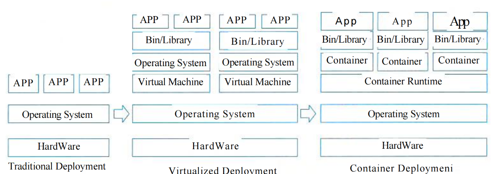
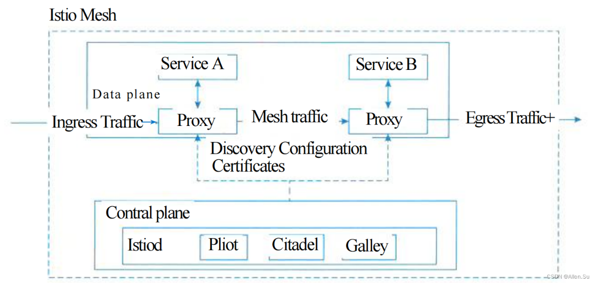

# 云原生架构

## 一、云原生架构内涵

### 1.1 定义

云原生架构是基于云原生技术的一组架构原则和设计模式的集合，旨在将云应用中的非业务代码部分进行最大化地剥离，从而让云设施接管应用中原有的大量非功能特性（如弹性、韧性、安全、可观测性、灰度等），使业务不再有非功能性业务中断困扰的同时，具备轻量、敏捷、高度自动化的特点。

### 1.2 特点

基于云原生架构的应用特点包括：

**(1) 代码结构发生巨大变化**：不再需要掌握文件及其分布式处理技术，不再需要掌握各种复杂的网络技术，简化让业务开发变得更敏捷、更快捷。

**(2) 非功能特性大量委托给云原生架构来解决**：比如高可用能力、容灾能力、安全特性、可运维性、易用性、可测试性、灰度发布能力等。

**(3) 高度自动化的软件交付**：基于云原生的自动化软件交付可以把应用自动化部署到成千上万的节点上。

### 1.3 云原生的原则

云原生具有以下原则：

**(1) 服务化原则**：通过服务化架构把不同生命周期的模块分离出来，分别进行业务迭代。

**(2) 弹性原则**：弹性是指系统的部署规模可以随着业务量的变化而自动伸缩。

**(3) 可观测原则**：通过日志、链路跟踪和度量等手段，使得多次服务调用的耗时、返回值和参数都清晰可见。

**(4) 韧性原则**：软件所依赖的软硬件组件出现各种异常时，软件表现出来的抵御能力。

**(5) 所有过程自动化原则**：让自动化工具理解交付目标和环境差异，实现整个软件交付和运维的自动化。

**(6) 零信任原则**：不应该信任网络内部和外部的任何人/设备/系统，需要基于认证和授权重构访问控制的信任基础。

**(7) 架构持续演进原则**：架构具备持续演进的能力。

### 1.4 主要架构模式

云原生涉及的主要架构模式。

#### 1.4.1 服务化架构模式

要求以应用模块为颗粒度划分一个应用软件，以接口契约（例如IDL）定义彼此业务关系，以标准协议（HTTP、gRPC等）确保彼此的互联互通，结合领域模型驱动（Domain Driven Design, DDD）、测试驱动开发（Test Driven Design, TDD）、容器化部署提升每个接口的代码质量和迭代速度。

#### 1.4.2 Mesh化架构模式

Mesh化架构是把中间件框架（如RPC、缓存、异步消息等）从业务进程中分离，让中间件SDK与业务代码进一步解耦，从而使得中间件升级对业务进程没有影响，甚至迁移到另外一个平台的中间件也对业务透明。

#### 1.4.3 Serverless模式

业务流量到来/业务事件发生时，云会启动或调度一个已启动的业务进程进行处理，处理完成后云自动会关闭/调度业务进程，等待下一次触发。开发者不用关心应用运行地点、操作系统、网络配置、CPU性能等，将应用的整个运行都委托给云。Serverless模式适合事件驱动的数据计算任务、计算时间短的请求/响应应用、没有复杂相互调用的长周期任务。

#### 1.4.4 存储计算分离模式

分布式环境中的CAP困难主要是针对有状态应用，由于一致性（Consistency, C）、可用性（Available, A）、分区容错性（Partition Tolerance, P）三者无法同时满足，最多满足其中两个。所以无状态应用不存在一致性这个维度，可以获得很好的可用性和分区容错性，因而获得更好的弹性。

#### 1.4.5 分布式事务模式

访问多个微服务往往会导致分布式事务问题，造成数据不一致。因此，架构师需要根据不同场景选择适合的分布式事务模式。常见模式包括：

**(1) XA模式**：
- **描述**：分布式事务处理的标准，通常使用两阶段提交（2PC）方法。
- **特点**：强一致性，但性能较差，需要两次网络交互。

**(2) 基于消息的最终一致性（BASE）**：
- **描述**：在可用性和一致性之间的妥协。BASE提出只要满足基本可用（BA）和最终一致性（E），通过接受软状态或不确定的数据状态（S）来优先考虑性能。
- **特点**：此类系统通常具有高性能。但由于其特定的应用特性，选择可用性和一致性之间的妥协导致通用性较差。

**(3) TCC模式**：
- **描述**：采用Try-Confirm-Cancel两阶段模型。
- **特点**：提供可控的事务隔离和高效率。但需要应用代码将业务模型拆分为两个阶段，导致业务侵入性强，设计、开发和维护成本高。

**(4) SAGA模式**：
- **描述**：每个正向事务对应一个补偿事务。如果正向事务失败，则执行补偿事务进行回滚。
- **特点**：导致开发和维护成本高。

**(5) 开源项目SEATA的AT模式**：
- **描述**：将TCC模式的两阶段过程委托给底层代码框架，并消除行锁。
- **特点**：性能非常高，无需代码开发工作，可以自动化回滚操作，但有一些使用场景限制。

#### 1.4.6 可观测架构

可观测架构包括日志（Logging）、链路跟踪（Tracing）和度量（Metrics）。

- **日志**：提供多级别跟踪，如INFO/DEBUG/WARNING/ERROR。
- **链路跟踪**：收集请求从前端到后端的访问日志，形成完整的调用链跟踪。
- **度量**：为系统量化提供多维度测量，包括并发量、耗时、可用时长、容量等。

#### 1.4.7 事件驱动架构

事件驱动架构（Event Driven Architecture, EDA）是应用/组件的集成架构模式。

**应用场景**：适用于增强服务韧性、数据变更通知、构建开放接口、事件流处理、命令查询职责分离（CQRS）。

**CQRS说明**：在CQRS中，影响服务状态的命令由事件发起，而不影响服务状态的查询使用同步API调用。

### 1.5 典型的云原生架构的反模式

架构设计有时需要根据业务场景采用不同的方法，常见的云原生反模式包括：

**(1) 庞大的单体应用**：
- **问题**：缺乏依赖隔离、代码耦合、职责和模块边界不清晰、缺乏模块间接口治理、变更传播范围广、难以协调不同模块的开发和发布时间、一个子模块的不稳定会拖慢整个应用、扩容只能针对整个应用而不是单个瓶颈模块。

**(2) 单体应用"硬拆"为微服务**：
- **问题**：强行将高耦合、低质量的代码模块拆分为服务。拆分后的服务数据仍然紧密耦合，拆分导致分布式调用，严重影响性能。

**(3) 缺乏自动化能力的微服务**：
- **问题**：导致每人管理的模块数量增加、每人工作量增加、软件开发成本更高。

## 二、云原生架构相关技术

### 2.1 容器技术

**容器**是一个标准化的软件基础单元，它将应用程序及其依赖项打包和发布。由于依赖项是完整的，应用程序不再受环境限制，可以在不同的计算环境中快速、可靠地运行。

#### 2.1.1 容器部署模式与其他模式的比较

**图示描述：容器部署模式与其他模式的比较**
一个图表展示了三种部署模式的比较：传统部署、虚拟化部署和容器部署。

- **传统部署（最左侧）**：
  - 顶层：三个"APP"框
  - 中间层：一个"操作系统"框
  - 底层：一个"硬件"框
  - 底部标注为"传统部署"

- **虚拟化部署（中间）**：
  - 顶层：两个相同的子堆栈，每个子堆栈包含：
    - 两个"APP"框
    - 一个"Bin/Library"框
    - 一个"操作系统"框
    - 一个"虚拟机"框
  - 这两个子堆栈下方：一个"操作系统"框
  - 最底层：一个"硬件"框
  - 底部标注为"虚拟化部署"
  - 从"传统部署"的"操作系统"层指向"虚拟化部署"的"操作系统"层的箭头

- **容器部署（最右侧）**：
  - 顶层：三个相同的子堆栈，每个子堆栈包含：
    - 一个"App"框
    - 一个"Bin/Library"框
    - 一个"容器"框
  - 这三个子堆栈下方：一个"容器运行时"框
  - 再下方：一个"操作系统"框
  - 最底层：一个"硬件"框
  - 底部标注为"容器部署"
  - 从"虚拟化部署"的"操作系统"层指向"容器部署"的"操作系统"层的箭头

### 2.2 容器编排技术

容器编排技术包括资源调度、应用部署和管理、自动恢复、服务发现和负载均衡、弹性伸缩、声明式API、可扩展架构和可移植性。

### 2.3 微服务

微服务模式将单体后端应用拆分为多个松耦合的子应用，每个子应用负责一组功能。这些子应用成为"微服务"，多个"微服务"共同构成一个物理独立但逻辑完整的分布式微服务系统。这些微服务相对独立，通过解耦开发、测试和部署过程来提高整体迭代效率。

#### 2.3.1 微服务设计约束

**(1) 微服务个体约束**：
一个设计良好的微服务应用应该具有在业务域划分方面相互独立的功能。与单体应用中紧密绑定特定语言和技术栈相比，这种方法允许不同的业务域选择不同的技术（例如，推荐系统使用Python可能比Java更高效）。在组织上，微服务团队更小，导致更高的开发效率。文本提到"一个微服务团队可以完成两个披萨"和"一个微服务应用应该能够在至少两周内完成一次迭代"作为在业务域边界正确划分微服务的隐喻和标准。总之，微服务中的"微"不是为了小而小，而是为了根据问题域合理拆分单体应用。此外，微服务应该具有正交分解特性，专注于特定的业务职责并做好，遵循SOLID原则中的单一职责原则（SRP）。如果修改或发布一个微服务，它不应该影响同一系统中另一个微服务的业务交互。

**(2) 微服务与微服务之间的横向关系**：
微服务之间的横向关系主要关注在正确定义微服务边界后的可发现性和互操作性。微服务可发现性是指当服务A发布和扩展时，依赖服务B如何能够自动感知服务A的变化而无需重新发布。这需要引入第三方服务注册中心来满足可发现性需求，特别是对于大规模微服务集群，服务注册中心的推送和扩展能力至关重要。微服务互操作性是指服务A使用什么方法调用服务B。由于服务自治的约束，服务间调用需要使用语言无关的远程调用协议。例如，REST协议有效满足"语言无关"和"标准化"因素。但在高性能场景中，基于IDL的二进制协议可能是更好的选择。此外，目前行业中的大多数微服务实践尚未实现受HATEOAS启发的REST调用，需要服务事先就接口达成一致才能进行调用。为了进一步解耦服务，微服务系统需要一个独立的元数据中心来存储服务的元数据信息，允许服务查询此中心以了解发起调用的详细信息。随着服务调用链变长，整个微服务系统变得更加脆弱，使得面向失败的设计原则变得至关重要。对于单个微服务应用，限流、熔断、舱壁和负载均衡等机制已成为增强服务韧性的标准。为了进一步提高系统吞吐量并充分利用机器资源，可以采用协程、Rx模型、异步调用和背压等技术。

**(3) 微服务与数据层之间的纵向约束**：
在微服务领域，提倡数据存储隔离（Data Storage Segregation, DSS）原则，即数据是微服务的私有资产，对该数据的访问都必须通过当前微服务提供的API来访问。否则，会造成数据层产生耦合，违背了高内聚低耦合的原则。同时，出于性能考虑，通常采取读写分离（CQRS）手段。同样，由于容器调度对底层设施稳定性的不可预知影响，微服务的设计应当尽量遵循无状态设计原则，这意味着上层应用与底层基础设施的解耦，微服务可以自由在不同容器间被调度。对于有数据存取（即有状态）的微服务而言，通常使用计算与存储分离方式，将数据下沉到分布式存储，通过这个方式做到一定程度的无状态化。

**(4) 全局视角下的微服务分布式约束**：
从微服务系统设计一开始，就需要考虑以下因素：高效运维整个系统，从技术上要准备全自动化的CI/CD流水线满足对开发效率的诉求，并在这个基础上支持蓝绿、金丝雀等不同发布策略，以满足对业务发布稳定性的诉求。面对复杂系统，全链路、实时和多维度的可观测能力成为标配。为了及时、有效地防范各类运维风险，需要从微服务体系多种事件源汇聚并分析相关数据，然后在中心化的监控系统中进行多维度展现。伴随着微服务拆分的持续，故障发现时效性和根因精确性始终是开发运维人员的核心诉求。

### 2.4 无服务技术

**无服务技术的特点**：

**(1) 全托管的计算服务**：客户只需要编写代码构建应用，无需关注同质化的、负担繁重的基于服务器等基础设施的开发、运维、安全、高可用等工作。

**(2) 通用性**：结合云BaaS API的能力，能够支撑云上所有重要类型的应用。

**(3) 自动弹性伸缩**：让用户无需为资源使用提前进行容量规划。

**(4) 按量计费**：让企业使用成本得到有效降低，无需为闲置资源付费。

### 2.5 服务网络

服务网格（Service Mesh）是分布式应用在微服务软件架构之上发展起来的新技术，旨在将那些微服务间的连接、安全、流量控制和可观测等通用功能下沉为平台基础设施，实现应用与平台基础设施的解耦。这个解耦意味着开发者无需关注微服务相关治理问题而聚焦于业务逻辑本身，提升应用开发效率并加速业务探索和创新。换句话说，因为大量非功能性从业务进程剥离到另外进程中，服务网格以无侵入的方式实现了应用轻量化。

#### 2.5.1 服务网格的典型架构

**图示描述：服务网格的典型架构**
一个图表展示了"Istio Mesh"的架构，分为两个主要平面："数据平面"和"控制平面"。

**数据平面**：

- 包含两个服务："Service A"和"Service B"
- 每个服务都与一个"Proxy"关联
- 流量流向用箭头表示：
  - "Ingress Traffic"流入与"Service A"关联的"Proxy"
  - "Service A"通过双向箭头与其"Proxy"通信
  - "Mesh traffic"从"Service A"的"Proxy"流向"Service B"的"Proxy"
  - "Service B"通过双向箭头与其"Proxy"通信
  - "Egress Traffic+"从"Service B"的"Proxy"流出
- 虚线将"数据平面"内的"Proxy"组件连接到标记为"Discovery Configuration Certificates"的框

**控制平面**：
- 包含四个组件："Istiod"、"Pilot"、"Citadel"和"Galley"
- 虚线将"控制平面"连接到"Discovery Configuration Certificates"框，表示交互或控制

**架构说明**：在这张架构图中，服务A调用服务B的所有请求，都被其下的服务代理截获，代理服务A完成到服务B的服务发现、熔断、限流等策略，而这些策略的总控是在控制平面（Control Plane）上配置。

## 三、云原生架构的优势

### 3.1 技术优势

- **轻量化**：通过容器化技术实现应用的轻量化部署
- **敏捷性**：支持快速迭代和持续交付
- **自动化**：高度自动化的部署、运维和监控
- **弹性**：根据业务需求自动伸缩资源
- **可观测性**：全面的日志、监控和链路跟踪

### 3.2 业务优势

- **降低成本**：按需付费，避免资源浪费
- **提高效率**：专注业务逻辑，减少基础设施管理
- **增强可靠性**：内置的高可用和容错机制
- **加速创新**：快速响应市场变化和业务需求

## 四、云原生架构的挑战

### 4.1 技术挑战

- **复杂性增加**：分布式系统的复杂性
- **学习成本**：需要掌握新的技术和工具
- **数据一致性**：分布式环境下的数据一致性挑战
- **网络延迟**：服务间通信的网络延迟问题

### 4.2 组织挑战

- **文化转变**：需要DevOps文化和协作模式
- **技能要求**：团队需要新的技能和知识
- **流程变革**：需要重新设计开发和运维流程
- **工具链**：需要建立完整的工具链和平台

## 五、云原生架构最佳实践

### 5.1 设计原则

- **单一职责**：每个服务专注于单一业务功能
- **松耦合**：服务间保持松耦合关系
- **高内聚**：服务内部保持高内聚
- **无状态**：尽量设计无状态服务
- **可观测**：内置监控和日志机制

### 5.2 实施策略

- **渐进式迁移**：从单体应用逐步迁移到微服务
- **容器化优先**：优先使用容器化技术
- **自动化优先**：优先实现自动化流程
- **监控优先**：优先建立监控体系
- **安全优先**：优先考虑安全性设计

## 六、云原生架构的未来趋势

### 6.1 技术趋势

- **边缘计算**：云原生技术向边缘扩展
- **AI/ML集成**：与人工智能和机器学习深度集成
- **多云管理**：跨云平台的统一管理
- **安全增强**：零信任安全模型的普及
- **性能优化**：持续的性能优化和调优

### 6.2 应用趋势

- **行业标准化**：云原生技术的标准化和规范化
- **生态完善**：云原生生态系统的不断完善
- **工具成熟**：相关工具和平台的成熟化
- **最佳实践**：行业最佳实践的积累和分享
- **人才培养**：云原生人才的培养和认证

## 七、总结

云原生架构代表了软件架构发展的新方向，它通过容器化、微服务、服务网格等技术，实现了应用的轻量化、敏捷化和自动化。虽然云原生架构带来了新的挑战，但其优势明显，是未来软件架构发展的重要趋势。企业和开发者需要积极拥抱云原生技术，不断提升技术能力和组织能力，以适应云原生时代的发展需求。
